# Architecture — AltFlex AEGIS v3.0

> **Dual-Engine Web3 Security Intelligence Platform**
>
> _Engineering Blueprint & Academic Reference_

| Field                  | Value                                                       |
| ---------------------- | ----------------------------------------------------------- |
| **Document Version**   | 1.0.0                                                       |
| **Architecture Style** | Hexagonal (Ports & Adapters) + Modular Monorepo             |
| **Target Audience**    | Engineers, Thesis Supervisors, Auditors                     |
| **Last Updated**       | 2026-04-03                                                  |
| **Author**             | Senior Blockchain Architect + Senior Technical Writer       |
| **Status**             | P1-ARCH-001 Deliverable                                     |
| **Academic Alignment** | Thesis 1 (AI Skill Safety) · Thesis 2 (Forensic Simulation) |

---

## Table of Contents

1. [Executive Summary](#1-executive-summary)
2. [System Context — C4 Level 1](#2-system-context--c4-level-1)
3. [Container Overview — C4 Level 2](#3-container-overview--c4-level-2)
4. [Component Details — C4 Level 3](#4-component-details--c4-level-3)
   - 4.1 [Hacks Engine (α) — Hexagonal Architecture](#41-hacks-engine-α--hexagonal-architecture)
   - 4.2 [Skills Engine (β) — Hexagonal Architecture](#42-skills-engine-β--hexagonal-architecture)
   - 4.3 [Forensic Engine — Hexagonal Architecture](#43-forensic-engine--hexagonal-architecture)
5. [Data Flow Diagrams](#5-data-flow-diagrams)
   - 5.1 [ETL Data Flow — Hacks Engine](#51-etl-data-flow--hacks-engine)
   - 5.2 [Safety Scanner Pipeline — Skills Engine](#52-safety-scanner-pipeline--skills-engine)
6. [Sequence Diagrams](#6-sequence-diagrams)
   - 6.1 [Hack Search Flow](#61-hack-search-flow)
   - 6.2 [Skill Copy Flow](#62-skill-copy-flow)
   - 6.3 [Exploit Simulation Flow](#63-exploit-simulation-flow)
7. [Technology Stack Matrix](#7-technology-stack-matrix)
8. [Cross-Cutting Concerns](#8-cross-cutting-concerns)
9. [Architecture Decision Records](#9-architecture-decision-records)
10. [Appendices](#10-appendices)

---

## 1. Executive Summary

AltFlex AEGIS (**A**I-**E**nhanced **G**overnance & **I**ntelligence for Web3 **S**ecurity) is a dual-engine security intelligence platform that aggregates, analyzes, and simulates DeFi exploit data alongside AI audit skill file safety classification.

The platform is organized around three domain engines:

| Engine                 | Codename | Domain                                              | Academic Thesis                       |
| ---------------------- | -------- | --------------------------------------------------- | ------------------------------------- |
| **Hacks Dashboard**    | Engine α | DeFi exploit incident aggregation and analytics     | Thesis 2 — Pattern Classification     |
| **AI Skills Explorer** | Engine β | AI audit skill file indexing and safety scanning    | Thesis 1 — Malicious Intent Detection |
| **Forensic Engine**    | Engine γ | Foundry-based exploit simulation and trace analysis | Thesis 2 — Forensic Simulation        |

### Architectural Principles

1. **Hexagonal Architecture (Ports & Adapters)**: Framework-agnostic domain core with injectable infrastructure
2. **Monorepo Modularity**: Turborepo-managed workspace with strict package boundaries
3. **Domain-Driven Design**: Entities, value objects, and ports defined in `@aegis/core`
4. **Type-Safe Validation**: Zod schemas at every API boundary — runtime validation generates TypeScript types
5. **Dependency Inversion**: Domain never depends on infrastructure — only abstract ports

---

## 2. System Context — C4 Level 1

The system context diagram positions AltFlex AEGIS within the broader Web3 security ecosystem, showing all external actors and systems it interacts with.

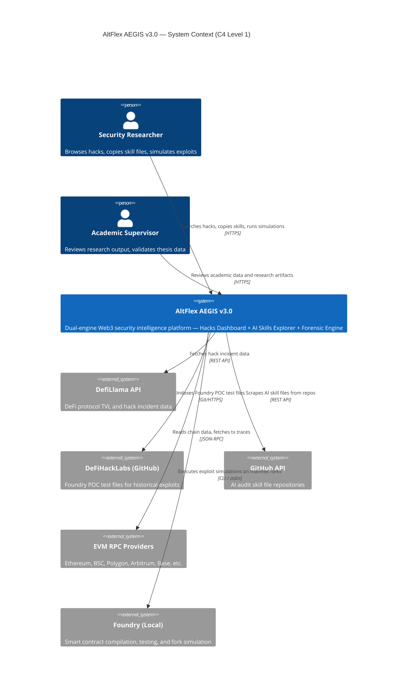

### External System Contracts

| System        | Protocol      | Rate Limit        | Authentication    |
| ------------- | ------------- | ----------------- | ----------------- |
| DefiLlama API | REST (HTTPS)  | 300 req/5min      | None (public)     |
| GitHub API    | REST v3/v4    | 5,000 req/hr      | PAT or GitHub App |
| EVM RPC       | JSON-RPC 2.0  | Provider-specific | API Key           |
| Foundry CLI   | Local process | N/A               | N/A               |
| DeFiHackLabs  | Git clone     | N/A               | SSH/HTTPS         |

---

## 3. Container Overview — C4 Level 2

The container diagram shows all deployable units, their technology choices, and inter-container communication patterns.

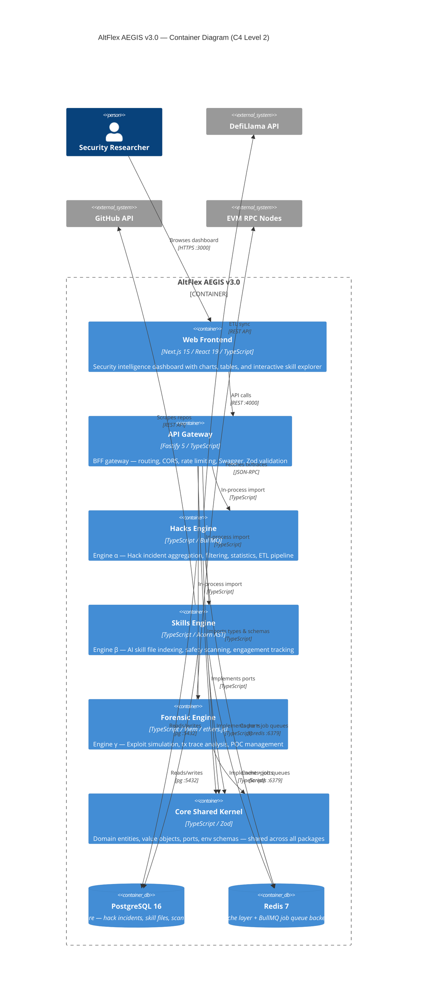

### Container Summary

| Container       | Package Name             | Port | Technology                                    | Purpose           |
| --------------- | ------------------------ | ---- | --------------------------------------------- | ----------------- |
| Web Frontend    | `@aegis/web`             | 3000 | Next.js 15, React 19, Recharts, Framer Motion | Dashboard UI      |
| API Gateway     | `@aegis/api-gateway`     | 4000 | Fastify 5, Zod, Swagger                       | BFF routing layer |
| Hacks Engine    | `@aegis/hacks-engine`    | —    | TypeScript, BullMQ, Axios, pg                 | Engine α          |
| Skills Engine   | `@aegis/skills-engine`   | —    | TypeScript, Acorn, gray-matter, pg            | Engine β          |
| Forensic Engine | `@aegis/forensic-engine` | —    | TypeScript, Viem, ethers.js                   | Engine γ          |
| Core Kernel     | `@aegis/core`            | —    | TypeScript, Zod, Winston, date-fns            | Shared domain     |
| PostgreSQL      | —                        | 5432 | PostgreSQL 16 Alpine                          | Primary datastore |
| Redis           | —                        | 6379 | Redis 7 Alpine                                | Cache + BullMQ    |

### Monorepo Dependency Graph

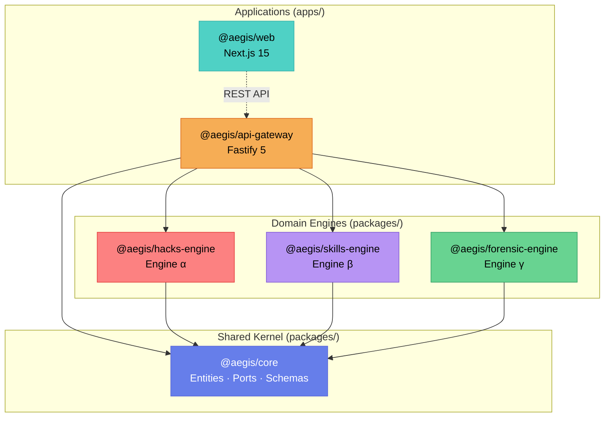

---

## 4. Component Details — C4 Level 3

### 4.1 Hacks Engine (α) — Hexagonal Architecture

Engine α aggregates DeFi exploit incident data from external sources, normalizes it into `HackIncident` domain entities, and provides filtered/paginated query and statistics APIs.

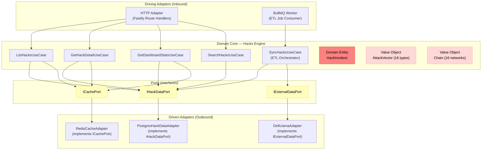

**Key Domain Objects:**

| Type         | Name            | Description                                                                            |
| ------------ | --------------- | -------------------------------------------------------------------------------------- |
| Entity       | `HackIncident`  | Primary aggregate — protocol, date, chain, attackVector, lossUsd, txHashes, dataSource |
| Value Object | `AttackVector`  | 16-member enum taxonomy (reentrancy, flash-loan, oracle-manipulation, etc.)            |
| Value Object | `Chain`         | 16-member enum (Ethereum, BSC, Polygon, Arbitrum, Base, Solana, etc.)                  |
| Port         | `IHackDataPort` | CRUD + filter + aggregate queries for hack incidents                                   |
| Port         | `ICachePort`    | get/set/delete with TTL for Redis caching                                              |

---

### 4.2 Skills Engine (β) — Hexagonal Architecture

Engine β indexes AI audit skill files from GitHub repositories, performs safety analysis using AST parsing and pattern matching, and provides a searchable/filterable skills catalog.

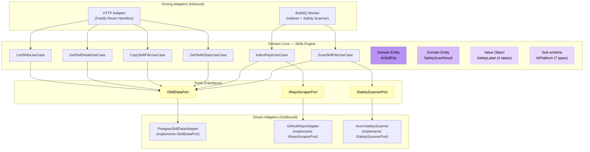

**Key Domain Objects:**

| Type         | Name                    | Description                                                                  |
| ------------ | ----------------------- | ---------------------------------------------------------------------------- |
| Entity       | `AISkillFile`           | Skill metadata, content, safety label, engagement metrics                    |
| Entity       | `SafetyScanResult`      | Scan findings, severity counts, scanner version, manual review status        |
| Value Object | `SafetyLabel`           | 4-state lifecycle: `UNANALYZED → SAFE \| SUSPICIOUS \| MALICIOUS`            |
| Sub-schema   | `AIPlatform`            | Target AI platform (claude, cursor, gemini, copilot, mcp, windsurf, generic) |
| Sub-schema   | `SmartContractLanguage` | Target language (solidity, vyper, rust, move, cairo, multi)                  |
| Port         | `ISkillDataPort`        | CRUD + filter + engagement + statistics for skill files                      |
| Port         | `ISafetyScannerPort`    | Execute safety scan, configure rules, stream progress                        |

---

### 4.3 Forensic Engine — Hexagonal Architecture

Engine γ manages Foundry-based exploit POC references, executes simulations on mainnet forks, and provides transaction trace analysis for historical DeFi incidents.

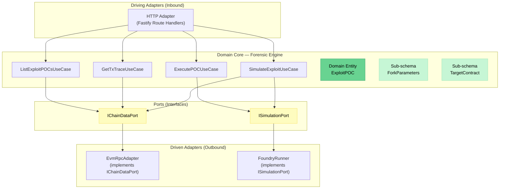

**Key Domain Objects:**

| Type       | Name              | Description                                                                   |
| ---------- | ----------------- | ----------------------------------------------------------------------------- |
| Entity     | `ExploitPOC`      | Foundry test file reference, fork params, execution status, complexity rating |
| Sub-schema | `ForkParameters`  | RPC URL env var, fork block number, chain, gas limit                          |
| Sub-schema | `TargetContract`  | Address, name, chain, isPrimaryTarget, isVerified                             |
| Port       | `IChainDataPort`  | Get tx, trace, block, contract info, balance (chain-agnostic)                 |
| Port       | `ISimulationPort` | Execute Foundry test, stream output, parse results                            |

---

## 5. Data Flow Diagrams

### 5.1 ETL Data Flow — Hacks Engine

The Hacks Engine ETL pipeline periodically fetches exploit data from DefiLlama, normalizes it against the `HackIncident` schema, deduplicates against existing records, and stores the enriched data in PostgreSQL with Redis caching.

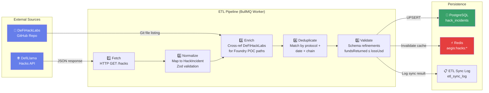

### 5.2 Safety Scanner Pipeline — Skills Engine

The Skills Engine safety scanner pipeline indexes AI skill files from GitHub, parses them using Acorn AST, runs a configurable rule engine against the parsed content, and classifies each file with a `SafetyLabel`.

```mermaid
flowchart LR
    subgraph "External Source"
        GH["🐙 GitHub API<br/>AI Skill Repos"]
    end

    subgraph "Indexing Pipeline (BullMQ Worker)"
        SCRAPE["1️⃣ Scrape<br/>Fetch SKILL.md files<br/>from target repos"]
        PARSE["2️⃣ Parse<br/>gray-matter YAML<br/>frontmatter extraction"]
        HASH["3️⃣ Hash<br/>SHA-256 content hash<br/>for deduplication"]
        STORE["4️⃣ Store<br/>UPSERT AISkillFile<br/>into PostgreSQL"]
    end

    subgraph "Safety Scanner Pipeline"
        AST["5️⃣ AST Parse<br/>Acorn JS/TS parser<br/>for embedded code"]
        RULES["6️⃣ Rule Engine<br/>Pattern matching:<br/>• Prompt injection<br/>• File system access<br/>• Network requests<br/>• Code exfiltration<br/>• Shell execution"]
        SCORE["7️⃣ Score<br/>Aggregate findings<br/>by severity"]
        LABEL["8️⃣ Label<br/>Assign SafetyLabel:<br/>SAFE | SUSPICIOUS<br/>| MALICIOUS"]
    end

    subgraph "Output"
        PG_SKILL["🐘 PostgreSQL<br/>ai_skill_files"]
        PG_SCAN["🐘 PostgreSQL<br/>safety_scan_results"]
    end

    GH --> SCRAPE
    SCRAPE --> PARSE
    PARSE --> HASH
    HASH --> STORE
    STORE --> AST
    AST --> RULES
    RULES --> SCORE
    SCORE --> LABEL
    LABEL --> PG_SKILL
    LABEL --> PG_SCAN

    style GH fill:#667eea,color:#fff
    style PG_SKILL fill:#805ad5,color:#fff
    style PG_SCAN fill:#805ad5,color:#fff
```

---

## 6. Sequence Diagrams

### 6.1 Hack Search Flow

The primary user journey: a researcher searches for DeFi exploits by attack vector, chain, and date range with paginated results.

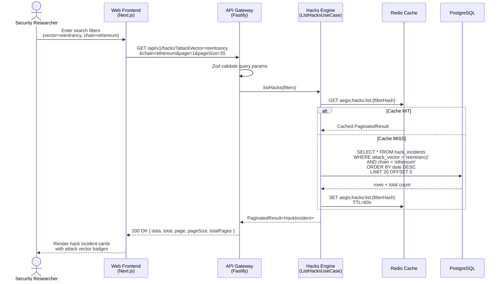

### 6.2 Skill Copy Flow

A researcher finds a useful AI skill file and copies it for use in their own AI coding assistant.

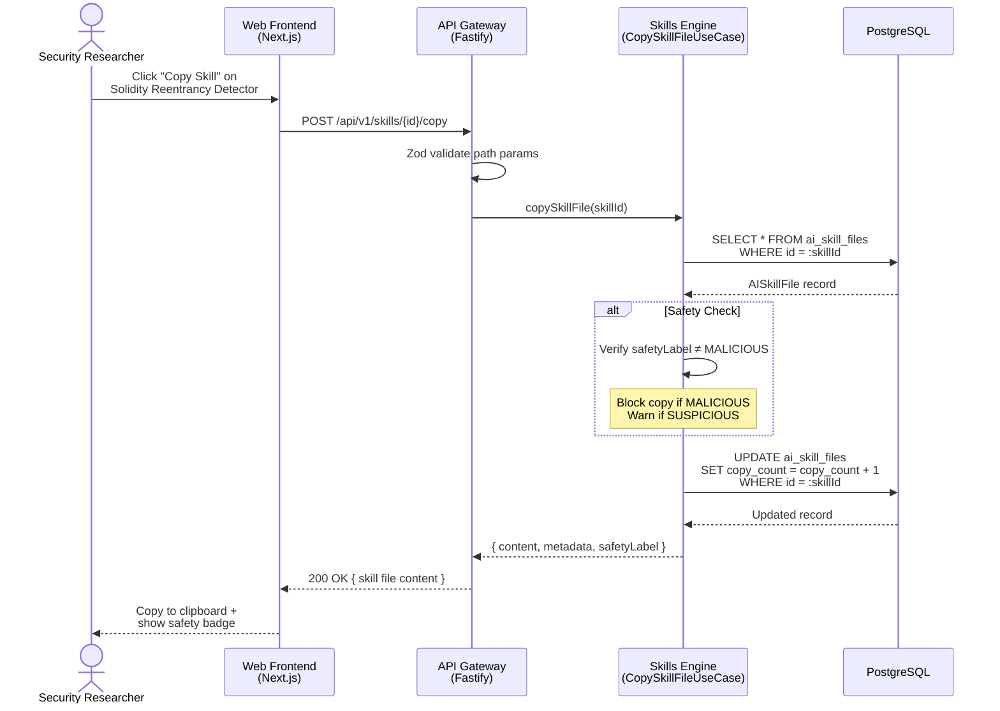

### 6.3 Exploit Simulation Flow

A researcher selects a historical DeFi exploit and runs a Foundry-based simulation on a mainnet fork to reproduce the attack.

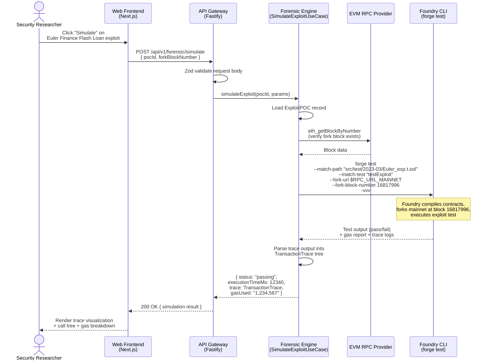

---

## 7. Technology Stack Matrix

| Layer                   | Technology     | Version | Justification                                                        |
| ----------------------- | -------------- | ------- | -------------------------------------------------------------------- |
| **Frontend Framework**  | Next.js        | 15.3    | App Router with RSC, streaming, built-in optimization                |
| **UI Library**          | React          | 19.0    | Concurrent features, Server Components                               |
| **Charts**              | Recharts       | 2.12    | React-native charting for loss trends and attack vector breakdowns   |
| **Animation**           | Framer Motion  | 11.0    | Production-grade animation library for micro-interactions            |
| **Icons**               | Lucide React   | 0.344   | Consistent icon set with tree-shaking                                |
| **Backend Framework**   | Fastify        | 5.7     | Fastest Node.js HTTP framework, native TypeScript, schema validation |
| **Validation**          | Zod            | 3.22    | TypeScript-first schema declaration with runtime validation          |
| **Database**            | PostgreSQL     | 16      | Advanced indexing (GIN, GiST, pg_trgm), JSONB, partitioning          |
| **Cache**               | Redis          | 7       | In-memory cache + BullMQ persistent job queue backend                |
| **Job Queue**           | BullMQ         | 5.1     | Redis-backed job queue with retries, priorities, and rate limiting   |
| **HTTP Client**         | Axios          | 1.13    | HTTP client for external API calls (DefiLlama, GitHub)               |
| **Blockchain (read)**   | Viem           | 2.8     | Modern TypeScript EVM library — type-safe, tree-shakeable            |
| **Blockchain (legacy)** | ethers.js      | 6.11    | Broad ecosystem support, ABI encoding, contract interaction          |
| **AST Parser**          | Acorn          | 8.11    | Lightweight JS parser for skill file safety analysis                 |
| **YAML Parser**         | gray-matter    | 4.0     | YAML frontmatter extraction from Markdown skill files                |
| **Logging**             | Winston        | 3.11    | Structured JSON logging with transports and log levels               |
| **Date Handling**       | date-fns       | 3.3     | Immutable, tree-shakeable date utilities                             |
| **Language**            | TypeScript     | 5.4+    | Strict mode, project references, composite builds                    |
| **Build System**        | Turborepo      | latest  | Incremental builds, task caching, topological ordering               |
| **Package Manager**     | pnpm           | latest  | Workspace support, strict mode, no phantom dependencies              |
| **Runtime**             | Node.js        | 20 LTS  | Latest LTS with native ESM, fetch, and performance improvements      |
| **Containerization**    | Docker         | latest  | Multi-stage builds, Alpine base images, health checks                |
| **Orchestration**       | Docker Compose | latest  | Local development stack with hot-reload volume mounts                |
| **Simulation**          | Foundry        | latest  | forge test + fork mode for exploit simulation                        |

---

## 8. Cross-Cutting Concerns

### 8.1 Structured Logging

```
┌─────────────────────────────────────────────────┐
│  Logger (Winston) — @aegis/core                 │
│                                                 │
│  Format: JSON structured logs                   │
│  Fields: timestamp, level, message,             │
│          correlationId, service, metadata        │
│                                                 │
│  Levels: error → warn → info → debug → trace    │
│  Transport: console (dev), JSON file (prod)     │
│  Correlation: AsyncLocalStorage per request      │
└─────────────────────────────────────────────────┘
```

| Concern         | Implementation                                | Location                         |
| --------------- | --------------------------------------------- | -------------------------------- |
| Log Format      | JSON structured with correlation ID           | `@aegis/core`                    |
| Request Tracing | `X-Correlation-ID` header → AsyncLocalStorage | API Gateway middleware           |
| Log Levels      | `error`, `warn`, `info`, `debug`, `trace`     | Environment variable `LOG_LEVEL` |
| Sensitive Data  | Never log passwords, tokens, or PII           | Logger sanitization middleware   |

### 8.2 Error Handling

```
AegisError (base)
├── ValidationError     → 400 Bad Request
├── NotFoundError       → 404 Not Found
├── ConflictError       → 409 Conflict
├── RateLimitError      → 429 Too Many Requests
├── ExternalServiceError → 502 Bad Gateway
└── InternalError       → 500 Internal Server Error

Response format (RFC 7807):
{
  "error": "VALIDATION_ERROR",
  "code": "AEGIS-400-001",
  "message": "Invalid query parameters",
  "details": [{ "field": "page", "message": "Must be ≥ 1" }],
  "timestamp": "2026-04-03T14:00:00Z"
}
```

### 8.3 Authentication & Authorization

| Aspect          | Strategy                        | Phase   |
| --------------- | ------------------------------- | ------- |
| Phase 1–2       | No auth — public read-only API  | Current |
| Phase 3+        | JWT bearer tokens (short-lived) | Future  |
| Admin endpoints | API key-based access            | Phase 3 |
| Rate limiting   | Per-IP: 100 req/min (anonymous) | Active  |

### 8.4 Caching Strategy

| Data Type          | Cache Key Pattern                | TTL  | Invalidation           |
| ------------------ | -------------------------------- | ---- | ---------------------- |
| Hack list queries  | `aegis:hacks:list:{filterHash}`  | 60s  | On ETL sync completion |
| Hack detail        | `aegis:hacks:detail:{id}`        | 300s | On record update       |
| Dashboard stats    | `aegis:hacks:stats`              | 300s | On ETL sync completion |
| Skill list queries | `aegis:skills:list:{filterHash}` | 60s  | On new index/scan      |
| Skill detail       | `aegis:skills:detail:{id}`       | 300s | On record update       |
| Skills stats       | `aegis:skills:stats`             | 300s | On new index/scan      |

### 8.5 Environment Configuration

All environment variables are validated at startup using Zod schemas defined in `@aegis/core`:

| Schema                    | Variables                                                 | Required By                 |
| ------------------------- | --------------------------------------------------------- | --------------------------- |
| `DatabaseEnvSchema`       | `DATABASE_URL`, `POSTGRES_HOST`, `POSTGRES_DB`, etc.      | All engines                 |
| `RedisEnvSchema`          | `REDIS_HOST`, `REDIS_PORT`, `REDIS_PASSWORD`              | Hacks Engine, Skills Engine |
| `ApiGatewayEnvSchema`     | `API_PORT`, `API_HOST`, `CORS_ORIGIN`, `API_RATE_LIMIT_*` | API Gateway                 |
| `HacksEngineEnvSchema`    | `DEFILLAMA_API_URL`, `HACKS_SYNC_CRON`                    | Hacks Engine                |
| `SkillsEngineEnvSchema`   | `GITHUB_TOKEN`, `SKILLS_SYNC_CRON`                        | Skills Engine               |
| `ForensicEngineEnvSchema` | `RPC_URL_MAINNET`, `RPC_URL_BSC`, `FOUNDRY_PATH`          | Forensic Engine             |
| `FrontendEnvSchema`       | `NEXT_PUBLIC_API_URL`                                     | Web Frontend                |
| `FeatureFlagsEnvSchema`   | `ENABLE_FORENSIC_ENGINE`, `ENABLE_SAFETY_SCANNER`         | All                         |

---

## 9. Architecture Decision Records

| ADR     | Decision                                       | Rationale                                                                                                                                                                                                                            |
| ------- | ---------------------------------------------- | ------------------------------------------------------------------------------------------------------------------------------------------------------------------------------------------------------------------------------------ |
| ADR-001 | Hexagonal Architecture over Clean Architecture | Simpler port/adapter pattern; entities and ports in a shared kernel (`@aegis/core`) with adapters in each engine package. No separate "use case layer" package — use cases live inside each engine.                                  |
| ADR-002 | Turborepo monorepo over polyrepo               | Single repository for code sharing, atomic commits, unified CI/CD, and shared TypeScript project references. All engines share domain types from `@aegis/core`.                                                                      |
| ADR-003 | Zod over io-ts or class-validator              | Zod 3.x provides the best TypeScript inference, composability (`z.object`, `z.union`), and ecosystem integration (Fastify type provider, OpenAPI generation). Schemas serve as single source of truth for both validation and types. |
| ADR-004 | Fastify over Express or NestJS                 | Fastify 5 is the fastest Node.js HTTP framework with native schema validation, plugin encapsulation, and TypeScript support. NestJS rejected for unnecessary decorator complexity at current scale.                                  |
| ADR-005 | PostgreSQL over MongoDB                        | Relational data model (hack incidents with FK to scans, skills to scan results) benefits from ACID transactions, rich indexing (GIN for JSONB, pg_trgm for search), and SQL analytics.                                               |
| ADR-006 | BullMQ over Agenda or custom cron              | BullMQ provides persistent job queues with Redis backend, built-in retry/backoff, job priorities, and rate limiting — essential for ETL reliability.                                                                                 |
| ADR-007 | Viem + ethers.js over web3.js                  | Viem for modern type-safe chain interactions; ethers.js retained for ABI encoding compatibility and broader ecosystem contract tooling. web3.js rejected for larger bundle size and weaker types.                                    |
| ADR-008 | Domain entities as Zod schemas (not classes)   | Plain object entities with Zod schema validation over OOP classes. Enables serialization-free API responses, immutability, and framework independence. Factory functions provide computed properties.                                |
| ADR-009 | Acorn AST for Safety Scanning                  | Lightweight core parser (< 200KB) vs. full TypeScript compiler API. Sufficient for detecting code patterns (function calls, imports, network requests) in skill files without needing type information.                              |
| ADR-010 | Docker Compose for development                 | Docker Compose provides a single-command boot for the full stack (PostgreSQL, Redis, API, Web, Workers) with hot-reload volume mounts. Kubernetes reserved for staging/production.                                                   |

---

## 10. Appendices

### A. Directory Structure

```
altflex-aegis/
├── apps/
│   ├── api-gateway/           # @aegis/api-gateway — Fastify 5 BFF
│   │   └── src/
│   │       ├── config/        # Environment configuration
│   │       ├── middleware/     # CORS, rate limit, error handler
│   │       ├── routes/        # Route handlers by domain
│   │       └── server.ts      # Entry point
│   └── web/                   # @aegis/web — Next.js 15 frontend
│       └── src/
│           ├── app/           # App Router pages + layouts
│           ├── components/    # UI components
│           ├── hooks/         # Custom React hooks
│           ├── lib/           # Utilities and configurations
│           └── styles/        # Global styles and tokens
├── packages/
│   ├── core/                  # @aegis/core — Shared domain kernel
│   │   └── src/
│   │       ├── domain/
│   │       │   ├── entities/  # HackIncident, AISkillFile, ExploitPOC, SafetyScanResult
│   │       │   ├── ports/     # IHackDataPort, ISkillDataPort, IChainDataPort, etc.
│   │       │   └── value-objects/  # AttackVector, Chain, SafetyLabel
│   │       └── shared/
│   │           ├── constants/ # Application constants
│   │           ├── env/       # Zod env schemas + validators
│   │           ├── types/     # Shared TypeScript types
│   │           └── utils/     # Utility functions
│   ├── hacks-engine/          # @aegis/hacks-engine — Engine α
│   │   └── src/
│   │       ├── adapters/      # PostgreSQL, Redis, DefiLlama adapters
│   │       ├── application/   # Use cases (list, detail, stats, sync)
│   │       ├── domain/        # Engine-specific domain logic
│   │       └── infrastructure/# BullMQ worker, config
│   ├── skills-engine/         # @aegis/skills-engine — Engine β
│   │   └── src/
│   │       ├── adapters/      # PostgreSQL, GitHub, Acorn adapters
│   │       ├── application/   # Use cases (list, scan, index, copy)
│   │       ├── domain/        # Engine-specific domain logic
│   │       └── infrastructure/# BullMQ worker, scanner config
│   └── forensic-engine/       # @aegis/forensic-engine — Engine γ
│       └── src/
│           ├── adapters/      # EVM RPC, Foundry CLI adapters
│           ├── application/   # Use cases (simulate, trace, execute)
│           ├── domain/        # Engine-specific domain logic
│           └── infrastructure/# Foundry process management
├── infrastructure/
│   ├── ci/                    # CI/CD workflow definitions
│   ├── docker/                # Dockerfiles (multi-stage)
│   └── terraform/             # Infrastructure as Code
├── docs/                      # Documentation
├── docker-compose.dev.yml     # Development stack
├── turbo.json                 # Turborepo pipeline configuration
├── pnpm-workspace.yaml        # Workspace definition
├── tsconfig.json              # Root TypeScript config
└── ARCHITECTURE.md            # This document
```

### B. Port Interface Summary

| Port                 | Package       | Methods                                                                                                                                                    | Adapters                                           |
| -------------------- | ------------- | ---------------------------------------------------------------------------------------------------------------------------------------------------------- | -------------------------------------------------- |
| `IHackDataPort`      | `@aegis/core` | `findById`, `findAll`, `save`, `saveBatch`, `update`, `delete`, `count`, `getAttackVectorStats`, `getChainStats`, `getLossTimeSeries`, `getDashboardStats` | PostgresHackDataAdapter, InMemoryHackDataAdapter   |
| `ISkillDataPort`     | `@aegis/core` | `findById`, `findAll`, `save`, `update`, `delete`, `findByContentHash`, platform/language/safety stats                                                     | PostgresSkillDataAdapter, InMemorySkillDataAdapter |
| `ISafetyScannerPort` | `@aegis/core` | `scan`, `configure`, `getRules`, `getVersion`                                                                                                              | AcornSafetyScanner                                 |
| `IChainDataPort`     | `@aegis/core` | `getTransaction`, `getTransactionTrace`, `getBlock`, `getBlockByTimestamp`, `getContractInfo`, `isContract`, `getBalance`                                  | EvmRpcAdapter (per chain)                          |
| `ICachePort`         | `@aegis/core` | `get`, `set`, `delete`, `exists`, `ttl`                                                                                                                    | RedisCacheAdapter                                  |

### C. Docker Compose Service Map

| Service       | Container Name            | Image                | Port | Depends On      |
| ------------- | ------------------------- | -------------------- | ---- | --------------- |
| postgres      | `aegis-postgres-dev`      | `postgres:16-alpine` | 5432 | —               |
| redis         | `aegis-redis-dev`         | `redis:7-alpine`     | 6379 | —               |
| api-gateway   | `aegis-api-gateway-dev`   | Custom (Dockerfile)  | 4000 | postgres, redis |
| web           | `aegis-web-dev`           | Custom (Dockerfile)  | 3000 | api-gateway     |
| hacks-worker  | `aegis-hacks-worker-dev`  | Custom (Dockerfile)  | —    | postgres, redis |
| skills-worker | `aegis-skills-worker-dev` | Custom (Dockerfile)  | —    | postgres, redis |

### D. Academic Thesis Alignment

| Thesis       | Title                                                                                                     | AEGIS Components                                                                                         |
| ------------ | --------------------------------------------------------------------------------------------------------- | -------------------------------------------------------------------------------------------------------- |
| **Thesis 1** | _Automated Detection of Malicious Intent in AI Audit Skill Files for Web3 Security_                       | Skills Engine (β), Safety Scanner, AISkillFile entity, SafetyScanResult entity, SafetyLabel value object |
| **Thesis 2** | _Programmatic Exploit Simulation and Forensic Trace Analysis Using Foundry for Historical DeFi Incidents_ | Hacks Engine (α), Forensic Engine (γ), HackIncident entity, ExploitPOC entity, AttackVector taxonomy     |

---

> _This document is a living artifact. It is updated with each phase of development to reflect the current system architecture. All diagrams are authored in Mermaid for version control and portability._
>
> **Document Version**: 1.0.0 — Phase 1 Deliverable (P1-ARCH-001)
> **Next Review**: Phase 1 Gate (upon completion of P1-ARCH-012)
