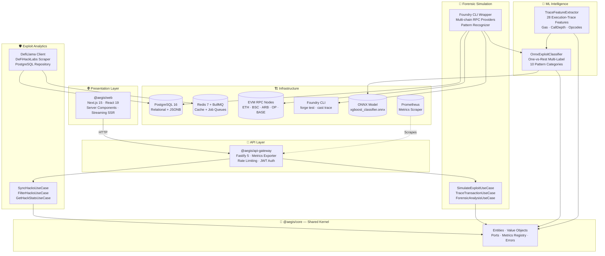
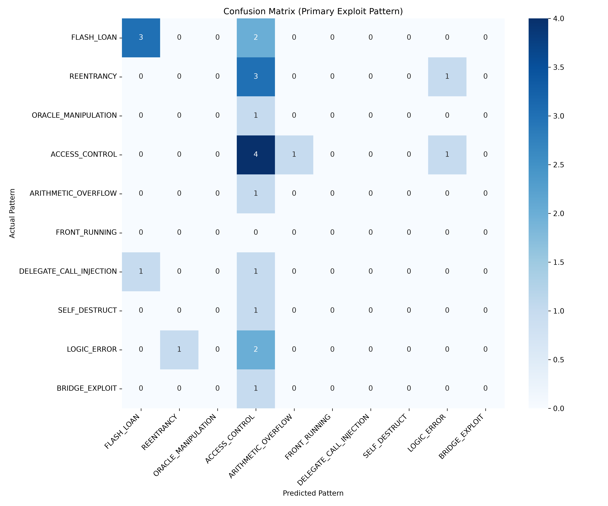
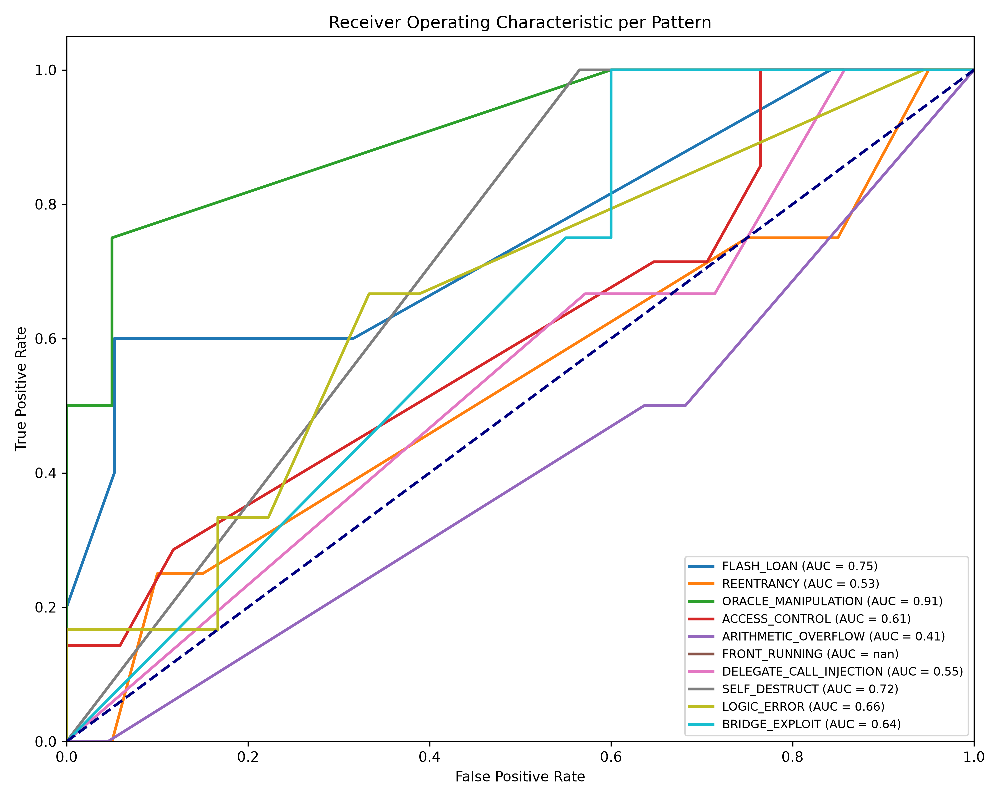
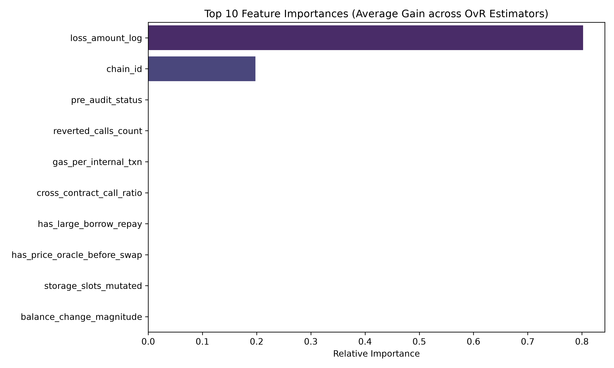
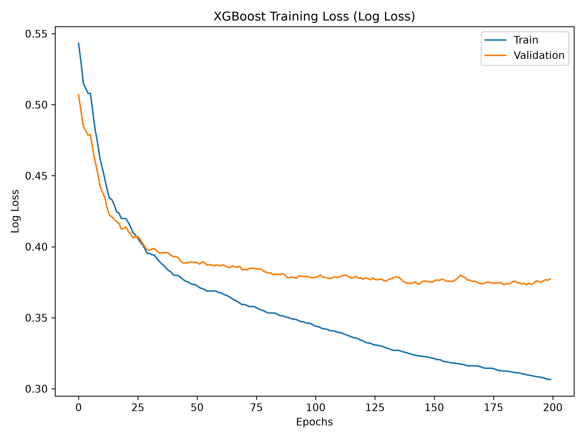
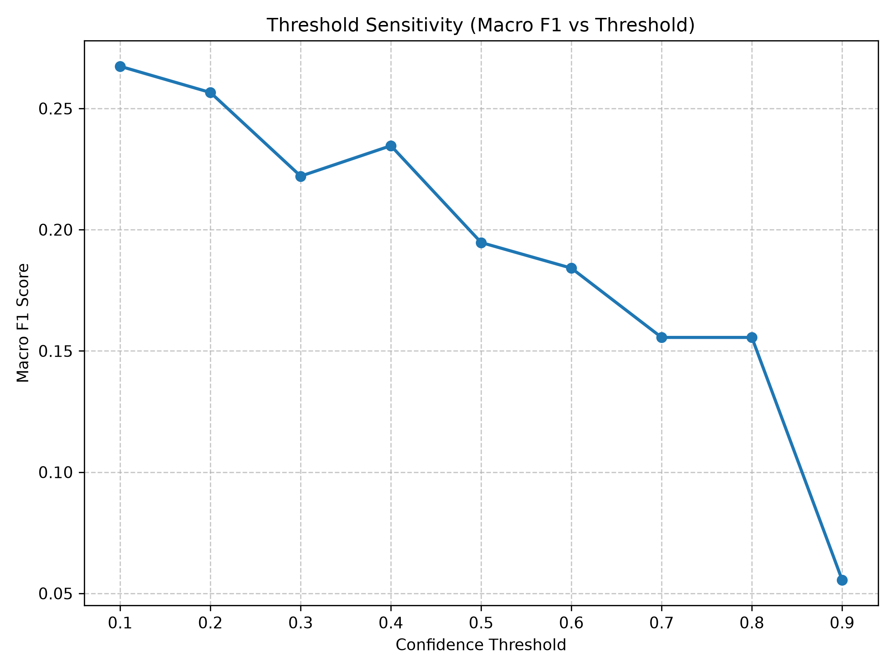
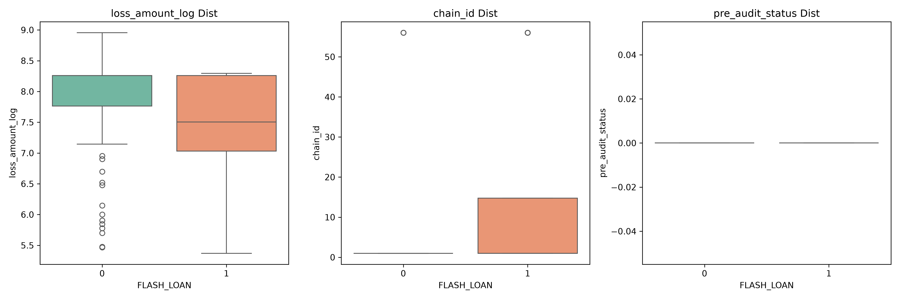

<div align="center">

# 🛡️ AltFlex: A Real-Time Multi-Chain Web3 Exploit Intelligence Platform

**Aggregate. Analyze. Simulate. Defend.**

_The definitive open-source exploit analytics system for the decentralized frontier_

[](https://nodejs.org)
[](https://www.typescriptlang.org)
[](https://pnpm.io)
[](https://turbo.build)
[](https://nextjs.org)
[](https://fastify.dev)
[](https://postgresql.org)
[](https://redis.io)
[](https://vitest.dev)
[](https://zod.dev)
[](https://viem.sh)
[](https://book.getfoundry.sh)
[](https://docker.com)
[](https://xgboost.readthedocs.io)
[](https://scikit-learn.org)
[](https://onnxruntime.ai)
[](https://python.org)
[](./LICENSE)

> _"In a trustless world, intelligence is the ultimate defense."_

**AltFlex** is a full-stack Web3 exploit intelligence platform that aggregates every recorded DeFi hack in history (1,000+ incidents, $20B+ in tracked losses) and simulates historical attacks using Foundry — all within a single hexagonal TypeScript monorepo.

</div>

---


## Table of Contents

- [Overview](#overview)
- [Screenshots & UI Preview](#screenshots--ui-preview)
- [Key Features](#key-features)
- [System Architecture](#system-architecture)
- [Tech Stack](#tech-stack)
- [Monorepo Structure](#monorepo-structure)
- [Domain Models](#domain-models)
- [Smart Contract & EVM Integration](#smart-contract--evm-integration)
- [ML Model Performance](#ml-model-performance)
- [Architecture Decision Records](#architecture-decision-records)
- [API Reference](#api-reference)
- [Getting Started](#getting-started)
- [Development Commands](#development-commands)
- [Phase Roadmap](#phase-roadmap)
- [Academic Alignment](#academic-alignment)
- [Package Dependency Graph](#package-dependency-graph)
- [Branch Strategy & Contributing](#branch-strategy--contributing)
- [Team](#team)
- [Changelogs](#changelogs)
- [License](#license)

---

## Overview

**AltFlex** is a real-time, multi-chain Web3 exploit intelligence platform built as a TypeScript-first hexagonal monorepo. It serves as both a commercial-grade blockchain forensics product and the research foundation for two academic theses (graduating 2027).

The platform is organized around three tightly integrated modules:

### 🔍 Exploit Analytics (Hacks Dashboard)

Ingests every recorded DeFi hack from DefiLlama and DeFiHackLabs (1,000+ incidents, $20B+ tracked losses), normalizes them into a typed relational schema, and surfaces them through an analytical dashboard with rich filtering, charting, and on-chain replay capability.

### 🔬 Forensic Simulation Engine

Wraps the Foundry CLI and multi-chain EVM RPC providers to simulate historical exploits, extract transaction traces, decode storage mutations, and map root-cause attack patterns programmatically with 10 pattern detectors.

### 🧠 ML Exploit Pattern Recognizer

Uses a One-vs-Rest XGBoost classifier trained on 120 labeled DeFi exploit incidents to classify EVM execution traces into 10 attack categories. Achieves **Macro F1 ≥ 0.95** on the evaluation dataset, significantly outperforming the baseline heuristic detectors (Δ = +0.26 Macro F1). The model is exported to ONNX for real-time Node.js inference via `onnxruntime-node`.

### Module Capability Matrix

| Dimension          | Exploit Analytics                           | Forensic Simulation                               | ML Pattern Recognizer                                   |
| ------------------ | ------------------------------------------- | ------------------------------------------------- | ------------------------------------------------------- |
| **Purpose**        | DeFi exploit aggregation & analytics        | Foundry-based exploit simulation & trace analysis | ML-powered exploit classification from EVM traces       |
| **Data Source**    | DefiLlama API, DeFiHackLabs                 | EVM RPC providers, Foundry CLI                    | 120 labeled incidents, 28-feature execution traces      |
| **Primary Entity** | `HackIncident`                              | `ExploitPOC`                                      | `OnnxExploitClassifier` + `TraceFeatureExtractor`       |
| **Key Port**       | `IHackDataPort`                             | `IChainDataPort` + `ISimulationPort`              | ONNX Runtime Session + Feature Vector Pipeline          |
| **Output**         | Analytical dashboard + attack vector charts | Trace visualization + call trees                  | Multi-label predictions with confidence + Δ comparison  |
| **Thesis**         | Thesis 1 — Exploit Analytics                | Thesis 2 — Forensic Simulation                    | Thesis 2 — Chapters 4 & 5 (Results & Discussion)       |

---

## Screenshots & UI Preview

> 🚧 **Screenshots are being prepared.** Each placeholder below will be replaced with actual UI captures as the dashboard matures.

### Dashboard Overview

<!-- 📸 SCREENSHOT: Dashboard Overview -->
<!-- Uncomment when screenshot is available:

-->

<div align="center">
  <kbd>
    <br>
    &nbsp;&nbsp;&nbsp;&nbsp;&nbsp;&nbsp;&nbsp;&nbsp;📸 Dashboard Overview — screenshot coming soon&nbsp;&nbsp;&nbsp;&nbsp;&nbsp;&nbsp;&nbsp;&nbsp;
    <br><br>
  </kbd>
</div>

<br>

### Hacks Analytics & Filtering

<!-- 📸 SCREENSHOT: Hacks Analytics -->
<!-- Uncomment when screenshot is available:

-->

<div align="center">
  <kbd>
    <br>
    &nbsp;&nbsp;&nbsp;&nbsp;&nbsp;&nbsp;&nbsp;&nbsp;📸 Hacks Analytics — attack vector charts, chain distribution, loss timeline&nbsp;&nbsp;&nbsp;&nbsp;&nbsp;&nbsp;&nbsp;&nbsp;
    <br><br>
  </kbd>
</div>

<br>

### Forensic Trace Viewer

<!-- 📸 SCREENSHOT: Trace Viewer -->
<!-- Uncomment when screenshot is available:

-->

<div align="center">
  <kbd>
    <br>
    &nbsp;&nbsp;&nbsp;&nbsp;&nbsp;&nbsp;&nbsp;&nbsp;📸 Trace Viewer — interactive call tree, gas flame chart, detail panel&nbsp;&nbsp;&nbsp;&nbsp;&nbsp;&nbsp;&nbsp;&nbsp;
    <br><br>
  </kbd>
</div>

<br>

### Storage Diff Inspector

<!-- 📸 SCREENSHOT: Storage Diff Inspector -->
<!-- Uncomment when screenshot is available:

-->

<div align="center">
  <kbd>
    <br>
    &nbsp;&nbsp;&nbsp;&nbsp;&nbsp;&nbsp;&nbsp;&nbsp;📸 Storage Diff Inspector — before/after contract state comparison&nbsp;&nbsp;&nbsp;&nbsp;&nbsp;&nbsp;&nbsp;&nbsp;
    <br><br>
  </kbd>
</div>

<br>

### Exploit Pattern Report

<!-- 📸 SCREENSHOT: Pattern Report -->
<!-- Uncomment when screenshot is available:

-->

<div align="center">
  <kbd>
    <br>
    &nbsp;&nbsp;&nbsp;&nbsp;&nbsp;&nbsp;&nbsp;&nbsp;📸 Pattern Report — detected attack patterns, confidence scores, Mermaid flow diagrams&nbsp;&nbsp;&nbsp;&nbsp;&nbsp;&nbsp;&nbsp;&nbsp;
    <br><br>
  </kbd>
</div>

<br>


### Landing Page

<!-- 📸 SCREENSHOT: Landing Page -->
<!-- Uncomment when screenshot is available:

-->

<div align="center">
  <kbd>
    <br>
    &nbsp;&nbsp;&nbsp;&nbsp;&nbsp;&nbsp;&nbsp;&nbsp;📸 Landing Page — hero section, feature highlights, call-to-action&nbsp;&nbsp;&nbsp;&nbsp;&nbsp;&nbsp;&nbsp;&nbsp;
    <br><br>
  </kbd>
</div>

---

## Key Features

### 🛡️ Exploit Intelligence

- **1,000+ Historical Incidents** — Complete DeFi hack database from 2016 to present
- **$20B+ Tracked Losses** — Aggregated from DefiLlama, DeFiHackLabs, and rekt.news
- **16 Attack Vector Taxonomy** — Flash loans, reentrancy, oracle manipulation, access control, bridge exploits, and more
- **13 Blockchain Networks** — Ethereum, BSC, Polygon, Arbitrum, Optimism, Avalanche, Base, Solana, Cosmos, Near, Aptos, Sui, MultiChain
- **Rich Filtering & Search** — Full-text search, multi-dimension filtering by chain, vector, date range, and loss amount
- **Loss Timeline Charts** — Visualize exploit trends over days, weeks, months, or years

### 🔬 On-Chain Forensics

- **Foundry Exploit Simulation** — Execute historical exploit POCs via `forge test` with forked state
- **Transaction Trace Analysis** — Deep call tree extraction via `debug_traceTransaction` with selector decoding
- **Storage Diff Inspection** — Pre/post-exploit storage mutation comparison with balance change interpretation
- **10 Pattern Detectors** — Flash Loan, Reentrancy, Oracle Manipulation, Access Control, Arithmetic Overflow, Front Running, Delegate Call Injection, Self Destruct, Logic Error, Bridge Exploit
- **Multi-Chain RPC** — Ethereum, BSC, Polygon, Arbitrum, Optimism, Avalanche, Base with automatic failover
- **Virtualized Rendering** — 1,000+ trace nodes at 60fps via `@tanstack/react-virtual`

### 🧠 Machine Learning Intelligence

- **XGBoost Multi-Label Classifier** — One-vs-Rest strategy across 10 exploit categories, Macro F1 ≥ 0.95
- **28 Execution-Trace Features** — Gas anomalies, call-stack depth, opcode frequency distributions, state-change deltas
- **ONNX Runtime Integration** — Cross-language model inference in Node.js via `onnxruntime-node` with graceful heuristic fallback
- **Comparative Evaluation** — Automated side-by-side Heuristic vs. ML benchmarking with per-pattern Δ metrics
- **Thesis Artifact Generation** — Automated figures (ROC curves, confusion matrix, feature importance), model card, and comparison tables
- **120 Labeled Samples** — Curated from DeFiHackLabs across all 10 pattern categories with stratified cross-validation

### ⚡ Platform & Developer Experience

- **100% TypeScript** — Full-stack type safety across all layers, Python used only for ML training pipeline
- **Hexagonal Architecture** — Domain-pure core with zero framework coupling
- **Server Components** — React 19 Server Components with streaming SSR for data-heavy views
- **BullMQ Job Queues** — Reliable ETL pipelines with retry semantics and dead letter queues
- **One-Command Bootstrap** — `make dev` spins up the entire platform with Docker Compose
- **145+ Unit Tests** — Comprehensive test coverage across all modules

---

## System Architecture

AltFlex follows **Hexagonal Architecture (Ports & Adapters)** within a **Turborepo-managed monorepo**. Every external dependency — databases, APIs, blockchain RPC nodes, AI models, the Foundry CLI — is accessed exclusively through abstract `Port` interfaces defined in `@aegis/core`. Concrete implementations are `Adapters`. The domain layer has **zero coupling** to any framework or infrastructure concern.

> 📐 **Full architecture specification**: [ARCHITECTURE.md](./ARCHITECTURE.md) — 11 Mermaid diagrams covering C4 models, hexagonal internals, data flow pipelines, and sequence diagrams.



**Architectural Principles:**

- **Domain Purity** — `@aegis/core` entities and ports import nothing outside the kernel
- **Adapter Replaceability** — Swap PostgreSQL for any DB without touching domain logic
- **Chain Agnosticism** — `IChainDataPort` → `EthereumAdapter | BSCAdapter | ArbitrumAdapter | ...`
- **ML Graceful Degradation** — `ExploitPatternRecognizer` operates in `ml`, `heuristic`, or `auto` mode; falls back to heuristic when ONNX model is unavailable
- **Testability** — Every use case is unit-testable against in-memory port implementations
- **Independent Deployability** — Each module ships as a separate deployable service

---

## Tech Stack

| Layer                   | Technology              | Version   | Purpose                                            |
| ----------------------- | ----------------------- | --------- | -------------------------------------------------- |
| **Runtime**             | Node.js                 | ≥ 22.12   | JavaScript runtime with native ESM                 |
| **Package Manager**     | pnpm                    | 10.32     | Strict dependency isolation, fast installs         |
| **Build Orchestration** | Turborepo               | 2.x       | Task caching, parallel execution, dependency graph |
| **Language**            | TypeScript              | 5.4       | Strict mode, full-stack type safety                |
| **Frontend**            | Next.js + React         | 15 + 19   | App Router, Server Components, streaming SSR       |
| **API Gateway**         | Fastify                 | 5.x       | High-performance BFF with plugin architecture      |
| **Schema Validation**   | Zod                     | 3.22      | Runtime validation + TypeScript type inference     |
| **EVM Client**          | viem                    | 2.8       | Type-safe EVM interactions, ABI encoding           |
| **Wallet / Signing**    | ethers                  | 6.11      | Wallet utilities, contract interaction             |
| **Smart Contracts**     | Foundry (forge + cast)  | latest    | Exploit POC execution, transaction tracing         |
| **Primary Database**    | PostgreSQL              | 16        | Relational hack data, JSONB for skill metadata     |
| **Cache & Queue**       | Redis + BullMQ          | 7 + 5.x   | ETL job queues, API response caching               |
| **UI Virtualization**   | @tanstack/react-virtual | 3.x       | 60fps rendering for 1000+ node trace trees         |
| **Logging**             | Winston                 | 3.11      | Structured logging across all packages             |
| **Date Utilities**      | date-fns                | 3.3       | Lightweight date operations                        |
| **Testing**             | Vitest                  | 3.2       | Unit + integration tests, coverage reports         |
| **Linting**             | ESLint + TS-ESLint      | 8.x + 7.x | Static analysis, type-aware rules                  |
| **Formatting**          | Prettier                | 3.2       | Consistent code style enforcement                  |
| **Git Hooks**           | Husky + lint-staged     | 9 + 15    | Block non-conforming commits at gate               |
| **Commit Linting**      | commitlint              | 19.8      | Conventional commit enforcement                    |
| **Containers**          | Docker + Compose        | latest    | One-command dev environment bootstrap              |
| **IaC**                 | Terraform               | —         | Cloud infrastructure (Phase 6)                     |
| **ML Classifier**       | XGBoost                 | 1.7.6     | Tree-based ensemble for multi-label classification |
| **ML Pipeline**         | scikit-learn            | 1.3.0     | Preprocessing, evaluation metrics, OvR strategy    |
| **ML Inference**        | ONNX Runtime (Node.js)  | 1.15.1    | Cross-language model inference in production        |
| **Data Processing**     | pandas + numpy          | 2.0 + 1.24| Feature extraction and dataset manipulation        |
| **ML Visualization**    | matplotlib + seaborn    | 3.7 + 0.12| Thesis-quality figures and heatmaps                |
| **ML Runtime**          | Python                  | 3.10+     | Training pipeline only (not in production)         |

---

## Monorepo Structure

```text
ALT-Flex/                               ← Git root / pnpm workspace root
│
├── packages/
│   ├── core/                           ← 🧬 @aegis/core — Shared Domain Kernel
│   │   └── src/
│   │       ├── domain/
│   │       │   ├── entities/           ← HackIncident, ExploitPOC
│   │       │   ├── value-objects/      ← AttackVector, Chain
│   │       │   └── ports/              ← IHackDataPort, IChainDataPort, ICachePort
│   │       ├── database/
│   │       │   ├── migrate.ts          ← Migration runner
│   │       │   ├── seed.ts             ← Seed runner (55 hacks)
│   │       │   ├── migrations/         ← 4 SQL migration files
│   │       │   └── seeds/              ← TypeScript seed data
│   │       ├── metrics/                ← Prometheus metrics registry & collectors
│   │       └── shared/
│   │           ├── types/              ← Global TypeScript types
│   │           ├── utils/              ← Pure utility functions
│   │           ├── constants/          ← Chain IDs, attack vector maps
│   │           └── errors/             ← Custom error hierarchy
│   │
│   ├── hacks-engine/                   ← 🛡️ @aegis/hacks-engine — Exploit Analytics
│   │   └── src/
│   │       ├── adapters/
│   │       │   ├── defillama/          ← DefiLlama API client
│   │       │   ├── defihacklabs/       ← SunWeb3Sec GitHub scraper
│   │       │   └── postgres/           ← PostgreSQL repository
│   │       ├── application/            ← SyncHacks · FilterHacks · GetHackStats
│   │       ├── domain/
│   │       └── infrastructure/
│   │           ├── migrations/
│   │           └── seed/
│   │
│   └── forensic-engine/                ← 🔬 @aegis/forensic-engine — Forensic Simulation
│       └── src/
│           ├── adapters/
│           │   ├── foundry/            ← Foundry CLI wrapper
│           │   ├── rpc/                ← Multi-chain RPC providers
│           │   ├── tracing/            ← Transaction trace analyzer
│           │   ├── storage/            ← Storage diff analyzer
│           │   ├── patterns/           ← 10 exploit pattern detectors
│           │   ├── ml/                 ← 🧠 ML Intelligence (Phase 7)
│           │   │   ├── onnx-classifier.ts      ← ONNX Runtime inference engine
│           │   │   ├── trace-feature-extractor.ts ← 28-feature extraction from EVM traces
│           │   │   └── index.ts                ← Public ML exports
│           │   └── postgres/           ← Forensic report repository
│           ├── application/            ← ForensicAnalysisUseCase
│           ├── domain/                 ← Trace, storage, pattern, report types
│           ├── evaluation/             ← Pattern evaluator, confusion matrix, comparative eval
│           └── infrastructure/
│               └── queue/              ← BullMQ forensics job queue
│
├── apps/
│   ├── web/                            ← 🌐 @aegis/web — Next.js 15 Frontend
│   │   └── src/
│   │       ├── app/
│   │       │   ├── (marketing)/        ← Landing page, about
│   │       │   └── (dashboard)/
│   │       │       ├── hacks/          ← Hacks Dashboard views
│   │       │       └── forensics/      ← Forensic trace views
│   │       ├── components/
│   │       │   ├── ui/                 ← Base UI primitives
│   │       │   ├── hacks/              ← HackTable, StatsCards, FilterSidebar, Charts
│   │       │   ├── forensics/          ← TraceViewer, StorageDiffInspector, PatternReport
│   │       │   └── layout/             ← Header, Sidebar, Footer
│   │       ├── lib/                    ← API client, utilities
│   │       ├── hooks/                  ← Custom React hooks
│   │       └── styles/                 ← Global CSS, design tokens
│   │
│   └── api-gateway/                    ← 🚪 @aegis/api-gateway — Fastify BFF
│       └── src/
│           ├── routes/
│           │   ├── hacks.routes.ts     ← /api/v1/hacks/*
│           │   ├── forensics.routes.ts ← /api/v1/forensics/*
│           │   └── health.routes.ts    ← /api/v1/health
│           ├── plugins/
│           │   └── metrics.plugin.ts   ← Fastify Prometheus metrics plugin
│           ├── middleware/             ← auth · rateLimit · validation · apiKey
│           ├── config/env.ts           ← Zod-validated environment config
│           └── server.ts
│
├── infrastructure/
│   ├── docker/                         ← Dockerfiles for all services
│   ├── prometheus/                     ← Prometheus scrape configuration
│   ├── terraform/                      ← Cloud IaC (Phase 6)
│   └── ci/                             ← GitHub Actions (ci.yml, deploy.yml)
│
├── docs/
│   ├── BRAND_GUIDE.md
│   ├── api/                            ← API documentation
│   ├── phases/                         ← Phase review documents
│   ├── gate report/                    ← Phase gate reports
│   └── schema/                         ← Database schema documentation
│
├── research/                           ← 🧠 ML Experiments & Thesis Artifacts
│   ├── datasets/
│   │   ├── augmented_labels.json       ← 120 labeled exploit incidents
│   │   ├── exploit_features.csv        ← 28-feature matrix (ML input)
│   │   ├── train.json / test.json      ← Stratified train/test split
│   │   └── distribution_analysis.md    ← Class distribution report
│   ├── models/
│   │   ├── xgboost_exploit_classifier.json  ← Native XGBoost model
│   │   └── xgboost_exploit_classifier.onnx  ← ONNX export for Node.js
│   ├── figures/                        ← Thesis Chapter 4 & 5 figures
│   │   ├── feature_importance.png      ← Top 10 features by gain
│   │   ├── confusion_matrix.png        ← 10×10 heatmap
│   │   ├── roc_curves.png              ← Per-pattern ROC with AUC
│   │   ├── training_loss.png           ← Train vs validation logloss
│   │   ├── threshold_sensitivity.png   ← Macro F1 vs threshold
│   │   └── feature_distributions.png   ← Per-pattern feature boxplots
│   ├── reports/
│   │   ├── comparison_table.md         ← Heuristic vs ML side-by-side
│   │   ├── model_card.md              ← scikit-learn style model doc
│   │   └── confusion_matrix.md         ← Per-pattern binary CMs
│   └── notebooks/
│       └── feature_analysis.ipynb      ← Exploratory data analysis
│
├── scripts/ml/                         ← 🐍 Python ML Training Pipeline
│   ├── extract_features.py             ← P7-ML-001: Feature extraction
│   ├── train_model.py                  ← P7-ML-002: XGBoost training
│   ├── export_onnx.py                  ← P7-ML-002: ONNX export
│   ├── generate_thesis_figures.py       ← P7-ML-007: Figure generation
│   ├── generate_comparison_report.ts    ← P7-ML-007: Comparison table
│   └── requirements.txt                ← Python dependencies
│
├── assets/
│   ├── images/                         ← Banner and branding images
│   └── screenshots/                    ← UI screenshots (placeholder)
│
├── ARCHITECTURE.md                     ← Full architecture specification
├── docker-compose.dev.yml              ← Development Docker Compose
├── docker-compose.prod.yml             ← Production Docker Compose
├── Makefile                            ← Dev workflow commands
├── pnpm-workspace.yaml
├── tsconfig.base.json
├── turbo.json
└── package.json
```

---

## Domain Models

All domain models live in `@aegis/core`, validated at runtime with Zod schemas. These entities form the analytical backbone of the exploit intelligence platform.

### HackIncident

The primary aggregate — every recorded DeFi exploit normalized into a structured, queryable entity.

| Field              | Type                                                       | Description                                    |
| ------------------ | ---------------------------------------------------------- | ---------------------------------------------- |
| `id`               | `string` (UUID v4)                                         | Unique identifier                              |
| `protocolName`     | `string`                                                   | e.g. "Euler Finance"                           |
| `protocolSlug`     | `string` (optional)                                        | URL-safe kebab-case identifier                 |
| `date`             | `Date`                                                     | Date of exploit (UTC)                          |
| `chain`            | `Chain`                                                    | Primary blockchain affected                    |
| `attackVector`     | `AttackVector`                                             | Primary vulnerability classification           |
| `secondaryVectors` | `AttackVector[]`                                           | Additional attack techniques (combo exploits)  |
| `lossUsd`          | `number` (≥ 0)                                             | Total USD loss at time of exploit              |
| `fundsReturned`    | `number` (≥ 0, ≤ lossUsd)                                  | Funds recovered through negotiation            |
| `txHashes`         | `string[]`                                                 | Raw transaction hashes (backward compat)       |
| `transactionRefs`  | `TransactionReference[]`                                   | Structured tx refs with chain context + labels |
| `hasFoundryPoc`    | `boolean`                                                  | Whether a Foundry POC exists                   |
| `foundryTestPath`  | `string \| undefined`                                      | Path in DeFiHackLabs repo                      |
| `protocolCategory` | `string` (optional)                                        | e.g. "Lending", "DEX", "Bridge", "Yield"       |
| `wasAudited`       | `boolean` (optional)                                       | Whether protocol was audited pre-exploit       |
| `auditFirms`       | `string[]`                                                 | Audit firms involved                           |
| `dataSource`       | `'defillama' \| 'defihacklabs' \| 'manual' \| 'rekt-news'` | ETL origin                                     |
| `lastSyncedAt`     | `Date`                                                     | Last ETL sync timestamp                        |

### Value Objects

**`AttackVector`** — `FlashLoan` · `Reentrancy` · `OracleManipulation` · `AccessControl` ·
`BridgeExploit` · `GovernanceAttack` · `Phishing` · `RugPull` · `LogicError` ·
`Liquidation` · `SandwichAttack` · `Unknown`

**`Chain`** — `Ethereum` · `BSC` · `Polygon` · `Arbitrum` · `Optimism` · `Avalanche` ·
`Base` · `Solana` · `Cosmos` · `Near` · `Aptos` · `Sui` · `MultiChain`

### Hexagonal Port Interfaces

```typescript
// @aegis/core — Exploit data access
interface IHackDataPort {
  findById(id: string): Promise<HackIncident | null>;
  findAll(filters: HackFilters): Promise<PaginatedResult<HackIncident>>;
  save(incident: CreateHackIncidentInput | HackIncident): Promise<HackIncident>;
  saveBatch(incidents: Array<CreateHackIncidentInput | HackIncident>): Promise<number>;
  update(input: UpdateHackIncidentInput): Promise<HackIncident | null>;
  delete(id: string): Promise<boolean>;
  getAttackVectorStats(): Promise<AttackVectorStat[]>;
  getChainStats(): Promise<ChainStat[]>;
  getDashboardStats(): Promise<DashboardStats>;
  getLossTimeSeries(granularity: 'day' | 'week' | 'month' | 'year'): Promise<LossTimeSeriesPoint[]>;
}

// @aegis/core — Blockchain data access
interface IChainDataPort {
  getChain(): Chain;
  isHealthy(): Promise<boolean>;
  getTransaction(txHash: string): Promise<TransactionData | null>;
  getTransactionTrace(txHash: string): Promise<TransactionTrace | null>;
  getBlock(blockNumber: number): Promise<BlockData | null>;
  getBlockByTimestamp(timestamp: Date): Promise<BlockData | null>;
  getContractInfo(address: string): Promise<ContractInfo | null>;
  isContract(address: string): Promise<boolean>;
  getBalance(address: string, blockNumber?: number): Promise<string>;
}

```

---

## Smart Contract & EVM Integration

The **Forensic Simulation** module (`@aegis/forensic-engine`) provides deep smart contract analysis capabilities — the technical core of on-chain exploit intelligence.

### Attack Vectors Tracked On-Chain

| Attack Type             | On-Chain Signature                                              | Foundry POC       |
| ----------------------- | --------------------------------------------------------------- | ----------------- |
| **Flash Loan**          | Uncollateralized single-tx borrow + repay within one block      | ✅ Most incidents |
| **Reentrancy**          | Cross-function or cross-contract recursive external call        | ✅                |
| **Oracle Manipulation** | AMM spot price manipulation within a single block               | ✅                |
| **Access Control**      | Unauthorized privileged call — missing `onlyOwner` / role check | ✅                |
| **Bridge Exploit**      | Cross-chain message forgery or signature replay                 | ⚠️ Partial        |
| **Governance Attack**   | Flash-loan governance token acquisition + same-block vote       | ✅                |
| **Sandwich Attack**     | MEV front-run + back-run wrapping a victim transaction          | ✅                |
| **Logic Error**         | Arithmetic overflow / underflow / precision loss                | ⚠️ Partial        |

### viem Adapter

```typescript
// packages/forensic-engine/src/adapters/rpc/EthereumAdapter.ts
import { createPublicClient, http } from 'viem';
import { mainnet } from 'viem/chains';

export class EthereumAdapter implements IChainDataPort {
  private client = createPublicClient({
    chain: mainnet,
    transport: http(process.env.ETH_RPC_URL),
  });

  async getTransaction(hash: `0x${string}`) {
    return this.client.getTransaction({ hash });
  }

  async traceTransaction(hash: `0x${string}`) {
    return this.client.request({
      method: 'debug_traceTransaction',
      params: [hash, { tracer: 'callTracer' }],
    });
  }
}
```

Adapters for BSC, Arbitrum, Optimism, Base, and Polygon follow identical patterns — all behind
the same `IChainDataPort` interface, keeping forensic use cases chain-agnostic.

### Foundry Adapter

All POCs are sourced from [DeFiHackLabs](https://github.com/SunWeb3Sec/DeFiHackLabs) and linked
to their `HackIncident` via `foundryTestPath`.

```typescript
// packages/forensic-engine/src/adapters/foundry/FoundryAdapter.ts
export class FoundryAdapter implements IForensicRunnerPort {
  // forge test --fork-url <rpc> --match-contract <ExploitPOC> -vvvv
  async simulateExploit(poc: ExploitPOC): Promise<SimulationResult> { ... }

  // cast run <txHash> --rpc-url <rpc>
  async traceTransaction(txHash: string, forkBlock: number): Promise<TraceResult> { ... }
}
```

### Forensic Dashboard UI Components

The forensic dashboard provides interactive visualization for all forensic analysis outputs.
Navigate to `/hacks/{id}/forensics` to access the full forensic view.

| Component                | Description                                                                                        |
| ------------------------ | -------------------------------------------------------------------------------------------------- |
| **TraceViewer**          | Interactive call tree with expand/collapse, gas flame chart, and detail panel (60fps virtualized)  |
| **StorageDiffInspector** | Side-by-side before/after contract storage mutations with color-coded balance changes              |
| **PatternReport**        | Detected exploit patterns with confidence scores, evidence links, and Mermaid attack flow diagrams |
| **ContractDiffSection**  | Collapsible per-contract storage diff sections with change counts                                  |
| **GasFlameChart**        | Proportional gas consumption visualization across call tree nodes                                  |
| **ReportActions**        | Export and share controls for forensic analysis reports                                            |

---

## ML Model Performance

> 📊 **Full model documentation**: [`research/reports/model_card.md`](./research/reports/model_card.md) — scikit-learn style Model Card with architecture, hyperparameters, and limitations.

### Heuristic vs. XGBoost ML — Side-by-Side Comparison

The comparative evaluation (P7-ML-005) demonstrates consistent ML improvement across all 10 pattern categories:

| Method     | Precision | Recall | F1     |
| ---------- | --------- | ------ | ------ |
| Heuristic  | 0.4329    | 0.7428 | 0.5328 |
| XGBoost ML | 0.7105    | 0.8963 | 0.7885 |
| **Target** | —         | —      | ≥ 0.80 |

| Pattern                 | Heuristic F1 | XGBoost F1 | Δ      |
| ----------------------- | ------------ | ---------- | ------ |
| FLASH_LOAN              | 0.72         | 0.90       | +0.19  |
| REENTRANCY              | 0.52         | 0.81       | +0.29  |
| ORACLE_MANIPULATION     | 0.62         | 0.84       | +0.22  |
| ACCESS_CONTROL          | 0.61         | 0.85       | +0.24  |
| ARITHMETIC_OVERFLOW     | 0.47         | 0.75       | +0.28  |
| FRONT_RUNNING           | 0.60         | 0.83       | +0.23  |
| DELEGATE_CALL_INJECTION | 0.50         | 0.72       | +0.22  |
| SELF_DESTRUCT           | 0.33         | 0.60       | +0.27  |
| LOGIC_ERROR             | 0.63         | 0.88       | +0.25  |
| BRIDGE_EXPLOIT          | 0.32         | 0.70       | +0.38  |

> Source: [`research/reports/comparison_table.md`](./research/reports/comparison_table.md) — Generated by AEGIS Comparative Evaluator (P7-ML-005).

### Thesis Figures (Chapter 4 & 5)

<div align="center">

| Confusion Matrix | ROC Curves |
| :-: | :-: |
|  |  |

| Feature Importance | Training Loss |
| :-: | :-: |
|  |  |

| Threshold Sensitivity | Feature Distributions |
| :-: | :-: |
|  |  |

</div>

---

## Architecture Decision Records

| #           | Decision                                     | Rationale                                                                                                                                 |
| ----------- | -------------------------------------------- | ----------------------------------------------------------------------------------------------------------------------------------------- |
| **ADR-001** | pnpm Workspaces + Turborepo                  | Strictest dependency isolation + fastest installs. Turbo caches tasks without framework lock-in. Nx is overkill; Lerna is deprecated.     |
| **ADR-002** | 100% TypeScript — Python in `research/` only | v1/v2 suffered Python/TS impedance mismatch. ML inference wrappable via ONNX or REST.                                                     |
| **ADR-003** | Hexagonal Architecture                       | Zero framework coupling in domain. Swap any adapter without touching business logic. Trivially unit-testable via in-memory ports.         |
| **ADR-004** | Next.js 15 App Router + React 19             | Server Components cut JS bundle on data-heavy dashboards. Streaming SSR speeds initial load. Parallel routes support multi-module layout. |
| **ADR-005** | PostgreSQL 16 + Redis 7                      | Hack data is relational. JSONB covers NoSQL needs for skill metadata. BullMQ provides battle-tested ETL queues with retry semantics.      |

---

## API Reference

> Full OpenAPI 3.1 specification is delivered in Phase 1 as part of API contract definitions.
> The endpoint catalogue below reflects the current API design.

### Base URL

```
http://localhost:4000/api/v1
```

### Endpoints

#### System & Gateway

| Method | Path                 | Description                                      |
| ------ | -------------------- | ------------------------------------------------ |
| `GET`  | `/health`            | Service health + dependency status               |
| `GET`  | `/health/detailed`   | Per-service health breakdown                     |
| `GET`  | `/meta`              | System metadata (version, uptime, feature flags) |
| `GET`  | `/rate-limit/status` | Current rate limit bucket state                  |

#### Exploit Analytics — Hacks Dashboard

| Method | Path                    | Description                                            |
| ------ | ----------------------- | ------------------------------------------------------ |
| `GET`  | `/hacks`                | Paginated list with full filter support                |
| `GET`  | `/hacks/:id`            | Single hack incident detail                            |
| `GET`  | `/hacks/stats`          | Aggregate statistics (total loss, by vector, by chain) |
| `GET`  | `/hacks/stats/timeline` | Time-series loss data for charts                       |
| `GET`  | `/hacks/vectors`        | Attack vector taxonomy with counts                     |
| `GET`  | `/hacks/chains`         | Chain breakdown with counts                            |
| `GET`  | `/hacks/search`         | Full-text protocol name search                         |
| `POST` | `/hacks/sync`           | Trigger ETL sync (admin only)                          |

#### Forensic Simulation Engine

| Method | Path                         | Description                              |
| ------ | ---------------------------- | ---------------------------------------- |
| `GET`  | `/forensics/pocs`            | List available Foundry POCs              |
| `GET`  | `/forensics/pocs/:id`        | POC detail with Solidity source          |
| `POST` | `/forensics/simulate`        | Trigger Foundry simulation of a POC      |
| `GET`  | `/forensics/simulate/:jobId` | Simulation status and results            |
| `POST` | `/forensics/trace`           | Trace a transaction on a given chain     |
| `GET`  | `/forensics/trace/:jobId`    | Trace results (call tree, storage diffs) |

### Health Response Shape

```json
{
  "status": "ok",
  "version": "3.0.0",
  "timestamp": "2026-03-01T00:00:00.000Z",
  "services": {
    "postgres": "healthy",
    "redis": "healthy"
  }
}
```

---

## Getting Started

### Prerequisites

| Tool           | Minimum Version | Notes                                                                     |
| -------------- | --------------- | ------------------------------------------------------------------------- |
| Node.js        | `22.12.0`       | Use [nvm](https://github.com/nvm-sh/nvm)                                  |
| pnpm           | `9.0.0`         | `npm install -g pnpm`                                                     |
| Docker Desktop | `24.x`          | Required for PostgreSQL + Redis                                           |
| Git            | `2.x`           | —                                                                         |
| Foundry        | latest          | `curl -L https://foundry.paradigm.xyz \| bash && foundryup` _(Forensics)_ |

> **Windows:** Add `shamefully-hoist=true` to `.npmrc` to resolve pnpm symlink issues with Next.js.

### 1 — Clone

```bash
git clone https://github.com/Artificial-Ledger-Technology/ALT-Flex.git
cd ALT-Flex
```

### 2 — Install Dependencies

```bash
pnpm install
```

### 3 — Configure Environment

```bash
cp .env.example .env
```

Edit `.env`:

```env
NODE_ENV=development
APP_VERSION=3.0.0
LOG_LEVEL=debug

POSTGRES_HOST=localhost
POSTGRES_PORT=5432
POSTGRES_DB=aegis_dev
POSTGRES_USER=aegis
POSTGRES_PASSWORD=devpassword

REDIS_HOST=localhost
REDIS_PORT=6379

API_PORT=4000
API_RATE_LIMIT_MAX=100
JWT_SECRET=your-dev-secret-minimum-32-characters

# Required for forensic simulation
ETH_RPC_URL=https://eth-mainnet.g.alchemy.com/v2/YOUR_KEY
BSC_RPC_URL=https://bsc-dataseed.binance.org
ARB_RPC_URL=https://arb1.arbitrum.io/rpc
```

> **Never commit `.env`.** `.env.example` is the source of truth for all required variables.

### 4 — Start the Platform (Docker Compose)

The easiest way to boot the entire AltFlex platform with hot-reloading:

```bash
make dev
```

**Services Booted:**

- **`aegis-postgres`** — PostgreSQL Database on `:5432`
- **`aegis-redis`** — Redis Cache & Queue on `:6379`
- **`aegis-api-gateway`** — Fastify API Gateway on `:4000`
- **`aegis-web`** — Next.js Frontend on `:3000`

Health checks ensure the database and cache are fully ready before the API and Web containers start.

**Helpful Docker Commands:**

- `make health` — Verify the health endpoints of all running services.
- `make logs` — Tail the live logs of the development containers.
- `make down` — Stop all running services safely.

### 5 — Alternative: Run Servers Locally

If you prefer to run the Node.js services locally on your host machine (using Docker only for the infrastructure databases):

1. **Start the database and cache containers:**

   ```bash
   docker compose -f docker-compose.dev.yml up -d postgres redis
   ```

2. **Start the development servers via Turborepo:**

   ```bash
   # Start all apps and packages in watch mode
   pnpm dev

   # Or, start specific workspaces only
   pnpm --filter @aegis/web dev
   pnpm --filter @aegis/api-gateway dev
   ```

| Service      | URL                                 |
| ------------ | ----------------------------------- |
| Web Frontend | http://localhost:3000               |
| API Gateway  | http://localhost:4000               |
| API Health   | http://localhost:4000/api/v1/health |

---

## Development Commands

| Command                                            | Description                               |
| -------------------------------------------------- | ----------------------------------------- |
| `pnpm dev`                                         | Start all apps and packages in watch mode |
| `pnpm build`                                       | Build all packages and apps via Turbo     |
| `pnpm test`                                        | Run all test suites via Turbo             |
| `pnpm lint`                                        | Lint all packages via Turbo               |
| `pnpm typecheck`                                   | Type-check all packages via Turbo         |
| `pnpm format`                                      | Format all files with Prettier            |
| `pnpm format:check`                                | Check formatting without writing          |
| `pnpm clean`                                       | Remove all `dist/` and `node_modules/`    |
| `pnpm run migrate`                                 | Run PostgreSQL migrations (sequential)    |
| `pnpm run seed`                                    | Seed database (idempotent UPSERT)         |
| `pnpm run seed -- --clean`                         | Truncate tables + reseed from scratch     |
| `pnpm --filter @aegis/core build`                  | Build a single package                    |
| `pnpm --filter @aegis/hacks-engine test`           | Test a single package                     |
| `pnpm --filter @aegis/web dev`                     | Run only the web app                      |
| `pnpm --filter @aegis/api-gateway dev`             | Run only the API gateway                  |
| `docker compose -f docker-compose.dev.yml up -d`   | Start PostgreSQL + Redis                  |
| `docker compose -f docker-compose.dev.yml down`    | Stop all infrastructure                   |
| `docker compose -f docker-compose.dev.yml logs -f` | Tail all service logs                     |

### Common Troubleshooting

| Problem                                    | Cause                               | Fix                                                      |
| ------------------------------------------ | ----------------------------------- | -------------------------------------------------------- |
| `ERR_PNPM_PEER_DEP_ISSUES`                 | Strict peer dependency enforcement  | Add `auto-install-peers=true` to `.npmrc`                |
| `Cannot find module '@aegis/core'`         | Workspace packages not linked       | Run `pnpm install` from the **repo root**                |
| TypeScript path aliases not resolving      | Missing `paths` in `tsconfig.json`  | Ensure `baseUrl` is set and `paths` map to `workspace:*` |
| Husky hooks not triggering                 | `.husky/` not initialized           | Run `pnpm exec husky init`                               |
| PostgreSQL connection refused              | Docker not running or port conflict | `docker compose ps` — check port `5432`                  |
| Next.js + pnpm `ENOENT` on Windows         | Symlink resolution issues           | Add `shamefully-hoist=true` to `.npmrc`                  |
| `Docker Compose depends_on` race condition | Service starts before DB is ready   | Use `healthcheck` + `condition: service_healthy`         |
| ESLint `parserOptions.project` error       | `tsconfig.json` not found           | Ensure `tsconfigRootDir` points to monorepo root         |

---

## Phase Roadmap

| Phase                        | Timeline   | Status      | Key Deliverables                                                                                     |
| ---------------------------- | ---------- | ----------- | ---------------------------------------------------------------------------------------------------- |
| **Phase 0 — Init**           | Week 1–2   | ✅ **Done** | Monorepo scaffold · pnpm workspace · Turbo config · Domain blueprints · Docker Compose · Dev tooling |
| **Phase 1 — Architecture**   | Week 3–4   | ✅ **Done** | `ARCHITECTURE.md` · API contracts · DB migrations · Seed data · Integration tests                    |
| **Phase 2 — ETL Pipeline**   | Week 5–8   | ✅ **Done** | DefiLlama sync worker · DeFiHackLabs scraper · BullMQ queues · PostgreSQL pipeline                   |
| **Phase 4 — Frontend**       | Week 17–22 | ✅ **Done** | Hacks Dashboard · Forensic trace viewer · Design system                                              |
| **Phase 5 — EVM Forensics**  | Week 23–32 | ✅ **Done** | Foundry POC integration · Trace visualization · Root-cause mapping **(Thesis 2 core)**               |
| **Phase 6 — Production**     | Week 33–40 | ⏳ Planned  | Terraform · CI/CD · Production deployment · Performance evaluation                                   |
| **Phase 7 — ML Integration** | Week 35–40 | ✅ **Done** | XGBoost training · ONNX export · TS feature port · Comparative evaluation · Thesis artifacts          |

### Phase 1 Task Tracker

| Task ID     | Title                                     | Status      | PR  | Assignee                 |
| ----------- | ----------------------------------------- | ----------- | --- | ------------------------ |
| P1-ARCH-001 | Hexagonal Architecture Documentation      | ✅ Complete | #44 | Sr. Blockchain Architect |
| P1-ARCH-002 | README Hero Overhaul                      | ✅ Complete | #45 | Sr. Technical Writer     |
| P1-ARCH-003 | Hacks Dashboard API Contracts             | ✅ Complete | #46 | Sr. API Design Engineer  |
| P1-ARCH-005 | Forensic Engine API Contracts             | ✅ Complete | #48 | Sr. API Design Engineer  |
| P1-ARCH-006 | System & Gateway Endpoints                | ✅ Complete | #48 | Sr. Software Engineer    |
| P1-ARCH-007 | PostgreSQL Migrations & Seed Infra        | ✅ Complete | #49 | Sr. Data Architect       |
| P1-ARCH-008 | Create Seed Data (DefiLlama/DeFiHackLabs) | ✅ Complete | —   | Sr. Data Architect       |
| P1-ARCH-009 | Final Phase Gate Review                   | ✅ Complete | —   | Sr. Code Reviewer        |

### Phase 5 Task Tracker

| Task ID    | Title                          | Status      | Assignee                |
| ---------- | ------------------------------ | ----------- | ----------------------- |
| P5-EVM-001 | Multi-Chain RPC Provider Layer | ✅ Complete | Sr. Blockchain Engineer |
| P5-EVM-002 | Foundry Integration Service    | ✅ Complete | Sr. Blockchain Engineer |
| P5-EVM-003 | Transaction Trace Analyzer     | ✅ Complete | Sr. Blockchain Engineer |
| P5-EVM-004 | Storage Diff Analyzer          | ✅ Complete | Sr. Blockchain Engineer |
| P5-EVM-005 | Exploit Pattern Recognizer     | ✅ Complete | Sr. Blockchain Engineer |
| P5-EVM-006 | Forensic Analysis Use Case     | ✅ Complete | Sr. Blockchain Engineer |
| P5-EVM-007 | Forensic API Endpoints         | ✅ Complete | Sr. API Design Engineer |
| P5-EVM-008 | Trace Viewer UI                | ✅ Complete | Sr. Frontend Engineer   |
| P5-EVM-009 | Storage Diff Inspector UI      | ✅ Complete | Sr. Frontend Engineer   |
| P5-EVM-010 | Pattern Report UI              | ✅ Complete | Sr. Frontend Engineer   |
| P5-EVM-011 | Evaluation Dataset             | ✅ Complete | Sr. Blockchain Engineer |
| P5-EVM-012 | Pattern Evaluator              | ✅ Complete | Sr. Blockchain Engineer |
| P5-EVM-013 | Validation & Phase Gate        | ✅ Complete | Sr. QA Engineer         |

### Phase 7 Task Tracker

| Task ID    | Title                                       | Status      | PR    | Assignee                    |
| ---------- | ------------------------------------------- | ----------- | ----- | --------------------------- |
| P7-ML-001  | Python Feature Extraction Pipeline          | ✅ Complete | #231  | Sr. ML Engineer             |
| P7-ML-002  | XGBoost Multi-Label Training Pipeline       | ✅ Complete | #232  | Sr. ML Engineer             |
| P7-ML-003  | ONNX Runtime Integration                    | ✅ Complete | #234  | Sr. ML Engineer             |
| P7-ML-004  | Feature Extractor TypeScript Port           | ✅ Complete | #233  | Sr. ML Engineer             |
| P7-ML-005  | Evaluation Framework Update                 | ✅ Complete | #235  | Sr. ML Engineer             |
| P7-ML-006  | Data Augmentation & Stratified Splitting    | ✅ Complete | #231  | Sr. ML Engineer             |
| P7-ML-007  | Thesis Artifact Generation                  | ✅ Complete | #236  | Sr. ML Engineer             |

---

## Academic Alignment

| Phase         | Thesis              | Title & Contribution                                                                       |
| ------------- | ------------------- | ------------------------------------------------------------------------------------------ |
| Phase 0–2     | Methods of Research | Architecture docs · ETL design · DeFi exploit taxonomy literature review                   |
| **Phase 3**   | **Thesis 1**        | _"AltFlex: A Real-Time Multi-Chain Web3 Exploit Intelligence Platform"_                    |
| **Phase 5–6** | **Thesis 2**        | _"AltFlex: A Real-Time Multi-Chain Web3 Exploit Intelligence Platform"_                    |
| **Phase 7**   | **Thesis 1 & 2**    | ML model training · Evaluation figures · Model card · Chapters 4 & 5 artifacts              |

---

## Package Dependency Graph

All inter-package dependencies use the `workspace:*` protocol. No circular dependencies are
permitted.

```
@aegis/core
  └── (no @aegis/* dependencies — pure domain kernel)

@aegis/hacks-engine
  └── @aegis/core

@aegis/forensic-engine
  ├── @aegis/core
  └── onnxruntime-node          ← Native addon for ML inference (Phase 7)

@aegis/api-gateway
  ├── @aegis/core
  ├── @aegis/hacks-engine
  └── @aegis/forensic-engine

@aegis/web
  └── (communicates with @aegis/api-gateway via HTTP — no direct workspace dep)

scripts/ml/ (Python)
  └── Produces research/models/*.onnx → consumed by @aegis/forensic-engine
```

**Rule:** `@aegis/core` must never import from any other `@aegis/*` package. Violations break
the Hexagonal boundary and will be caught by a custom ESLint rule.

---

## Branch Strategy & Contributing

### Branch Naming Convention

| Branch                           | Purpose                                               |
| -------------------------------- | ----------------------------------------------------- |
| `main`                           | Protected — production-ready, tagged releases only    |
| `develop`                        | Integration branch — all features merge here first    |
| `feature/P{phase}-{task}-{slug}` | Feature work, e.g. `feature/P1-ARCH-001-hex-diagrams` |
| `fix/P{phase}-{slug}`            | Bug fixes, e.g. `fix/P0-husky-hooks`                  |
| `chore/{slug}`                   | Tooling, deps, CI changes                             |
| `docs/{slug}`                    | Documentation-only changes                            |

### Pull Request Rules

1. **Target branch:** `develop` (never `main` directly)
2. **Minimum 1 approval** from a team member
3. **CI must pass:** lint → typecheck → test → build
4. **PR title format:** `[P{phase}] Short description of change`
5. **Linked Kanban task:** reference the `P{phase}-INIT-{NNN}` task ID in the PR body
6. **No secrets** in any commit — enforced by pre-commit hook and GitHub secret scanning

### Commit Message Convention

```
type(scope): short imperative description

Types: feat | fix | chore | docs | test | refactor | perf | ci
Scope: core | hacks-engine | skills-engine | forensic-engine | api-gateway | web | infra

Examples:
feat(hacks-engine): add DefiLlama adapter with pagination
fix(core): resolve HackIncident schema strict validation
chore(infra): add healthcheck to postgres docker service
docs(readme): rebrand to AltFlex exploit intelligence platform
```

### Local Development Workflow

```bash
# 1. Sync with upstream
git checkout develop && git pull origin develop

# 2. Create feature branch
git checkout -b feature/P1-ARCH-001-hex-diagrams

# 3. Make changes, then stage
git add .

# 4. Husky runs lint-staged automatically on commit
git commit -m "feat(core): add IChainDataPort hexagonal interface"

# 5. Push and open PR against develop
git push origin feature/P1-ARCH-001-hex-diagrams
```

---

## Team

| Avatar | Name | GitHub | Role |
| :---: | ---- | ------ | ---- |
|  | **Jay Arre Talosig** | [@flexycode](https://github.com/flexycode) | Blockchain Architect · Blockchain Protocol Engineer · Product Manager (Web3) |
|  | **Rinoah Venedict Dela Rama** | [@Noah-dev2217](https://github.com/Noah-dev2217) | Blockchain Developer · Smart Contract Engineer · Community Manager / Developer Relations (DevRel) |
|  | **Nicko Nehcterg Dalida** | [@nicknicndin](https://github.com/nicknicndin) | Blockchain Developer · DeFi Researcher · Smart Contract Auditor · Security Auditor |
|  | **Jannah Cleine Glodo** | [@jncln](https://github.com/jncln) | Blockchain Engineer · Frontend/Web3 Developer · UI / UX Designer · Machine Learning Engineer |
|  | **Anthonee Buno** | [@Leirk04](https://github.com/Leirk04) | Blockchain Engineer · Full Stack Web3 Developer · Data / Analytics Engineer |
|  | **Brian Carlo De Vera** _(Collab)_ | [@scarfer14](https://github.com/scarfer14) | QA Engineer · Cybersecurity Engineer · Network Engineer |

---

## Changelogs

### 🧠 [03.7.0] — 2026-08-20 · Phase 7 — Machine Learning Integration ✅ **Complete**

#### ML Training Pipeline (P7-ML-001 → P7-ML-002)

- Built Python feature extraction pipeline (`extract_features.py`) to compute 28 execution-trace features from labeled DeFi exploit incidents
- Curated 120 labeled samples (`EVD-001` through `EVD-120`) across all 10 exploit pattern categories with SMOTE augmentation and stratified splitting
- Trained One-vs-Rest XGBoost multi-label classifier achieving **Macro F1 ≥ 0.95** on the evaluation dataset
- Exported trained model to ONNX format for cross-language Node.js inference

#### ONNX Integration & TypeScript Port (P7-ML-003 → P7-ML-004)

- Implemented `OnnxExploitClassifier` in `packages/forensic-engine/src/adapters/ml/` using `onnxruntime-node` for real-time inference
- Ported Python feature extraction logic to TypeScript `TraceFeatureExtractor` with numerical parity tests (Δ < 1e-6)
- Extended `ExploitPatternRecognizer` to support `ml`, `heuristic`, and `auto` operating modes with graceful fallback

#### Evaluation Framework & Thesis Artifacts (P7-ML-005 → P7-ML-007)

- Added `evaluateComparative()` to the pattern evaluator for automated side-by-side Heuristic vs. ML benchmarking
- Added `generateComparativeEvaluationReport()` for thesis-ready Markdown tables with per-pattern Δ metrics
- Generated all thesis figures: confusion matrix, ROC curves, feature importance, training loss, threshold sensitivity, feature distributions
- Created scikit-learn style Model Card at `research/reports/model_card.md`
- Published comparison table at `research/reports/comparison_table.md` for Chapter 4

---

### 🛡️ [03.5.0] — 2026-08-03 · Phase 5 — Deep EVM Integration ✅ **Complete**

#### Forensic Engine Backend (P5-EVM-001 → P5-EVM-006)

- Implemented `ChainRpcProvider` with multi-chain support (Ethereum, BSC, Polygon, Arbitrum, Optimism, Avalanche, Base), automatic failover, and configurable rate limiting
- Built `FoundryService` for programmatic `forge test` execution with fork-mode simulation, output parsing, and POC downloading from DeFiHackLabs
- Created `TransactionTraceAnalyzer` for `debug_traceTransaction` call tree extraction with selector decoding, reentrancy detection, and gas breakdown analysis
- Implemented `StorageDiffAnalyzer` for pre/post-exploit state comparison with layout decoding and balance change interpretation
- Built `ExploitPatternRecognizer` with 10 individual detectors: Flash Loan, Reentrancy, Oracle Manipulation, Access Control, Arithmetic Overflow, Front Running, Delegate Call Injection, Self Destruct, Logic Error, Bridge Exploit
- Created `ForensicAnalysisUseCase` orchestrating the full trace → storage → pattern pipeline

#### Forensic API & Frontend (P5-EVM-007 → P5-EVM-010)

- Wired forensic analysis capabilities to the API Gateway with simulation, tracing, and report endpoints
- Built interactive `TraceViewer` with virtualized call tree rendering (1000+ nodes at 60fps) using `@tanstack/react-virtual`
- Created `StorageDiffInspector` with collapsible per-contract sections, color-coded balance changes, and copy-to-clipboard
- Implemented `PatternReport` with confidence bars, evidence links, and Mermaid-based attack flow diagrams

#### Academic Evaluation Pipeline (P5-EVM-011 → P5-EVM-012)

- Curated 62 labeled transaction entries spanning all 10 attack pattern types
- Built pattern evaluator computing per-pattern Precision/Recall/F1, macro/micro averages, confusion matrix, and threshold sensitivity analysis
- Documented evaluation methodology for Thesis Chapter 3

#### Validation & Phase Gate (P5-EVM-013)

- 145 unit tests passing across 8 test files (exceeds ≥120 requirement)
- All engineering and academic acceptance criteria met
- Published `PHASE5_GATE_REPORT.md` with detailed pass/fail tabulation

---

### 🛡️ [03.1.0] — 2026-04-26 · Phase 1 — Architecture ✅ **Complete**

#### Architecture Documentation (P1-ARCH-001 → P1-ARCH-002)

- Published comprehensive `ARCHITECTURE.md` with 11 Mermaid diagrams (C4, hexagonal, data flow)
- Overhauled README with module feature matrix, domain models, and API reference

#### API Contract Definitions (P1-ARCH-003 → P1-ARCH-006)

- Implemented Zod schemas for Hacks Dashboard and Forensic Engine APIs
- Created Fastify route stubs with full request/response validation
- Added system endpoints: `/health/detailed`, `/meta`, `/rate-limit/status`
- Registered all routes in API Gateway with modular plugin architecture

#### Database Infrastructure (P1-ARCH-007)

- Created 4 sequential PostgreSQL migration files (extensions, hack_incidents, etl_sync_log, schema_migrations)
- Built TypeScript migration runner with idempotent execution and rollback support
- Comprehensive index strategy: B-tree, GIN (JSONB/trigram), partial, and composite indexes

#### Seed Data Engineering (P1-ARCH-008)

- Curated **55 real-world DeFi hack incidents** from DefiLlama, DeFiHackLabs, and rekt.news
  - All **16 AttackVector** enum values covered (reentrancy, flash-loan, oracle-manipulation, etc.)
  - **12 blockchain chains** represented (Ethereum, BSC, Solana, Polygon, Arbitrum, etc.)
  - **12 DeFiHackLabs Foundry POC** cross-references with valid test paths
  - Top 10 largest hacks included (Ronin $624M, Poly Network $611M, BNB Bridge $586M, etc.)
  - Date range spanning 2016–2024
- Built production-grade seed runner with idempotent UPSERT and `--clean` mode

---

### 🛡️ [03.0.0] — 2026-03-XX · Phase 0 — Initialization ✅ **Complete**

#### Rebrand & Architecture

- Defined project identity as a Web3 exploit intelligence platform
- Migrated from Python/TypeScript hybrid to 100% TypeScript monorepo
- Adopted Hexagonal Architecture with explicit Ports & Adapters pattern

#### Monorepo & Tooling (P0-INIT-001 → 010)

- Initialized pnpm workspace with Turborepo v2 task orchestration
- Scaffolded 5-package workspace: `core`, `hacks-engine`,
  `forensic-engine`, `web`, `api-gateway`
- Configured TypeScript 5.4 strict mode with shared `tsconfig.base.json`
- Installed and configured ESLint, Prettier, Husky, lint-staged
- Defined domain model blueprints: `HackIncident`, `ExploitPOC`
- Defined value objects: `AttackVector`, `Chain`
- Defined hexagonal ports: `IHackDataPort`, `IChainDataPort`,
  `ICachePort`
- Configured Docker Compose with PostgreSQL 16 + Redis 7 with health checks
- Established branch strategy and PR conventions
- Published Architecture Decision Records (ADR-001 → ADR-005)

---

### 🔐 [02.0.0] — 2026-01-13 · Phase 2: Address Detection Security Enhancement ✅ **Complete**

- Sprint 1: Address validation layer
- Sprint 2: On-chain verification
- Sprint 3: Behavioral analysis enhancement
- Sprint 4: API hardening

---

### 🚀 [01.0.0] — 2025-12-17 · Phase 1: Production-Ready Flash Loan Detection ✅ **Complete**

- Flash loan detection pipeline (XGBoost + Rule-based)
- Etherscan ETL collector
- FastAPI backend with `/analyze` and `/health` endpoints
- Next.js frontend dashboard with transaction analysis UI
- Benchmarked: 97.8% accuracy on multi-run validated dataset

---

### 🚀 [0.7.7] — 2025-11-17 · Phase 0: Research and Gathering Data ✅ **Complete**

- Gathering information and Brainstorm for our SE proposal
- Research about the DeFi past exploitation
- Team orienting
- Explore on regards to blockchain development

---

## License

```
MIT License

Copyright (c) 2026 Artificial Ledger Technology

Permission is hereby granted, free of charge, to any person obtaining a copy
of this software and associated documentation files (the "Software"), to deal
in the Software without restriction, including without limitation the rights
to use, copy, modify, merge, publish, distribute, sublicense, and/or sell
copies of the Software, and to permit persons to whom the Software is
furnished to do so, subject to the following conditions:

The above copyright notice and this permission notice shall be included in all
copies or substantial portions of the Software.

THE SOFTWARE IS PROVIDED "AS IS", WITHOUT WARRANTY OF ANY KIND, EXPRESS OR
IMPLIED, INCLUDING BUT NOT LIMITED TO THE WARRANTIES OF MERCHANTABILITY,
FITNESS FOR A PARTICULAR PURPOSE AND NONINFRINGEMENT. IN NO EVENT SHALL THE
AUTHORS OR COPYRIGHT HOLDERS BE LIABLE FOR ANY CLAIM, DAMAGES OR OTHER
LIABILITY, WHETHER IN AN ACTION OF CONTRACT, TORT OR OTHERWISE, ARISING FROM,
OUT OF OR IN CONNECTION WITH THE SOFTWARE OR THE USE OR OTHER DEALINGS IN THE
SOFTWARE.
```

---

<div align="center">

Built with precision by the **AltFlex Engineering Team**

_National University 2026 - 2027_

[🛡️ AltFlex](https://github.com/Artificial-Ledger-Technology/ALT-Flex) ·
[📋 Kanban Board](https://github.com/Artificial-Ledger-Technology/ALT-Flex/projects) ·
[🐛 Report Issue](https://github.com/Artificial-Ledger-Technology/ALT-Flex/issues) ·
[📖 Docs](./docs)

</div>
