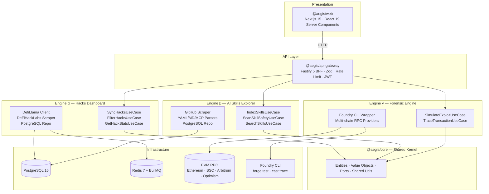

<div align="center">

# 🛡️ AltFlex AEGIS v3.0

**A**daptive **E**xploit & **G**overnance **I**ntelligence **S**ystem

_The Shield of Web3_

[](https://nodejs.org)
[](https://www.typescriptlang.org)
[](https://pnpm.io)
[](https://turbo.build)
[](https://nextjs.org)
[](https://fastify.dev)
[](https://postgresql.org)
[](https://redis.io)
[](https://vitest.dev)
[](https://zod.dev)
[](https://viem.sh)
[](https://book.getfoundry.sh)
[](https://docker.com)
[](./LICENSE)

> _In Greek mythology, the aegis (αἰγίς) was the shield of Zeus — a supernatural defense
> wielded only by the most powerful. AltFlex AEGIS is the shield for Web3._

**AltFlex AEGIS aggregates every recorded DeFi exploit in history, indexes AI audit skill files for safety classification, and simulates historical attacks using Foundry — powering both a security intelligence dashboard and two academic theses, all within a single hexagonal TypeScript monorepo.**

</div>

---


## Table of Contents

- [Overview](#overview)
- [Why AEGIS — The Rebrand](#why-aegis--the-rebrand)
- [Architecture](#architecture)
- [Tech Stack](#tech-stack)
- [Monorepo Structure](#monorepo-structure)
- [Domain Models](#domain-models)
- [Smart Contract & EVM Integration](#smart-contract--evm-integration)
- [Architecture Decision Records](#architecture-decision-records)
- [Phase Roadmap](#phase-roadmap)
- [Academic Alignment](#academic-alignment)
- [Getting Started](#getting-started)
- [Development Commands](#development-commands)
- [Package Dependency Graph](#package-dependency-graph)
- [API Reference](#api-reference)
- [Branch Strategy & Contributing](#branch-strategy--contributing)
- [Team](#team)
- [Changelogs](#changelogs)
- [License](#license)

---

## Overview

**AltFlex AEGIS v3.0** is a dual-engine Web3 security intelligence platform built as a
TypeScript-first hexagonal monorepo. It simultaneously serves as a commercial-grade blockchain
forensics product and the research foundation for two academic theses, graduating 2027.

**Engine α — Hacks Dashboard** ingests every recorded DeFi hack from DefiLlama and DeFiHackLabs
(1,000+ incidents, $20B+ tracked losses), normalizes them into a typed relational schema, and
surfaces them through an analytical dashboard with on-chain replay capability via Foundry.

**Engine β — AI Skills Explorer** indexes AI audit skill files from public GitHub repositories,
parses their AST structure, and runs a safety pipeline classifying each file as
`Safe | Suspicious | Malicious` — governing the integrity of AI-assisted smart contract auditing.

**Engine γ — Forensic Engine** wraps the Foundry CLI and multi-chain EVM RPC providers to
simulate historical exploits, extract transaction traces, and map root-cause attack patterns
programmatically.

### Engine Feature Matrix

| Dimension          | Engine α — Hacks Dashboard                  | Engine β — AI Skills Explorer            | Engine γ — Forensic Engine                        |
| ------------------ | ------------------------------------------- | ---------------------------------------- | ------------------------------------------------- |
| **Purpose**        | DeFi exploit aggregation & analytics        | AI skill file indexing & safety scanning | Foundry-based exploit simulation & trace analysis |
| **Data Source**    | DefiLlama API, DeFiHackLabs                 | GitHub AI skill repositories             | EVM RPC providers, Foundry CLI                    |
| **Primary Entity** | `HackIncident`                              | `AISkillFile` + `SafetyScanResult`       | `ExploitPOC`                                      |
| **Key Port**       | `IHackDataPort`                             | `ISkillDataPort` + `ISafetyScannerPort`  | `IChainDataPort` + `ISimulationPort`              |
| **Output**         | Analytical dashboard + attack vector charts | Searchable catalog + safety badges       | Trace visualization + call trees                  |
| **Thesis**         | Thesis 2 — Pattern Classification           | Thesis 1 — Malicious Intent Detection    | Thesis 2 — Forensic Simulation                    |
| **Phase**          | Phase 2 (ETL) → Phase 4 (UI)                | Phase 3 (Scanner) → Phase 4 (UI)         | Phase 5 (Integration)                             |

---

## Why AEGIS — The Rebrand

The v1/v2 name — _"AltFlex: AI-Powered Forensic Framework for Exploit Detection"_ — no longer
reflects the scope of this system.

| Dimension            | v1 / v2 (AltFlex)                 | v3.0 (AltFlex AEGIS)                            |
| -------------------- | --------------------------------- | ----------------------------------------------- |
| **Scope**            | Flash loan detection, 5 protocols | Every DeFi hack in history (1,000+ incidents)   |
| **Engine Count**     | 1 — Transaction analysis          | 3 — Hacks · AI Skills · EVM Forensics           |
| **AI Role**          | XGBoost anomaly detector          | AST Safety Scanner + LLM audit skill governance |
| **Chain Support**    | Ethereum only                     | EVM + Non-EVM (Solana, Cosmos, Move)            |
| **Data Sources**     | Etherscan, PolygonScan            | DefiLlama, DeFiHackLabs, GitHub AI repos        |
| **Architecture**     | Monolithic Python + Next.js       | Hexagonal TypeScript microservices              |
| **Language**         | Python backend + TypeScript UI    | 100% TypeScript across all layers               |
| **Smart Contract**   | Flash loan pattern matching       | Full Foundry exploit simulation + EVM traces    |
| **Academic Purpose** | Capstone proof-of-concept         | Thesis 1 & Thesis 2 research system             |

---

## Architecture

AltFlex AEGIS follows **Hexagonal Architecture (Ports & Adapters)**. Every external dependency —
databases, APIs, blockchain RPC nodes, AI models, the Foundry CLI — is accessed exclusively
through abstract `Port` interfaces defined in `@aegis/core`. Concrete implementations are
`Adapters`. The domain layer has **zero coupling** to any framework or infrastructure concern.

> 📐 **Full architecture specification**: [ARCHITECTURE.md](./ARCHITECTURE.md) — 11 Mermaid diagrams covering C4 models, hexagonal internals, data flow pipelines, and sequence diagrams.



**Architectural Principles:**

- **Domain Purity** — `@aegis/core` entities and ports import nothing outside the kernel
- **Adapter Replaceability** — Swap PostgreSQL for any DB without touching domain logic
- **Chain Agnosticism** — `IChainDataPort` → `EthereumAdapter | SolanaAdapter | CosmosAdapter`
- **Testability** — Every use case is unit-testable against in-memory port implementations
- **Independent Deployability** — Each engine ships as a separate deployable service

---

## Tech Stack

| Layer                  | Technology          | Version   | Purpose                                        |
| ---------------------- | ------------------- | --------- | ---------------------------------------------- |
| Package Manager        | pnpm                | 10.x      | Strict dependency isolation, fast installs     |
| Build Orchestration    | Turborepo           | 2.x       | Task caching, parallel execution               |
| Language               | TypeScript          | 5.4       | Strict mode, full-stack type safety            |
| Frontend               | Next.js + React     | 15 + 19   | App Router, Server Components, streaming SSR   |
| API Gateway            | Fastify             | 5.x       | High-performance BFF                           |
| Schema Validation      | Zod                 | 3.22      | Runtime validation + TypeScript inference      |
| EVM Client             | viem                | 2.8       | Type-safe EVM interactions                     |
| Wallet / Signing       | ethers              | 6.11      | Wallet utilities, ABI encoding                 |
| Smart Contract Testing | Foundry             | latest    | Exploit POC execution, transaction tracing     |
| Primary Database       | PostgreSQL          | 16        | Relational hack data, JSONB for skill metadata |
| Cache & Queue          | Redis + BullMQ      | 7 + 5.x   | ETL job queues, API response caching           |
| Logging                | Winston             | 3.11      | Structured logging across all packages         |
| Date Utilities         | date-fns            | 3.3       | Lightweight date operations                    |
| Testing                | Vitest              | 1.3       | Unit + integration tests, coverage             |
| Linting                | ESLint + TS-ESLint  | 8.x + 7.x | Static analysis, type-aware rules              |
| Formatting             | Prettier            | 3.2       | Consistent code style                          |
| Git Hooks              | Husky + lint-staged | 9 + 15    | Block non-conforming commits at gate           |
| Containers             | Docker + Compose    | latest    | One-command dev environment bootstrap          |
| IaC                    | Terraform           | —         | Cloud infrastructure (Phase 6)                 |

---

## Monorepo Structure

```text
ALT-Flex/                               ← Git root / pnpm workspace root
│
├── packages/
│   ├── core/                           ← 🧬 @aegis/core — Shared Kernel
│   │   └── src/
│   │       ├── domain/
│   │       │   ├── entities/           ← HackIncident, AISkillFile, ExploitPOC, SafetyScanResult
│   │       │   ├── value-objects/      ← AttackVector, Chain, SafetyLabel
│   │       │   └── ports/              ← IHackDataPort, ISkillDataPort,
│   │       │                             IChainDataPort, ISafetyScannerPort, ICachePort
│   │       ├── database/
│   │       │   ├── migrate.ts          ← Migration runner (P1-ARCH-007 ✅)
│   │       │   ├── seed.ts             ← Seed runner (P1-ARCH-008 ✅)
│   │       │   ├── migrations/         ← 6 SQL migration files
│   │       │   └── seeds/              ← TypeScript seed data (55 hacks, 12 skills, 10 scans)
│   │       └── shared/
│   │           ├── types/              ← Global TypeScript types
│   │           ├── utils/              ← Pure utility functions
│   │           ├── constants/          ← Chain IDs, attack vector maps
│   │           └── errors/             ← Custom error hierarchy
│   │
│   ├── hacks-engine/                   ← ⚡ @aegis/hacks-engine — Engine α
│   │   └── src/
│   │       ├── adapters/
│   │       │   ├── defillama/          ← DefiLlama API client
│   │       │   ├── defihacklabs/       ← SunWeb3Sec GitHub scraper
│   │       │   └── postgres/           ← PostgreSQL repository
│   │       ├── application/            ← SyncHacks · FilterHacks · GetHackStats
│   │       ├── domain/
│   │       └── infrastructure/
│   │           ├── migrations/
│   │           └── seed/
│   │
│   ├── skills-engine/                  ← 🧠 @aegis/skills-engine — Engine β
│   │   └── src/
│   │       ├── adapters/
│   │       │   ├── github/             ← GitHub repo scraper
│   │       │   ├── parsers/            ← YAML / Markdown / MCP parsers
│   │       │   └── postgres/
│   │       ├── application/            ← IndexSkills · ScanSkillSafety · SearchSkills
│   │       ├── domain/safety/          ← Safety rule definitions
│   │       └── infrastructure/
│   │           ├── migrations/
│   │           └── safety-rules/       ← AST / regex safety rule configs
│   │
│   └── forensic-engine/                ← 🔬 @aegis/forensic-engine — Engine γ
│       └── src/
│           ├── adapters/
│           │   ├── foundry/            ← Foundry CLI wrapper
│           │   └── rpc/                ← Multi-chain RPC providers (viem)
│           ├── application/            ← SimulateExploit · TraceTransaction
│           ├── domain/
│           └── infrastructure/
│
├── apps/
│   ├── web/                            ← 🌐 @aegis/web — Next.js 15 Frontend
│   │   └── src/
│   │       ├── app/
│   │       │   ├── (marketing)/        ← Landing page, about
│   │       │   └── dashboard/
│   │       │       ├── hacks/          ← Hacks Dashboard views
│   │       │       ├── skills/         ← AI Skills Explorer views
│   │       │       └── forensics/      ← Forensic trace views
│   │       ├── components/
│   │       │   ├── ui/                 ← Base UI primitives
│   │       │   ├── hacks/              ← HackCard, HackTable, FilterSidebar
│   │       │   ├── skills/             ← SkillCard, SafetyBadge, CopyButton
│   │       │   ├── forensics/          ← TraceViewer, ExploitSimulator
│   │       │   └── layout/             ← Header, Sidebar, Footer
│   │       ├── lib/                    ← API client, utilities
│   │       ├── hooks/                  ← Custom React hooks
│   │       └── styles/                 ← Global CSS, design tokens
│   │
│   └── api-gateway/                    ← 🚪 @aegis/api-gateway — Fastify BFF
│       └── src/
│           ├── routes/
│           │   ├── hacks.ts            ← /api/v1/hacks/*
│           │   ├── skills.ts           ← /api/v1/skills/*
│           │   ├── forensics.ts        ← /api/v1/forensics/*
│           │   └── health.ts           ← /api/v1/health
│           ├── middleware/             ← auth · rateLimit · validation
│           ├── config/env.ts           ← Zod-validated environment config
│           └── server.ts
│
├── infrastructure/
│   ├── docker/                         ← Dockerfiles for all services
│   ├── terraform/                      ← Cloud IaC (Phase 6)
│   └── ci/                             ← GitHub Actions (ci.yml, deploy.yml)
│
├── docs/
│   ├── BRAND_GUIDE.md
│   ├── CODE_REVIEW_PHASE0.md
│   ├── CODE_REVIEW_PHASE1.md           ← Phase 1 task tracker
│   └── PHASE_0_PROJECT_INITIALIZATION.md
│
├── ARCHITECTURE.md                     ← Phase 1 deliverable (P1-ARCH-001 ✅)
├── research/                           ← Jupyter notebooks & ML experiments
├── .env.example
├── .gitignore
├── .prettierrc
├── .eslintrc.cjs
├── docker-compose.dev.yml
├── pnpm-workspace.yaml
├── tsconfig.base.json
├── turbo.json
└── package.json
```

---

## Domain Models

All models live in `@aegis/core`, validated with Zod. These are **Phase 0 blueprints** —
implementations ship in Phase 1.

### HackIncident

The primary aggregate in Engine α — validated at runtime with `HackIncidentSchema` (Zod).

| Field              | Type                                                       | Description                                    |
| ------------------ | ---------------------------------------------------------- | ---------------------------------------------- |
| `id`               | `string` (UUID v4)                                         | Unique identifier                              |
| `protocolName`     | `string`                                                   | e.g. "Euler Finance"                           |
| `protocolSlug`     | `string` (optional)                                        | URL-safe kebab-case identifier                 |
| `date`             | `Date`                                                     | Date of exploit (UTC)                          |
| `chain`            | `Chain`                                                    | Primary blockchain affected                    |
| `attackVector`     | `AttackVector`                                             | Primary vulnerability classification           |
| `secondaryVectors` | `AttackVector[]`                                           | Additional attack techniques (combo exploits)  |
| `lossUsd`          | `number` (≥ 0)                                             | Total USD loss at time of exploit              |
| `fundsReturned`    | `number` (≥ 0, ≤ lossUsd)                                  | Funds recovered through negotiation            |
| `txHashes`         | `string[]`                                                 | Raw transaction hashes (backward compat)       |
| `transactionRefs`  | `TransactionReference[]`                                   | Structured tx refs with chain context + labels |
| `hasFoundryPoc`    | `boolean`                                                  | Whether a Foundry POC exists                   |
| `foundryTestPath`  | `string \| undefined`                                      | Path in DeFiHackLabs repo                      |
| `protocolCategory` | `string` (optional)                                        | e.g. "Lending", "DEX", "Bridge", "Yield"       |
| `wasAudited`       | `boolean` (optional)                                       | Whether protocol was audited pre-exploit       |
| `auditFirms`       | `string[]`                                                 | Audit firms involved                           |
| `dataSource`       | `'defillama' \| 'defihacklabs' \| 'manual' \| 'rekt-news'` | ETL origin                                     |
| `lastSyncedAt`     | `Date`                                                     | Last ETL sync timestamp                        |

### AISkillFile

Domain entity for indexed AI audit skill files — validated with `AISkillFileSchema` (Zod).

| Field              | Type                                                                                | Description                                   |
| ------------------ | ----------------------------------------------------------------------------------- | --------------------------------------------- |
| `id`               | `string` (UUID v4)                                                                  | Unique identifier                             |
| `name`             | `string`                                                                            | Skill display name                            |
| `description`      | `string`                                                                            | Short description of skill purpose            |
| `category`         | `SkillCategory`                                                                     | e.g. "vulnerability-detection", "code-review" |
| `sourceRepo`       | `string`                                                                            | GitHub `owner/repo` format                    |
| `filePath`         | `string`                                                                            | File path within the repository               |
| `platform`         | `'claude' \| 'cursor' \| 'mcp' \| 'copilot' \| 'gemini' \| 'windsurf' \| 'generic'` | Target AI platform                            |
| `language`         | `'solidity' \| 'vyper' \| 'rust' \| 'move' \| 'cairo' \| 'multi'`                   | Smart contract language                       |
| `content`          | `string`                                                                            | Raw file content                              |
| `format`           | `'yaml' \| 'markdown' \| 'json' \| 'toml' \| 'text'`                                | Source file format                            |
| `contentHash`      | `string` (SHA-256)                                                                  | Content hash for deduplication                |
| `contentSizeBytes` | `number`                                                                            | Content size in bytes                         |
| `safetyLabel`      | `SafetyLabel`                                                                       | Safety scanner classification                 |
| `author`           | `string`                                                                            | Skill author or team                          |
| `copyCount`        | `number`                                                                            | Community copy metric                         |
| `starCount`        | `number`                                                                            | Community star metric                         |
| `viewCount`        | `number`                                                                            | Community view metric                         |

### Value Objects

**`AttackVector`** — `FlashLoan` · `Reentrancy` · `OracleManipulation` · `AccessControl` ·
`BridgeExploit` · `GovernanceAttack` · `Phishing` · `RugPull` · `LogicError` ·
`Liquidation` · `SandwichAttack` · `Unknown`

**`Chain`** — `Ethereum` · `BSC` · `Polygon` · `Arbitrum` · `Optimism` · `Avalanche` ·
`Base` · `Solana` · `Cosmos` · `Near` · `Aptos` · `Sui` · `MultiChain`

**`SafetyLabel`** — `Safe` · `Suspicious` · `Malicious` · `Unanalyzed`

### Hexagonal Port Interfaces

```typescript
// @aegis/core/src/domain/ports/IHackDataPort.ts
interface IHackDataPort {
  findById(id: string): Promise<HackIncident | null>;
  findAll(filters: HackFilters): Promise<PaginatedResult<HackIncident>>;
  save(incident: CreateHackIncidentInput | HackIncident): Promise<HackIncident>;
  saveBatch(incidents: Array<CreateHackIncidentInput | HackIncident>): Promise<number>;
  update(input: UpdateHackIncidentInput): Promise<HackIncident | null>;
  delete(id: string): Promise<boolean>;
  getAttackVectorStats(): Promise<AttackVectorStat[]>;
  getChainStats(): Promise<ChainStat[]>;
  getDashboardStats(): Promise<DashboardStats>;
  getLossTimeSeries(granularity: 'day' | 'week' | 'month' | 'year'): Promise<LossTimeSeriesPoint[]>;
}

// @aegis/core/src/domain/ports/IChainDataPort.ts
interface IChainDataPort {
  getChain(): Chain;
  isHealthy(): Promise<boolean>;
  getTransaction(txHash: string): Promise<TransactionData | null>;
  getTransactionTrace(txHash: string): Promise<TransactionTrace | null>;
  getBlock(blockNumber: number): Promise<BlockData | null>;
  getBlockByTimestamp(timestamp: Date): Promise<BlockData | null>;
  getContractInfo(address: string): Promise<ContractInfo | null>;
  isContract(address: string): Promise<boolean>;
  getBalance(address: string, blockNumber?: number): Promise<string>;
}

// @aegis/core/src/domain/ports/ISafetyScannerPort.ts
interface ISafetyScannerPort {
  scan(request: ScanRequest): Promise<ScanResponse>;
  configure(config: ScannerConfig): Promise<void>;
  getRules(): Promise<ScannerRuleConfig[]>;
  getVersion(): string;
}
```

---

## Smart Contract & EVM Integration

The **Forensic Engine** (`@aegis/forensic-engine`) provides deep smart contract analysis —
the technical core of **Thesis 2**.

### Attack Vectors Tracked On-Chain

| Attack Type             | On-Chain Signature                                              | Foundry POC       |
| ----------------------- | --------------------------------------------------------------- | ----------------- |
| **Flash Loan**          | Uncollateralized single-tx borrow + repay within one block      | ✅ Most incidents |
| **Reentrancy**          | Cross-function or cross-contract recursive external call        | ✅                |
| **Oracle Manipulation** | AMM spot price manipulation within a single block               | ✅                |
| **Access Control**      | Unauthorized privileged call — missing `onlyOwner` / role check | ✅                |
| **Bridge Exploit**      | Cross-chain message forgery or signature replay                 | ⚠️ Partial        |
| **Governance Attack**   | Flash-loan governance token acquisition + same-block vote       | ✅                |
| **Sandwich Attack**     | MEV front-run + back-run wrapping a victim transaction          | ✅                |
| **Logic Error**         | Arithmetic overflow / underflow / precision loss                | ⚠️ Partial        |

### viem Adapter

```typescript
// packages/forensic-engine/src/adapters/rpc/EthereumAdapter.ts
import { createPublicClient, http } from 'viem';
import { mainnet } from 'viem/chains';

export class EthereumAdapter implements IChainDataPort {
  private client = createPublicClient({
    chain: mainnet,
    transport: http(process.env.ETH_RPC_URL),
  });

  async getTransaction(hash: `0x${string}`) {
    return this.client.getTransaction({ hash });
  }

  async traceTransaction(hash: `0x${string}`) {
    return this.client.request({
      method: 'debug_traceTransaction',
      params: [hash, { tracer: 'callTracer' }],
    });
  }
}
```

Adapters for BSC, Arbitrum, Optimism, Base, and Polygon follow identical patterns — all behind
the same `IChainDataPort` interface, keeping forensic use cases chain-agnostic.

### Foundry Adapter

All POCs are sourced from [DeFiHackLabs](https://github.com/SunWeb3Sec/DeFiHackLabs) and linked
to their `HackIncident` via `foundryTestPath`.

```typescript
// packages/forensic-engine/src/adapters/foundry/FoundryAdapter.ts
export class FoundryAdapter implements IForensicRunnerPort {
  // forge test --fork-url <rpc> --match-contract <ExploitPOC> -vvvv
  async simulateExploit(poc: ExploitPOC): Promise<SimulationResult> { ... }

  // cast run <txHash> --rpc-url <rpc>
  async traceTransaction(txHash: string, forkBlock: number): Promise<TraceResult> { ... }
}
```

---

## Architecture Decision Records

| #           | Decision                                     | Rationale                                                                                                                                |
| ----------- | -------------------------------------------- | ---------------------------------------------------------------------------------------------------------------------------------------- |
| **ADR-001** | pnpm Workspaces + Turborepo                  | Strictest dependency isolation + fastest installs. Turbo caches tasks without framework lock-in. Nx is overkill; Lerna is deprecated.    |
| **ADR-002** | 100% TypeScript — Python in `research/` only | v1/v2 suffered Python/TS impedance mismatch. ML inference wrappable via ONNX or REST.                                                    |
| **ADR-003** | Hexagonal Architecture                       | Zero framework coupling in domain. Swap any adapter without touching business logic. Trivially unit-testable via in-memory ports.        |
| **ADR-004** | Next.js 15 App Router + React 19             | Server Components cut JS bundle on data-heavy dashboards. Streaming SSR speeds initial load. Parallel routes support dual-engine layout. |
| **ADR-005** | PostgreSQL 16 + Redis 7                      | Hack data is relational. JSONB covers NoSQL needs for skill metadata. BullMQ provides battle-tested ETL queues with retry semantics.     |

---

## Phase Roadmap

| Phase                        | Timeline   | Status             | Key Deliverables                                                                                                              |
| ---------------------------- | ---------- | ------------------ | ----------------------------------------------------------------------------------------------------------------------------- |
| **Phase 0 — Init**           | Week 1–2   | ✅ **Done**        | Monorepo scaffold · pnpm workspace · Turbo config · Domain blueprints · Docker Compose · Dev tooling                          |
| **Phase 1 — Architecture**   | Week 3–4   | 🔄 **In Progress** | `ARCHITECTURE.md` ✅ · API contracts ✅ · DB migrations ✅ · Seed data ✅ · Integration tests ✅ · P1-ARCH-009 remaining     |
| **Phase 2 — ETL Pipeline**   | Week 5–8   | ⏳ Planned         | DefiLlama sync worker · DeFiHackLabs scraper · BullMQ queues · PostgreSQL pipeline                                            |
| **Phase 3 — Safety Scanner** | Week 9–16  | ⏳ Planned         | AST parser · Heuristic safety rules · Safety label classifier **(Thesis 1 core)**                                             |
| **Phase 4 — Frontend**       | Week 17–22 | ⏳ Planned         | Hacks Dashboard · AI Skills Explorer · Forensic trace viewer · AEGIS design system                                            |
| **Phase 5 — EVM Forensics**  | Week 23–32 | ⏳ Planned         | Foundry POC integration · Trace visualization · Root-cause mapping **(Thesis 2 core)**                                        |
| **Phase 6 — Production**     | Week 33–40 | ⏳ Planned         | Terraform · CI/CD · Production deployment · Performance evaluation                                                            |

### Phase 1 Task Tracker

| Task ID       | Title                                      | Status          | PR    | Assignee                    |
| ------------- | ------------------------------------------ | --------------- | ----- | --------------------------- |
| P1-ARCH-001   | Hexagonal Architecture Documentation       | ✅ Complete     | #44   | Sr. Blockchain Architect    |
| P1-ARCH-002   | README Hero Overhaul                       | ✅ Complete     | #45   | Sr. Technical Writer        |
| P1-ARCH-003   | Hacks Dashboard API Contracts              | ✅ Complete     | #46   | Sr. API Design Engineer     |
| P1-ARCH-004   | AI Skills Explorer API Contracts           | ✅ Complete     | #47   | Sr. API Design Engineer     |
| P1-ARCH-005   | Forensic Engine API Contracts              | ✅ Complete     | #48   | Sr. API Design Engineer     |
| P1-ARCH-006   | System & Gateway Endpoints                 | ✅ Complete     | #48   | Sr. Software Engineer       |
| P1-ARCH-007   | PostgreSQL Migrations & Seed Infra         | ✅ Complete     | #49   | Sr. Data Architect          |
| P1-ARCH-008   | Create Seed Data (DefiLlama/DeFiHackLabs)  | ✅ Complete     | —     | Sr. Data Architect          |
| P1-ARCH-009   | Final Phase Gate Review                    | 🔄 In Progress  | —     | Sr. Code Reviewer           |

---

## Academic Alignment

| Phase         | Thesis              | Title & Contribution                                                                                                                                                                                                      |
| ------------- | ------------------- | ------------------------------------------------------------------------------------------------------------------------------------------------------------------------------------------------------------------------- |
| Phase 0–2     | Methods of Research | Architecture docs · ETL design · DeFi exploit taxonomy literature review                                                                                                                                                  |
| **Phase 3**   | **Thesis 1**        | _"Automated Detection of Malicious Intent in AI Audit Skill Files for Web3 Security"_ — AST parser + heuristic rules detecting prompt injection, file-system abuse, and code exfiltration in YAML/Markdown AI skill files |
| **Phase 5–6** | **Thesis 2**        | _"Programmatic Exploit Simulation and Forensic Trace Analysis Using Foundry for Historical DeFi Incidents"_ — Automated Foundry POC execution, transaction trace visualization, root-cause attack vector mapping          |

---

## Getting Started

### Prerequisites

| Tool           | Minimum Version | Notes                                                                    |
| -------------- | --------------- | ------------------------------------------------------------------------ |
| Node.js        | `20.11.0`       | Use [nvm](https://github.com/nvm-sh/nvm)                                 |
| pnpm           | `9.0.0`         | `npm install -g pnpm`                                                    |
| Docker Desktop | `24.x`          | Required for PostgreSQL + Redis                                          |
| Git            | `2.x`           | —                                                                        |
| Foundry        | latest          | `curl -L https://foundry.paradigm.xyz \| bash && foundryup` _(Phase 5+)_ |

> **Windows:** Add `shamefully-hoist=true` to `.npmrc` to resolve pnpm symlink issues with Next.js.

### 1 — Clone

```bash
git clone https://github.com/Artificial-Ledger-Technology/ALT-Flex.git
cd ALT-Flex
```

### 2 — Install Dependencies

```bash
pnpm install
```

### 3 — Configure Environment

```bash
cp .env.example .env
```

Edit `.env`:

```env
NODE_ENV=development
APP_VERSION=3.0.0
LOG_LEVEL=debug

POSTGRES_HOST=localhost
POSTGRES_PORT=5432
POSTGRES_DB=aegis_dev
POSTGRES_USER=aegis
POSTGRES_PASSWORD=devpassword

REDIS_HOST=localhost
REDIS_PORT=6379

API_PORT=4000
API_RATE_LIMIT_MAX=100
JWT_SECRET=your-dev-secret-minimum-32-characters

# Required from Phase 1 onward
ETH_RPC_URL=https://eth-mainnet.g.alchemy.com/v2/YOUR_KEY
BSC_RPC_URL=https://bsc-dataseed.binance.org
ARB_RPC_URL=https://arb1.arbitrum.io/rpc
```

> **Never commit `.env`.** `.env.example` is the source of truth for all required variables.

### 4 — Start the Platform (Docker Compose)

The easiest way to boot the entire AltFlex AEGIS platform with hot-reloading is using the provided `Makefile` targets. This builds the containers and starts everything in the background.

```bash
make dev
```

**Services Booted:**

- **`aegis-postgres`** — PostgreSQL Database on `:5432`
- **`aegis-redis`** — Redis Cache & Queue on `:6379`
- **`aegis-api-gateway`** — Fastify API Gateway on `:4000`
- **`aegis-web`** — Next.js Frontend on `:3000`

Health checks ensure the database and cache are fully ready before the API and Web containers start.

**Helpful Docker Commands:**

- `make health` — Verify the health endpoints of all running services.
- `make logs` — Tail the live logs of the development containers.
- `make down` — Stop all running AEGIS services safely.

### 5 — Alternative: Run Servers Locally

If you prefer to run the Node.js services locally on your host machine (using Docker only for the infrastructure databases):

1. **Start the database and cache containers:**

   ```bash
   docker compose -f docker-compose.dev.yml up -d postgres redis
   ```

2. **Start the development servers via Turborepo:**

   ```bash
   # Start all apps and packages in watch mode
   pnpm dev

   # Or, start specific workspaces only
   pnpm --filter @aegis/web dev
   pnpm --filter @aegis/api-gateway dev
   ```

| Service      | URL                                 |
| ------------ | ----------------------------------- |
| Web Frontend | http://localhost:3000               |
| API Gateway  | http://localhost:4000               |
| API Health   | http://localhost:4000/api/v1/health |

---

## Development Commands

| Command                                            | Description                                  |
| -------------------------------------------------- | -------------------------------------------- |
| `pnpm dev`                                         | Start all apps and packages in watch mode    |
| `pnpm build`                                       | Build all packages and apps via Turbo        |
| `pnpm test`                                        | Run all test suites via Turbo                |
| `pnpm lint`                                        | Lint all packages via Turbo                  |
| `pnpm typecheck`                                   | Type-check all packages via Turbo            |
| `pnpm format`                                      | Format all files with Prettier               |
| `pnpm format:check`                                | Check formatting without writing             |
| `pnpm clean`                                       | Remove all `dist/` and `node_modules/`       |
| `pnpm run migrate`                                 | Run PostgreSQL migrations (sequential)       |
| `pnpm run seed`                                    | Seed database (idempotent UPSERT)            |
| `pnpm run seed -- --clean`                         | Truncate tables + reseed from scratch        |
| `pnpm --filter @aegis/core build`                  | Build a single package                       |
| `pnpm --filter @aegis/hacks-engine test`           | Test a single package                        |
| `pnpm --filter @aegis/web dev`                     | Run only the web app                         |
| `pnpm --filter @aegis/api-gateway dev`             | Run only the API gateway                     |
| `docker compose -f docker-compose.dev.yml up -d`   | Start PostgreSQL + Redis                     |
| `docker compose -f docker-compose.dev.yml down`    | Stop all infrastructure                      |
| `docker compose -f docker-compose.dev.yml logs -f` | Tail all service logs                        |

### Common Troubleshooting

| Problem                                    | Cause                               | Fix                                                      |
| ------------------------------------------ | ----------------------------------- | -------------------------------------------------------- |
| `ERR_PNPM_PEER_DEP_ISSUES`                 | Strict peer dependency enforcement  | Add `auto-install-peers=true` to `.npmrc`                |
| `Cannot find module '@aegis/core'`         | Workspace packages not linked       | Run `pnpm install` from the **repo root**                |
| TypeScript path aliases not resolving      | Missing `paths` in `tsconfig.json`  | Ensure `baseUrl` is set and `paths` map to `workspace:*` |
| Husky hooks not triggering                 | `.husky/` not initialized           | Run `pnpm exec husky init`                               |
| PostgreSQL connection refused              | Docker not running or port conflict | `docker compose ps` — check port `5432`                  |
| Next.js + pnpm `ENOENT` on Windows         | Symlink resolution issues           | Add `shamefully-hoist=true` to `.npmrc`                  |
| `Docker Compose depends_on` race condition | Service starts before DB is ready   | Use `healthcheck` + `condition: service_healthy`         |
| ESLint `parserOptions.project` error       | `tsconfig.json` not found           | Ensure `tsconfigRootDir` points to monorepo root         |

---

## Package Dependency Graph

All inter-package dependencies use the `workspace:*` protocol. No circular dependencies are
permitted.

```
@aegis/core
  └── (no @aegis/* dependencies — pure domain kernel)

@aegis/hacks-engine
  └── @aegis/core

@aegis/skills-engine
  └── @aegis/core

@aegis/forensic-engine
  └── @aegis/core

@aegis/api-gateway
  ├── @aegis/core
  ├── @aegis/hacks-engine
  ├── @aegis/skills-engine
  └── @aegis/forensic-engine

@aegis/web
  └── (communicates with @aegis/api-gateway via HTTP — no direct workspace dep)
```

**Rule:** `@aegis/core` must never import from any other `@aegis/*` package. Violations break
the Hexagonal boundary and will be caught by a custom ESLint rule in Phase 1.

---

## API Reference

> Full OpenAPI 3.1 specification is delivered in Phase 1 as part of API contract definitions.
> The endpoint catalogue below reflects Phase 1 API design (P1-ARCH-003/004/005/006).

### Base URL

```
http://localhost:4000/api/v1
```

### Endpoints

#### System & Gateway

| Method | Path                 | Description                                      | Phase   |
| ------ | -------------------- | ------------------------------------------------ | ------- |
| `GET`  | `/health`            | Service health + dependency status               | Phase 0 |
| `GET`  | `/health/detailed`   | Per-service health breakdown                     | Phase 1 |
| `GET`  | `/meta`              | System metadata (version, uptime, feature flags) | Phase 1 |
| `GET`  | `/rate-limit/status` | Current rate limit bucket state                  | Phase 1 |

#### Engine α — Hacks Dashboard

| Method | Path                    | Description                                            | Phase   |
| ------ | ----------------------- | ------------------------------------------------------ | ------- |
| `GET`  | `/hacks`                | Paginated list with full filter support                | Phase 2 |
| `GET`  | `/hacks/:id`            | Single hack incident detail                            | Phase 2 |
| `GET`  | `/hacks/stats`          | Aggregate statistics (total loss, by vector, by chain) | Phase 2 |
| `GET`  | `/hacks/stats/timeline` | Time-series loss data for charts                       | Phase 2 |
| `GET`  | `/hacks/vectors`        | Attack vector taxonomy with counts                     | Phase 2 |
| `GET`  | `/hacks/chains`         | Chain breakdown with counts                            | Phase 2 |
| `GET`  | `/hacks/search`         | Full-text protocol name search                         | Phase 2 |
| `POST` | `/hacks/sync`           | Trigger ETL sync (admin only)                          | Phase 2 |

#### Engine β — AI Skills Explorer

| Method | Path                  | Description                                     | Phase   |
| ------ | --------------------- | ----------------------------------------------- | ------- |
| `GET`  | `/skills`             | Paginated list with filter support              | Phase 3 |
| `GET`  | `/skills/:id`         | Single skill file detail (includes raw content) | Phase 3 |
| `GET`  | `/skills/:id/content` | Raw skill file content for copy                 | Phase 3 |
| `GET`  | `/skills/stats`       | Aggregate statistics (by platform, by safety)   | Phase 3 |
| `GET`  | `/skills/platforms`   | Platform breakdown with counts                  | Phase 3 |
| `GET`  | `/skills/languages`   | Language breakdown with counts                  | Phase 3 |
| `GET`  | `/skills/:id/safety`  | Safety scan results for a specific skill        | Phase 3 |
| `POST` | `/skills/:id/copy`    | Increment copy count                            | Phase 3 |
| `POST` | `/skills/:id/star`    | Increment star count                            | Phase 3 |
| `POST` | `/skills/scan`        | Trigger safety scan for a skill (admin)         | Phase 3 |
| `POST` | `/skills/sync`        | Trigger GitHub scraper sync (admin)             | Phase 3 |

#### Engine γ — Forensic Engine

| Method | Path                         | Description                              | Phase   |
| ------ | ---------------------------- | ---------------------------------------- | ------- |
| `GET`  | `/forensics/pocs`            | List available Foundry POCs              | Phase 5 |
| `GET`  | `/forensics/pocs/:id`        | POC detail with Solidity source          | Phase 5 |
| `POST` | `/forensics/simulate`        | Trigger Foundry simulation of a POC      | Phase 5 |
| `GET`  | `/forensics/simulate/:jobId` | Simulation status and results            | Phase 5 |
| `POST` | `/forensics/trace`           | Trace a transaction on a given chain     | Phase 5 |
| `GET`  | `/forensics/trace/:jobId`    | Trace results (call tree, storage diffs) | Phase 5 |

### Health Response Shape

```json
{
  "status": "ok",
  "version": "3.0.0",
  "timestamp": "2026-03-01T00:00:00.000Z",
  "services": {
    "postgres": "healthy",
    "redis": "healthy"
  }
}
```

## Branch Strategy & Contributing

### Branch Naming Convention

| Branch                           | Purpose                                               |
| -------------------------------- | ----------------------------------------------------- |
| `main`                           | Protected — production-ready, tagged releases only    |
| `develop`                        | Integration branch — all features merge here first    |
| `feature/P{phase}-{task}-{slug}` | Feature work, e.g. `feature/P1-ARCH-001-hex-diagrams` |
| `fix/P{phase}-{slug}`            | Bug fixes, e.g. `fix/P0-husky-hooks`                  |
| `chore/{slug}`                   | Tooling, deps, CI changes                             |
| `docs/{slug}`                    | Documentation-only changes                            |

### Pull Request Rules

1. **Target branch:** `develop` (never `main` directly)
2. **Minimum 1 approval** from a team member
3. **CI must pass:** lint → typecheck → test → build
4. **PR title format:** `[P{phase}] Short description of change`
5. **Linked Kanban task:** reference the `P{phase}-INIT-{NNN}` task ID in the PR body
6. **No secrets** in any commit — enforced by pre-commit hook and GitHub secret scanning

### Commit Message Convention

```
type(scope): short imperative description

Types: feat | fix | chore | docs | test | refactor | perf | ci
Scope: core | hacks-engine | skills-engine | forensic-engine | api-gateway | web | infra

Examples:
feat(hacks-engine): add DefiLlama adapter with pagination
fix(core): resolve HackIncident schema strict validation
chore(infra): add healthcheck to postgres docker service
docs(readme): rebrand to AltFlex AEGIS v3.0
```

### Local Development Workflow

```bash
# 1. Sync with upstream
git checkout develop && git pull origin develop

# 2. Create feature branch
git checkout -b feature/P1-ARCH-001-hex-diagrams

# 3. Make changes, then stage
git add .

# 4. Husky runs lint-staged automatically on commit
git commit -m "feat(core): add IChainDataPort hexagonal interface"

# 5. Push and open PR against develop
git push origin feature/P1-ARCH-001-hex-diagrams
```

---

## Team

| Name                               | GitHub                                           | Role                                                                                              |
| ---------------------------------- | ------------------------------------------------ | ------------------------------------------------------------------------------------------------- |
| **Jay Arre Talosig**               | [@flexycode](https://github.com/flexycode)       | Blockchain Architect · Blockchain Protocol Engineer · Product Manager (Web3)                      |
| **Rinoah Venedict Dela Rama**      | [@Noah-dev2217](https://github.com/Noah-dev2217) | Blockchain Developer · Smart Contract Engineer · Community Manager / Developer Relations (DevRel) |
| **Nicko Nehcterg Dalida**          | [@nicknicndin](https://github.com/nicknicndin)   | Blockchain Developer · DeFi Researcher · Smart Contract Auditor · Security Auditor                |
| **Jannah Cleine Glodo**            | [@jncln](https://github.com/jncln)               | Blockchain Engineer · Frontend/Web3 Developer · UI / UX Designer · Machine Learning Engineer      |
| **Anthonee Buno**                  | [@Leirk04](https://github.com/Leirk04)           | Blockchain Engineer · Full Stack Web3 Developer · Data / Analytics Engineer                       |
| **Brian Carlo De Vera** _(Collab)_ | [@scarfer14](https://github.com/scarfer14)       | QA Engineer · Cybersecurity Engineer · Network Engineer                                           |

---

## Changelogs

### 🛡️ [03.1.0] — 2026-04-26 · Phase 1 — Architecture 🔄 **In Progress**

#### Architecture Documentation (P1-ARCH-001 → P1-ARCH-002)

- Published comprehensive `ARCHITECTURE.md` with 11 Mermaid diagrams (C4, hexagonal, data flow)
- Overhauled README with engine feature matrix, domain models, and API reference

#### API Contract Definitions (P1-ARCH-003 → P1-ARCH-006)

- Implemented Zod schemas for Hacks Dashboard, AI Skills Explorer, and Forensic Engine APIs
- Created Fastify route stubs with full request/response validation
- Added system endpoints: `/health/detailed`, `/meta`, `/rate-limit/status`
- Registered all routes in API Gateway with modular plugin architecture

#### Database Infrastructure (P1-ARCH-007)

- Created 6 sequential PostgreSQL migration files (extensions, hack_incidents, ai_skill_files, safety_scan_results, etl_sync_log, schema_migrations)
- Built TypeScript migration runner with idempotent execution and rollback support
- Comprehensive index strategy: B-tree, GIN (JSONB/trigram), partial, and composite indexes

#### Seed Data Engineering (P1-ARCH-008)

- Curated **55 real-world DeFi hack incidents** from DefiLlama, DeFiHackLabs, and rekt.news
  - All **16 AttackVector** enum values covered (reentrancy, flash-loan, oracle-manipulation, etc.)
  - **12 blockchain chains** represented (Ethereum, BSC, Solana, Polygon, Arbitrum, etc.)
  - **12 DeFiHackLabs Foundry POC** cross-references with valid test paths
  - Top 10 largest hacks included (Ronin $624M, Poly Network $611M, BNB Bridge $586M, etc.)
  - Date range spanning 2016–2024
- Created **12 AI skill files** with realistic content and full SafetyLabel coverage
  - 5 safe, 3 suspicious, 2 malicious, 2 unanalyzed
  - Multi-platform: Claude, Cursor, Gemini, Copilot, Generic
  - Multi-language: Solidity, Rust, Vyper, Multi
- Created **10 safety scan results** with realistic findings and severity classifications
- Built production-grade seed runner with idempotent UPSERT and `--clean` mode

#### Agentic Squad Expansion

- Created **Senior Data Engineer** role in `.claude/` and `.gemini/` skill directories
- Agentic squad now has **20 specialized roles** for god-level code generation

---

### 🛡️ [03.0.0] — 2026-03-XX · Phase 0 — Initialization ✅ **Complete**

#### Rebrand & Architecture

- Rebranded project from _AltFlex v2_ to **AltFlex AEGIS v3.0**
- Defined AEGIS acronym: **A**daptive **E**xploit & **G**overnance **I**ntelligence **S**ystem
- Migrated from Python/TypeScript hybrid to 100% TypeScript monorepo
- Adopted Hexagonal Architecture with explicit Ports & Adapters pattern

#### Monorepo & Tooling (P0-INIT-001 → 010)

- Initialized pnpm workspace with Turborepo v2 task orchestration
- Scaffolded 6-package workspace: `core`, `hacks-engine`, `skills-engine`,
  `forensic-engine`, `web`, `api-gateway`
- Configured TypeScript 5.4 strict mode with shared `tsconfig.base.json`
- Installed and configured ESLint, Prettier, Husky, lint-staged
- Defined domain model blueprints: `HackIncident`, `AISkillFile`, `ExploitPOC`
- Defined value objects: `AttackVector`, `Chain`, `SafetyLabel`
- Defined hexagonal ports: `IHackDataPort`, `ISkillDataPort`, `IChainDataPort`,
  `ISafetyScannerPort`, `ICachePort`
- Configured Docker Compose with PostgreSQL 16 + Redis 7 with health checks
- Established branch strategy and PR conventions
- Published Architecture Decision Records (ADR-001 → ADR-005)

---

### 🔐 [02.0.0] — 2026-01-13 · Phase 2: Address Detection Security Enhancement ✅ **Complete**

- Sprint 1: Address validation layer
- Sprint 2: On-chain verification
- Sprint 3: Behavioral analysis enhancement
- Sprint 4: API hardening

---

### 🚀 [01.0.0] — 2025-12-17 · Phase 1: Production-Ready Flash Loan Detection ✅ **Complete**

- Flash loan detection pipeline (XGBoost + Rule-based)
- Etherscan ETL collector
- FastAPI backend with `/analyze` and `/health` endpoints
- Next.js frontend dashboard with transaction analysis UI
- Benchmarked: 97.8% accuracy on multi-run validated dataset

---

### 🚀 [0.7.7] — 2025-11-17 · Phase 0: Research and Gathering Data ✅ **Complete**

- Gathering information and Brainstorm for our SE proposal
- Research about the DeFi past exploitation
- Team orienting
- Explore on regards to blockchain development

---

## License

```
MIT License

Copyright (c) 2026 Artificial Ledger Technology

Permission is hereby granted, free of charge, to any person obtaining a copy
of this software and associated documentation files (the "Software"), to deal
in the Software without restriction, including without limitation the rights
to use, copy, modify, merge, publish, distribute, sublicense, and/or sell
copies of the Software, and to permit persons to whom the Software is
furnished to do so, subject to the following conditions:

The above copyright notice and this permission notice shall be included in all
copies or substantial portions of the Software.

THE SOFTWARE IS PROVIDED "AS IS", WITHOUT WARRANTY OF ANY KIND, EXPRESS OR
IMPLIED, INCLUDING BUT NOT LIMITED TO THE WARRANTIES OF MERCHANTABILITY,
FITNESS FOR A PARTICULAR PURPOSE AND NONINFRINGEMENT. IN NO EVENT SHALL THE
AUTHORS OR COPYRIGHT HOLDERS BE LIABLE FOR ANY CLAIM, DAMAGES OR OTHER
LIABILITY, WHETHER IN AN ACTION OF CONTRACT, TORT OR OTHERWISE, ARISING FROM,
OUT OF OR IN CONNECTION WITH THE SOFTWARE OR THE USE OR OTHER DEALINGS IN THE
SOFTWARE.
```

---

<div align="center">

Built with precision by the **AltFlex AEGIS Engineering Team**

_College of Computer Studies — 2026_

[🛡️ AltFlex AEGIS](https://github.com/Artificial-Ledger-Technology/ALT-Flex) ·
[📋 Kanban Board](https://github.com/Artificial-Ledger-Technology/ALT-Flex/projects) ·
[🐛 Report Issue](https://github.com/Artificial-Ledger-Technology/ALT-Flex/issues) ·
[📖 Docs](./docs)

</div>
