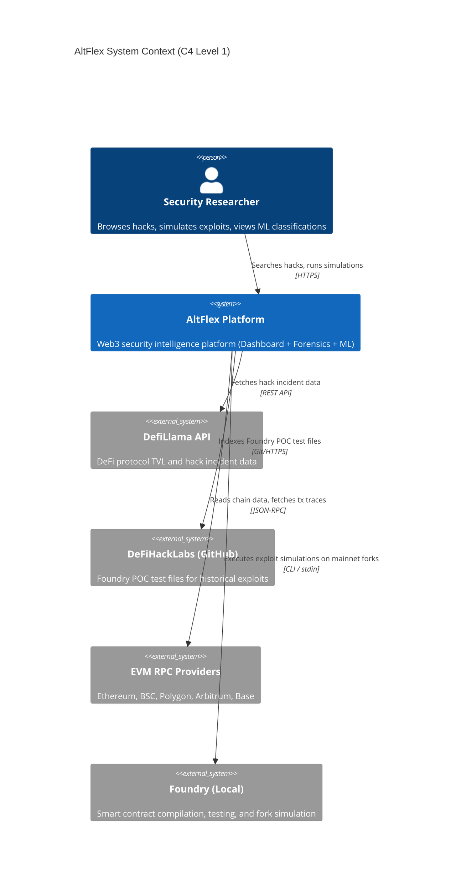
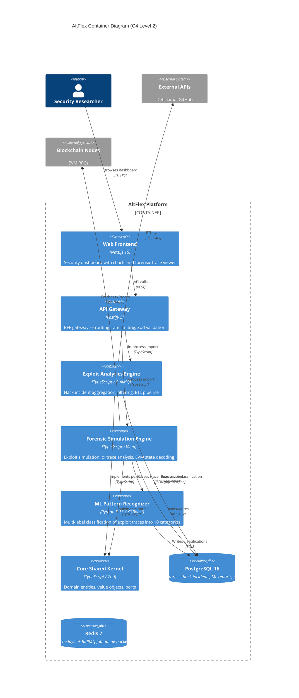
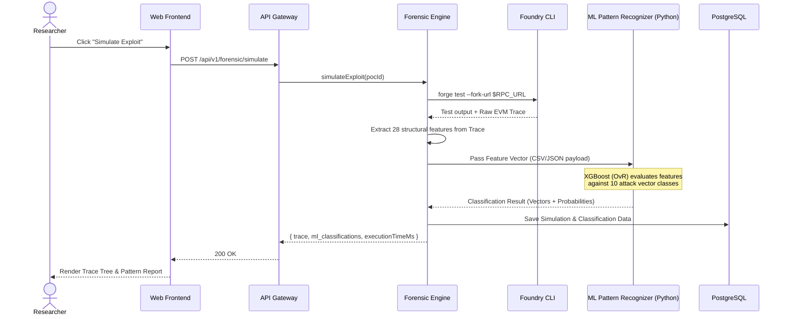

# System Architecture — AltFlex Web3 Intelligence Platform

> **Web3 Exploit Intelligence & ML Classification Platform**
>
> _Academic Reference Document for Thesis 2_

| Field                  | Value                                                     |
| ---------------------- | --------------------------------------------------------- |
| **Document Version**   | 1.0.0 (Thesis Edition)                                    |
| **Architecture Style** | Hexagonal (Ports & Adapters) + Modular Monorepo           |
| **Primary Scope**      | Exploit Analytics, Forensic Simulation, ML Classification |
| **Academic Alignment** | Thesis 2 (Forensic Simulation & Pattern Classification)   |

---

## 1. Executive Summary

AltFlex is a real-time Web3 security intelligence platform that aggregates, analyzes, and simulates DeFi exploit data alongside a Machine Learning Exploit Pattern Recognizer.

The platform is organized around three core pillars tailored for forensic analysis:

| Component                 | Domain                                              | Technology           |
| ------------------------- | --------------------------------------------------- | -------------------- |
| **Exploit Analytics**     | DeFi exploit incident aggregation and dashboard     | TypeScript / Node.js |
| **Forensic Simulation**   | Foundry-based exploit simulation and trace analysis | TypeScript / Viem    |
| **ML Pattern Recognizer** | Transaction trace pattern classification            | Python / XGBoost     |

### Architectural Principles

1. **Hexagonal Architecture (Ports & Adapters)**: Framework-agnostic domain core with injectable infrastructure.
2. **Monorepo Modularity**: Turborepo-managed workspace with strict package boundaries.
3. **ML Pipeline Integration**: Python-based ML models integrated asynchronously via data pipelines.
4. **Domain-Driven Design**: Core entities (`HackIncident`, `ExploitPOC`) shared across modules.

---

## 2. System Context — C4 Level 1

The system context diagram positions the AltFlex platform within the broader Web3 security ecosystem.

---

## 3. Container Overview — C4 Level 2

The container diagram shows all deployable units and the introduction of the Machine Learning pipeline.

---

## 4. Component Details — C4 Level 3

### 4.1 Exploit Analytics (Hacks Engine)

Aggregates DeFi exploit incident data from external sources, normalizes it into `HackIncident` domain entities, and provides filtered/paginated query APIs.

### 4.2 Forensic Simulation Engine

Manages Foundry-based exploit POC references, executes simulations on mainnet forks, and extracts deep transaction traces.

### 4.3 Machine Learning Integration

The ML Pattern Recognizer is a standalone Python 3.13 component that acts upon the data generated by the Forensic Engine.

- **Pipeline:** Extracts 28 execution features from raw EVM traces (depth, distinct contracts, gas usage, recursive patterns).
- **Model:** An XGBoost One-vs-Rest (OvR) Multi-Label Classifier.
- **Integration:** Once the Forensic Engine extracts a trace, it triggers the ML pipeline, which classifies the trace into one or more of 10 attack vectors (for instance, Reentrancy, Flash Loan, Oracle Manipulation). The result is saved to PostgreSQL and surfaced in the Next.js UI.

---

## 5. Sequence Diagram: Exploit Simulation to ML Classification

This flow illustrates how the ML model is embedded directly into the forensic simulation process.

