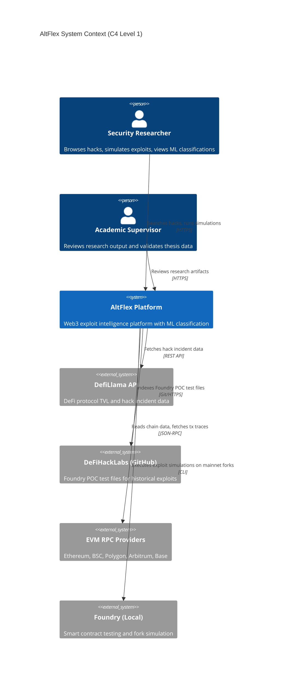
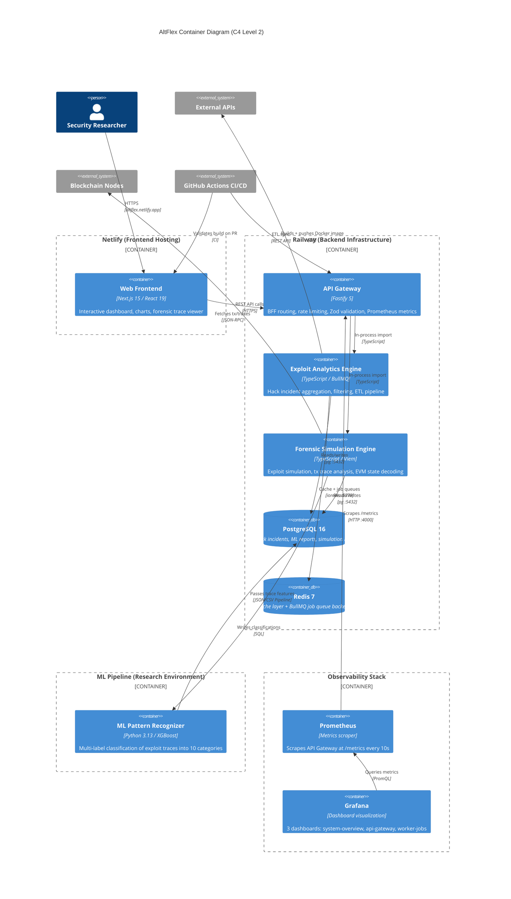
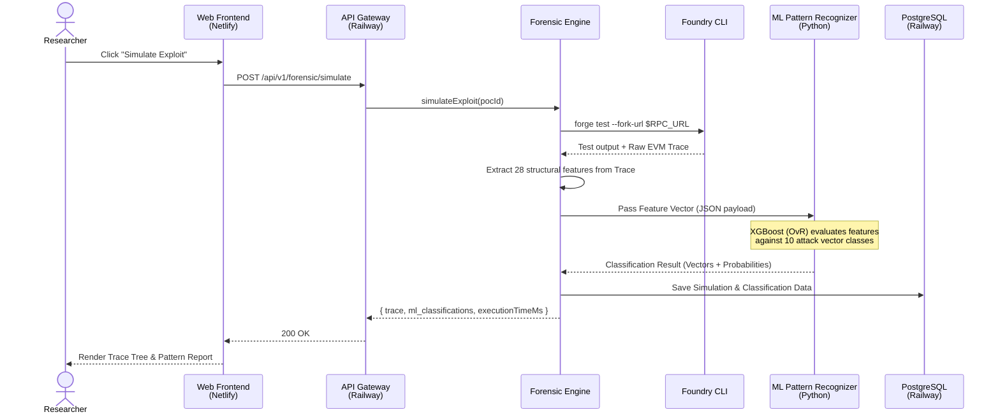

# System Architecture — AltFlex Web3 Intelligence Platform

> **Web3 Exploit Intelligence & ML Classification Platform**
>
> _Academic Reference Document for Chapter 3.2_

| Field                  | Value                                                         |
| ---------------------- | ------------------------------------------------------------- |
| **Document Version**   | 2.0.0 (Thesis Edition)                                        |
| **Architecture Style** | Hexagonal (Ports & Adapters) + Modular Monorepo               |
| **Primary Scope**      | Exploit Analytics, Forensic Simulation, ML Classification     |
| **Deployment**         | Railway (Backend) + Netlify (Frontend) + GitHub Actions CI/CD |
| **Live URL**           | https://altflex.netlify.app/                                  |
| **Repository**         | https://github.com/Artificial-Ledger-Technology/ALT-Flex      |

---

## 1. Executive Summary

AltFlex is a real-time, multi-chain Web3 exploit intelligence platform that aggregates every recorded DeFi hack in history (over 1,000 incidents representing more than $20 billion in tracked losses), simulates historical attacks using Foundry on forked mainnet state, and classifies exploit traces using a supervised Machine Learning model. It serves as both a commercial-grade blockchain forensics product and the research foundation for the academic thesis.

The platform is organized around three core pillars:

| Component                 | Domain                                              | Technology           |
| ------------------------- | --------------------------------------------------- | -------------------- |
| **Exploit Analytics**     | DeFi exploit incident aggregation and dashboard     | TypeScript / Node.js |
| **Forensic Simulation**   | Foundry-based exploit simulation and trace analysis | TypeScript / Viem    |
| **ML Pattern Recognizer** | Transaction trace pattern classification            | Python / XGBoost     |

### Architectural Principles

1. **Hexagonal Architecture (Ports & Adapters)**: Framework-agnostic domain core with injectable infrastructure adapters.
2. **Monorepo Modularity**: Turborepo-managed workspace with strict package boundaries and topological build ordering.
3. **ML Pipeline Integration**: Python-based ML models integrated asynchronously via data pipelines to classify forensic trace features.
4. **Domain-Driven Design**: Core entities (`HackIncident`, `ExploitPOC`) and abstract port interfaces shared across all modules.
5. **Continuous Deployment**: GitHub Actions CI/CD pipelines automate linting, type-checking, testing, and deployment to Railway and Netlify.

---

## 2. System Context — C4 Level 1

The system context diagram positions the AltFlex platform within the broader Web3 security ecosystem, showing all external actors and systems it interacts with.

---

## 3. Container Overview — C4 Level 2

The container diagram shows all deployable units, their hosting platforms, and the introduction of the Machine Learning pipeline.

---

## 4. Deployment Architecture

The platform follows a split-deployment model optimized for cost and performance.

| Service          | Hosting Platform | Technology            | URL / Port                   |
| ---------------- | ---------------- | --------------------- | ---------------------------- |
| **Web Frontend** | Netlify          | Next.js 15 (SSR/SSG)  | https://altflex.netlify.app/ |
| **API Gateway**  | Railway          | Fastify 5 (Docker)    | Port 4000                    |
| **PostgreSQL**   | Railway          | PostgreSQL 16         | Port 5432                    |
| **Redis**        | Railway          | Redis 7               | Port 6379                    |
| **Prometheus**   | Docker Compose   | Prometheus            | Port 9090                    |
| **Grafana**      | Docker Compose   | Grafana               | Port 3001                    |
| **ML Pipeline**  | Local / Research | Python 3.13 + XGBoost | Offline batch inference      |

### CI/CD Pipeline (GitHub Actions)

The repository contains three automated workflow files:

| Workflow              | Trigger                        | Purpose                                                          |
| --------------------- | ------------------------------ | ---------------------------------------------------------------- |
| `ci.yml`              | PR to `main` + push to `main`  | Lint (scoped to diff), typecheck, and test (145+ unit tests)     |
| `deploy-backend.yml`  | Push to `main` (backend paths) | Build multi-stage Docker images and push to GHCR, trigger deploy |
| `deploy-frontend.yml` | PR to `main` (web paths)       | Validate Next.js build output before Netlify auto-deploys        |

### Observability

| Tool           | Configuration File                         | Purpose                               |
| -------------- | ------------------------------------------ | ------------------------------------- |
| **Prometheus** | `infrastructure/prometheus/prometheus.yml` | Scrapes API Gateway metrics every 10s |
| **Grafana**    | `monitoring/dashboards/*.json`             | 3 pre-provisioned dashboards          |

The Grafana instance ships with three pre-built dashboards: **System Overview** (aggregate platform health), **API Gateway** (request latency, error rates, throughput), and **Worker Jobs** (BullMQ ETL queue depth and processing times).

---

## 5. Component Details — C4 Level 3

### 5.1 Exploit Analytics (Hacks Engine)

Aggregates DeFi exploit incident data from external sources (DefiLlama, DeFiHackLabs), normalizes it into `HackIncident` domain entities validated by Zod schemas, and provides filtered/paginated query and statistics APIs.

**Key Domain Objects:**

| Type         | Name            | Description                                                     |
| ------------ | --------------- | --------------------------------------------------------------- |
| Entity       | `HackIncident`  | Primary aggregate: protocol, date, chain, attackVector, lossUsd |
| Value Object | `AttackVector`  | 16-member enum taxonomy (reentrancy, flash-loan, etc.)          |
| Value Object | `Chain`         | 13 blockchain networks (Ethereum, BSC, Polygon, etc.)           |
| Port         | `IHackDataPort` | CRUD + filter + aggregate queries for hack incidents            |

### 5.2 Forensic Simulation Engine

Manages Foundry-based exploit POC references, executes simulations on mainnet forks, extracts deep transaction traces, decodes storage mutations, and prepares structural features for ML classification.

**Key Domain Objects:**

| Type   | Name              | Description                                                |
| ------ | ----------------- | ---------------------------------------------------------- |
| Entity | `ExploitPOC`      | Foundry test file reference, fork params, execution status |
| Port   | `IChainDataPort`  | Get tx, trace, block, contract info (chain-agnostic)       |
| Port   | `ISimulationPort` | Execute Foundry test, stream output, parse results         |

### 5.3 Machine Learning Integration

The ML Pattern Recognizer is a standalone Python 3.13 component that operates on data generated by the Forensic Engine.

- **Feature Extraction:** Extracts 28 execution features from raw EVM traces (call depth, distinct contracts, gas usage, recursive patterns, storage mutations).
- **Model:** XGBoost One-vs-Rest (OvR) Multi-Label Classifier with 200 estimators at max depth 6.
- **10 Attack Vector Categories:** Flash Loan, Reentrancy, Oracle Manipulation, Access Control, Arithmetic Overflow, Front Running, Delegatecall Injection, Self-Destruct, Logic Error, Bridge Exploit.
- **Integration Flow:** The Forensic Engine extracts a trace, passes the feature vector to the ML pipeline, which classifies it and writes results to PostgreSQL for display in the dashboard.

---

## 6. Sequence Diagram: End-to-End Exploit Intelligence Flow

---

## 7. Technology Stack Matrix

| Layer                   | Technology             | Version | Purpose                                         |
| ----------------------- | ---------------------- | ------- | ----------------------------------------------- |
| **Runtime**             | Node.js                | 22.12+  | JavaScript runtime with native ESM              |
| **Language**            | TypeScript             | 5.4     | Full-stack type safety (strict mode)            |
| **Frontend**            | Next.js + React        | 15 + 19 | App Router, Server Components, streaming SSR    |
| **API Gateway**         | Fastify                | 5.x     | High-performance BFF with plugin architecture   |
| **Schema Validation**   | Zod                    | 3.22    | Runtime validation + TypeScript type inference  |
| **EVM Client**          | viem                   | 2.8     | Type-safe EVM interactions, ABI encoding        |
| **Smart Contracts**     | Foundry (forge + cast) | latest  | Exploit POC execution, transaction tracing      |
| **Primary Database**    | PostgreSQL             | 16      | Relational hack data, JSONB for metadata        |
| **Cache & Queue**       | Redis + BullMQ         | 7 + 5.x | ETL job queues, API response caching            |
| **ML Framework**        | XGBoost + scikit-learn | latest  | One-vs-Rest multi-label classification          |
| **ML Runtime**          | Python                 | 3.13    | Model training and batch inference              |
| **Testing**             | Vitest                 | 3.2     | 145+ unit and integration tests                 |
| **Monitoring**          | Prometheus + Grafana   | latest  | Metrics scraping + 3 pre-built dashboards       |
| **CI/CD**               | GitHub Actions         | latest  | Lint, typecheck, test, Docker build, deploy     |
| **Frontend Hosting**    | Netlify                | managed | Auto-deploy on merge to main                    |
| **Backend Hosting**     | Railway                | managed | Docker container hosting + managed databases    |
| **Containerization**    | Docker                 | latest  | Multi-stage builds, Alpine base, non-root users |
| **Build Orchestration** | Turborepo              | 2.x     | Task caching, parallel execution                |
| **Package Manager**     | pnpm                   | 10.32   | Strict dependency isolation                     |
