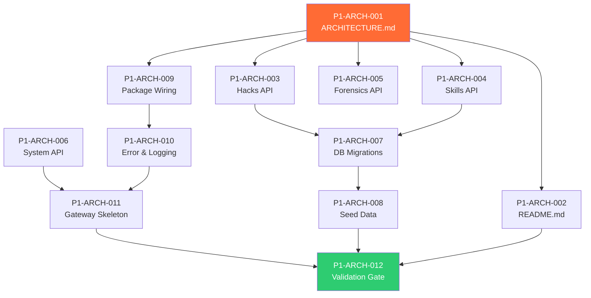

# Phase 1: High-Level Architecture & API Design — Code Review & Kanban Tasks

> **Project**: AltFlex AEGIS v3.0 — Adaptive Exploit & Governance Intelligence System
> **Timeline**: Week 3–4
> **Priority**: Critical — Phase 2 (ETL Pipelines) depends on finalized API contracts
> **Tech Stack**: TypeScript 5.4+, Fastify, Next.js 15, PostgreSQL 16, Redis 7, Zod, OpenAPI 3.1
> **Blocked By**: Phase 0 (Clean Slate Initialization) ✅ Complete

---

## Overview

Phase 1 transforms the Phase 0 scaffold into a fully specified system. Every API endpoint, database migration, and inter-service contract is **defined and documented** before a single line of business logic is written. This phase produces three critical deliverables:

1. **`ARCHITECTURE.md`** — Comprehensive hexagonal architecture with Mermaid diagrams, data flow sequences, and system boundary definitions.
2. **`README.md`** — New hero page with AltFlex AEGIS v3.0 branding, architecture diagrams, and getting-started guide.
3. **API Contracts** — OpenAPI 3.1 specification for all endpoints across Hacks Dashboard, AI Skills Explorer, and Forensic Engine.
   Additionally: all PostgreSQL migrations are written and validated, seed data from DefiLlama + DeFiHackLabs is prepared, and inter-package dependency wiring is finalized.

---

## Task Breakdown

---

### P1-ARCH-001: Create ARCHITECTURE.md — System Architecture Document

**Title**: Author Comprehensive Hexagonal Architecture Documentation with Mermaid Diagrams
| Field | Value |
|-------|-------|
| Priority | P0 — Critical |
| Estimated Hours | 6 |
| Dependencies | Phase 0 complete |
| Labels | `documentation`, `architecture`, `hexagonal` |
**Description**:
Create the master architecture document defining every system boundary, data flow, and integration point. This document serves dual purpose: **academic reference** (cited in Thesis 1 & 2) and **engineering blueprint** (developers build from this).
**Acceptance Criteria**:

- [ ] System context diagram (C4 Level 1) — AltFlex AEGIS within the Web3 ecosystem
- [ ] Container diagram (C4 Level 2) — 6 services + 2 datastores + external APIs
- [ ] Component diagrams (C4 Level 3) — Internal structure of each engine
- [ ] Hexagonal architecture diagram — Ports & Adapters for each engine
- [ ] Data flow diagrams — ETL pipeline for Hacks Engine, Safety Scanner pipeline for Skills Engine
- [ ] Sequence diagrams — Key user flows (search hacks, scan skill file, simulate exploit)
- [ ] Technology stack matrix — justified per component
- [ ] Cross-cutting concerns — logging, error handling, authentication, caching
- [ ] All diagrams use Mermaid for portability and version control

**Required Diagrams**:
| Diagram | Type | Purpose |
|---------|------|---------|
| System Context | C4 L1 | Shows AEGIS in the broader Web3 ecosystem |
| Container Overview | C4 L2 | Shows all 6 services, 2 databases, external APIs |
| Hacks Engine Internals | Hexagonal | Ports, adapters, use cases for Engine α |
| Skills Engine Internals | Hexagonal | Ports, adapters, use cases for Engine β |
| Forensic Engine Internals | Hexagonal | Foundry integration, RPC adapters |
| ETL Data Flow | Flowchart | DefiLlama → Normalize → PostgreSQL → Cache |
| Safety Scanner Pipeline | Flowchart | GitHub → Parse → AST Scan → Label → Store |
| Hack Search Flow | Sequence | User → Web → Gateway → Hacks Engine → DB |
| Skill Copy Flow | Sequence | User → Web → Gateway → Skills Engine → DB |
| Exploit Simulation | Sequence | User → Web → Gateway → Forensic → Foundry |

---

### P1-ARCH-002: Design & Create README.md — AEGIS Hero Page

**Title**: Author Production-Grade README with Branding, Architecture, and Quick-Start Guide
| Field | Value |
|-------|-------|
| Priority | P0 — Critical |
| Estimated Hours | 3 |
| Dependencies | P1-ARCH-001 |
| Labels | `documentation`, `branding`, `readme` |
**Description**:
Replace the existing v1/v2 README with a new hero page that reflects the AEGIS v3.0 identity. The README is the project's public face — it must immediately convey scale, sophistication, and dual-engine purpose.
**Acceptance Criteria**:

- [ ] New hero section with AEGIS branding and tagline
- [ ] Dual-engine feature matrix (Hacks Dashboard + AI Skills Explorer)
- [ ] Architecture overview diagram (embedded from ARCHITECTURE.md)
- [ ] Tech stack badges (TypeScript, Next.js 15, PostgreSQL, Redis, Foundry, Docker)
- [ ] Quick-start guide (Docker and local development)
- [ ] Phase roadmap table (Phase 0–6 with status indicators)
- [ ] Academic alignment section (Thesis 1 & 2)
- [ ] API endpoints summary table
- [ ] Contributing guidelines
- [ ] License section (MIT)

---

### P1-ARCH-003: Define API Contracts — Hacks Dashboard Endpoints

**Title**: Design RESTful API Specification for Hacks Dashboard (Engine α)
| Field | Value |
|-------|-------|
| Priority | P0 — Critical |
| Estimated Hours | 4 |
| Dependencies | P1-ARCH-001 |
| Labels | `api`, `hacks-engine`, `specification` |
**Description**:
Define every endpoint for the Hacks Dashboard API. These contracts are the interface between `apps/api-gateway`, `packages/hacks-engine`, and `apps/web`. All endpoints must support the dynamic filtering mechanics required to rival the SCH dashboard.
**Acceptance Criteria**:

- [ ] `GET /api/v1/hacks` — Paginated list with full filter support
- [ ] `GET /api/v1/hacks/:id` — Single hack incident detail
- [ ] `GET /api/v1/hacks/stats` — Aggregate statistics (total loss, count by vector, by chain)
- [ ] `GET /api/v1/hacks/stats/timeline` — Time-series loss data for charts
- [ ] `GET /api/v1/hacks/vectors` — Attack vector taxonomy with counts and total loss
- [ ] `GET /api/v1/hacks/chains` — Chain breakdown with counts and total loss
- [ ] `GET /api/v1/hacks/search` — Full-text protocol name search
- [ ] `POST /api/v1/hacks/sync` — Trigger ETL sync (admin only)
- [ ] All endpoints have Zod request/response schemas
- [ ] All endpoints have OpenAPI 3.1 documentation
- [ ] Pagination follows `{ data, total, page, pageSize, totalPages }` pattern
- [ ] Filters: `attackVector`, `chain`, `dateFrom`, `dateTo`, `minLossUsd`, `maxLossUsd`, `hasFoundryPoc`, `search`
- [ ] Sorting: `date`, `lossUsd`, `protocolName` (asc/desc)
      **Filter Parameters** (query string):

```
GET /api/v1/hacks?
attackVector=flash-loan&
chain=ethereum&
dateFrom=2023-01-01&
dateTo=2024-12-31&
minLossUsd=1000000&
hasFoundryPoc=true&
page=1&
pageSize=20&
sortBy=lossUsd&
sortOrder=desc
```

---

### P1-ARCH-004: Define API Contracts — AI Skills Explorer Endpoints

**Title**: Design RESTful API Specification for AI Skills Explorer (Engine β)
| Field | Value |
|-------|-------|
| Priority | P0 — Critical |
| Estimated Hours | 4 |
| Dependencies | P1-ARCH-001 |
| Labels | `api`, `skills-engine`, `specification` |
**Description**:
Define every endpoint for the AI Skills Explorer API. The filtering mechanics must support language, platform, safety label, and author. The one-click copy and safety badge systems are frontend features but require specific API response fields.
**Acceptance Criteria**:

- [ ] `GET /api/v1/skills` — Paginated list with filter support
- [ ] `GET /api/v1/skills/:id` — Single skill file detail (includes raw content)
- [ ] `GET /api/v1/skills/:id/content` — Raw skill file content for copy
- [ ] `GET /api/v1/skills/stats` — Aggregate statistics (total skills, by platform, by safety)
- [ ] `GET /api/v1/skills/platforms` — Platform breakdown with counts
- [ ] `GET /api/v1/skills/languages` — Language breakdown with counts
- [ ] `POST /api/v1/skills/:id/copy` — Increment copy count
- [ ] `POST /api/v1/skills/:id/star` — Increment star count
- [ ] `POST /api/v1/skills/scan` — Trigger safety scan for a specific skill (admin)
- [ ] `POST /api/v1/skills/sync` — Trigger GitHub scraper sync (admin)
- [ ] `GET /api/v1/skills/:id/safety` — Safety scan results for a specific skill
- [ ] Filters: `platform`, `language`, `safetyLabel`, `author`, `format`, `search`
- [ ] Sorting: `name`, `copyCount`, `starCount`, `createdAt` (asc/desc)
      **Filter Parameters** (query string):

```
GET /api/v1/skills?
platform=claude&
language=solidity&
safetyLabel=safe&
author=cyfrin&
search=reentrancy&
page=1&
pageSize=20&
sortBy=copyCount&
sortOrder=desc
```

---

### P1-ARCH-005: Define API Contracts — Forensic Engine Endpoints

**Title**: Design RESTful API Specification for Forensic Engine (Foundry/EVM)
| Field | Value |
|-------|-------|
| Priority | P1 — High |
| Estimated Hours | 3 |
| Dependencies | P1-ARCH-001 |
| Labels | `api`, `forensic-engine`, `specification` |
**Description**:
Define endpoints for the Forensic Engine — the Foundry integration and EVM trace analysis layer. These endpoints power Phase 5 (Thesis 2) but the contracts must be designed now for forward compatibility.
**Acceptance Criteria**:

- [ ] `GET /api/v1/forensics/pocs` — List available Foundry POCs from DeFiHackLabs
- [ ] `GET /api/v1/forensics/pocs/:id` — POC detail with Solidity source
- [ ] `POST /api/v1/forensics/simulate` — Trigger Foundry simulation of a POC
- [ ] `GET /api/v1/forensics/simulate/:jobId` — Simulation status and results
- [ ] `POST /api/v1/forensics/trace` — Trace a transaction on a given chain
- [ ] `GET /api/v1/forensics/trace/:jobId` — Trace results (call tree, storage diffs)
- [ ] All long-running operations use async job pattern (BullMQ)
- [ ] Job status follows `{ jobId, status, result?, error?, progress }` pattern

---

### P1-ARCH-006: Define API Contracts — System & Gateway Endpoints

**Title**: Design Health, Auth, and Meta Endpoints for the API Gateway
| Field | Value |
|-------|-------|
| Priority | P0 — Critical |
| Estimated Hours | 2 |
| Dependencies | None |
| Labels | `api`, `api-gateway`, `infrastructure` |
**Description**:
Define the API Gateway's own endpoints — health checks, authentication, rate limit status, and system metadata.
**Acceptance Criteria**:

- [ ] `GET /api/v1/health` — System health (all services + DB + Redis)
- [ ] `GET /api/v1/health/detailed` — Per-service health breakdown
- [ ] `GET /api/v1/meta` — System metadata (version, uptime, feature flags)
- [ ] `POST /api/v1/auth/token` — Generate API access token (future)
- [ ] `GET /api/v1/rate-limit/status` — Current rate limit bucket state
- [ ] Error response format standardized: `{ error, code, message, details?, timestamp }`
- [ ] Health response format: `{ status, version, uptime, services: { name, healthy, latencyMs }[] }`
      **Standard Error Codes**:

```typescript
enum ErrorCode {
  VALIDATION_ERROR = 'VALIDATION_ERROR',
  NOT_FOUND = 'NOT_FOUND',
  RATE_LIMIT_EXCEEDED = 'RATE_LIMIT_EXCEEDED',
  UNAUTHORIZED = 'UNAUTHORIZED',
  FORBIDDEN = 'FORBIDDEN',
  INTERNAL_ERROR = 'INTERNAL_ERROR',
  SERVICE_UNAVAILABLE = 'SERVICE_UNAVAILABLE',
  ETL_SYNC_IN_PROGRESS = 'ETL_SYNC_IN_PROGRESS',
}
```

---

### P1-ARCH-007: Write PostgreSQL Migrations

**Title**: Create Production-Ready Database Migrations for Both Engines
| Field | Value |
|-------|-------|
| Priority | P0 — Critical |
| Estimated Hours | 3 |
| Dependencies | P1-ARCH-003, P1-ARCH-004 |
| Labels | `database`, `migrations`, `infrastructure` |
**Description**:
Write and validate all PostgreSQL migration files. These are the concrete implementations of the schema designs from Phase 0. Migrations must be idempotent and reversible.
**Acceptance Criteria**:

- [ ] `001_extensions.sql` — Enable `uuid-ossp`, `pg_trgm`
- [ ] `002_create_hack_incidents.sql` — Hacks table with all indexes
- [ ] `003_create_ai_skill_files.sql` — Skills table with unique constraints
- [ ] `004_create_safety_scan_results.sql` — Safety scan results with FK cascade
- [ ] `005_create_etl_sync_log.sql` — ETL job tracking table
- [ ] `006_create_api_usage_log.sql` — API usage analytics table
- [ ] All migrations tested against PostgreSQL 16 via Docker
- [ ] Down migrations (rollback) for every up migration
- [ ] Migration runner script (`pnpm run migrate`)
- [ ] Seed data script (`pnpm run seed`)
      **Additional Tables**:

```sql
-- ETL Sync tracking
CREATE TABLE etl_sync_log (
id UUID PRIMARY KEY DEFAULT uuid_generate_v4(),
source VARCHAR(50) NOT NULL, -- 'defillama', 'defihacklabs', 'github'
engine VARCHAR(50) NOT NULL, -- 'hacks', 'skills'
status VARCHAR(20) NOT NULL, -- 'running', 'completed', 'failed'
records_added INTEGER DEFAULT 0,
records_updated INTEGER DEFAULT 0,
error_message TEXT,
started_at TIMESTAMPTZ NOT NULL DEFAULT NOW(),
completed_at TIMESTAMPTZ,
duration_ms INTEGER
);
-- API usage analytics
CREATE TABLE api_usage_log (
id UUID PRIMARY KEY DEFAULT uuid_generate_v4(),
endpoint VARCHAR(255) NOT NULL,
method VARCHAR(10) NOT NULL,
status_code INTEGER NOT NULL,
response_time_ms INTEGER NOT NULL,
ip_address INET,
user_agent TEXT,
created_at TIMESTAMPTZ NOT NULL DEFAULT NOW()
);
CREATE INDEX idx_api_usage_endpoint ON api_usage_log(endpoint, created_at DESC);
CREATE INDEX idx_etl_sync_source ON etl_sync_log(source, started_at DESC);
```

---

### P1-ARCH-008: Create Seed Data from DefiLlama & DeFiHackLabs

**Title**: Prepare Development Seed Dataset with Real-World Hack Incidents
| Field | Value |
|-------|-------|
| Priority | P1 — High |
| Estimated Hours | 4 |
| Dependencies | P1-ARCH-007 |
| Labels | `data`, `seed`, `hacks-engine` |
**Description**:
Curate a development seed dataset from DefiLlama's hacks API and DeFiHackLabs repository. This dataset enables frontend development and API testing without requiring live ETL pipelines.
**Acceptance Criteria**:

- [ ] Minimum 50 hack incidents from DefiLlama spanning 2020–2026
- [ ] Coverage of all 16 attack vector categories
- [ ] Coverage of at least 8 different chains
- [ ] 10+ incidents with DeFiHackLabs Foundry POC references
- [ ] Include the "Top 10" largest DeFi hacks by loss amount
- [ ] Seed data stored as TypeScript files (not JSON) for type safety
- [ ] `pnpm run seed` populates development database
- [ ] Seed script is idempotent (safe to run multiple times)
- [ ] 10 sample AI skill files seeded for Skills Engine
- [ ] Skill files include at least 1 per safety label (safe, suspicious, malicious)
      **Top Hacks to Include** (minimum):
      | Protocol | Loss | Vector | Chain | Year |
      |----------|------|--------|-------|------|
      | Ronin Network | $624M | Access Control | Ethereum | 2022 |
      | Poly Network | $611M | Access Control | Multi | 2021 |
      | Wormhole | $326M | Access Control | Solana | 2022 |
      | Euler Finance | $197M | Flash Loan | Ethereum | 2023 |
      | Mango Markets | $117M | Oracle Manipulation | Solana | 2022 |
      | Cream Finance | $130M | Flash Loan | Ethereum | 2021 |
      | Curve (July) | $73M | Reentrancy | Ethereum | 2023 |
      | Nomad Bridge | $190M | Logic Error | Multi | 2022 |
      | BNB Bridge | $586M | Access Control | BSC | 2022 |
      | Wintermute | $160M | Access Control | Ethereum | 2022 |

---

### P1-ARCH-009: Wire Inter-Package Dependencies

**Title**: Configure Package Imports, Barrel Exports, and TypeScript Project References
| Field | Value |
|-------|-------|
| Priority | P0 — Critical |
| Estimated Hours | 2 |
| Dependencies | P1-ARCH-001 |
| Labels | `infrastructure`, `typescript`, `monorepo` |
**Description**:
Wire up the actual TypeScript imports between packages. Each package must have clean barrel exports (`index.ts`) and TypeScript project references for incremental builds.
**Acceptance Criteria**:

- [ ] `@aegis/core/index.ts` — exports all entities, value objects, ports, utils
- [ ] `@aegis/hacks-engine` imports from `@aegis/core` using workspace protocol
- [ ] `@aegis/skills-engine` imports from `@aegis/core` using workspace protocol
- [ ] `@aegis/forensic-engine` imports from `@aegis/core` using workspace protocol
- [ ] `apps/api-gateway` imports from all 3 engine packages
- [ ] `apps/web` uses `@aegis/core` types (shared between frontend and backend)
- [ ] TypeScript `composite` and `references` configured for all packages
- [ ] `pnpm run build` builds packages in correct dependency order
- [ ] `tsc --build` works from monorepo root
      **Dependency Graph**:

```
@aegis/core ←── @aegis/hacks-engine
←── @aegis/skills-engine
←── @aegis/forensic-engine
↑ ↑ ↑
apps/api-gateway
↑
apps/web (types only)
```

---

### P1-ARCH-010: Implement Shared Error Handling & Logging Framework

**Title**: Build Cross-Cutting Error Hierarchy and Structured Logging System
| Field | Value |
|-------|-------|
| Priority | P1 — High |
| Estimated Hours | 3 |
| Dependencies | P1-ARCH-009 |
| Labels | `infrastructure`, `error-handling`, `logging` |
**Description**:
Implement the shared error handling hierarchy and structured logging system in `@aegis/core`. Every engine and app uses these — no ad-hoc error handling allowed.
**Acceptance Criteria**:

- [ ] `AegisError` — base error class with `code`, `statusCode`, `details`
- [ ] `ValidationError` — input validation failures (400)
- [ ] `NotFoundError` — resource not found (404)
- [ ] `ConflictError` — duplicate resource (409)
- [ ] `UnauthorizedError` — authentication failure (401)
- [ ] `ForbiddenError` — authorization failure (403)
- [ ] `ExternalServiceError` — upstream API failure (502)
- [ ] `RateLimitError` — rate limit exceeded (429)
- [ ] Winston logger configured with JSON format, log levels, and correlation IDs
- [ ] Request-scoped correlation ID via `AsyncLocalStorage`
- [ ] Error serialization for API responses (no stack traces in production)
      **Error Hierarchy**:

```typescript
AegisError (abstract)
├── ValidationError (400)
├── UnauthorizedError (401)
├── ForbiddenError (403)
├── NotFoundError (404)
├── ConflictError (409)
├── RateLimitError (429)
├── ExternalServiceError (502)
└── InternalError (500)
```

---

### P1-ARCH-011: Implement API Gateway Skeleton with Fastify

**Title**: Bootstrap Fastify Server with CORS, Rate Limiting, Swagger, and Route Registration
| Field | Value |
|-------|-------|
| Priority | P0 — Critical |
| Estimated Hours | 4 |
| Dependencies | P1-ARCH-006, P1-ARCH-010 |
| Labels | `api-gateway`, `fastify`, `implementation` |
**Description**:
Build the API Gateway skeleton — a working Fastify server with all middleware configured and route stubs registered. No business logic yet, but the server boots, responds to health checks, and documents itself via Swagger.
**Acceptance Criteria**:

- [ ] Fastify server boots on configurable port (default `4000`)
- [ ] CORS configured for frontend origin
- [ ] Rate limiting via `@fastify/rate-limit` (configurable per-endpoint)
- [ ] Swagger/OpenAPI generation via `@fastify/swagger` + `@fastify/swagger-ui`
- [ ] Request validation via Zod schemas (integrated with Fastify type providers)
- [ ] Error handler middleware using `AegisError` hierarchy
- [ ] Correlation ID middleware (generates UUID per request)
- [ ] All route files registered but return `501 Not Implemented`
- [ ] `GET /api/v1/health` returns proper health check
- [ ] `GET /docs` serves Swagger UI
- [ ] Graceful shutdown handler (`SIGTERM`, `SIGINT`)

---

### P1-ARCH-012: Validation & Phase Gate

**Title**: Full Phase 1 Validation — Architecture Docs Complete, API Contracts Frozen, Gateway Boots
| Field | Value |
|-------|-------|
| Priority | P0 — Critical |
| Estimated Hours | 2 |
| Dependencies | P1-ARCH-011, P1-ARCH-008 |
| Labels | `validation`, `qa`, `gate` |
**Description**:
The final quality gate for Phase 1. If any criterion fails, Phase 1 is incomplete and Phase 2 cannot begin.
**Acceptance Criteria**:

- [ ] `ARCHITECTURE.md` — All 10 diagrams render correctly
- [ ] `README.md` — Hero page reviewed and approved
- [ ] API contracts — All endpoints documented with request/response schemas
- [ ] PostgreSQL migrations — All 6 migration files execute without errors
- [ ] Seed data — `pnpm run seed` populates 50+ hacks, 10+ skills
- [ ] API Gateway — `GET /api/v1/health` returns healthy status
- [ ] Swagger UI — `GET /docs` renders all registered endpoints
- [ ] Inter-package imports — `pnpm run build` succeeds
- [ ] Error handling — Standardized error responses from gateway
- [ ] Logging — Structured JSON logs with correlation IDs
- [ ] TypeScript — `tsc --noEmit` reports 0 errors
- [ ] All documents cross-referenced and internally consistent

---

## Dependency Graph



---

## Phase Gate Criteria

| Criterion       | Requirement                           | Status |
| --------------- | ------------------------------------- | ------ |
| ARCHITECTURE.md | 10 Mermaid diagrams, complete         | ⬜     |
| README.md       | AEGIS branding, architecture overview | ⬜     |
| Hacks API       | 8 endpoints fully specified           | ⬜     |
| Skills API      | 11 endpoints fully specified          | ⬜     |
| Forensics API   | 6 endpoints fully specified           | ⬜     |
| System API      | 5 endpoints fully specified           | ⬜     |
| DB Migrations   | 6 migration files, tested             | ⬜     |
| Seed Data       | 50+ hacks, 10+ skills                 | ⬜     |
| Gateway Boots   | Health check + Swagger UI             | ⬜     |
| Error Framework | Custom error hierarchy                | ⬜     |
| Logging         | Structured JSON, correlation IDs      | ⬜     |
| TypeScript      | 0 errors, all packages build          | ⬜     |

> **⛔ Phase 2 CANNOT begin until all Phase Gate Criteria are ✅.**

---

_Document Version: 3.1.0_
_Author: AltFlex AEGIS Engineering_
_Last Updated: April 2026_
