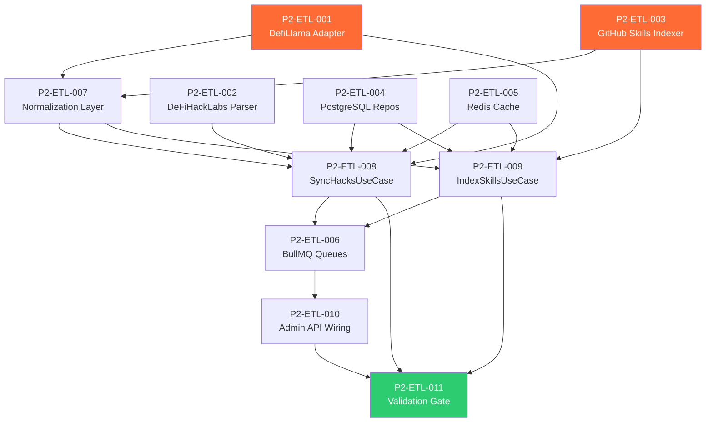

# Phase 2: Data Pipelines & ETL — Code Review & Kanban Tasks

> **Project**: AltFlex AEGIS v3.0 — Adaptive Exploit & Governance Intelligence System
> **Timeline**: Week 5–8
> **Priority**: Critical — Phase 3 (AI Safety Scanner) depends on indexed data
> **Tech Stack**: TypeScript, Axios, BullMQ, PostgreSQL 16, Redis 7, GitHub API, Zod
> **Blocked By**: Phase 1 (Architecture & API Design) ✅ Complete

---

## Overview

Phase 2 builds the data arteries of AltFlex AEGIS. Three independent ETL pipelines ingest, normalize, and store data from external sources into the PostgreSQL datastore. These pipelines run as stateless BullMQ workers, scheduled via cron or triggered manually through admin API endpoints.
The three pipelines:

1. **DefiLlama Sync** — Fetches hack incident data from `api.llama.fi/hacks`, normalizes it to `HackIncident` entities, and upserts into PostgreSQL.
2. **DeFiHackLabs Parser** — Clones or fetches the SunWeb3Sec/DeFiHackLabs repository, parses README and Foundry test files, cross-references with DefiLlama data, and links POCs to incidents.
3. **GitHub AI Skills Indexer** — Scrapes curated GitHub repositories for AI audit skill files (YAML, Markdown), indexes them into the skills table, and triggers the safety scanner pipeline (Phase 3).
   No pipeline depends on another — they can run in parallel, on independent schedules.

---

## Task Breakdown

---

### P2-ETL-001: Implement DefiLlama Hacks API Adapter

**Title**: Build the Primary ETL Adapter for DefiLlama Hack Incident Data

| Field           | Value                                         |
| --------------- | --------------------------------------------- |
| Priority        | P0 — Critical                                 |
| Estimated Hours | 6                                             |
| Dependencies    | Phase 1 API contracts frozen                  |
| Labels          | `etl`, `hacks-engine`, `adapter`, `defillama` |

**Description**:
Implement the `DefiLlamaAdapter` — a hexagonal driven adapter that fetches hack data from the DefiLlama API (`https://api.llama.fi/hacks`), transforms the raw JSON into `HackIncident` domain entities, and handles pagination, rate limiting, and error recovery.

**Acceptance Criteria**:

- [ ] `DefiLlamaAdapter` implements `IHackSourcePort` interface
- [ ] Fetches all hacks from `GET https://api.llama.fi/hacks`
- [ ] Maps DefiLlama fields to `HackIncident` entity schema
- [ ] Normalizes chain names to `Chain` enum values
- [ ] Classifies `technique` field to `AttackVector` enum values
- [ ] Handles API rate limiting (429 responses) with exponential backoff
- [ ] Handles network errors with retry logic (3 retries, configurable)
- [ ] Validates each record with `HackIncidentSchema` (Zod)
- [ ] Logs invalid records instead of throwing (partial failure tolerance)
- [ ] Returns `HackIncident[]` ready for database upsert
- [ ] Unit tests with mocked API responses (≥15 test cases)
- [ ] Integration test against live API (optional, CI-gated)

**DefiLlama Response Mapping**:

```typescript
// DefiLlama raw response shape
interface DefiLlamaHack {
  id: number;
  name: string; // → protocolName
  date: number; // Unix timestamp → date
  amount: number; // → lossUsd (in millions, needs × 1_000_000)
  chains: string[]; // → chain (first element, normalized)
  technique: string; // → attackVector (needs classification)
  bridgeHack: boolean; // → attackVector override if true
  returnedFunds: number | null; // → fundsReturned
  target: string; // Additional context
  source?: string; // → sources[]
}
```

**Chain Normalization Map**:

```typescript
const CHAIN_NORMALIZATION: Record<string, Chain> = {
  Ethereum: Chain.ETHEREUM,
  BSC: Chain.BSC,
  Polygon: Chain.POLYGON,
  Arbitrum: Chain.ARBITRUM,
  Optimism: Chain.OPTIMISM,
  Avalanche: Chain.AVALANCHE,
  Base: Chain.BASE,
  Fantom: Chain.FANTOM,
  Gnosis: Chain.GNOSIS,
  Cronos: Chain.CRONOS,
  Solana: Chain.SOLANA,
  // ... more mappings
};
```

---

### P2-ETL-002: Implement DeFiHackLabs Repository Parser

**Title**: Build the Secondary ETL Adapter for SunWeb3Sec/DeFiHackLabs Foundry POCs

| Field           | Value                                            |
| --------------- | ------------------------------------------------ |
| Priority        | P0 — Critical                                    |
| Estimated Hours | 8                                                |
| Dependencies    | P2-ETL-001                                       |
| Labels          | `etl`, `hacks-engine`, `adapter`, `defihacklabs` |

**Description**:
Implement the `DeFiHackLabsAdapter` — a hexagonal driven adapter that clones or uses the GitHub API to fetch the SunWeb3Sec/DeFiHackLabs repository, parses the README tables (which map exploits to test files), extracts Foundry test file paths, and cross-references with existing `HackIncident` records to set `hasFoundryPoc = true` and populate `foundryTestPath`.

**Acceptance Criteria**:

- [ ] `DeFiHackLabsAdapter` implements `IHackSourcePort` interface
- [ ] Fetches repository file listing via GitHub API (or shallow clone)
- [ ] Parses root `README.md` to extract exploit → test file mappings
- [ ] Extracts test file paths from `src/test/` directory structure
- [ ] Maps each POC to date, protocol name, and vulnerability type
- [ ] Cross-references with `hack_incidents` table by protocol name + date
- [ ] Updates `hasFoundryPoc` and `foundryTestPath` fields on matching records
- [ ] Handles GitHub API rate limiting (5000 req/hour with token)
- [ ] Supports incremental sync (only fetch new/changed files since last sync)
- [ ] Unit tests with mocked GitHub API responses (≥12 test cases)
- [ ] Stores `lastSyncedAt` timestamp in `etl_sync_log`

**DeFiHackLabs Repository Structure**:

```text
DeFiHackLabs/
├── README.md ← Parse this for exploit → test mappings
├── src/
│ └── test/
│ ├── 2020-02/
│ │ └── bZx_exp.sol
│ ├── 2021-10/
│ │ └── CreamFinance_exp.sol
│ ├── 2023-03/
│ │ └── Euler_exp.sol
│ └── 2026-03/
│ └── CurveLend_exp.sol
```

**README Parsing Strategy**:

```typescript
// DeFiHackLabs README contains markdown tables like:
// | Protocol | Date | Loss | Test File |
// |----------|------|------|-----------|
// | Euler | 2023-03-13 | $197M | [Link](src/test/2023-03/Euler_exp.sol) |
// Parse these tables using regex:
const TABLE_ROW_REGEX =
  /\|\s*(.+?)\s*\|\s*(\d{4}-\d{2}-\d{2})\s*\|\s*\$?([\d.,]+[MKB]?)\s*\|\s*\[.*?\]\((.*?)\)\s*\|/g;
```

---

### P2-ETL-003: Implement GitHub AI Skills Indexer

**Title**: Build the ETL Adapter for Indexing AI Audit Skill Files from GitHub

| Field           | Value                                       |
| --------------- | ------------------------------------------- |
| Priority        | P0 — Critical                               |
| Estimated Hours | 8                                           |
| Dependencies    | Phase 1 API contracts frozen                |
| Labels          | `etl`, `skills-engine`, `adapter`, `github` |

**Description**:
Implement the `GitHubSkillsAdapter` — a hexagonal driven adapter that scrapes curated GitHub repositories for AI audit skill files. It discovers, downloads, parses metadata, generates content hashes for deduplication, and indexes files into the `ai_skill_files` table.

**Acceptance Criteria**:

- [ ] `GitHubSkillsAdapter` implements `ISkillSourcePort` interface
- [ ] Maintains a curated list of source repositories (configurable)
- [ ] Discovers skill files by extension (`.yml`, `.yaml`, `.md`, `.json`, `.toml`)
- [ ] Filters discovery to relevant directories (e.g., `skills/`, `prompts/`, `agents/`, `.cursorrules`)
- [ ] Downloads file content via GitHub API (`GET /repos/{owner}/{repo}/contents/{path}`)
- [ ] Parses YAML frontmatter using `gray-matter` to extract metadata (name, description, platform, language)
- [ ] Generates SHA-256 content hash for deduplication
- [ ] Detects platform from file path, frontmatter, or content heuristics
- [ ] Detects language from file path, frontmatter, or content analysis
- [ ] Skips files that haven't changed (same content hash)
- [ ] Handles GitHub API rate limiting with token auth
- [ ] Supports incremental sync via `If-Modified-Since` header or commit timestamps
- [ ] Unit tests (≥15 test cases) with mocked GitHub API
- [ ] Stores sync metadata in `etl_sync_log`
- [ ] New skills indexed with `safetyLabel: 'unanalyzed'` (scanned in Phase 3)

**Curated Source Repositories** (initial set):

```typescript
const SKILL_SOURCES: SkillSource[] = [
  {
    owner: 'AquaSecure', // Example — replace with real repos
    repo: 'ai-audit-skills',
    paths: ['skills/', 'prompts/'],
    defaultPlatform: 'claude',
  },
  {
    owner: 'example',
    repo: 'cursor-security-rules',
    paths: ['.cursorrules', 'rules/'],
    defaultPlatform: 'cursor',
  },
  // Additional repos discovered during Phase 3 research
];
```

**File Discovery & Classification Heuristics**:

```typescript
// Platform detection priority:
// 1. Frontmatter field: platform: "claude"
// 2. File path contains: .cursorrules → cursor, .claude → claude
// 3. Content keywords: "MCP", "tool_use" → mcp
// 4. Default from source config
// Language detection priority:
// 1. Frontmatter field: language: "solidity"
// 2. Content keywords: "Solidity", "EVM", "Vyper", "Rust", "Move"
// 3. Default: "multi"
```

---

### P2-ETL-004: Implement PostgreSQL Repository Adapters

**Title**: Build Concrete Database Repositories for Both Engines

| Field           | Value                               |
| --------------- | ----------------------------------- |
| Priority        | P0 — Critical                       |
| Estimated Hours | 6                                   |
| Dependencies    | P1-ARCH-007 (Migrations)            |
| Labels          | `database`, `repository`, `adapter` |

**Description**:
Implement the PostgreSQL adapter layer — concrete implementations of `IHackDataPort` and `ISkillDataPort` that execute optimized SQL queries against the PostgreSQL database.

**Acceptance Criteria**:

- [ ] `PostgresHackRepository` implements `IHackDataPort`
- [ ] `findAll()` with dynamic WHERE clause from `HackFilters`
- [ ] `save()` / `saveBatch()` with `ON CONFLICT DO UPDATE` (upsert)
- [ ] `count()` with filter support
- [ ] `getTotalLossUsd()` with filter support
- [ ] `getAttackVectorStats()` with aggregation query
- [ ] Full-text search on `protocol_name` using `pg_trgm`
- [ ] Parameterized queries — zero SQL injection surface
- [ ] `PostgresSkillRepository` implements `ISkillDataPort`
- [ ] `findAll()` with dynamic WHERE clause from `SkillFilters`
- [ ] `save()` with `ON CONFLICT (source_repo, file_path) DO UPDATE`
- [ ] `incrementCopyCount()` / `incrementStarCount()` — atomic updates
- [ ] Platform/language/safety aggregation queries
- [ ] Connection pooling via `pg.Pool` (min: 2, max: 10 connections)
- [ ] Query timeout (30s default)
- [ ] Unit tests with test database (≥25 test cases per repository)
- [ ] Query performance: filter queries < 50ms on 1000-row dataset

**Dynamic Filter Query Builder**:

```typescript
// Build WHERE clause dynamically from filter params
function buildHackWhereClause(filters: HackFilters): {
  text: string;
  values: unknown[];
} {
  const conditions: string[] = [];
  const values: unknown[] = [];
  let paramIdx = 1;
  if (filters.attackVector) {
    conditions.push(`attack_vector = $${paramIdx++}`);
    values.push(filters.attackVector);
  }
  if (filters.chain) {
    conditions.push(`chain = $${paramIdx++}`);
    values.push(filters.chain);
  }
  if (filters.dateFrom) {
    conditions.push(`date >= $${paramIdx++}`);
    values.push(filters.dateFrom);
  }
  if (filters.dateTo) {
    conditions.push(`date <= $${paramIdx++}`);
    values.push(filters.dateTo);
  }
  if (filters.minLossUsd !== undefined) {
    conditions.push(`loss_usd >= $${paramIdx++}`);
    values.push(filters.minLossUsd);
  }
  if (filters.search) {
    conditions.push(`protocol_name ILIKE $${paramIdx++}`);
    values.push(`%${filters.search}%`);
  }
  // ... more filters
  const whereClause = conditions.length > 0 ? `WHERE ${conditions.join(' AND ')}` : '';
  return { text: whereClause, values };
}
```

---

### P2-ETL-005: Implement Redis Cache Adapter

**Title**: Build Concrete Redis Cache for API Response Caching

| Field           | Value                            |
| --------------- | -------------------------------- |
| Priority        | P1 — High                        |
| Estimated Hours | 3                                |
| Dependencies    | Phase 1 caching strategy defined |
| Labels          | `cache`, `redis`, `adapter`      |

**Description**:
Implement the `RedisCacheAdapter` — a concrete implementation of `ICachePort` using `ioredis`. Supports TTL-based caching, cache-aside pattern, and bulk invalidation by key prefix.

**Acceptance Criteria**:

- [ ] `RedisCacheAdapter` implements `ICachePort`
- [ ] `get<T>(key)` — Retrieve + JSON parse with type safety
- [ ] `set<T>(key, value, ttlSeconds)` — Serialize + store with TTL
- [ ] `del(key)` — Delete single key
- [ ] `delByPrefix(prefix)` — Delete all keys matching `aegis:hacks:*` etc.
- [ ] `getOrSet<T>(key, factory, ttlSeconds)` — Cache-aside pattern helper
- [ ] Connection health check method for health endpoint
- [ ] Graceful handling of Redis downtime (fallthrough to DB, not crash)
- [ ] Configurable serializer (JSON by default)
- [ ] Unit tests (≥10 test cases) with mocked Redis

---

### P2-ETL-006: Implement BullMQ Job Queue System

**Title**: Build Job Queue Infrastructure for Scheduled and On-Demand ETL

| Field           | Value                              |
| --------------- | ---------------------------------- |
| Priority        | P0 — Critical                      |
| Estimated Hours | 6                                  |
| Dependencies    | P2-ETL-001, P2-ETL-002, P2-ETL-003 |
| Labels          | `jobs`, `bullmq`, `infrastructure` |

**Description**:
Implement the BullMQ-based job queue system that orchestrates ETL pipeline execution. Jobs can be triggered on a cron schedule or on-demand via admin API endpoints. Each job has retry logic, progress tracking, and completion logging.

**Acceptance Criteria**:

- [ ] `HacksSyncJob` — DefiLlama + DeFiHackLabs sync
- [ ] Cron schedule: every 6 hours (`0 */6 * * *`)
- [ ] Max retry: 3 with exponential backoff
- [ ] Progress tracking: 0% → fetching → normalizing → upserting → 100%
- [ ] Logs result to `etl_sync_log` table
- [ ] `SkillsIndexJob` — GitHub skills scraper
- [ ] Cron schedule: every 1 hour (`0 * * * *`)
- [ ] Max retry: 3
- [ ] Triggers safety scan for newly indexed skills (Phase 3 hook)
- [ ] `SafetyScanJob` — Safety scanner (Phase 3 placeholder)
- [ ] Triggered by `SkillsIndexJob` for each new skill
- [ ] Max retry: 2
- [ ] Sets `safetyLabel` on completion
- [ ] `QueueDashboard` — BullMQ Board or custom status endpoint
- [ ] Shows active/waiting/completed/failed job counts
- [ ] Accessible via `GET /api/v1/admin/jobs`
- [ ] All queues use dedicated Redis connection
- [ ] Queue names namespaced: `aegis:queue:hacks-sync`, `aegis:queue:skills-index`
- [ ] Unit tests for job processors (≥12 test cases)
- [ ] Integration test: trigger → process → verify DB state

**Job Queue Architecture**:

```typescript
// Worker setup
import { Worker, Queue, QueueScheduler } from 'bullmq';
import IORedis from 'ioredis';
const connection = new IORedis({
  host: process.env.REDIS_HOST,
  port: Number(process.env.REDIS_PORT),
  maxRetriesPerRequest: null,
});
// Hacks Sync Queue
export const hacksSyncQueue = new Queue('aegis:hacks-sync', {
  connection,
  defaultJobOptions: {
    attempts: 3,
    backoff: { type: 'exponential', delay: 5000 },
    removeOnComplete: { count: 100 },
    removeOnFail: { count: 50 },
  },
});
// Add recurring job
await hacksSyncQueue.add(
  'sync',
  {},
  {
    repeat: { cron: '0 */6 * * *' },
  },
);
```

---

### P2-ETL-007: Implement Data Normalization Layer

**Title**: Build Data Transformation & Validation Pipeline Between Sources and Domain

| Field           | Value                                |
| --------------- | ------------------------------------ |
| Priority        | P0 — Critical                        |
| Estimated Hours | 5                                    |
| Dependencies    | P2-ETL-001, P2-ETL-003               |
| Labels          | `etl`, `normalization`, `validation` |

**Description**:
Implement the normalization layer that sits between raw external data and domain entities. This layer handles field mapping, type coercion, enum classification, deduplication, and Zod validation.

**Acceptance Criteria**:

- [ ] `HackNormalizer` — Transforms DefiLlama raw data to `HackIncident[]`
- [ ] Chain name normalization (case-insensitive, alias support)
- [ ] Attack vector classification from `technique` string
- [ ] Loss amount conversion (millions → raw USD)
- [ ] Date normalization (Unix timestamp → ISO format)
- [ ] Source URL extraction and validation
- [ ] Deduplication by `protocolName + date` composite key
- [ ] `SkillNormalizer` — Transforms GitHub file data to `AISkillFile[]`
- [ ] YAML frontmatter extraction using `gray-matter`
- [ ] Platform detection heuristics (from path, content, frontmatter)
- [ ] Language detection heuristics
- [ ] Content hash generation (SHA-256)
- [ ] Author extraction from repo owner or frontmatter
- [ ] `AttackVectorClassifier` — Maps free-text technique descriptions to `AttackVector` enum
- [ ] Keyword-based classification with confidence scoring
- [ ] Handles multi-word descriptions ("Oracle Manipulation & Price Manipulation")
- [ ] Falls back to `AttackVector.OTHER` for unrecognized patterns
- [ ] Classification accuracy ≥ 95% on known DeFi hacks
- [ ] All normalizers produce Zod-validated output
- [ ] Invalid records logged with reason (not silently dropped)
- [ ] Unit tests (≥20 test cases) covering edge cases

**Attack Vector Classifier:**

```typescript
const VECTOR_KEYWORDS: Record<AttackVector, string[]> = {
  [AttackVector.ACCESS_CONTROL]: [
    'access control',
    'private key',
    'admin',
    'privilege',
    'unauthorized',
  ],
  [AttackVector.FLASH_LOAN]: ['flash loan', 'flashloan', 'flash-loan'],
  [AttackVector.ORACLE_MANIPULATION]: ['oracle', 'price manipulation', 'price oracle', 'twap'],
  [AttackVector.REENTRANCY]: ['reentrancy', 're-entrancy', 'reentrant'],
  [AttackVector.PHISHING]: ['phishing', 'social engineering', 'fake'],
  [AttackVector.RUG_PULL]: ['rug pull', 'rugpull', 'exit scam'],
  [AttackVector.FRONTRUNNING]: ['frontrun', 'sandwich', 'mev', 'front-run'],
  [AttackVector.DAO_GOVERNANCE]: ['governance', 'dao', 'voting'],
  [AttackVector.ARITHMETIC_OVERFLOW]: ['overflow', 'underflow', 'integer'],
  [AttackVector.DELEGATECALL_INJECTION]: ['delegatecall', 'proxy', 'call injection'],
  [AttackVector.DOS]: ['dos', 'denial of service', 'griefing'],
  [AttackVector.REPLAY]: ['replay', 'signature replay'],
  [AttackVector.SELF_DESTRUCT]: ['selfdestruct', 'self-destruct', 'suicide'],
  [AttackVector.BRIDGE_EXPLOIT]: ['bridge', 'cross-chain', 'cross chain'],
  [AttackVector.LOGIC_ERROR]: ['logic', 'bug', 'implementation error'],
};
```

---

### P2-ETL-008: Implement SyncHacksUseCase

**Title**: Build the Application-Layer Orchestrator for Hacks ETL Pipeline

| Field           | Value                                          |
| --------------- | ---------------------------------------------- |
| Priority        | P0 — Critical                                  |
| Estimated Hours | 4                                              |
| Dependencies    | P2-ETL-001, P2-ETL-002, P2-ETL-004, P2-ETL-007 |
| Labels          | `use-case`, `hacks-engine`, `application`      |

**Description**:
Implement the `SyncHacksUseCase` — the application-layer orchestrator that coordinates the full hacks ETL pipeline: fetch from DefiLlama → normalize → upsert → cross-reference with DeFiHackLabs → invalidate cache → log sync result.

**Acceptance Criteria**:

- [ ] Orchestrates full ETL flow in correct order
- [ ] Calls `DefiLlamaAdapter.fetchAllHacks()`
- [ ] Passes raw data through `HackNormalizer`
- [ ] Upserts normalized data via `IHackDataPort.saveBatch()`
- [ ] Calls `DeFiHackLabsAdapter.fetchPocMappings()`
- [ ] Cross-references POCs with stored incidents
- [ ] Invalidates Redis cache (`aegis:hacks:*`)
- [ ] Logs sync result to `etl_sync_log` (records added, updated, duration)
- [ ] Reports progress to BullMQ job handler (0%→25%→50%→75%→100%)
- [ ] Handles partial failures (some records fail, others succeed)
- [ ] Returns `SyncResult` with summary statistics
- [ ] Unit tests with mocked ports (≥10 test cases)

---

### P2-ETL-009: Implement IndexSkillsUseCase

**Title**: Build the Application-Layer Orchestrator for Skills ETL Pipeline

| Field           | Value                                      |
| --------------- | ------------------------------------------ |
| Priority        | P0 — Critical                              |
| Estimated Hours | 4                                          |
| Dependencies    | P2-ETL-003, P2-ETL-004, P2-ETL-007         |
| Labels          | `use-case`, `skills-engine`, `application` |

**Description**:
Implement the `IndexSkillsUseCase` — the application-layer orchestrator that coordinates the skills indexing pipeline: discover repos → fetch files → normalize → dedup → upsert → trigger safety scans.

**Acceptance Criteria**:

- [ ] Orchestrates full indexing flow
- [ ] Iterates over curated `SKILL_SOURCES` list
- [ ] Calls `GitHubSkillsAdapter.discoverSkillFiles(source)`
- [ ] Passes raw data through `SkillNormalizer`
- [ ] Skips files with unchanged `contentHash` (deduplication)
- [ ] Upserts new/changed skills via `ISkillDataPort.save()`
- [ ] Enqueues `SafetyScanJob` for each newly indexed skill
- [ ] Invalidates Redis cache (`aegis:skills:*`)
- [ ] Logs sync result to `etl_sync_log`
- [ ] Returns `IndexResult` with counts (added, updated, skipped, errored)
- [ ] Unit tests with mocked ports (≥10 test cases)

---

### P2-ETL-010: Wire ETL Workers to API Gateway Admin Endpoints

**Title**: Connect Admin API Endpoints to Job Queue Triggers

| Field           | Value                              |
| --------------- | ---------------------------------- |
| Priority        | P1 — High                          |
| Estimated Hours | 3                                  |
| Dependencies    | P2-ETL-006, P2-ETL-008, P2-ETL-009 |
| Labels          | `api`, `admin`, `integration`      |

**Description**:
Wire the admin API endpoints (`POST /api/v1/hacks/sync`, `POST /api/v1/skills/sync`) to their respective BullMQ job queues. Include job status polling endpoints.

**Acceptance Criteria**:

- [ ] `POST /api/v1/hacks/sync` → Enqueues `HacksSyncJob` → Returns `{ jobId }`
- [ ] `POST /api/v1/skills/sync` → Enqueues `SkillsIndexJob` → Returns `{ jobId }`
- [ ] `GET /api/v1/admin/jobs/:jobId` → Returns job status from BullMQ
- [ ] `GET /api/v1/admin/jobs` → Returns queue statistics (active, waiting, completed, failed)
- [ ] Prevents duplicate sync if job already running (returns 409 `ETL_SYNC_IN_PROGRESS`)
- [ ] Admin endpoints protected by API key (`requireApiKey` middleware)
- [ ] Returns proper error 429 if rate limited
- [ ] Integration tests (≥5 test cases)

---

### P2-ETL-011: Validation & Phase Gate

**Title**: Full Phase 2 Validation — All Pipelines Sync Successfully, Data Verified

| Field           | Value                      |
| --------------- | -------------------------- |
| Priority        | P0 — Critical              |
| Estimated Hours | 3                          |
| Dependencies    | All P2-ETL tasks           |
| Labels          | `validation`, `qa`, `gate` |

**Description**:
End-to-end validation of all three ETL pipelines. Each pipeline must successfully sync, normalize, and persist data.

**Acceptance Criteria**:

- [ ] DefiLlama sync: ≥100 hack incidents in database
- [ ] DeFiHackLabs parser: ≥30 incidents linked to Foundry POCs
- [ ] GitHub skills indexer: ≥10 skill files indexed
- [ ] All records pass Zod schema validation
- [ ] `etl_sync_log` shows successful completion for all 3 sources
- [ ] Redis cache populated for default queries
- [ ] API endpoints return correct data:
- [ ] `GET /api/v1/hacks` returns paginated hack list
- [ ] `GET /api/v1/hacks/stats` returns aggregate stats
- [ ] `GET /api/v1/hacks/vectors` returns all 16 attack vectors
- [ ] `GET /api/v1/skills` returns paginated skill list
- [ ] `GET /api/v1/skills/stats` returns skill statistics
- [ ] Performance: full DefiLlama sync completes in < 60 seconds
- [ ] Performance: filter queries return in < 100ms
- [ ] All unit tests pass (≥100 new tests this phase)
- [ ] TypeScript: `tsc --noEmit` reports 0 errors

---

## Dependency Graph



---

## Phase Gate Criteria

| Criterion             | Requirement                                  | Status |
| --------------------- | -------------------------------------------- | ------ |
| DefiLlama adapter     | Fetches + normalizes all hacks               | ⬜     |
| DeFiHackLabs parser   | Links POCs to incidents                      | ⬜     |
| GitHub skills indexer | Indexes skill files from curated repos       | ⬜     |
| PostgreSQL repos      | All CRUD operations working                  | ⬜     |
| Redis cache           | Cache-aside pattern operational              | ⬜     |
| BullMQ jobs           | All 3 queues functional with cron            | ⬜     |
| Normalization         | Chain/vector/platform classification ≥95%    | ⬜     |
| Admin API             | Sync triggers work, job status polling works | ⬜     |
| Data volume           | ≥100 hacks, ≥30 with POCs, ≥10 skills        | ⬜     |
| Performance           | Sync < 60s, queries < 100ms                  | ⬜     |
| Tests                 | ≥100 new test cases                          | ⬜     |

> **⛔ Phase 3 CANNOT begin until all Phase Gate Criteria are ✅.**

---

_Document Version: 3.2.0_
_Author: AltFlex AEGIS Engineering_
_Last Updated: April 2026_
