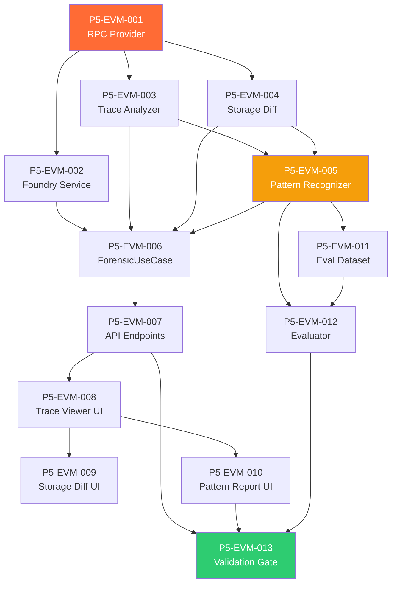

# Phase 5: Deep EVM Integration — Code Review & Kanban Tasks

> **Project**: AltFlex AEGIS v3.0 — Adaptive Exploit & Governance Intelligence System
> **Timeline**: Week 23–30
> **Priority**: Critical — **This is the core Thesis 2 deliverable**
> **Tech Stack**: TypeScript, Foundry (forge), Viem/Ethers.js, Alchemy/Infura, PostgreSQL, BullMQ
> **Blocked By**: Phase 4 (Frontend Implementation) ✅ Complete
> **Academic Mapping**: Thesis 2 — "Programmable Forensic Replay and Exploit Pattern Recognition on the Ethereum Virtual Machine"

---

## Overview

Phase 5 transforms AltFlex AEGIS from a passive data dashboard into an **active forensic intelligence platform**. This phase implements the Forensic Engine (Engine γ from Phase 1 architecture) — enabling users to simulate exploit POCs in sandboxed environments, trace EVM transactions call-by-call, analyze storage diffs, and visualize attack execution paths.
The four pillars:

1. **Foundry Integration** — Programmatic `forge test` execution against forked mainnet state
2. **Transaction Tracing** — `debug_traceTransaction` call tree extraction and analysis
3. **Storage Diff Analysis** — Pre/post-attack state comparison for identifying what changed
4. **Forensic Frontend** — Interactive trace viewer, call tree visualization, storage diff inspector

---

## Task Breakdown

---

### P5-EVM-001: Implement Multi-Chain RPC Provider Layer

**Title**: Build Abstracted RPC Provider with Alchemy/Infura Fallback and Rate Limiting

| Field           | Value                                      |
| --------------- | ------------------------------------------ |
| Priority        | P0 — Critical                              |
| Estimated Hours | 5                                          |
| Dependencies    | Phase 4 complete                           |
| Labels          | `forensic-engine`, `rpc`, `infrastructure` |

**Description**:
Implement the `ChainRpcProvider` — a hexagonal driven adapter that abstracts multi-chain RPC access behind a unified interface. Supports Alchemy and Infura with automatic fallback, rate limiting, and connection pooling.

**Acceptance Criteria**:

- [ ] `ChainRpcProvider` implements `IRpcPort` interface
- [ ] Supports: Ethereum, BSC, Polygon, Arbitrum, Optimism, Avalanche, Base
- [ ] Alchemy primary, Infura fallback (configurable per chain)
- [ ] Automatic failover when primary returns 429/5xx
- [ ] Rate limiter: 25 req/s free tier, configurable per chain
- [ ] Archive node detection (`eth_getBalance` at historical block)
- [ ] WebSocket support for `debug_traceTransaction` (long-running)
- [ ] Connection health check for `/health` endpoint
- [ ] Unit tests (≥12 test cases) with mocked RPC responses
      **Supported RPC Methods**:

```typescript
interface IRpcPort {
  getBlock(chain: Chain, blockNumber: number): Promise<Block>;
  getTransaction(chain: Chain, txHash: string): Promise<Transaction>;
  getTransactionReceipt(chain: Chain, txHash: string): Promise<TransactionReceipt>;
  traceTransaction(chain: Chain, txHash: string): Promise<TraceResult>;
  getStorageAt(chain: Chain, address: string, slot: string, blockNumber: number): Promise<string>;
  call(chain: Chain, callData: CallRequest, blockNumber: number): Promise<string>;
  getCode(chain: Chain, address: string, blockNumber?: number): Promise<string>;
  getLogs(chain: Chain, filter: LogFilter): Promise<Log[]>;
}
```

---

### P5-EVM-002: Implement Foundry Integration Service

**Title**: Build Programmatic Foundry/Forge Execution for POC Simulation

| Field           | Value                                                  |
| --------------- | ------------------------------------------------------ |
| Priority        | P0 — Critical                                          |
| Estimated Hours | 10                                                     |
| Dependencies    | P5-EVM-001                                             |
| Labels          | `forensic-engine`, `foundry`, `simulation`, `thesis-2` |

**Description**:
Implement the `FoundryService` — the core forensic capability that programmatically executes Foundry (`forge test`) against exploit POC files from DeFiHackLabs, running them in a forked mainnet environment at the pre-exploit block height.

**Acceptance Criteria**:

- [ ] `FoundryService` orchestrates forge execution
- [ ] Downloads POC .sol file from DeFiHackLabs (via GitHub API or local cache)
- [ ] Creates temporary Foundry project with correct dependencies
- [ ] Configures `foundry.toml` with:
- [ ] Fork URL (Alchemy/Infura endpoint for target chain)
- [ ] Fork block number (pre-exploit, from `hack_incidents.date` → nearest block)
- [ ] Solidity compiler version (extracted from pragma or defaulted)
- [ ] Executes `forge test --match-test <exploit_function> -vvvv --json`
- [ ] Parses JSON output for: test result, gas used, traces, logs
- [ ] Timeout: 120s max per test execution
- [ ] Sandboxed: runs in isolated `/tmp` directory
- [ ] Cleans up temporary files after execution
- [ ] Returns `SimulationResult { success, gasUsed, traces, logs, duration }`
- [ ] Error handling: compile errors, fork unavailable, timeout
- [ ] Unit tests (≥10 cases) with pre-recorded forge output
- [ ] Requires `forge` binary installed on host (validated on startup)
      **Forge Output Parsing**:

```typescript
interface ForgeTestResult {
  success: boolean;
  reason?: string; // Failure reason if !success
  gasUsed: bigint;
  logs: ForgeLog[]; // Event logs emitted during test
  traces: ForgeTrace[]; // Internal call trace (from -vvvv)
  duration: number; // Execution time in ms
}
interface ForgeTrace {
  depth: number; // Call depth (0 = entry point)
  type: 'CALL' | 'STATICCALL' | 'DELEGATECALL' | 'CREATE' | 'CREATE2';
  from: string; // Caller address
  to: string; // Callee address
  value: bigint; // ETH value transferred
  gasUsed: bigint;
  input: string; // Calldata (hex)
  output: string; // Return data (hex)
  error?: string; // Revert reason if failed
}
```

---

### P5-EVM-003: Implement Transaction Trace Analyzer

**Title**: Build EVM Call Tree Extraction and Analysis via debug_traceTransaction

| Field           | Value                                           |
| --------------- | ----------------------------------------------- |
| Priority        | P0 — Critical                                   |
| Estimated Hours | 8                                               |
| Dependencies    | P5-EVM-001                                      |
| Labels          | `forensic-engine`, `tracing`, `evm`, `thesis-2` |

**Description**:
Implement the `TransactionTraceAnalyzer` — extracts and analyzes the internal call tree of any on-chain transaction using `debug_traceTransaction`. This enables post-mortem analysis of how exploits executed step-by-step.

**Acceptance Criteria**:

- [ ] `TransactionTraceAnalyzer` wraps `debug_traceTransaction` RPC call
- [ ] Supports `callTracer` preset for structured output
- [ ] Builds hierarchical `CallTree` from flat trace data
- [ ] Decodes function selectors using known ABI signatures
- [ ] Uses 4byte.directory API for signature lookup
- [ ] Falls back to raw selector if not found
- [ ] Identifies: flash loan calls, token transfers, oracle reads, admin calls
- [ ] Detects reentrancy: same address called at depth > 1
- [ ] Detects delegate calls: identifies proxy→implementation patterns
- [ ] Computes: total gas by contract, value flow summary
- [ ] Returns `TransactionTrace { callTree, events, gasBreakdown, summary }`
- [ ] Handles large traces (>10,000 internal calls) — streaming parse
- [ ] Unit tests (≥15 cases) with recorded trace fixtures
- [ ] Integration test: trace a known exploit tx (e.g., Euler 2023)
      **Call Tree Structure**:

```typescript
interface CallTreeNode {
  id: string; // Unique node ID
  depth: number;
  type: CallType; // CALL, STATICCALL, DELEGATECALL, CREATE
  from: string; // Address
  to: string; // Address
  value: bigint; // ETH wei
  gasUsed: bigint;
  input: string; // Raw calldata hex
  output: string; // Raw return hex
  decodedCall?: DecodedCall; // Decoded function name + args
  error?: string;
  children: CallTreeNode[]; // Nested calls
}
interface DecodedCall {
  signature: string; // e.g., "transfer(address,uint256)"
  selector: string; // e.g., "0xa9059cbb"
  name: string; // e.g., "transfer"
  args: DecodedArg[]; // Decoded arguments
}
type CallType = 'CALL' | 'STATICCALL' | 'DELEGATECALL' | 'CREATE' | 'CREATE2' | 'SELFDESTRUCT';
```

---

### P5-EVM-004: Implement Storage Diff Analyzer

**Title**: Build Pre/Post-Attack State Comparison Engine

| Field           | Value                                                |
| --------------- | ---------------------------------------------------- |
| Priority        | P0 — Critical                                        |
| Estimated Hours | 7                                                    |
| Dependencies    | P5-EVM-001                                           |
| Labels          | `forensic-engine`, `storage`, `analysis`, `thesis-2` |

**Description**:
Implement the `StorageDiffAnalyzer` — compares contract storage at two block heights (pre-exploit and post-exploit) to identify exactly what state changed during an attack.

**Acceptance Criteria**:

- [ ] `StorageDiffAnalyzer` reads storage slots via `eth_getStorageAt`
- [ ] Compares storage at `blockBefore` and `blockAfter` for target contracts
- [ ] Auto-discovers relevant storage slots from:
- [ ] Transaction trace access list
- [ ] Known ERC-20 storage layouts (balanceOf, totalSupply, allowances)
- [ ] Events emitted during the transaction
- [ ] Decodes storage slots using known layout patterns:
- [ ] Mapping keys (keccak256 slot computation)
- [ ] Dynamic arrays (length + element slots)
- [ ] Packed variables
- [ ] Labels storage changes: "balance decreased", "owner changed", "paused toggled"
- [ ] Returns `StorageDiff { contract, changes[], summary }`
- [ ] Handles proxy contracts (reads implementation storage, not proxy)
- [ ] Unit tests (≥12 cases) with pre-recorded storage data
      **Storage Diff Types**:

```typescript
interface StorageDiff {
  contractAddress: string;
  contractName?: string; // From verified source or Etherscan
  changes: StorageChange[];
  summary: string; // Human-readable summary
}
interface StorageChange {
  slot: string; // Storage slot (hex)
  label?: string; // Decoded label ("balanceOf[attacker]")
  valueBefore: string; // Value at blockBefore
  valueAfter: string; // Value at blockAfter
  decodedBefore?: string; // Human-readable ("1000.5 USDC")
  decodedAfter?: string; // Human-readable ("0 USDC")
  interpretation: string; // "Attacker drained 1000.5 USDC"
}
```

---

### P5-EVM-005: Implement Exploit Pattern Recognizer

**Title**: Build Automated Pattern Classification for Known Exploit Techniques

| Field           | Value                                                                  |
| --------------- | ---------------------------------------------------------------------- |
| Priority        | P0 — Critical                                                          |
| Estimated Hours | 8                                                                      |
| Dependencies    | P5-EVM-003, P5-EVM-004                                                 |
| Labels          | `forensic-engine`, `pattern-recognition`, `classification`, `thesis-2` |

**Description**:
Implement the `ExploitPatternRecognizer` — analyzes transaction traces and storage diffs to automatically classify the exploit technique used. This is the core academic contribution for Thesis 2.

**Acceptance Criteria**:

- [ ] `ExploitPatternRecognizer` processes `TransactionTrace` + `StorageDiff` inputs
- [ ] Detects 10+ exploit patterns:
- [ ] **Flash Loan Attack**: Flash loan borrow → price manipulation → arbitrage → repay
- [ ] **Reentrancy**: Recursive calls to same contract before state update
- [ ] **Oracle Manipulation**: Reads from price oracle within same tx that manipulated pool
- [ ] **Access Control**: Calls to admin/governance functions from unauthorized address
- [ ] **Arithmetic Overflow**: Integer overflow/underflow in token calculations
- [ ] **Front-running**: Sandwich pattern (buy → victim tx → sell)
- [ ] **Delegate Call Injection**: Delegate call to user-controlled implementation
- [ ] **Self-destruct Attack**: Contract destruction to alter balance expectations
- [ ] **Logic Error**: Incorrect conditional branches or missing checks
- [ ] **Bridge Exploit**: Cross-chain message forgery or validation bypass
- [ ] Each pattern has a confidence score (0.0–1.0)
- [ ] Multiple patterns can be detected per transaction (composable attacks)
- [ ] Returns `PatternMatch[]` with evidence references (call indices, storage slots)
- [ ] Pattern rules are declarative and extensible (JSON config)
- [ ] Unit tests (≥20 cases) against known exploit transactions
- [ ] Accuracy target: ≥ 85% on labeled exploit dataset
      **Pattern Detection Logic (Flash Loan Example)**:

```typescript
interface PatternDetector {
  id: string;
  name: string;
  detect(trace: TransactionTrace, diff: StorageDiff): PatternMatch | null;
}
const flashLoanDetector: PatternDetector = {
  id: 'FLASH_LOAN',
  name: 'Flash Loan Attack',
  detect(trace, diff) {
    // 1. Look for flash loan entry: call to known flash loan providers
    const flashLoanProviders = ['aave', 'dydx', 'uniswap', 'balancer', 'euler', 'maker'];
    const flashLoanCalls = trace.callTree.filter((node) =>
      flashLoanProviders.some(
        (p) =>
          node.decodedCall?.name.toLowerCase().includes('flashloan') ||
          node.decodedCall?.name.toLowerCase().includes('flash'),
      ),
    );
    if (flashLoanCalls.length === 0) return null;
    // 2. Check for large token transfers in both directions (borrow + repay)
    const transfers = trace.events.filter(
      (e) => e.name === 'Transfer' && e.args.value > 1_000_000n,
    );
    // 3. Look for price manipulation between borrow and repay
    const oracleReads = trace.callTree.filter(
      (node) =>
        node.decodedCall?.name.includes('getPrice') ||
        node.decodedCall?.name.includes('latestAnswer'),
    );
    const confidence = calculateConfidence(flashLoanCalls, transfers, oracleReads);
    return confidence > 0.6
      ? {
          patternId: 'FLASH_LOAN',
          confidence,
          evidence: { flashLoanCalls, transfers, oracleReads },
        }
      : null;
  },
};
```

---

### P5-EVM-006: Implement ForensicAnalysisUseCase

**Title**: Build Application-Layer Orchestrator for Full Forensic Analysis Pipeline

| Field           | Value                                                      |
| --------------- | ---------------------------------------------------------- |
| Priority        | P0 — Critical                                              |
| Estimated Hours | 5                                                          |
| Dependencies    | P5-EVM-002 through P5-EVM-005                              |
| Labels          | `use-case`, `forensic-engine`, `orchestration`, `thesis-2` |

**Description**:
Implement the `ForensicAnalysisUseCase` — orchestrates the full forensic pipeline: simulate POC → trace transaction → diff storage → classify pattern → persist results.

**Acceptance Criteria**:

- [ ] Two analysis modes:
- [ ] **Simulation mode**: Run Foundry POC → extract trace → analyze
- [ ] **Trace mode**: Trace existing on-chain tx → extract trace → analyze
- [ ] Orchestrates: RPC → Trace → Storage Diff → Pattern Recognition
- [ ] Persists `ForensicReport` to `forensic_reports` table
- [ ] Links report to `hack_incidents` record
- [ ] Async job execution via BullMQ (`aegis:queue:forensics`)
- [ ] Progress tracking (0%→20%→40%→60%→80%→100%)
- [ ] Timeout: 5 minutes max per analysis
- [ ] Returns `ForensicReport { simulation?, trace, storageDiff, patterns, summary }`
- [ ] Unit tests (≥10 cases) with mocked services
      **ForensicReport Schema**:

```typescript
interface ForensicReport {
  id: string;
  hackIncidentId: string;
  analysisMode: 'simulation' | 'trace';
  chain: Chain;
  txHash?: string;
  simulation?: {
    pocFilePath: string;
    success: boolean;
    gasUsed: bigint;
    duration: number;
    logs: ForgeLog[];
  };
  trace: {
    callTree: CallTreeNode;
    totalCalls: number;
    uniqueContracts: string[];
    gasBreakdown: Record<string, bigint>;
    events: DecodedEvent[];
  };
  storageDiff: {
    contracts: StorageDiff[];
    totalChanges: number;
    summary: string;
  };
  patterns: {
    detected: PatternMatch[];
    primaryPattern: string;
    confidence: number;
  };
  metadata: {
    analysisDuration: number;
    rpcCalls: number;
    timestamp: Date;
    engineVersion: string;
  };
}
```

---

### P5-EVM-007: Implement Forensic API Endpoints

**Title**: Wire Forensic Engine to API Gateway

| Field           | Value                                   |
| --------------- | --------------------------------------- |
| Priority        | P0 — Critical                           |
| Estimated Hours | 4                                       |
| Dependencies    | P5-EVM-006                              |
| Labels          | `api`, `forensic-engine`, `integration` |

**Description**:
Connect forensic analysis capabilities to the API Gateway for frontend consumption.

**Acceptance Criteria**:

- [ ] `POST /api/v1/forensics/simulate` — Trigger POC simulation
- Body: `{ hackIncidentId, pocFilePath? }`
- Response: `{ jobId }` (async)
- [ ] `POST /api/v1/forensics/trace` — Trace an on-chain transaction
- Body: `{ chain, txHash }`
- Response: `{ jobId }` (async)
- [ ] `GET /api/v1/forensics/jobs/:jobId` — Poll job status + results
- [ ] `GET /api/v1/forensics/reports/:id` — Full forensic report
- [ ] `GET /api/v1/forensics/reports` — List reports (paginated)
- [ ] `GET /api/v1/hacks/:id/forensics` — Get forensic reports for a hack incident
- [ ] Concurrent analysis limit: 3 jobs max
- [ ] Admin API key required for simulation/trace triggers
- [ ] Integration tests (≥8 cases)

---

### P5-EVM-008: Implement Forensic Frontend — Trace Viewer

**Title**: Build Interactive Call Tree Visualization Component

| Field           | Value                                                         |
| --------------- | ------------------------------------------------------------- |
| Priority        | P0 — Critical                                                 |
| Estimated Hours | 8                                                             |
| Dependencies    | P5-EVM-007, Phase 4 design system                             |
| Labels          | `frontend`, `forensic-dashboard`, `visualization`, `thesis-2` |

**Description**:
Build the interactive transaction trace viewer — a collapsible tree visualization of the EVM call hierarchy with decoded function names, value flow, and gas breakdown.

**Acceptance Criteria**:

- [ ] Collapsible tree view of `CallTreeNode` hierarchy
- [ ] Each node displays:
- [ ] Call type badge (CALL, DELEGATECALL, STATICCALL, CREATE)
- [ ] From → To addresses (ENS-resolved if available)
- [ ] Decoded function signature + arguments
- [ ] ETH value transferred (if > 0)
- [ ] Gas used (with % of total)
- [ ] Return data (decoded if possible)
- [ ] Error/revert reason (highlighted red)
- [ ] Color coding: green (success), red (revert), amber (delegate)
- [ ] Depth indentation with connecting lines (tree lines)
- [ ] Search/filter by address or function name
- [ ] Expand all / Collapse all controls
- [ ] Click node → detail panel with full calldata hex + decoded args
- [ ] Gas flame chart (miniature flame graph showing gas distribution)
- [ ] Performance: renders 1000+ nodes without jank (virtualized list)
- [ ] Copy address/calldata on click
- [ ] Mobile: horizontal scroll with sticky columns

---

### P5-EVM-009: Implement Forensic Frontend — Storage Diff Inspector

**Title**: Build Before/After Storage Comparison UI Component

| Field           | Value                                       |
| --------------- | ------------------------------------------- |
| Priority        | P1 — High                                   |
| Estimated Hours | 5                                           |
| Dependencies    | P5-EVM-008                                  |
| Labels          | `frontend`, `forensic-dashboard`, `storage` |

**Description**:
Build the storage diff inspector — a side-by-side comparison view showing what contract storage changed during an exploit.

**Acceptance Criteria**:

- [ ] Collapsible per-contract sections
- [ ] For each contract:
- [ ] Contract address + name (if known)
- [ ] Table of changed slots: Slot | Label | Before | After | Interpretation
- [ ] Color coding: red (balance decrease), green (balance increase), amber (state change)
- [ ] Copy slot/value on click
- [ ] Summary card: "Attacker gained $X, Protocol lost $Y"
- [ ] Token balance diff summary (aggregated across contracts)
- [ ] Unknown slot warning indicator

---

### P5-EVM-010: Implement Forensic Frontend — Pattern Report

**Title**: Build Exploit Pattern Visualization and Report Summary

| Field           | Value                                        |
| --------------- | -------------------------------------------- |
| Priority        | P1 — High                                    |
| Estimated Hours | 4                                            |
| Dependencies    | P5-EVM-008                                   |
| Labels          | `frontend`, `forensic-dashboard`, `patterns` |

**Description**:
Build the pattern report UI — displays detected exploit patterns with evidence, confidence scores, and a human-readable attack narrative.

**Acceptance Criteria**:

- [ ] Detected patterns list with confidence bars
- [ ] Each pattern card:
- [ ] Pattern name + icon
- [ ] Confidence score (progress bar, color-coded)
- [ ] Description of the pattern
- [ ] Evidence list: linked to trace viewer nodes (click to highlight)
- [ ] Attack stage diagram (Mermaid sequence diagram)
- [ ] Attack narrative summary (auto-generated prose):
- "The attacker used a flash loan from Aave to borrow 100K USDC, manipulated the oracle price on Uniswap V3, then liquidated positions on the target protocol, netting $2.4M profit."
- [ ] Export report as PDF / Markdown
- [ ] Share link generation

---

### P5-EVM-011: Build Forensic Evaluation Dataset

**Title**: Create Labeled Dataset of Known Exploits with Expected Pattern Classifications

| Field           | Value                               |
| --------------- | ----------------------------------- |
| Priority        | P0 — Critical                       |
| Estimated Hours | 6                                   |
| Dependencies    | P5-EVM-005                          |
| Labels          | `dataset`, `evaluation`, `thesis-2` |

**Description**:
Create a labeled dataset of historical exploit transactions with human-assigned pattern classifications. This is the ground truth for evaluating the Exploit Pattern Recognizer's accuracy.

**Acceptance Criteria**:

- [ ] Minimum 50 labeled exploit transactions
- [ ] Distribution across all 10 pattern categories
- [ ] Each sample has:
- [ ] Transaction hash, chain, block number
- [ ] Protocol name, date, loss amount
- [ ] Human-assigned primary pattern(s)
- [ ] Expected detected patterns with confidence ranges
- [ ] Attack narrative (1–2 sentences)
- [ ] Includes multi-pattern exploits (e.g., flash loan + reentrancy)
- [ ] Stored in `packages/forensic-engine/__tests__/fixtures/evaluation-dataset/`
- [ ] Dataset documentation with methodology (thesis-citeable)
      **Example entries**:

```json
[
  {
    "txHash": "0x...",
    "chain": "ethereum",
    "protocol": "Euler Finance",
    "date": "2023-03-13",
    "loss": 197000000,
    "patterns": ["FLASH_LOAN", "ORACLE_MANIPULATION"],
    "narrative": "Attacker used flash loan to manipulate DonateToReserves, then liquidated underwater positions."
  },
  {
    "txHash": "0x...",
    "chain": "ethereum",
    "protocol": "The DAO",
    "date": "2016-06-17",
    "loss": 60000000,
    "patterns": ["REENTRANCY"],
    "narrative": "Classic reentrancy: recursive calls to withdraw() before balance update."
  }
]
```

---

### P5-EVM-012: Implement Pattern Recognition Evaluator

**Title**: Build Accuracy Measurement for Exploit Pattern Classification

| Field           | Value                               |
| --------------- | ----------------------------------- |
| Priority        | P0 — Critical                       |
| Estimated Hours | 5                                   |
| Dependencies    | P5-EVM-005, P5-EVM-011              |
| Labels          | `evaluation`, `metrics`, `thesis-2` |

**Description**:
Build the evaluation framework for the Exploit Pattern Recognizer — measures classification accuracy against the labeled dataset.

**Acceptance Criteria**:

- [ ] Runs pattern recognizer against all labeled transactions
- [ ] Computes per-pattern: Precision, Recall, F1
- [ ] Computes macro-averaged metrics
- [ ] Multi-label support (transactions may have multiple patterns)
- [ ] Generates confusion matrix (pattern × pattern)
- [ ] Reports false positives and false negatives with analysis
- [ ] Threshold sensitivity analysis
- [ ] Target: Macro F1 ≥ 0.80 across 10 pattern types
- [ ] Generates thesis-appendix-ready evaluation report
- [ ] Reproducible: deterministic given same dataset

---

### P5-EVM-013: Validation & Phase Gate

**Title**: Full Phase 5 Validation — Forensic Engine Operational, Thesis 2 Metrics Met

| Field           | Value                                  |
| --------------- | -------------------------------------- |
| Priority        | P0 — Critical                          |
| Estimated Hours | 5                                      |
| Dependencies    | All P5-EVM tasks                       |
| Labels          | `validation`, `qa`, `gate`, `thesis-2` |

**Description**:
End-to-end validation of the Forensic Engine. Both engineering and academic criteria must be met.

**Acceptance Criteria**:

- [ ] **Engineering Criteria**:
- [ ] Foundry simulation: executes ≥5 different DeFiHackLabs POCs
- [ ] Transaction tracing: extracts call tree from real exploit txs
- [ ] Storage diff: identifies balance changes in ≥10 test cases
- [ ] Pattern recognizer: classifies all 10 attack patterns
- [ ] All API endpoints operational
- [ ] Frontend trace viewer renders 1000+ call nodes
- [ ] Frontend storage diff renders correctly
- [ ] ≥120 new unit tests pass
- [ ] `tsc --noEmit` reports 0 errors
- [ ] **Academic Criteria (Thesis 2)**:
- [ ] Evaluation dataset: 50+ labeled transactions
- [ ] Pattern recognition macro F1 ≥ 0.80
- [ ] Zero false negatives on reentrancy and flash loan patterns
- [ ] Attack narrative generation for ≥20 incidents
- [ ] Evaluation report in thesis-appendix format
- [ ] Methodology documented for thesis Chapter 3

---

## Dependency Graph



---

## Phase Gate Criteria

| Criterion           | Requirement                          | Status |
| ------------------- | ------------------------------------ | ------ |
| RPC provider        | Multi-chain + fallback + rate limit  | ⬜     |
| Foundry integration | Programmatic forge test execution    | ⬜     |
| Transaction tracing | Call tree extraction + decoding      | ⬜     |
| Storage diff        | Pre/post comparison + interpretation | ⬜     |
| Pattern recognizer  | 10 patterns, F1 ≥ 0.80               | ⬜     |
| Forensic use case   | Full pipeline orchestration          | ⬜     |
| API endpoints       | Simulate + trace + report queries    | ⬜     |
| Trace viewer UI     | Interactive collapsible tree         | ⬜     |
| Storage diff UI     | Before/after comparison              | ⬜     |
| Pattern report UI   | Confidence bars + evidence links     | ⬜     |
| Eval dataset        | 50+ labeled txs, 10 pattern types    | ⬜     |
| Evaluator           | Macro F1 ≥ 0.80                      | ⬜     |
| Tests               | ≥120 new test cases                  | ⬜     |

> **⛔ Phase 6 CANNOT begin until all Phase Gate Criteria are ✅.**
> **📝 Thesis 2 submission requires Phase 5 evaluation report as core evidence.**

---

_Document Version: 3.5.0_
_Author: AltFlex AEGIS Engineering_
_Last Updated: April 2026_
