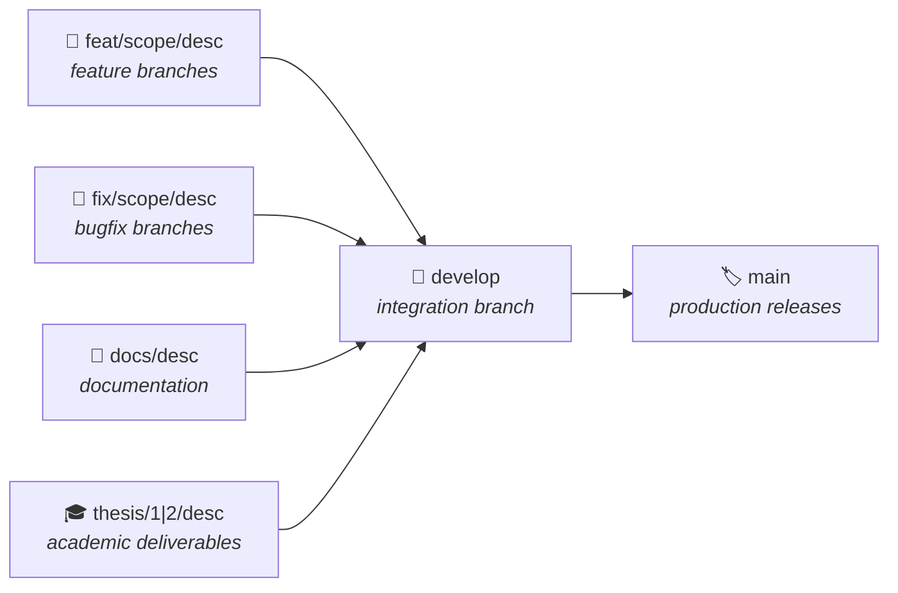
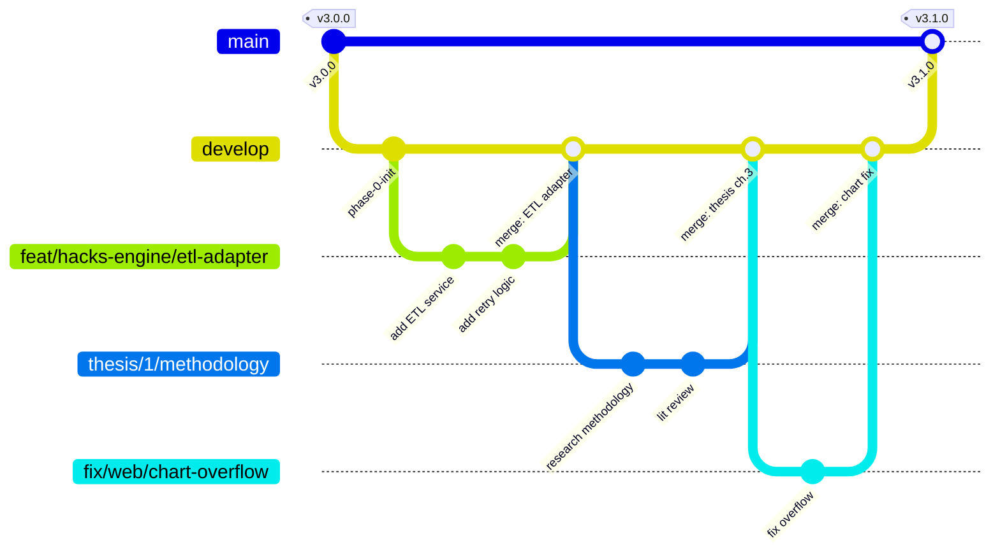

# Git Branch Strategy & Workflow

> **Project**: AltFlex AEGIS v3.0 — Adaptive Exploit & Governance Intelligence System  
> **Last Updated**: March 29, 2026  
> **Model**: Modified Git Flow with Academic Track

---

## Overview

AltFlex AEGIS uses a **modified Git Flow** branching model that supports two parallel workstreams:

1. **Rapid Development** — feature branches for platform engineering
2. **Academic Review Cycles** — thesis-aligned branches with defense milestones

This strategy ensures production stability while enabling parallel work across multiple thesis phases and engineering sprints.

---

## Branch Hierarchy



---

## Branch Types

### `main` — Production Releases

| Property        | Value                                                     |
| --------------- | --------------------------------------------------------- |
| **Purpose**     | Stable, deployable production code                        |
| **Protection**  | Requires PR + 1 approval + passing CI                     |
| **Merge From**  | `develop` only (via release PR)                           |
| **Tags**        | Semantic versioning (`v3.0.0`, `v3.1.0`)                  |
| **Deployments** | Auto-deploys to production on merge                       |

**Rules:**
- ❌ Never commit directly to `main`
- ❌ Never force push
- ✅ All CI checks must pass
- ✅ Squash merge from `develop` preferred for clean history

---

### `develop` — Integration Branch

| Property        | Value                                                     |
| --------------- | --------------------------------------------------------- |
| **Purpose**     | Integration point for all completed features              |
| **Protection**  | Requires PR + passing CI                                  |
| **Merge From**  | `feat/*`, `fix/*`, `docs/*`, `thesis/*`                   |
| **Deployments** | Auto-deploys to staging environment                       |

**Rules:**
- ❌ Never commit directly (use feature branches)
- ✅ Must always be in a buildable state
- ✅ Run full test suite before merging to `main`

---

### `feat/<scope>/<description>` — Feature Branches

| Property        | Value                                                     |
| --------------- | --------------------------------------------------------- |
| **Purpose**     | New features and enhancements                             |
| **Created From**| `develop`                                                 |
| **Merges Into** | `develop` via PR                                          |
| **Lifetime**    | Short-lived (1–5 days ideal)                              |

**Naming Convention:**
```
feat/<scope>/<kebab-case-description>
```

**Valid Scopes:** `core`, `hacks-engine`, `skills-engine`, `forensic-engine`, `web`, `api-gateway`, `infra`

**Examples:**
```
feat/hacks-engine/defillama-etl-adapter
feat/web/exploit-dashboard-filters
feat/skills-engine/safety-scanner-rules
feat/core/chain-value-object
feat/api-gateway/rate-limiter
feat/infra/kubernetes-helm-chart
```

---

### `fix/<scope>/<description>` — Bugfix Branches

| Property        | Value                                                     |
| --------------- | --------------------------------------------------------- |
| **Purpose**     | Bug fixes and patches                                     |
| **Created From**| `develop` (or `main` for hotfixes)                        |
| **Merges Into** | `develop` via PR (or `main` for critical hotfixes)        |
| **Lifetime**    | Very short-lived (hours to 1 day)                         |

**Naming Convention:**
```
fix/<scope>/<kebab-case-description>
```

**Examples:**
```
fix/hacks-engine/null-loss-amount-handling
fix/web/chart-overflow-on-mobile
fix/api-gateway/cors-preflight-headers
fix/core/zod-schema-date-parsing
```

**Hotfix Protocol:**
For critical production issues:
```
fix/hotfix/<description>  →  merges directly to main AND develop
```

---

### `docs/<description>` — Documentation Branches

| Property        | Value                                                     |
| --------------- | --------------------------------------------------------- |
| **Purpose**     | Documentation updates, guides, and diagrams               |
| **Created From**| `develop`                                                 |
| **Merges Into** | `develop` via PR                                          |
| **Lifetime**    | Short-lived                                               |

**Naming Convention:**
```
docs/<kebab-case-description>
```

**Examples:**
```
docs/api-endpoint-reference
docs/architecture-decision-records
docs/phase-1-research-methodology
docs/deployment-runbook
```

---

### `thesis/<1|2>/<description>` — Academic Deliverable Branches

| Property        | Value                                                     |
| --------------- | --------------------------------------------------------- |
| **Purpose**     | Thesis-aligned development with academic milestone gates  |
| **Created From**| `develop`                                                 |
| **Merges Into** | `develop` via PR (after advisor review)                   |
| **Lifetime**    | Medium-lived (aligned with thesis milestones)             |

**Naming Convention:**
```
thesis/<phase>/<kebab-case-description>
```

**Phase Mapping:**
| Phase | Academic Milestone                 |
| ----- | ---------------------------------- |
| `1`   | Thesis 1 — Methods of Research     |
| `2`   | Thesis 2 — Implementation & Defense|

**Examples:**
```
thesis/1/literature-review-exploit-taxonomy
thesis/1/research-methodology-chapter
thesis/2/attack-vector-classification-model
thesis/2/safety-scanner-evaluation-results
thesis/2/defense-presentation-demo
```

**Academic Workflow:**
1. Create branch from `develop`
2. Implement thesis-relevant code + documentation
3. Submit PR with academic artifact checklist
4. Advisor review gate before merge
5. Tag milestone: `thesis-1-draft`, `thesis-1-defense`, etc.

---

## Commit Convention

All commits follow **Conventional Commits** (enforced by Husky + commitlint):

```
<type>(<scope>): <subject>

[optional body]

[optional footer(s)]
```

**Types:** `feat`, `fix`, `docs`, `style`, `refactor`, `perf`, `test`, `build`, `ci`, `chore`, `revert`

**Examples:**
```
feat(hacks-engine): add DefiLlama ETL adapter with retry logic
fix(skills-engine): handle malformed YAML in safety scanner
docs(phase-0): finalize initialization guide
test(forensic-engine): add Foundry trace parser unit tests
ci(infra): add Docker layer caching to GitHub Actions
```

---

## Workflow Diagram



---

## Branch Protection Rules

### `main` Branch
- ✅ Require pull request before merging
- ✅ Require at least 1 approval
- ✅ Require status checks to pass (CI pipeline)
- ✅ Require linear history (squash merge)
- ✅ Require signed commits (recommended)
- ❌ Do not allow force pushes
- ❌ Do not allow deletions

### `develop` Branch
- ✅ Require pull request before merging
- ✅ Require status checks to pass (CI pipeline)
- ✅ Allow squash merge and regular merge
- ❌ Do not allow force pushes

### Feature/Fix Branches
- No protection rules (developer autonomy)
- Must pass CI before PR merge
- Auto-delete after merge

---

## Release Process

```
1. All features merged to develop
2. Create release PR: develop → main
3. Version bump in package.json files
4. Changelog generated from conventional commits
5. PR approved + CI passes
6. Squash merge to main
7. Tag release: git tag v3.x.0
8. GitHub Release created with changelog
9. Production deployment triggered
```

---

## Quick Reference

| Action                    | Command                                          |
| ------------------------- | ------------------------------------------------ |
| Start a feature           | `git checkout develop && git checkout -b feat/<scope>/<desc>` |
| Start a bugfix            | `git checkout develop && git checkout -b fix/<scope>/<desc>`  |
| Start thesis work         | `git checkout develop && git checkout -b thesis/<1\|2>/<desc>` |
| Start docs update         | `git checkout develop && git checkout -b docs/<desc>`          |
| Update from develop       | `git checkout <branch> && git rebase develop`                  |
| Submit for review         | `git push -u origin <branch>` → open PR on GitHub             |
| Hotfix production         | `git checkout main && git checkout -b fix/hotfix/<desc>`       |

---

_Document Version: 3.0.0_  
_Author: AltFlex AEGIS DevOps Engineering_  
_Last Updated: March 30, 2026_
