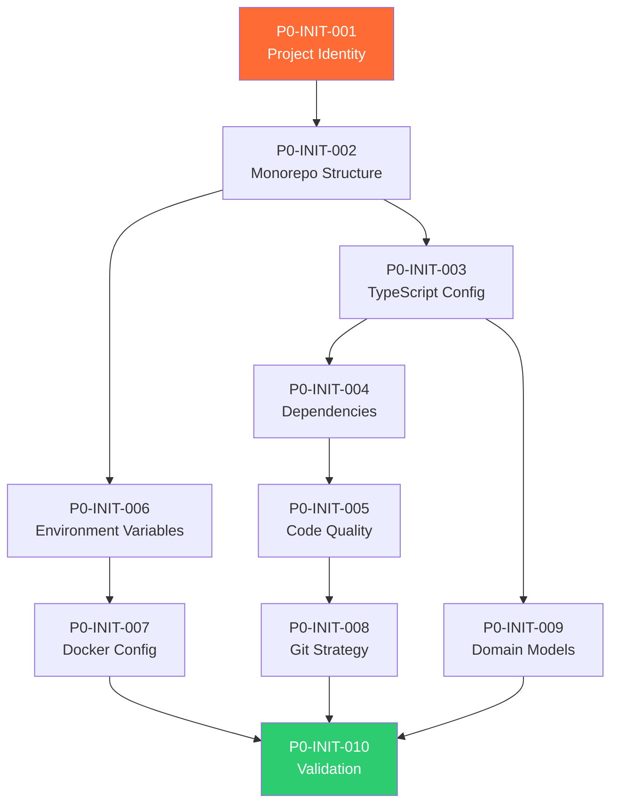

# Phase 0: Clean Slate Initialization — Code Review & Kanban Tasks

> **Project**: AltFlex AEGIS v3.0 — Adaptive Exploit & Governance Intelligence System  
> **Timeline**: Week 1–2  
> **Priority**: Critical — no other phase can begin without this  
> **Tech Stack**: Node.js 20 LTS, pnpm Workspaces, TypeScript 5.4+, Foundry, Next.js 15, PostgreSQL 16, Redis, Docker, Husky, Prettier, ESLint  
> **Academic Track**: Methods of Research → Thesis 1 → Thesis 2 (Target: 2027)

---

## Overview

Phase 0 scaffolds a production-grade, hexagonal-architecture monorepo for the **AltFlex AEGIS** platform — a **dual-engine** Web3 security intelligence system combining:

1. **Engine α — Hacks Dashboard**: A massive-scale ETL pipeline sourcing from DefiLlama Hacks API + SunWeb3Sec/DeFiHackLabs, with dynamic filtering by attack vector, chain, protocol, and loss amount.
2. **Engine β — AI Skills Explorer**: A curated repository and marketplace for AI audit skill files (Claude, Cursor, MCP, Copilot) with an automated **Safety Scanner** that detects prompt injection, file-system abuse, and exfiltration vectors.

Every task in this phase is a **hard blocker** for Phase 1 (Architecture & API Design) and Phase 2 (Data Pipelines & ETL). No code is written until this phase is **fully validated**.

---

## Architecture Philosophy

| Principle                   | Implementation                                                                                                                |
| --------------------------- | ----------------------------------------------------------------------------------------------------------------------------- |
| **Hexagonal Architecture**  | All external services (AI models, RPC nodes, scrapers, APIs) sit behind abstract port/adapter interfaces                      |
| **Interface Segregation**   | Fine-grained TypeScript interfaces — no god-objects                                                                           |
| **Chain Agnosticism**       | Data models support EVM (Ethereum, BSC, Polygon, Arbitrum, Avalanche, Optimism, Base) + Non-EVM (Solana, Cosmos, Move chains) |
| **Agent Agnosticism**       | AI skill models aren't locked to Claude/Cursor — extensible to any future agent framework                                     |
| **Stateless Microservices** | ETL Pipeline, Forensic Engine, Safety Scanner, and Frontend are independently deployable                                      |
| **15-Year Future-Proofing** | Abstract data layer, versioned APIs, feature flags, plugin architecture                                                       |

---

## Task Breakdown

---

### P0-INIT-001: Define New Project Identity & Branding

**Title**: Establish AltFlex AEGIS v3.0 Branding, Naming Convention, and Repository Meta

| Field           | Value                               |
| --------------- | ----------------------------------- |
| Priority        | P0 — Critical                       |
| Estimated Hours | 1                                   |
| Dependencies    | None                                |
| Assigned Agent  | `senior_technical_writer`           |
| QA Agent        | `senior_qa_engineer`                |
| Review Agent    | `senior_code_reviewer`              |
| Labels          | `branding`, `meta`, `documentation` |

**Description**:  
Formally define the v3.0 product identity. The project transitions from "AltFlex: AI-Powered Forensic Framework for Exploit Detection" to **"AltFlex AEGIS: Adaptive Exploit & Governance Intelligence System"** — reflecting the dual-engine architecture (Hacks Dashboard + AI Skills Explorer) and its academic + commercial dual purpose.

**Acceptance Criteria**:

- [ ] New project name finalized: **AltFlex AEGIS v3.0**
- [ ] AEGIS acronym defined: **A**daptive **E**xploit & **G**overnance **I**ntelligence **S**ystem
- [ ] New tagline established for README hero section
- [ ] GitHub repo description updated
- [ ] Color palette and design tokens documented in `docs/BRAND_GUIDE.md`

**Key Decision**:

> AEGIS (Greek: αἰγίς) — the shield of Zeus. The name signals both **protection** (exploit detection, safety scanning) and **authority** (governance over AI skill integrity).

---

### P0-INIT-002: Create Monorepo Directory Structure

**Title**: Scaffold Hexagonal pnpm Workspace Monorepo with All Service Boundaries

| Field           | Value                                  |
| --------------- | -------------------------------------- |
| Priority        | P0 — Critical                          |
| Estimated Hours | 2                                      |
| Dependencies    | P0-INIT-001                            |
| Assigned Agent  | `senior_software_engineer`             |
| QA Agent        | `senior_sdet`                          |
| Review Agent    | `senior_code_reviewer`                 |
| Labels          | `setup`, `infrastructure`, `hexagonal` |

**Description**:  
Create the root project structure using **pnpm workspaces** with strict service boundaries enforcing hexagonal architecture. Each engine (Hacks, Skills), the shared kernel, and the frontend are isolated packages.

**Acceptance Criteria**:

- [ ] Root directory initialized as a pnpm workspace monorepo
- [ ] `packages/core/` — Shared domain models, interfaces, value objects
- [ ] `packages/hacks-engine/` — Hacks Dashboard ETL + API service
- [ ] `packages/skills-engine/` — AI Skills Explorer + Safety Scanner service
- [ ] `packages/forensic-engine/` — EVM trace analysis, Foundry integration
- [ ] `apps/web/` — Next.js 15 frontend (App Router)
- [ ] `apps/api-gateway/` — Express/Fastify API gateway (BFF pattern)
- [ ] `infrastructure/` — Docker, Terraform, CI/CD configs
- [ ] `docs/` — All phase documentation, academic papers, architecture diagrams
- [ ] `research/` — Jupyter notebooks, experiment logs
- [ ] Root `pnpm-workspace.yaml` defines all packages
- [ ] Root `tsconfig.base.json` with strict TypeScript paths

**Files to Create**:

```text
pnpm-workspace.yaml
tsconfig.base.json
package.json
packages/
  core/
    src/
      domain/
        entities/
        value-objects/
        ports/          ← Abstract interfaces (Hexagonal "ports")
      shared/
        types/
        utils/
        constants/
    package.json
    tsconfig.json
  hacks-engine/
    src/
      adapters/         ← Hexagonal "adapters" (DefiLlama, DeFiHackLabs)
      application/      ← Use cases / service layer
      domain/           ← Hacks-specific domain models
      infrastructure/   ← Database repos, cache, queues
    package.json
    tsconfig.json
  skills-engine/
    src/
      adapters/         ← GitHub scrapers, skill file parsers
      application/      ← Use cases (CRUD, safety scanning)
      domain/           ← Skill-specific domain models
      infrastructure/
    package.json
    tsconfig.json
  forensic-engine/
    src/
      adapters/         ← Foundry CLI, RPC providers
      application/      ← Trace analysis, POC simulation
      domain/
      infrastructure/
    package.json
    tsconfig.json
apps/
  web/                  ← Next.js 15 App Router
    src/
      app/
      components/
      lib/
      hooks/
      styles/
    package.json
    tsconfig.json
  api-gateway/          ← BFF / unified API layer
    src/
      routes/
      middleware/
      config/
    package.json
    tsconfig.json
infrastructure/
  docker/
  terraform/
  ci/
docs/
research/
```

---

### P0-INIT-003: Initialize TypeScript Configuration & Path Aliases

**Title**: Configure Strict TypeScript with Cross-Package Path Resolution

| Field           | Value                                  |
| --------------- | -------------------------------------- |
| Priority        | P0 — Critical                          |
| Estimated Hours | 1.5                                    |
| Dependencies    | P0-INIT-002                            |
| Assigned Agent  | `senior_software_engineer`             |
| QA Agent        | `senior_sdet`                          |
| Review Agent    | `senior_code_reviewer`                 |
| Labels          | `setup`, `typescript`, `configuration` |

**Description**:  
Establish a base `tsconfig.base.json` with strict compiler options. Each package/app extends this base config with its own path aliases. This ensures type safety across the entire monorepo from day one.

**Acceptance Criteria**:

- [ ] `tsconfig.base.json` at root with `strict: true`, `noUncheckedIndexedAccess: true`, `exactOptionalPropertyTypes: true`
- [ ] Each package has `tsconfig.json` extending the base
- [ ] Path aliases configured: `@aegis/core`, `@aegis/hacks-engine`, `@aegis/skills-engine`, `@aegis/forensic-engine`
- [ ] `composite: true` and `references` set up for project references
- [ ] VS Code workspace settings for consistent TypeScript version

**Key Configuration**:

```jsonc
// tsconfig.base.json
{
  "compilerOptions": {
    "target": "ES2022",
    "module": "NodeNext",
    "moduleResolution": "NodeNext",
    "strict": true,
    "noUncheckedIndexedAccess": true,
    "exactOptionalPropertyTypes": true,
    "noImplicitReturns": true,
    "noFallthroughCasesInSwitch": true,
    "isolatedModules": true,
    "declaration": true,
    "declarationMap": true,
    "sourceMap": true,
    "skipLibCheck": true,
    "forceConsistentCasingInFileNames": true,
    "esModuleInterop": true,
    "resolveJsonModule": true,
  },
}
```

---

### P0-INIT-004: Install Core Dependencies & Dev Tooling

**Title**: Install Production and Development Dependencies Across All Workspaces

| Field           | Value                              |
| --------------- | ---------------------------------- |
| Priority        | P0 — Critical                      |
| Estimated Hours | 2                                  |
| Dependencies    | P0-INIT-003                        |
| Assigned Agent  | `senior_software_engineer`         |
| QA Agent        | `senior_devsecops_engineer`        |
| Review Agent    | `senior_code_reviewer`             |
| Labels          | `setup`, `dependencies`, `tooling` |

**Description**:  
Install all core runtime and development dependencies. This is a controlled, audited install — every dependency must be justified.

**Acceptance Criteria**:

- [ ] Root dev dependencies: `typescript`, `prettier`, `eslint`, `husky`, `lint-staged`, `vitest`, `tsx`, `turbo`
- [ ] `@aegis/core`: `zod` (schema validation), `date-fns`, `winston` (logging)
- [ ] `@aegis/hacks-engine`: `axios`, `pg` (PostgreSQL), `ioredis`, `bullmq` (job queue)
- [ ] `@aegis/skills-engine`: `gray-matter` (YAML/Markdown parser), `acorn` (JS AST parser), `semver`
- [ ] `@aegis/forensic-engine`: `viem` (EVM interaction), `ethers` (v6)
- [ ] `apps/web`: `next@15`, `react@19`, `react-dom@19`, `recharts`, `framer-motion`, `lucide-react`
- [ ] `apps/api-gateway`: `fastify`, `@fastify/cors`, `@fastify/rate-limit`, `@fastify/swagger`
- [ ] All `node_modules/` in `.gitignore`
- [ ] `pnpm-lock.yaml` committed and reproducible

**Dependency Philosophy**:

| Category   | Principle                                                           |
| ---------- | ------------------------------------------------------------------- |
| Runtime    | Zero unnecessary dependencies — every dep serves a measured purpose |
| Types      | `@types/*` pinned alongside their package                           |
| Security   | `pnpm audit` passes with 0 critical/high vulnerabilities            |
| Versioning | Caret ranges (`^`) for dev deps, tilde ranges (`~`) for runtime     |

---

### P0-INIT-005: Configure Code Quality Pipeline

**Title**: Set Up ESLint, Prettier, Husky, and lint-staged for Commit-Level Quality Gates

| Field           | Value                      |
| --------------- | -------------------------- |
| Priority        | P0 — Critical              |
| Estimated Hours | 1.5                        |
| Dependencies    | P0-INIT-004                |
| Assigned Agent  | `senior_devops_engineer`   |
| QA Agent        | `senior_sdet`              |
| Review Agent    | `senior_code_reviewer`     |
| Labels          | `quality`, `linting`, `ci` |

**Description**:  
Enforce code quality at the commit level. No malformed code can enter `main`. This is critical for academic rigor — thesis reviewers will examine code quality.

**Acceptance Criteria**:

- [ ] ESLint config with `@typescript-eslint/recommended-type-checked`
- [ ] Prettier config (2-space indent, single quotes, trailing commas, 100 print width)
- [ ] Husky `pre-commit` hook runs `lint-staged`
- [ ] `lint-staged` config: ESLint + Prettier on `*.{ts,tsx,js,jsx}`
- [ ] Husky `commit-msg` hook validates Conventional Commits format
- [ ] Root `npm run lint` and `npm run format` scripts work across all workspaces

**Conventional Commits Pattern**:

```text
feat(hacks-engine): add DefiLlama ETL adapter
fix(skills-engine): handle malformed YAML in safety scanner
docs(phase-0): finalize initialization guide
test(forensic-engine): add Foundry trace parser unit tests
```

---

### P0-INIT-006: Configure Environment Variables & Secrets Management

**Title**: Create Comprehensive `.env.example` with All Service Credentials

| Field           | Value                                         |
| --------------- | --------------------------------------------- |
| Priority        | P0 — Critical                                 |
| Estimated Hours | 1                                             |
| Dependencies    | P0-INIT-002                                   |
| Assigned Agent  | `senior_devsecops_engineer`                   |
| QA Agent        | `senior_security_test_engineer`               |
| Review Agent    | `senior_security_reviewer`                    |
| Labels          | `security`, `configuration`, `infrastructure` |

**Description**:  
Create a comprehensive environment template that covers all services across the dual-engine platform. Secrets never touch version control.

**Acceptance Criteria**:

- [ ] `.env.example` at root with all variables documented
- [ ] `.env` added to `.gitignore` (root and all packages)
- [ ] Environment validation using Zod schemas on startup
- [ ] Separate env sections: Database, Redis, API Keys, Auth, Feature Flags

**Environment Template**:

```bash
# ═══════════════════════════════════════════════
# AltFlex AEGIS v3.0 — Environment Configuration
# Copy to .env and fill in real values
# ═══════════════════════════════════════════════

# ── Application ──────────────────────────────
NODE_ENV=development
APP_VERSION=3.0.0
LOG_LEVEL=debug

# ── Database (PostgreSQL) ────────────────────
POSTGRES_HOST=localhost
POSTGRES_PORT=5432
POSTGRES_DB=aegis_dev
POSTGRES_USER=aegis
POSTGRES_PASSWORD=changeme

# ── Cache (Redis) ────────────────────────────
REDIS_HOST=localhost
REDIS_PORT=6379
REDIS_PASSWORD=

# ── Hacks Engine ─────────────────────────────
DEFILLAMA_API_URL=https://api.llama.fi
DEFI_HACK_LABS_REPO=SunWeb3Sec/DeFiHackLabs
ETHERSCAN_API_KEY=
POLYGONSCAN_API_KEY=
BSCSCAN_API_KEY=
ARBISCAN_API_KEY=

# ── Skills Engine ────────────────────────────
GITHUB_TOKEN=                         # For scraping AI skill repos
SKILLS_SAFETY_SCAN_ENABLED=true
SKILLS_AUTO_INDEX_INTERVAL_MS=3600000 # 1 hour

# ── Forensic Engine ──────────────────────────
FOUNDRY_BIN_PATH=/usr/local/bin/forge
RPC_URL_MAINNET=https://eth-mainnet.g.alchemy.com/v2/YOUR_KEY
RPC_URL_BSC=https://bsc-dataseed1.binance.org
RPC_URL_POLYGON=https://polygon-rpc.com

# ── API Gateway ──────────────────────────────
API_PORT=4000
API_RATE_LIMIT_MAX=100
API_RATE_LIMIT_WINDOW_MS=60000
JWT_SECRET=changeme
API_KEYS=key1,key2

# ── Frontend ─────────────────────────────────
NEXT_PUBLIC_API_URL=http://localhost:4000
NEXT_PUBLIC_APP_NAME=AltFlex AEGIS
```

---

### P0-INIT-007: Configure Docker & Docker Compose for All Services

**Title**: Create Production and Development Docker Configurations

| Field           | Value                                |
| --------------- | ------------------------------------ |
| Priority        | P0 — High                            |
| Estimated Hours | 2                                    |
| Dependencies    | P0-INIT-006                          |
| Assigned Agent  | `senior_devops_engineer`             |
| QA Agent        | `senior_devsecops_engineer`          |
| Review Agent    | `senior_code_reviewer`               |
| Labels          | `infrastructure`, `docker`, `devops` |

**Description**:  
Containerize every service. Development and production configs are separate. One `docker compose up` boots the entire platform.

**Acceptance Criteria**:

- [ ] `infrastructure/docker/Dockerfile.api-gateway` — Multi-stage build
- [ ] `infrastructure/docker/Dockerfile.web` — Next.js optimized production build
- [ ] `infrastructure/docker/Dockerfile.hacks-worker` — ETL pipeline worker
- [ ] `infrastructure/docker/Dockerfile.skills-worker` — Skills indexer + scanner
- [ ] `docker-compose.dev.yml` — Development with hot-reload, mounted volumes
- [ ] `docker-compose.prod.yml` — Production with health checks, restart policies
- [ ] Services: `postgres`, `redis`, `api-gateway`, `web`, `hacks-worker`, `skills-worker`
- [ ] `make dev` and `make prod` convenience targets in root `Makefile`

**Service Architecture**:

```yaml
# docker-compose.dev.yml services
services:
  postgres: # PostgreSQL 16 — primary datastore
  redis: # Redis 7 — cache + job queue backend
  api-gateway: # Fastify BFF — unified API surface
  web: # Next.js 15 — frontend dashboard
  hacks-worker: # BullMQ worker — DefiLlama/DeFiHackLabs ETL
  skills-worker: # BullMQ worker — GitHub scraper + safety scanner
```

---

### P0-INIT-008: Configure Git & Branch Strategy

**Title**: Initialize Git Configuration, Branch Protection, and CI Hooks

| Field           | Value                            |
| --------------- | -------------------------------- |
| Priority        | P0 — High                        |
| Estimated Hours | 1                                |
| Dependencies    | P0-INIT-005                      |
| Assigned Agent  | `senior_git_operations_engineer` |
| QA Agent        | `senior_qa_engineer`             |
| Review Agent    | `senior_code_reviewer`           |
| Labels          | `git`, `ci`, `workflow`          |

**Description**:  
Define the branching strategy and Git workflow that supports both academic review cycles and rapid development.

**Acceptance Criteria**:

- [ ] `.gitignore` updated for pnpm, TypeScript, Next.js, Foundry, Python notebooks
- [ ] `.gitattributes` for LFS (datasets, model weights)
- [ ] Branch naming convention documented:
  - `main` — production releases
  - `develop` — integration branch
  - `feat/<scope>/<description>` — feature branches
  - `fix/<scope>/<description>` — bugfix branches
  - `docs/<description>` — documentation branches
  - `thesis/<1|2>/<description>` — academic deliverable branches
- [ ] PR template (`.github/PULL_REQUEST_TEMPLATE.md`)
- [ ] Issue templates for Bug, Feature, Research Task

---

### P0-INIT-009: Define Domain Models (Schema Blueprint)

**Title**: Design Core Domain Entities for Both Engines as TypeScript Interfaces

| Field           | Value                                  |
| --------------- | -------------------------------------- |
| Priority        | P0 — Critical                          |
| Estimated Hours | 3                                      |
| Dependencies    | P0-INIT-003                            |
| Assigned Agent  | `senior_blockchain_architect`          |
| QA Agent        | `senior_qa_engineer`                   |
| Review Agent    | `senior_code_reviewer`                 |
| Labels          | `domain`, `architecture`, `data-model` |

**Description**:  
Define the core domain entities that both engines share. These are pure TypeScript interfaces — no database coupling. This is the nucleus of the hexagonal architecture.

**Acceptance Criteria**:

- [ ] `HackIncident` entity — protocol, chain, date, loss, attack vector, tx hashes, sources
- [ ] `AttackVector` value object — enumerated vulnerability taxonomy (11 categories from SCH)
- [ ] `Chain` value object — supports EVM + non-EVM chains, chain ID, name, explorer URL
- [ ] `AISkillFile` entity — name, source repo, platform, language, content, safety label
- [ ] `SafetyLabel` value object — `Safe | Unanalyzed | Suspicious | Malicious`
- [ ] `SafetyScanResult` entity — scan timestamp, findings, rule matches, final label
- [ ] `ExploitPOC` entity — Foundry test file reference, target contract, vulnerability class
- [ ] All entities use Zod schemas for runtime validation
- [ ] All entities are framework-agnostic (no ORM decorators)

**Attack Vector Taxonomy** (from reference dashboard):

```typescript
enum AttackVector {
  ACCESS_CONTROL = 'access-control',
  ARITHMETIC_OVERFLOW = 'arithmetic-overflow',
  DELEGATECALL_INJECTION = 'delegatecall-injection',
  FLASH_LOAN = 'flash-loan',
  ORACLE_MANIPULATION = 'oracle-manipulation',
  REENTRANCY = 'reentrancy',
  DAO_GOVERNANCE = 'dao-governance',
  FRONTRUNNING = 'frontrunning',
  PHISHING = 'phishing',
  DOS = 'dos',
  REPLAY = 'replay',
  SELF_DESTRUCT = 'self-destruct',
  RUG_PULL = 'rug-pull',
  OTHER = 'other',
}
```

---

### P0-INIT-010: Validation & Smoke Test

**Title**: Full Environment Validation — Every Service Boots, Every Lint Passes

| Field           | Value                                 |
| --------------- | ------------------------------------- |
| Priority        | P0 — Critical                         |
| Estimated Hours | 2                                     |
| Dependencies    | P0-INIT-007, P0-INIT-008, P0-INIT-009 |
| Assigned Agent  | `senior_qa_engineer`                  |
| QA Agent        | `senior_sdet`                         |
| Review Agent    | `senior_code_reviewer`                |
| Labels          | `validation`, `testing`, `qa`         |

**Description**:  
The final quality gate. If this task fails, Phase 0 is incomplete.

**Acceptance Criteria**:

- [ ] `pnpm install` — zero errors, zero warnings
- [ ] `pnpm run build` — all packages compile successfully
- [ ] `pnpm run lint` — zero errors
- [ ] `pnpm run format:check` — zero formatting issues
- [ ] `pnpm run test` — basic smoke tests pass (empty test suites OK)
- [ ] `docker compose -f docker-compose.dev.yml up` — all services healthy
- [ ] PostgreSQL accepts connections
- [ ] Redis accepts connections
- [ ] API Gateway responds to `/health`
- [ ] Next.js frontend loads on `localhost:3000`
- [ ] Husky pre-commit hook triggers on `git commit`
- [ ] TypeScript compiler reports 0 errors across all packages
- [ ] New team member can clone, `pnpm install`, and boot in < 5 minutes

---

## Dependency Graph



---

## Phase Gate Criteria

| Criterion          | Requirement                                   | Status |
| ------------------ | --------------------------------------------- | ------ |
| Monorepo boots     | `pnpm install && pnpm build` = 0 errors       | ⬜     |
| All services up    | Docker Compose = all healthy                  | ⬜     |
| Lint passes        | `pnpm lint` = 0 errors                        | ⬜     |
| Types compile      | `tsc --noEmit` = 0 errors                     | ⬜     |
| Domain models      | All core entities defined with Zod schemas    | ⬜     |
| Environment        | `.env.example` covers all services            | ⬜     |
| Docs complete      | Phase 0 dev guide + code review + README stub | ⬜     |
| Academic alignment | Architecture supports Thesis 1 & 2 scope      | ⬜     |

> **⛔ Phase 1 CANNOT begin until all Phase Gate Criteria are ✅.**

---

## Legacy Migration Notes

The existing ALT-Flex v1/v2 codebase (`src/`, `frontend/`, `tests/`) will be **archived** but not deleted. Key learnings to carry forward:

| v1/v2 Component                         | v3.0 Destination                         | Notes                                       |
| --------------------------------------- | ---------------------------------------- | ------------------------------------------- |
| `src/collectors/etherscan_collector.py` | `packages/hacks-engine/src/adapters/`    | Rewrite in TypeScript behind port interface |
| `src/models/anomaly_detector.py`        | `packages/forensic-engine/src/adapters/` | XGBoost model → TypeScript service wrapper  |
| `src/models/behavioral_analyzer.py`     | `packages/hacks-engine/src/application/` | Velocity/funding analysis → use case layer  |
| `src/app/main.py` (FastAPI)             | `apps/api-gateway/src/`                  | Migrate to Fastify with TypeScript          |
| `frontend/` (Next.js 14)                | `apps/web/`                              | Full rewrite → Next.js 15 + React 19        |
| `tests/` (159 tests)                    | Distributed per package                  | Each package owns its test suite            |
| `data/` (sample exploits)               | `packages/hacks-engine/seed/`            | 5 exploits → seed data for development      |

---

_Document Version: 3.0.0_  
_Author: AltFlex AEGIS Engineering_  
_Last Updated: March 11, 2026_
