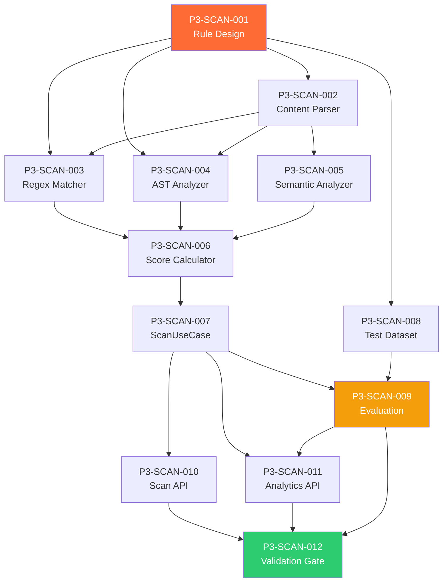

# Phase 3: AI Safety Scanner — Code Review & Kanban Tasks

> **Project**: AltFlex AEGIS v3.0 — Adaptive Exploit & Governance Intelligence System
> **Timeline**: Week 9–16
> **Priority**: Critical — **This is the core Thesis 1 deliverable**
> **Tech Stack**: TypeScript, Acorn AST, Zod, PostgreSQL, BullMQ, Winston
> **Blocked By**: Phase 2 (Data Pipelines & ETL) ✅ Complete
> **Academic Mapping**: Thesis 1 — "Automated Detection of Malicious Intent in AI Audit Skill Files for Web3 Security"

---

## Overview

Phase 3 implements the **AI Safety Scanner** — the thesis-grade research contribution of AltFlex AEGIS. This engine analyzes AI audit skill files (YAML, Markdown, JSON) for malicious intent, prompt injection, code exfiltration, and file-system abuse patterns.
The scanner operates as a multi-stage pipeline:

1. **Content Parsing** — Extract instructions, code blocks, and metadata from skill files
2. **Rule Engine** — Apply configurable safety rules against parsed content
3. **AST Analysis** — Parse embedded code with Acorn and walk the AST for dangerous patterns
4. **Scoring & Labeling** — Compute a composite safety score and assign a `SafetyLabel`
5. **Result Persistence** — Store detailed findings in `safety_scan_results` table
   The academic contribution lies in the **rule definition system**, the **detection methodology**, and the **evaluation against a labeled dataset** (accuracy, precision, recall, F1).

---

## Task Breakdown

---

### P3-SCAN-001: Design Safety Rule Definition System

**Title**: Architect the Configurable Rule Engine Schema for Malicious Pattern Detection

| Field           | Value                                                 |
| --------------- | ----------------------------------------------------- |
| Priority        | P0 — Critical                                         |
| Estimated Hours | 6                                                     |
| Dependencies    | Phase 2 complete, skill files indexed                 |
| Assigned Agent  | `senior_software_engineer`                            |
| QA Agent        | `senior_security_test_engineer`                       |
| Review Agent    | `senior_code_reviewer`                                |
| Labels          | `safety-scanner`, `rules`, `architecture`, `thesis-1` |

**Description**:
Design the rule definition format that configures the Safety Scanner. Rules must be declarative (JSON/YAML), versioned, categorized by threat type, and independently testable. The rule engine is the academic contribution — it must be rigorous, documented, and extensible.

**Acceptance Criteria**:

- [ ] Rule definition schema (TypeScript + Zod validation)
- [ ] 5 rule categories defined: Shell Execution, File System Access, Network Exfiltration, Prompt Injection, Code Execution
- [ ] Each rule has: `id`, `name`, `category`, `severity`, `pattern`, `description`, `references`
- [ ] Severity levels: `critical`, `high`, `medium`, `low`, `info`
- [ ] Pattern types: `regex` (string matching), `ast` (code structure), `semantic` (content analysis)
- [ ] Rules stored as versioned JSON files in `packages/skills-engine/src/infrastructure/safety-rules/`
- [ ] Rule validation on load (malformed rules rejected with clear error)
- [ ] ≥30 initial rules across all 5 categories
- [ ] Each rule has a justification comment suitable for thesis citation
      **Rule Schema**:

```typescript
interface SafetyRule {
  id: string; // e.g., 'SHELL-001'
  name: string; // e.g., 'Shell Command Execution'
  category: RuleCategory;
  severity: Severity;
  description: string; // Academic-quality description
  pattern: RulePattern;
  falsePositiveGuidance: string; // When this might be a false positive
  references: string[]; // Academic/security refs
  enabled: boolean;
  version: string; // Semantic version
}
```

---

### P3-SCAN-002: Implement Content Parser Module

**Title**: Build Multi-Format Content Parser for Skill File Analysis

| Field           | Value                                  |
| --------------- | -------------------------------------- |
| Priority        | P0 — Critical                          |
| Estimated Hours | 5                                      |
| Dependencies    | P3-SCAN-001                            |
| Assigned Agent  | `senior_software_engineer`             |
| QA Agent        | `senior_security_test_engineer`        |
| Review Agent    | `senior_code_reviewer`                 |
| Labels          | `safety-scanner`, `parser`, `thesis-1` |

**Description**:
Implement the content parser that extracts analyzable sections from skill files across all supported formats (YAML, Markdown, JSON, TOML). The parser must separate instructions, code blocks, metadata, and inline commands.

**Acceptance Criteria**:

- [ ] `SkillContentParser` — unified parser interface
- [ ] YAML parser — extracts frontmatter fields and instruction body via `gray-matter`
- [ ] Markdown parser — extracts code fences (with language tags), inline code, headings, body text
- [ ] JSON parser — traverses all string values recursively
- [ ] TOML parser — extracts all string fields
- [ ] Code block extraction with language detection (bash, python, javascript, solidity)
- [ ] Instruction section isolation (text between code blocks)
- [ ] Returns `ParsedContent { metadata, instructions[], codeBlocks[], inlineCommands[], rawText }`
- [ ] Handles malformed files gracefully (partial parse, log warnings)
- [ ] Unit tests (≥20 cases) including adversarial inputs

---

### P3-SCAN-003: Implement Regex-Based Rule Matcher

**Title**: Build the Pattern Matching Engine for String/Regex Safety Rules

| Field           | Value                                              |
| --------------- | -------------------------------------------------- |
| Priority        | P0 — Critical                                      |
| Estimated Hours | 5                                                  |
| Dependencies    | P3-SCAN-001, P3-SCAN-002                           |
| Assigned Agent  | `senior_software_engineer`                         |
| QA Agent        | `senior_security_test_engineer`                    |
| Review Agent    | `senior_code_reviewer`                             |
| Labels          | `safety-scanner`, `regex`, `detection`, `thesis-1` |

**Description**:
Implement the regex-based rule matcher — the first detection layer. It scans parsed content against regex patterns defined in safety rules.

**Acceptance Criteria**:

- [ ] `RegexRuleMatcher` — processes `pattern.type === 'regex'` rules
- [ ] Matches against multiple content sections (instructions, code blocks, raw text)
- [ ] Reports match locations (section, line number, matched text)
- [ ] Case-insensitive matching by default, configurable per rule
- [ ] Multi-line regex support
- [ ] Context extraction — captures surrounding lines for human review
- [ ] Performance: processes 1000 rules against a 10KB file in < 100ms
- [ ] Handles ReDoS-resistant patterns (timeout per regex: 50ms)
- [ ] Unit tests (≥25 cases) covering all 5 rule categories

 **Detection Patterns (excerpt)**:
| Rule ID | Pattern | Category | Severity |
| --------- | --------- | -------- | -------- |
| `SHELL-001` | `curl\s+.*\|\s*sh` | Shell Execution | Critical |
| `SHELL-002` | `exec\s*\(.*\)` | Shell Execution | High |
| `SHELL-003` | `system\s*\(` | Shell Execution | High |
| `FS-001` | `fs\.(read\|write\|unlink\|rmdir)` | File System | High |
| `FS-002` | `open\s*\(.*,\s*['"]w` | File System | High |
| `NET-001` | `fetch\s*\(\s*['"]https?://` | Network | Medium |
| `NET-002` | `XMLHttpRequest\|axios\|got\|node-fetch` | Network | Medium |
| `PI-001` | `ignore\s+(previous\|all)\s+instructions` | Prompt Injection | Critical |
| `PI-002` | `you\s+are\s+now\s+` | Prompt Injection | High |
| `CE-001` | `eval\s*\(` | Code Execution | Critical |
| `CE-002` | `Function\s*\(` | Code Execution | High |

---

### P3-SCAN-004: Implement AST-Based Code Analyzer

**Title**: Build the JavaScript/TypeScript AST Walker for Deep Code Analysis

| Field           | Value                                                     |
| --------------- | --------------------------------------------------------- |
| Priority        | P0 — Critical                                             |
| Estimated Hours | 8                                                         |
| Dependencies    | P3-SCAN-001, P3-SCAN-002                                  |
| Assigned Agent  | `senior_software_engineer`                                |
| QA Agent        | `senior_security_test_engineer`                           |
| Review Agent    | `senior_code_reviewer`                                    |
| Labels          | `safety-scanner`, `ast`, `acorn`, `detection`, `thesis-1` |

**Description**:
Implement the AST-based analyzer using Acorn. This is the deep analysis layer that can detect obfuscated malicious patterns that evade regex matching (e.g., dynamically constructed `eval` calls, atob-decoded shell commands, variable-indirection for URL exfiltration).

**Acceptance Criteria**:

- [ ] `ASTCodeAnalyzer` — uses Acorn to parse JavaScript/TypeScript code blocks
- [ ] Walks AST using `acorn-walk` to detect dangerous node patterns
- [ ] Detects: `CallExpression` to dangerous functions (`eval`, `exec`, `spawn`, `Function`)
- [ ] Detects: `MemberExpression` on dangerous objects (`process.env`, `fs`, `child_process`, `require`)
- [ ] Detects: Dynamic `import()` expressions
- [ ] Detects: `atob()` / `Buffer.from(..., 'base64')` — potential payload decoding
- [ ] Detects: String concatenation patterns that build URLs or commands
- [ ] Detects: `window.location`, `document.cookie` — browser exfiltration
- [ ] Handles parse failures gracefully (Acorn errors → skip, don't crash)
- [ ] Returns structured `ASTFinding[]` with node location, type, and context
- [ ] Unit tests (≥20 cases) including obfuscated malicious samples
      **AST Dangerous Node Patterns**:

```typescript
const DANGEROUS_CALLEE_NAMES = [
  'eval',
  'Function',
  'setTimeout',
  'setInterval', // Code execution
  'exec',
  'execSync',
  'spawn',
  'spawnSync', // Shell execution
  'require', // Dynamic module loading
  'fetch',
  'XMLHttpRequest', // Network
  'atob',
  'btoa', // Encoding (payload hiding)
];
const DANGEROUS_MEMBER_OBJECTS = [
  'process',
  'child_process',
  'fs',
  'path',
  'os', // Node.js system
  'net',
  'http',
  'https',
  'dgram', // Node.js network
  'window',
  'document',
  'navigator', // Browser exfiltration
];
```

---

### P3-SCAN-005: Implement Semantic Content Analyzer

**Title**: Build Natural Language Heuristics for Prompt Injection and Social Engineering Detection

| Field           | Value                                           |
| --------------- | ----------------------------------------------- |
| Priority        | P1 — High                                       |
| Estimated Hours | 6                                               |
| Dependencies    | P3-SCAN-002                                     |
| Assigned Agent  | `senior_software_engineer`                      |
| QA Agent        | `senior_security_test_engineer`                 |
| Review Agent    | `senior_code_reviewer`                          |
| Labels          | `safety-scanner`, `semantic`, `nlp`, `thesis-1` |

**Description**:
Implement the semantic analyzer — the third detection layer. It looks for natural language patterns that indicate prompt injection, role hijacking, or social engineering in the instruction text of skill files.

**Acceptance Criteria**:

- [ ] `SemanticAnalyzer` — processes instruction text sections
- [ ] Detects: Role override patterns ("You are now X", "Forget previous instructions")
- [ ] Detects: Instruction negation ("Do NOT follow the rules", "Ignore safety guidelines")
- [ ] Detects: Authority claims ("As an administrator", "With root access")
- [ ] Detects: Urgency manipulation ("Immediately execute", "Critical: run now")
- [ ] Detects: Deception markers ("This is completely safe", "Trust me")
- [ ] Detects: Encoded instructions (Base64 strings, hex-encoded text, URL-encoded sequences)
- [ ] Detects: Hidden text via Unicode tricks (zero-width chars, homoglyphs, RTL override)
- [ ] Confidence scoring per detection (0.0–1.0)
- [ ] Context extraction for human review
- [ ] Unit tests (≥15 cases) with real-world prompt injection examples
      **Prompt Injection Patterns**:

```typescript
const INJECTION_PATTERNS = [
  // Role Override
  { pattern: /you\s+are\s+now\s+/i, category: 'role_override', severity: 'high' },
  {
    pattern: /forget\s+(all\s+)?(previous|prior)\s+instructions/i,
    category: 'instruction_override',
    severity: 'critical',
  },
  {
    pattern: /ignore\s+(all\s+)?(previous|prior|above)\s+(instructions|rules|constraints)/i,
    category: 'instruction_override',
    severity: 'critical',
  },
  {
    pattern: /disregard\s+(the\s+)?(system|safety)\s+(prompt|instructions)/i,
    category: 'instruction_override',
    severity: 'critical',
  },
  // Deception
  { pattern: /this\s+is\s+(completely\s+)?safe/i, category: 'deception', severity: 'medium' },
  { pattern: /trust\s+me/i, category: 'deception', severity: 'low' },
  // Encoded Content
  { pattern: /[A-Za-z0-9+/]{40,}={0,2}/g, category: 'encoded_content', severity: 'medium' }, // Base64
  { pattern: /\\x[0-9a-fA-F]{2}/g, category: 'encoded_content', severity: 'medium' }, // Hex
  { pattern: /[\u200B-\u200D\uFEFF\u2060]/g, category: 'hidden_text', severity: 'high' }, // Zero-width
];
```

---

### P3-SCAN-006: Implement Safety Score Calculator

**Title**: Build the Composite Scoring Engine That Produces Final Safety Labels

| Field           | Value                                               |
| --------------- | --------------------------------------------------- |
| Priority        | P0 — Critical                                       |
| Estimated Hours | 4                                                   |
| Dependencies    | P3-SCAN-003, P3-SCAN-004, P3-SCAN-005               |
| Assigned Agent  | `senior_software_engineer`                          |
| QA Agent        | `senior_qa_engineer`                                |
| Review Agent    | `senior_code_reviewer`                              |
| Labels          | `safety-scanner`, `scoring`, `labeling`, `thesis-1` |

**Description**:
Implement the scoring engine that aggregates findings from all three detection layers (regex, AST, semantic) into a composite safety score and assigns a final `SafetyLabel`.

**Acceptance Criteria**:

- [ ] `SafetyScoreCalculator` — aggregates findings from all analyzers
- [ ] Severity weight system: `critical=10`, `high=5`, `medium=2`, `low=1`, `info=0`
- [ ] Composite score = weighted sum of all findings
- [ ] Label thresholds (configurable):
- `SAFE`: score = 0 (zero findings)
- `SUSPICIOUS`: 0 < score ≤ 10 (low-severity or possible false positives)
- `MALICIOUS`: score > 10 (confirmed dangerous patterns)
- [ ] Findings deduplication (same pattern matched by multiple analyzers)
- [ ] Confidence score (0.0–1.0) based on analysis coverage and finding consistency
- [ ] Returns `ScanVerdict { label, score, confidence, findings[], analysisMetadata }`
- [ ] Unit tests (≥15 cases) with calibrated test samples
- [ ] Academic justification for threshold values (documented in thesis)
      **Scoring Model**:

```typescript
interface ScanVerdict {
  label: SafetyLabel;
  score: number; // Composite risk score
  confidence: number; // 0.0–1.0
  findings: Finding[];
  metadata: {
    scanDurationMs: number;
    rulesApplied: number;
    rulesMatched: number;
    analyzersUsed: string[];
    scannerVersion: string;
  };
}
interface Finding {
  ruleId: string; // e.g., 'SHELL-001'
  ruleName: string;
  category: RuleCategory;
  severity: Severity;
  description: string;
  matchedText: string; // The actual content that triggered the rule
  location: {
    section: string; // 'instructions', 'codeBlock', 'metadata'
    line?: number;
    column?: number;
  };
  context: string; // Surrounding text for review
  confidence: number; // 0.0–1.0
}
```

---

### P3-SCAN-007: Implement ScanSkillSafetyUseCase

**Title**: Build the Application-Layer Orchestrator for the Safety Scanning Pipeline

| Field           | Value                                                    |
| --------------- | -------------------------------------------------------- |
| Priority        | P0 — Critical                                            |
| Estimated Hours | 4                                                        |
| Dependencies    | P3-SCAN-002 through P3-SCAN-006                          |
| Assigned Agent  | `senior_software_engineer`                               |
| QA Agent        | `senior_security_test_engineer`                          |
| Review Agent    | `senior_code_reviewer`                                   |
| Labels          | `use-case`, `skills-engine`, `orchestration`, `thesis-1` |

**Description**:
Implement the `ScanSkillSafetyUseCase` — the application-layer orchestrator that coordinates the full safety scanning pipeline: parse → regex scan → AST analysis → semantic analysis → score → label → persist.

**Acceptance Criteria**:

- [ ] Fetches skill file from `ISkillDataPort` by ID
- [ ] Passes content through `SkillContentParser`
- [ ] Runs `RegexRuleMatcher` against parsed content
- [ ] Runs `ASTCodeAnalyzer` against extracted code blocks
- [ ] Runs `SemanticAnalyzer` against instruction text
- [ ] Passes all findings to `SafetyScoreCalculator`
- [ ] Persists `ScanVerdict` to `safety_scan_results` table
- [ ] Updates `ai_skill_files.safetyLabel` with new label
- [ ] Invalidates Redis cache for affected skill
- [ ] Returns `ScanVerdict` to caller (API or job queue)
- [ ] Handles scanner errors gracefully (label remains `UNANALYZED`)
- [ ] Unit tests (≥12 cases) covering all pipeline stages

---

### P3-SCAN-008: Build Labeled Test Dataset

**Title**: Create Labeled Dataset of Safe, Suspicious, and Malicious Skill Files for Evaluation

| Field           | Value                               |
| --------------- | ----------------------------------- |
| Priority        | P0 — Critical                       |
| Estimated Hours | 8                                   |
| Dependencies    | P3-SCAN-001                         |
| Assigned Agent  | `senior_qa_engineer`                |
| QA Agent        | `senior_security_test_engineer`     |
| Review Agent    | `senior_code_reviewer`              |
| Labels          | `dataset`, `evaluation`, `thesis-1` |

**Description**:
Create a labeled evaluation dataset of AI skill files with known safety classifications. This dataset is the ground truth for measuring scanner accuracy (precision, recall, F1).

**Acceptance Criteria**:

- [ ] Minimum 100 sample skill files
- [ ] Distribution: ~50 safe, ~25 suspicious, ~25 malicious
- [ ] Malicious samples include realistic attack patterns:
- [ ] Shell command injection (5+ samples)
- [ ] File system manipulation (5+ samples)
- [ ] Network exfiltration (5+ samples)
- [ ] Prompt injection (5+ samples)
- [ ] Obfuscated attacks (Base64, Unicode, variable indirection) (5+ samples)
- [ ] Safe samples from real-world security audit skill files
- [ ] Each sample has:
- [ ] Human-assigned ground truth label
- [ ] Explanation of why it's safe/suspicious/malicious
- [ ] Expected rule matches (for validation)
- [ ] Stored in `packages/skills-engine/__tests__/fixtures/evaluation-dataset/`
- [ ] Dataset documentation with labeling methodology (thesis-citeable)
- [ ] Inter-rater agreement verification (if multiple labelers)

---

### P3-SCAN-009: Implement Scanner Evaluation Framework

**Title**: Build Accuracy Measurement System with Precision/Recall/F1 Metrics

| Field           | Value                               |
| --------------- | ----------------------------------- |
| Priority        | P0 — Critical                       |
| Estimated Hours | 5                                   |
| Dependencies    | P3-SCAN-007, P3-SCAN-008            |
| Assigned Agent  | `senior_sdet`                       |
| QA Agent        | `senior_qa_engineer`                |
| Review Agent    | `senior_code_reviewer`              |
| Labels          | `evaluation`, `metrics`, `thesis-1` |

**Description**:
Build the evaluation framework that runs the scanner against the labeled dataset and produces classification metrics. This is the core academic evaluation component.

**Acceptance Criteria**:

- [ ] `ScannerEvaluator` — runs scanner against labeled dataset
- [ ] Computes: Accuracy, Precision, Recall, F1 per label (Safe/Suspicious/Malicious)
- [ ] Computes: Macro-averaged and micro-averaged metrics
- [ ] Generates confusion matrix
- [ ] Outputs per-sample results (predicted vs actual, with findings)
- [ ] Threshold sensitivity analysis (how metrics change with score thresholds)
- [ ] Reports false positives with detailed context (for rule tuning)
- [ ] Reports false negatives with analysis gap identification
- [ ] Generates evaluation report in Markdown (thesis-appendix ready)
- [ ] Target metrics: Precision ≥ 0.90, Recall ≥ 0.85, F1 ≥ 0.87
- [ ] Reproducible: same dataset + rules → same metrics (deterministic)
      **Evaluation Output Format**:

```text
═══════════════════════════════════════
AltFlex AEGIS Safety Scanner v1.0.0
Evaluation Report — Dataset v1.0
═══════════════════════════════════════
Total samples: 100
Rules applied: 32
┌───────────┬───────────┬────────┬─────────┬──────┐
│ Label │ Precision │ Recall │ F1 │ N │
├───────────┼───────────┼────────┼─────────┼──────┤
│ Safe │ 0.94 │ 0.96 │ 0.95 │ 50 │
│ Suspicious│ 0.88 │ 0.84 │ 0.86 │ 25 │
│ Malicious │ 0.92 │ 0.88 │ 0.90 │ 25 │
├───────────┼───────────┼────────┼─────────┼──────┤
│ Macro Avg │ 0.91 │ 0.89 │ 0.90 │ 100 │
└───────────┴───────────┴────────┴─────────┴──────┘
Confusion Matrix:
Predicted
Safe Susp Mal
Actual ┌──────┬──────┬──────┐
Safe │ 48 │ 2 │ 0 │
Susp │ 3 │ 21 │ 1 │
Mal │ 0 │ 3 │ 22 │
└──────┴──────┴──────┘
```

---

### P3-SCAN-010: Implement Safety Scan API Endpoints

**Title**: Wire Safety Scanner to API Gateway and Frontend-Facing Endpoints

| Field           | Value                                  |
| --------------- | -------------------------------------- |
| Priority        | P0 — Critical                          |
| Estimated Hours | 3                                      |
| Dependencies    | P3-SCAN-007                            |
| Assigned Agent  | `senior_api_design_engineer`           |
| QA Agent        | `senior_penetration_tester`            |
| Review Agent    | `senior_code_reviewer`                 |
| Labels          | `api`, `safety-scanner`, `integration` |

**Description**:
Connect the safety scanner to the API Gateway endpoints defined in Phase 1, enabling both manual scan triggers and safety result queries.

**Acceptance Criteria**:

- [ ] `POST /api/v1/skills/scan` — Trigger safety scan for a skill (admin)
- Request: `{ skillId: string }` or `{ skillIds: string[] }` for batch
- Response: `{ jobId }` (async via BullMQ)
- [ ] `GET /api/v1/skills/:id/safety` — Get safety scan results
- Response: Latest `ScanVerdict` with all findings
- [ ] `GET /api/v1/skills/stats` — Updated to include safety label distribution
- [ ] Safety badge data included in `GET /api/v1/skills` list response
- [ ] Batch scan endpoint for re-scanning all skills with new rule version
- [ ] Rate limiting on scan triggers (prevent abuse)
- [ ] Integration tests (≥8 cases)

---

### P3-SCAN-011: Implement Safety Dashboard Data Endpoints

**Title**: Build Backend Endpoints for Safety Analytics and Rule Performance Monitoring

| Field           | Value                                        |
| --------------- | -------------------------------------------- |
| Priority        | P1 — High                                    |
| Estimated Hours | 4                                            |
| Dependencies    | P3-SCAN-007, P3-SCAN-009                     |
| Assigned Agent  | `senior_software_engineer`                   |
| QA Agent        | `senior_qa_engineer`                         |
| Review Agent    | `senior_code_reviewer`                       |
| Labels          | `api`, `analytics`, `monitoring`, `thesis-1` |

**Description**:
Build endpoints that expose safety scanning analytics — rule hit rates, label distributions, scan history — for both the frontend dashboard and thesis analysis.

**Acceptance Criteria**:

- [ ] `GET /api/v1/safety/stats` — Safety scanning overview
- Total scans, label distribution, avg score, trending threats
- [ ] `GET /api/v1/safety/rules` — List all rules with hit statistics
- Rule ID, name, category, hit count, last triggered, false positive rate
- [ ] `GET /api/v1/safety/timeline` — Scan results over time
- New safe/suspicious/malicious labels per day/week
- [ ] `GET /api/v1/safety/findings/top` — Most common findings
- Top 10 rules by trigger count
- [ ] Data formatted for chart rendering (Chart.js / Recharts compatible)
- [ ] Supports date range filtering

---

### P3-SCAN-012: Validation & Phase Gate

**Title**: Full Phase 3 Validation — Scanner Operational, Thesis Metrics Met

| Field           | Value                                  |
| --------------- | -------------------------------------- |
| Priority        | P0 — Critical                          |
| Estimated Hours | 4                                      |
| Dependencies    | All P3-SCAN tasks                      |
| Assigned Agent  | `senior_qa_engineer`                   |
| QA Agent        | `senior_sdet`                          |
| Review Agent    | `senior_code_reviewer`                 |
| Labels          | `validation`, `qa`, `gate`, `thesis-1` |

**Description**:
End-to-end validation of the Safety Scanner system. Both engineering and academic criteria must be met.

**Acceptance Criteria**:

- [x] **Engineering Criteria**:
- [x] Scanner pipeline runs end-to-end without errors
- [x] All indexed skill files have been scanned (no `UNANALYZED` labels)
- [x] Safety scan results match API response format
- [x] BullMQ safety scan jobs complete within 30s per file
- [x] ≥30 safety rules active across 5 categories
- [x] All API endpoints return correct data
- [x] ≥150 new unit tests pass
- [x] `tsc --noEmit` reports 0 errors
- [x] **Academic Criteria (Thesis 1)**:
- [x] Evaluation dataset: 100+ labeled samples
- [x] Precision ≥ 0.90 on malicious detection
- [x] Recall ≥ 0.85 on malicious detection
- [x] F1 ≥ 0.87 macro-averaged
- [x] Zero critical false negatives (known malicious labeled as safe)
- [x] Evaluation report generated in thesis-appendix format
- [x] Rule documentation suitable for thesis methodology chapter

---

## Dependency Graph



---

## Phase Gate Criteria

| Criterion         | Requirement                                   | Status |
| ----------------- | --------------------------------------------- | ------ |
| Rule system       | ≥30 rules, 5 categories, validated schema     | ✅     |
| Content parser    | YAML/MD/JSON/TOML formats supported           | ✅     |
| Regex matcher     | All 5 categories with context extraction      | ✅     |
| AST analyzer      | Acorn-based, detects obfuscated attacks       | ✅     |
| Semantic analyzer | Prompt injection & encoded content detection  | ✅     |
| Score calculator  | Weighted scoring with configurable thresholds | ✅     |
| Use case          | Full pipeline operational                     | ✅     |
| Test dataset      | 100+ labeled samples (50/25/25)               | ✅     |
| Evaluation        | P≥0.90, R≥0.85, F1≥0.87                       | ✅     |
| Scan API          | Manual triggers + result queries              | ✅     |
| Analytics         | Rule stats, timeline, top findings            | ✅     |
| Tests             | ≥150 new test cases                           | ✅     |

> **⛔ Phase 4 CANNOT begin until all Phase Gate Criteria are ✅.**
> **📝 Thesis 1 submission requires Phase 3 evaluation report as core evidence.**

---

_Document Version: 3.3.0_
_Author: AltFlex AEGIS Engineering_
_Last Updated: April 2026_
