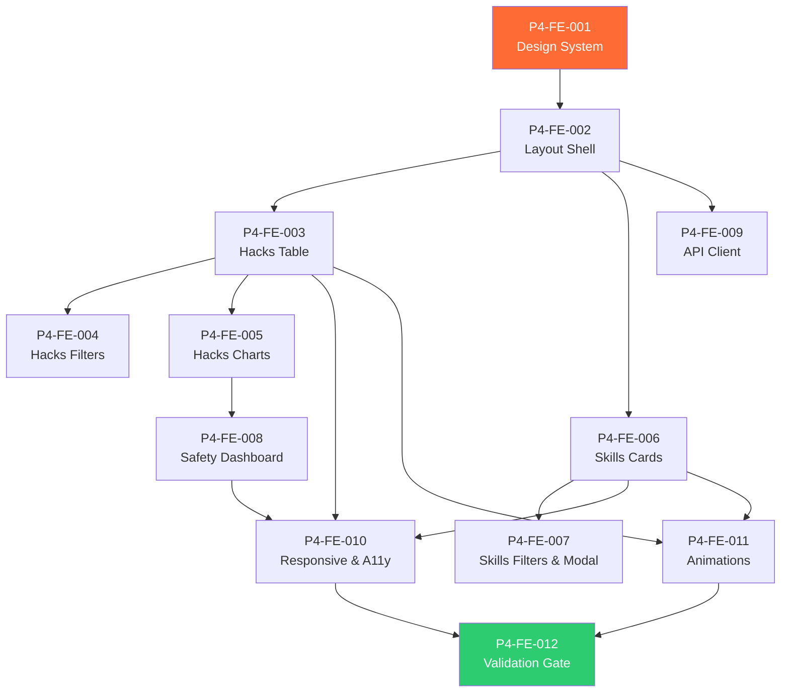

# Phase 4: Frontend Implementation — Code Review & Kanban Tasks

> **Project**: AltFlex AEGIS v3.0 — Adaptive Exploit & Governance Intelligence System
> **Timeline**: Week 17–22
> **Priority**: Critical — User-facing product layer
> **Tech Stack**: Next.js 15, React 19, TypeScript, CSS Modules, Recharts, Framer Motion
> **Blocked By**: Phase 3 (AI Safety Scanner) ✅ Complete

---

## Overview

Phase 4 builds the **face** of AltFlex AEGIS — the Next.js 15 frontend that transforms backend data into an interactive, visually stunning Web3 security intelligence dashboard. The UI must rival the [SCH Hacks Dashboard](https://smartcontractshacking.com/tools/web3-hacks-dashboard) and [AI Skills Explorer](https://smartcontractshacking.com/tools/ai-skills-explorer) in data depth, filtering mechanics, and visual polish.
Three primary views:

1. **Hacks Dashboard** — Sortable data table with dynamic filters, attack vector charts, loss timeline, chain breakdown
2. **AI Skills Explorer** — Card grid with safety badges, platform/language filters, one-click copy, search
3. **Safety Dashboard** — Scanner analytics, rule performance, label distribution, scan timeline
   Design principles:

- **Server Components first** — React 19 RSC for data-heavy pages, client components only for interactivity
- **Dark mode default** — Cybersecurity audience expects dark UI with accented neon highlights
- **Micro-animations** — Framer Motion for card entrances, filter transitions, chart reveals
- **Mobile-responsive** — Full tablet and mobile layouts

---

## Task Breakdown

---

### P4-FE-001: Design System & Global Styles

**Title**: Create CSS Design Tokens, Typography, Color Palette, and Base Component Styles

| Field           | Value                              |
| --------------- | ---------------------------------- |
| Priority        | P0 — Critical                      |
| Estimated Hours | 6                                  |
| Dependencies    | Phase 3 complete                   |
| Assigned Agent  | `senior_frontend_engineer`         |
| QA Agent        | `senior_qa_engineer`               |
| Review Agent    | `senior_code_reviewer`             |
| Labels          | `frontend`, `design-system`, `css` |

**Description**:
Establish the visual foundation — CSS custom properties (design tokens), color palette, typography scale, spacing system, and base component styles. Everything subsequent builds on this.

**Acceptance Criteria**:

- [x] CSS custom properties for colors, spacing, typography, shadows, radii
- [x] Dark mode color palette (primary: deep navy, accents: cyan/emerald/amber)
- [x] Light mode palette (optional, togglable)
- [x] Typography scale using Inter or Outfit (Google Fonts)
- [x] Responsive breakpoints: `sm` (640px), `md` (768px), `lg` (1024px), `xl` (1280px)
- [x] CSS utility classes for common patterns
- [x] Global reset and base element styles
- [x] CSS Modules configured for component-level scoping
- [x] Design token documentation in Storybook or standalone page
- [x] Animations: `fadeIn`, `slideUp`, `scaleIn`, `shimmer` (for skeleton loading)
      **Color Palette**:

```css
:root {
  /* Background */
  --bg-primary: hsl(222, 47%, 8%); /* Deep navy */
  --bg-secondary: hsl(222, 40%, 12%); /* Card background */
  --bg-tertiary: hsl(222, 35%, 16%); /* Elevated surface */
  --bg-hover: hsl(222, 30%, 20%);
  /* Accent */
  --accent-cyan: hsl(186, 100%, 50%); /* Primary action */
  --accent-emerald: hsl(160, 84%, 39%); /* Safe / success */
  --accent-amber: hsl(38, 92%, 50%); /* Warning / suspicious */
  --accent-red: hsl(0, 84%, 60%); /* Danger / malicious */
  --accent-purple: hsl(270, 76%, 60%); /* Info / highlight */
  /* Text */
  --text-primary: hsl(210, 40%, 96%);
  --text-secondary: hsl(215, 20%, 65%);
  --text-muted: hsl(215, 15%, 45%);
  /* Border */
  --border-subtle: hsl(222, 20%, 22%);
  --border-strong: hsl(222, 20%, 30%);
}
```

---

### P4-FE-002: Implement Layout Shell

**Title**: Build App Shell with Navigation Sidebar, Header, and Route Structure

| Field           | Value                              |
| --------------- | ---------------------------------- |
| Priority        | P0 — Critical                      |
| Estimated Hours | 5                                  |
| Dependencies    | P4-FE-001                          |
| Assigned Agent  | `senior_frontend_engineer`         |
| QA Agent        | `senior_qa_engineer`               |
| Review Agent    | `senior_code_reviewer`             |
| Labels          | `frontend`, `layout`, `navigation` |

**Description**:
Build the persistent app shell — collapsible sidebar navigation, top header bar, breadcrumbs, and the App Router layout hierarchy.

**Acceptance Criteria**:

- [x] Root layout (`app/layout.tsx`) with font loading, metadata, theme provider
- [x] Dashboard layout (`app/dashboard/layout.tsx`) with sidebar + main content area
- [x] Sidebar navigation with icons and active state indicators
- [x] Hacks Dashboard link (sword/shield icon)
- [x] AI Skills Explorer link (brain icon)
- [x] Safety Dashboard link (scan icon)
- [x] Forensics link (microscope icon) — disabled placeholder
- [x] Collapsible sidebar (icon-only mode on mobile)
- [x] Top header with AEGIS logo, search bar, and theme toggle
- [x] Breadcrumb component (auto-generated from route)
- [x] Loading state skeleton (shimmer animation)
- [x] Mobile hamburger menu
- [x] Keyboard navigation (Tab, Escape)

---

### P4-FE-003: Implement Hacks Dashboard — Data Table

**Title**: Build the Core Hacks Table with Sorting, Pagination, and Row Expansion

| Field           | Value                                  |
| --------------- | -------------------------------------- |
| Priority        | P0 — Critical                          |
| Estimated Hours | 8                                      |
| Dependencies    | P4-FE-002                              |
| Assigned Agent  | `senior_frontend_engineer`             |
| QA Agent        | `senior_qa_engineer`                   |
| Review Agent    | `senior_code_reviewer`                 |
| Labels          | `frontend`, `hacks-dashboard`, `table` |

**Description**:
Build the primary data table for the Hacks Dashboard. This is the centerpiece of Engine α — a high-performance, sortable, paginated table displaying hack incidents with expandable row details.

**Acceptance Criteria**:

- [ ] Server Component data fetching (`GET /api/v1/hacks`)
- [ ] Table columns: Protocol, Date, Chain, Attack Vector, Loss (USD), POC, Sources
- [ ] Column header sorting (click to toggle asc/desc)
- [ ] Pagination controls (prev/next, page size selector: 10/20/50/100)
- [ ] Row expansion — shows description, tx hashes, Foundry test path
- [ ] Loss amount formatting ($1.2M, $624M, $3.4B)
- [ ] Chain badges with chain-specific colors/icons
- [ ] Attack vector badges with color coding
- [ ] "Has POC" indicator (green check / gray dash)
- [ ] Source links (clickable, open in new tab)
- [ ] Empty state with illustration
- [ ] Loading skeleton (shimmer rows)
- [ ] Responds to URL search params for deep-linking
- [ ] Keyboard accessible (arrow keys for row navigation)

---

### P4-FE-004: Implement Hacks Dashboard — Filter Sidebar

**Title**: Build Dynamic Filter Panel with Real-Time Result Count Updates

| Field           | Value                                    |
| --------------- | ---------------------------------------- |
| Priority        | P0 — Critical                            |
| Estimated Hours | 6                                        |
| Dependencies    | P4-FE-003                                |
| Assigned Agent  | `senior_frontend_engineer`               |
| QA Agent        | `senior_qa_engineer`                     |
| Review Agent    | `senior_code_reviewer`                   |
| Labels          | `frontend`, `hacks-dashboard`, `filters` |

**Description**:
Build the filter sidebar that mirrors the SCH dashboard filtering mechanics. Filters update the URL params and trigger server-side data refetching.

**Acceptance Criteria**:

- [ ] Attack vector multi-select with checkboxes (16 categories)
- [ ] Chain multi-select with chain logos
- [ ] Date range picker (from/to)
- [ ] Loss amount range slider (min/max USD)
- [ ] "Has Foundry POC" toggle
- [ ] Text search input (protocol name)
- [ ] Active filter count badge
- [ ] "Clear all filters" button
- [ ] Filter state synced to URL search params (shareable URLs)
- [ ] Result count updates as filters change
- [ ] Collapsible on mobile (slide-out drawer)
- [ ] Smooth transitions when opening/closing filter groups

---

### P4-FE-005: Implement Hacks Dashboard — Charts & Stats

**Title**: Build Visualization Cards with Interactive Charts

| Field           | Value                                                    |
| --------------- | -------------------------------------------------------- |
| Priority        | P0 — Critical                                            |
| Estimated Hours | 7                                                        |
| Dependencies    | P4-FE-003                                                |
| Assigned Agent  | `senior_frontend_engineer`                               |
| QA Agent        | `senior_qa_engineer`                                     |
| Review Agent    | `senior_code_reviewer`                                   |
| Labels          | `frontend`, `hacks-dashboard`, `charts`, `visualization` |

**Description**:
Build the stats overview cards and interactive charts above the data table. These provide at-a-glance intelligence about the DeFi hack landscape.

**Acceptance Criteria**:

- [ ] Stats row (4 cards):
- [ ] Total Incidents (count with trend arrow)
- [ ] Total Loss USD (formatted with $ symbol)
- [ ] Funds Returned (with %)
- [ ] Protocols Affected (unique count)
- [ ] Loss Timeline chart (area chart, monthly buckets) — Recharts
- [ ] Attack Vector Breakdown (horizontal bar chart or treemap)
- [ ] Chain Distribution (donut chart with chain logos)
- [ ] Loss by Year (bar chart)
- [ ] Chart tooltips with detailed data on hover
- [ ] Charts respond to active filters
- [ ] Animate chart data on mount (Framer Motion)
- [ ] Responsive: charts stack vertically on mobile
- [ ] Color-coding consistent with design system

---

### P4-FE-006: Implement AI Skills Explorer — Card Grid

**Title**: Build Skill Card Grid with Safety Badges, Copy Button, and Search

| Field           | Value                                  |
| --------------- | -------------------------------------- |
| Priority        | P0 — Critical                          |
| Estimated Hours | 7                                      |
| Dependencies    | P4-FE-002                              |
| Assigned Agent  | `senior_frontend_engineer`             |
| QA Agent        | `senior_qa_engineer`                   |
| Review Agent    | `senior_code_reviewer`                 |
| Labels          | `frontend`, `skills-explorer`, `cards` |

**Description**:
Build the AI Skills Explorer page — a filterable card grid displaying AI audit skill files with safety badges, one-click copy, and platform/language indicators.

**Acceptance Criteria**:

- [ ] Server Component data fetching (`GET /api/v1/skills`)
- [ ] Skill cards with:
- [ ] Skill name (title)
- [ ] Author / team name
- [ ] Platform badge (Claude, Cursor, MCP, Copilot, Gemini)
- [ ] Language badge (Solidity, Vyper, Rust, Move, Cairo)
- [ ] Safety label badge (Safe ✅, Suspicious ⚠️, Malicious 🚫, Unanalyzed ❓)
- [ ] Copy count and star count
- [ ] Content preview (first 2–3 lines)
- [ ] Format indicator (YAML, Markdown, JSON)
- [ ] "Copy to Clipboard" button with toast notification
- [ ] Fetches full content via `GET /api/v1/skills/:id/content`
- [ ] Increments copy count via `POST /api/v1/skills/:id/copy`
- [ ] Star button (toggle, optimistic update)
- [ ] Card hover: subtle elevation + border glow
- [ ] Grid layout: 1→2→3 columns responsive
- [ ] Pagination (infinite scroll or paginated)
- [ ] Loading skeleton (shimmer cards)
- [ ] Empty state

---

### P4-FE-007: Implement AI Skills Explorer — Filters & Detail Modal

**Title**: Build Filter Bar and Skill Detail View with Full Content Display

| Field           | Value                                             |
| --------------- | ------------------------------------------------- |
| Priority        | P0 — Critical                                     |
| Estimated Hours | 5                                                 |
| Dependencies    | P4-FE-006                                         |
| Assigned Agent  | `senior_frontend_engineer`                        |
| QA Agent        | `senior_qa_engineer`                              |
| Review Agent    | `senior_code_reviewer`                            |
| Labels          | `frontend`, `skills-explorer`, `filters`, `modal` |

**Description**:
Build the filter bar for the Skills Explorer and the skill detail modal/page that shows full content with syntax highlighting.

**Acceptance Criteria**:

- [ ] Filter bar:
- [ ] Platform dropdown (Claude, Cursor, MCP, Copilot, Gemini, Generic)
- [ ] Language dropdown (Solidity, Vyper, Rust, Move, Cairo, Multi)
- [ ] Safety label toggle buttons (Safe, Suspicious, Malicious)
- [ ] Author search/select
- [ ] Text search input
- [ ] Sort select (Most Copied, Most Starred, Newest, Name)
- [ ] Skill detail view (modal or dedicated page):
- [ ] Full raw content with syntax highlighting (Prism.js or highlight.js)
- [ ] Copy full content button
- [ ] Safety scan results panel:
- [ ] Current label with reasoning
- [ ] Findings list with severity badges
- [ ] Scan timestamp and scanner version
- [ ] GitHub source link
- [ ] Metadata: format, platform, language, author
- [ ] Filter state in URL params
- [ ] Back navigation preserves scroll position

---

### P4-FE-008: Implement Safety Dashboard

**Title**: Build Safety Analytics Dashboard with Scanner Metrics and Rule Performance

| Field           | Value                                                   |
| --------------- | ------------------------------------------------------- |
| Priority        | P1 — High                                               |
| Estimated Hours | 6                                                       |
| Dependencies    | P4-FE-005 (chart components reusable)                   |
| Assigned Agent  | `senior_frontend_engineer`                              |
| QA Agent        | `senior_security_test_engineer`                         |
| Review Agent    | `senior_code_reviewer`                                  |
| Labels          | `frontend`, `safety-dashboard`, `analytics`, `thesis-1` |

**Description**:
Build the Safety Dashboard — a dedicated view showing safety scanning analytics, rule performance, and label distribution. This dashboard has academic value for thesis presentation.

**Acceptance Criteria**:

- [ ] Safety label distribution (donut chart: Safe/Suspicious/Malicious)
- [ ] Scan timeline (area chart: scans per day/week)
- [ ] Top triggered rules (horizontal bar chart)
- [ ] Rule performance table:
- [ ] Rule ID, name, category, hit count, false positive rate
- [ ] Sortable by hit count
- [ ] Most recent scans list:
- [ ] Skill name, label, score, findings count, timestamp
- [ ] Stats cards: Total Scanned, % Safe, % Malicious, Avg Score
- [ ] Findings category breakdown (stacked bar: Shell/FS/Network/PI/CE)
- [ ] All data from `GET /api/v1/safety/*` endpoints
- [ ] Charts share design tokens with Hacks Dashboard charts

---

### P4-FE-009: Implement API Client Layer

**Title**: Build Type-Safe API Client with SWR/React Query Integration

| Field           | Value                              |
| --------------- | ---------------------------------- |
| Priority        | P0 — Critical                      |
| Estimated Hours | 4                                  |
| Dependencies    | P4-FE-002                          |
| Assigned Agent  | `senior_software_engineer`         |
| QA Agent        | `senior_sdet`                      |
| Review Agent    | `senior_code_reviewer`             |
| Labels          | `frontend`, `api`, `data-fetching` |

**Description**:
Build the frontend API client layer — type-safe functions for calling all backend endpoints, with server-side fetching for RSC and client-side SWR for interactive components.

**Acceptance Criteria**:

- [ ] `ApiClient` class with base URL configuration
- [ ] Server-side fetch functions for React Server Components
- [ ] Client-side hooks using SWR or React Query:
- [ ] `useHacks(filters)` — paginated hacks list
- [ ] `useHackStats()` — aggregate statistics
- [ ] `useHackTimeline(params)` — time-series data
- [ ] `useSkills(filters)` — paginated skills list
- [ ] `useSkillDetail(id)` — single skill with content
- [ ] `useSafetyStats()` — safety analytics
- [ ] Type-safe request/response using Zod schemas from `@aegis/core`
- [ ] Error handling with user-friendly error states
- [ ] Loading states with skeleton UI
- [ ] Automatic cache invalidation on mutations (copy, star)
- [ ] Retry logic (3 retries with exponential backoff)
- [ ] Request deduplication

---

### P4-FE-010: Implement Responsive Design & Accessibility

**Title**: Ensure Full Mobile/Tablet Responsiveness and WCAG 2.1 AA Compliance

| Field           | Value                                     |
| --------------- | ----------------------------------------- |
| Priority        | P1 — High                                 |
| Estimated Hours | 5                                         |
| Dependencies    | P4-FE-003 through P4-FE-008               |
| Assigned Agent  | `senior_frontend_engineer`                |
| QA Agent        | `senior_qa_engineer`                      |
| Review Agent    | `senior_code_reviewer`                    |
| Labels          | `frontend`, `responsive`, `accessibility` |

**Description**:
Audit and refine all pages for mobile/tablet responsiveness and accessibility compliance.

**Acceptance Criteria**:

- [x] Mobile (< 640px): single column, slide-out navigation, stacked charts
- [x] Tablet (640–1024px): two-column grid, side panel filters
- [x] Desktop (> 1024px): full sidebar, multi-column layouts
- [x] WCAG 2.1 AA:
- [x] All interactive elements keyboard navigable
- [x] Color contrast ≥ 4.5:1 for text
- [x] ARIA labels on icons and badges
- [x] Focus indicators visible
- [x] Screen reader friendly table headers
- [x] Touch targets ≥ 44px on mobile
- [x] No horizontal scroll at any breakpoint
- [x] Dark mode tested at all breakpoints

---

### P4-FE-011: Implement Micro-Animations & Polish

**Title**: Add Framer Motion Animations, Transitions, and UI Polish

| Field           | Value                          |
| --------------- | ------------------------------ |
| Priority        | P1 — High                      |
| Estimated Hours | 4                              |
| Dependencies    | P4-FE-003 through P4-FE-008    |
| Assigned Agent  | `senior_frontend_engineer`     |
| QA Agent        | `senior_qa_engineer`           |
| Review Agent    | `senior_code_reviewer`         |
| Labels          | `frontend`, `animations`, `ux` |

**Description**:
Add micro-animations that bring the interface to life — card entrance animations, filter transitions, chart data reveals, hover effects, and loading states.

**Acceptance Criteria**:

- [ ] Page transitions (fade + slide between routes)
- [ ] Card grid: staggered entrance animation (cards fade in sequentially)
- [ ] Table rows: fade in on data load
- [ ] Chart data: animate from zero on mount
- [ ] Filter panel: smooth height transition on expand/collapse
- [ ] Button hover: scale + glow effect
- [ ] Toast notifications: slide in from bottom-right
- [ ] Copy button: success checkmark animation
- [ ] Safety badge: pulse animation on malicious label
- [ ] Skeleton loading: shimmer gradient animation
- [ ] All animations respect `prefers-reduced-motion`

---

### P4-FE-012: Validation & Phase Gate

**Title**: Full Phase 4 Validation — UI Complete, Responsive, Accessible, Data-Connected

| Field           | Value                      |
| --------------- | -------------------------- |
| Priority        | P0 — Critical              |
| Estimated Hours | 4                          |
| Dependencies    | All P4-FE tasks            |
| Assigned Agent  | `senior_qa_engineer`       |
| QA Agent        | `senior_sdet`              |
| Review Agent    | `senior_code_reviewer`     |
| Labels          | `validation`, `qa`, `gate` |

**Description**:
End-to-end validation of the frontend. Every page must render correctly, fetch real data, filter properly, and be responsive and accessible.

**Acceptance Criteria**:

- [ ] Hacks Dashboard: table loads 100+ incidents, filters work, charts render
- [ ] AI Skills Explorer: cards load, copy works, safety badges display
- [ ] Safety Dashboard: analytics render with real scan data
- [ ] All API calls succeed (no 500s, no CORS errors)
- [ ] Responsive: tested at 375px, 768px, 1280px, 1920px
- [ ] Accessibility: Lighthouse score ≥ 90
- [ ] Lighthouse Performance score ≥ 85
- [ ] No console errors in production build
- [ ] `pnpm --filter web run build` — 0 errors
- [ ] Dark mode: all pages visually consistent
- [ ] Deep linking: URL params restore filter state
- [ ] TypeScript: 0 type errors

---

## Dependency Graph



---

## Phase Gate Criteria

| Criterion        | Requirement                                     | Status |
| ---------------- | ----------------------------------------------- | ------ |
| Design system    | CSS tokens, dark mode, typography               | ✅     |
| Layout shell     | Sidebar, header, routing, mobile menu           | ✅     |
| Hacks table      | 100+ rows, sorting, pagination, expansion       | ⬜     |
| Hacks filters    | All filter types, URL sync, clear all           | ⬜     |
| Hacks charts     | Timeline, vector bars, chain donut, stats cards | ⬜     |
| Skills cards     | Grid, copy, star, safety badges                 | ⬜     |
| Skills filters   | Platform/language/safety, detail modal          | ⬜     |
| Safety dashboard | Label distribution, rule performance, timeline  | ⬜     |
| API client       | Type-safe, SWR hooks, error handling            | ⬜     |
| Responsive       | Mobile/tablet/desktop tested                    | ✅     |
| Accessibility    | Lighthouse ≥ 90                                 | ✅     |
| Animations       | Micro-animations, reduced-motion respected      | ⬜     |

> **⛔ Phase 5 CANNOT begin until all Phase Gate Criteria are ✅.**

---

_Document Version: 3.4.0_
_Author: AltFlex AEGIS Engineering_
_Last Updated: April 2026_
