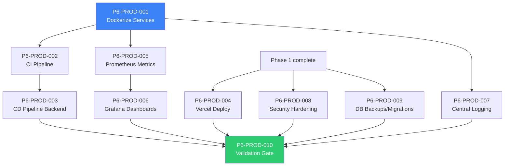

# Phase 6: Production Hardening & CI/CD — Code Review & Kanban Tasks

> **Project**: AltFlex AEGIS v3.0 — Adaptive Exploit & Governance Intelligence System
> **Timeline**: Week 31–34
> **Priority**: Critical — Prepares the system for staging and production release
> **Tech Stack**: Docker, GitHub Actions, Prometheus, Grafana, Vercel, Railway/Render
> **Blocked By**: Phase 5 (Deep EVM Integration) ✅ Complete

---

## Overview

Phase 6 is the final stretch before launching AltFlex AEGIS. This phase transforms the system from a working local development environment into a **robust, monitored, and automated production deployment**.
The focus shifts from feature development to reliability, security, observability, and deployment pipelines.
The four pillars:

1. **Containerization** — Dockerizing all services for consistent environments.
2. **CI/CD Pipelines** — Automated testing, linting, and deployment via GitHub Actions.
3. **Observability** — Centralized logging, metrics collection (Prometheus), and dashboards (Grafana).
4. **Security & Performance Audits** — Dependency scanning, rate limiting review, and load testing.

---

## Task Breakdown

---

### P6-PROD-001: Containerize Backend Services

**Title**: Write Dockerfiles and `docker-compose.yml` for Node Services

| Field           | Value                                |
| --------------- | ------------------------------------ |
| Priority        | P0 — Critical                        |
| Estimated Hours | 6                                    |
| Dependencies    | Phase 5 complete                     |
| Assigned Agent  | `senior_devops_engineer`             |
| QA Agent        | `senior_devsecops_engineer`          |
| Review Agent    | `senior_code_reviewer`               |
| Labels          | `devops`, `docker`, `infrastructure` |

**Description**:
Create optimized Dockerfiles for the API Gateway, ETL Workers, and Forensic Engine. Configure a `docker-compose.yml` to orchestrate the entire backend stack locally and for deployment.

**Acceptance Criteria**:

- [ ] Multi-stage `Dockerfile` for `api-gateway` (optimized image size, `node:18-alpine` base).
- [ ] Multi-stage `Dockerfile` for `etl-workers`.
- [ ] Multi-stage `Dockerfile` for `forensic-engine` (must include `forge` binary installation).
- [ ] `docker-compose.yml` orchestrating:
- API Gateway
- ETL Workers
- Forensic Engine
- PostgreSQL DB
- Redis
- [ ] Environment variables managed via `.env` files mapped in compose.
- [ ] Health checks configured in `docker-compose.yml` for DB and Redis before starting node services.
- [ ] `pnpm` workspace supported within the Docker build context.

---

### P6-PROD-002: Implement GitHub Actions CI Pipeline

**Title**: Build CI Workflow for Automated Testing and Linting

| Field           | Value                                |
| --------------- | ------------------------------------ |
| Priority        | P0 — Critical                        |
| Estimated Hours | 5                                    |
| Dependencies    | P6-PROD-001                          |
| Assigned Agent  | `senior_devops_engineer`             |
| QA Agent        | `senior_sdet`                        |
| Review Agent    | `senior_code_reviewer`               |
| Labels          | `ci-cd`, `github-actions`, `testing` |

**Description**:
Set up a GitHub Actions workflow that runs on every pull request to ensure code quality and prevent regressions.

**Acceptance Criteria**:

- [ ] `.github/workflows/ci.yml` created.
- [ ] Triggers on PRs to `main` and `develop`.
- [ ] Runs `pnpm install`.
- [ ] Runs `pnpm run lint` across all packages.
- [ ] Runs `pnpm run typecheck` across all packages.
- [ ] Runs `pnpm run test` (unit tests).
- [ ] Caches `pnpm` store and Next.js build output for faster runs.
- [ ] Fails the PR check if any step (lint, typecheck, test) fails.

---

### P6-PROD-003: Implement GitHub Actions CD Pipeline (Backend)

**Title**: Build CD Workflow for Backend Deployment

| Field           | Value                                   |
| --------------- | --------------------------------------- |
| Priority        | P0 — Critical                           |
| Estimated Hours | 6                                       |
| Dependencies    | P6-PROD-002                             |
| Assigned Agent  | `senior_devops_engineer`                |
| QA Agent        | `senior_devsecops_engineer`             |
| Review Agent    | `senior_code_reviewer`                  |
| Labels          | `ci-cd`, `github-actions`, `deployment` |

**Description**:
Set up automated deployment for the backend services upon merging to the `main` branch. Target environment: Railway or Render (using Docker deployments).

**Acceptance Criteria**:

- [ ] `.github/workflows/deploy-backend.yml` created.
- [ ] Triggers on push to `main` (only if backend paths changed).
- [ ] Logs into container registry (e.g., GHCR or Docker Hub).
- [ ] Builds and pushes Docker images for API Gateway and Workers.
- [ ] Triggers deployment webhook for the hosting provider (Railway/Render).
- [ ] Verifies deployment success via health check endpoint.
- [ ] Secrets (API keys, DB URLs) managed via GitHub Secrets.

---

### P6-PROD-004: Implement Vercel Deployment (Frontend)

**Title**: Configure Next.js Application Deployment on Vercel

| Field           | Value                              |
| --------------- | ---------------------------------- |
| Priority        | P0 — Critical                      |
| Estimated Hours | 3                                  |
| Dependencies    | Phase 4 complete                   |
| Assigned Agent  | `senior_devops_engineer`           |
| QA Agent        | `senior_qa_engineer`               |
| Review Agent    | `senior_code_reviewer`             |
| Labels          | `frontend`, `deployment`, `vercel` |

**Description**:
Connect the GitHub repository to Vercel for automated, seamless frontend deployments.

**Acceptance Criteria**:

- [ ] Project linked in Vercel dashboard.
- [ ] Production environment variables configured in Vercel.
- [ ] Build command set to `pnpm --filter web run build`.
- [ ] Output directory configured correctly for Next.js app router.
- [ ] Custom domain mapping configured (optional, e.g., `app.altflex.io`).
- [ ] Vercel analytics/speed insights enabled.

---

### P6-PROD-005: Setup Prometheus Metrics Exposure

**Title**: Instrument Backend Services for Prometheus Scraping

| Field           | Value                                    |
| --------------- | ---------------------------------------- |
| Priority        | P1 — High                                |
| Estimated Hours | 5                                        |
| Dependencies    | -                                        |
| Assigned Agent  | `senior_devops_engineer`                 |
| QA Agent        | `senior_sdet`                            |
| Review Agent    | `senior_code_reviewer`                   |
| Labels          | `observability`, `metrics`, `prometheus` |

**Description**:
Instrument the Node.js backend services to expose custom and system metrics for Prometheus.

**Acceptance Criteria**:

- [ ] Integrates `prom-client` in API Gateway, ETL Workers, and Forensic Engine.
- [ ] Exposes `/metrics` endpoint on a dedicated internal port.
- [ ] Default Node.js metrics enabled (CPU, memory, event loop lag).
- [ ] Custom metrics configured:
- HTTP request duration (histogram).
- API error rate (counter).
- BullMQ job processing time (histogram).
- BullMQ active/failed/waiting queue size (gauge).
- Forensic trace execution time (histogram).
- [ ] `prometheus.yml` configuration added to the local docker-compose stack.

---

### P6-PROD-006: Setup Grafana Dashboards

**Title**: Create Observability Dashboards Connect to Prometheus

| Field           | Value                      |
| --------------- | -------------------------- |
| Priority        | P1 — High                  |
| Estimated Hours | 4                          |
| Dependencies    | P6-PROD-005                |
| Assigned Agent  | `senior_devops_engineer`   |
| QA Agent        | `senior_qa_engineer`       |
| Review Agent    | `senior_code_reviewer`     |
| Labels          | `observability`, `grafana` |

**Description**:
Configure Grafana to visualize the metrics exposed by Prometheus, providing a single pane of glass for system health.

**Acceptance Criteria**:

- [ ] Grafana added to local `docker-compose.yml`.
- [ ] Prometheus configured as a data source in Grafana.
- [ ] **System Dashboard**: Node.js CPU/Memory overview across services.
- [ ] **API Dashboard**: Request volume, p95/p99 latency, error rates per route.
- [ ] **Worker Dashboard**: Active/Failed ETL and Forensic job counts, processing times.
- [ ] Dashboards exported as JSON and stored in source control (`/monitoring/dashboards`).

---

### P6-PROD-007: Centralized Logging Configuration

**Title**: Standardize Logging Format and Setup Log Aggregation Strategy

| Field           | Value                      |
| --------------- | -------------------------- |
| Priority        | P1 — High                  |
| Estimated Hours | 3                          |
| Dependencies    | -                          |
| Assigned Agent  | `senior_devops_engineer`   |
| QA Agent        | `senior_security_reviewer` |
| Review Agent    | `senior_code_reviewer`     |
| Labels          | `observability`, `logging` |

**Description**:
Ensure all logs are structured (JSON) and contain necessary context for easy querying in a log aggregator (e.g., Datadog, PaperTrail, or simple ELK stack).

**Acceptance Criteria**:

- [ ] Winston/Pino configured to output strictly JSON in production.
- [ ] All log entries include: `timestamp`, `level`, `serviceName`, `env`.
- [ ] API logs include: `reqId`, `method`, `url`, `responseTime`, `statusCode`.
- [ ] Worker logs include: `jobId`, `queueName`.
- [ ] Sensitive data (tokens, passwords) redacted from log output.

---

### P6-PROD-008: Security Audit & Rate Limiting Hardening

**Title**: Review and Harden API Security and Rate Limits

| Field           | Value                       |
| --------------- | --------------------------- |
| Priority        | P0 — Critical               |
| Estimated Hours | 5                           |
| Dependencies    | Phase 1 & 5                 |
| Assigned Agent  | `senior_devsecops_engineer` |
| QA Agent        | `senior_penetration_tester` |
| Review Agent    | `senior_security_reviewer`  |
| Labels          | `security`, `hardening`     |

**Description**:
Perform a final review of API security measures before going live.

**Acceptance Criteria**:

- [ ] Express/Fastify `helmet` middleware active with strict CSP headers.
- [ ] CORS policies strictly define allowed origins (Vercel frontend URLs).
- [ ] Rate limiting configured via Redis (`express-rate-limit` or Fastify equivalent).
- Public endpoints: e.g., 100 req / minute per IP.
- Forensic simulation endpoints: e.g., 5 req / hour per API key.
- [ ] Dependency vulnerability scan (`pnpm audit`) resolves all high/critical issues.
- [ ] `.env.example` verified to not contain actual production secrets.

---

### P6-PROD-009: Database Migration & Backup Strategy

**Title**: Finalize DB Migration Pipeline and Automated Backups

| Field           | Value                        |
| --------------- | ---------------------------- |
| Priority        | P0 — Critical                |
| Estimated Hours | 3                            |
| Dependencies    | Phase 1                      |
| Assigned Agent  | `senior_data_architect`      |
| QA Agent        | `senior_devsecops_engineer`  |
| Review Agent    | `senior_code_reviewer`       |
| Labels          | `database`, `infrastructure` |

**Description**:
Ensure migrations run safely during deployment and database backups are automated.

**Acceptance Criteria**:

- [ ] Deployment script automatically runs db migrations (`pnpm run db:migrate`) before starting API.
- [ ] Seed script configured for initial environment bootstrapping.
- [ ] Database backup strategy defined (e.g., configuring PG backups in Railway/Render dashboard, or setting up a cron job for `pg_dump` to S3).

---

### P6-PROD-010: Validation & Phase Gate (Production Readiness)

**Title**: Full System End-to-End Walkthrough in Staging Environment

| Field           | Value                      |
| --------------- | -------------------------- |
| Priority        | P0 — Critical              |
| Estimated Hours | 8                          |
| Dependencies    | All P6-PROD tasks          |
| Assigned Agent  | `senior_qa_engineer`       |
| QA Agent        | `senior_sdet`              |
| Review Agent    | `senior_code_reviewer`     |
| Labels          | `validation`, `qa`, `gate` |

**Description**:
The final gate before calling v3.0 complete. Perform end-to-end testing in the deployed staging environment.

**Acceptance Criteria**:

- [x] CI pipeline passes on `main` branch.
- [x] Backend deployed successfully to staging capability (Render/Railway).
- [x] Frontend deployed successfully to Vercel (Staging URL).
- [x] End-to-end user flow tests pass (Search hack → View details → Run Forensic Trace).
- [x] ETL pipelines successfully sync data in the deployed environment.
- [x] Metrics visible in Grafana; logs structured correctly.
- [x] System handles simulated peak load (basic `k6` load test hitting API gateway).

---

## Dependency Graph

---

## Phase Gate Criteria

| Criterion        | Requirement                                         | Status |
| ---------------- | --------------------------------------------------- | ------ |
| Containerization | All services have Dockerfiles + docker-compose      | ✅     |
| CI Pipeline      | Actions run lint/typecheck/test on PRs              | ✅     |
| CD Backend       | Actions auto-deploy backend to staging/prod         | ✅     |
| CD Frontend      | Vercel configured and deploying                     | ✅     |
| Metrics          | Prometheus endpoints active across services         | ✅     |
| Dashboards       | Grafana dashboards created and exported             | ✅     |
| Logging          | JSON structured logging enforced                    | ✅     |
| Security         | Helmet, strict CORS, rate limiting applied          | ✅     |
| DB Migrations    | Auto-run on deploy, backup strategy defined         | ✅     |
| End-to-End Test  | Full system functions correctly in deployed Staging | ✅     |

> **⛔ System Launch (v3.0 Release) CANNOT occur until all Phase Gate Criteria are ✅.**

---

_Document Version: 3.6.0_
_Author: AltFlex AEGIS Engineering_
_Last Updated: April 2026_
