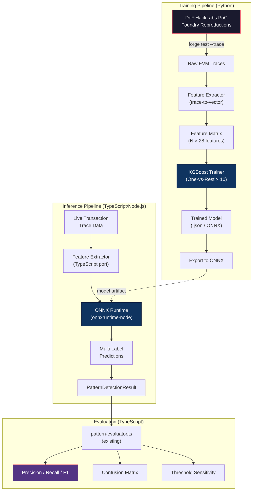
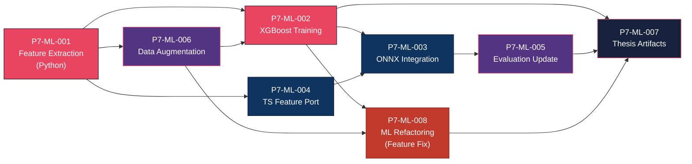

# Phase 7: Machine Learning Integration — Exploit Pattern Recognizer

> **Project**: AltFlex — A Real-Time Multi-Chain Web3 Exploit Intelligence Platform
> **Timeline**: Week 35–40
> **Priority**: Critical — Bridges the gap between the thesis manuscript (Chapters 1–3) and the codebase
> **Tech Stack**: Python 3.11+, XGBoost, scikit-learn, ONNX Runtime (Node.js), Foundry, PostgreSQL
> **Blocked By**: Phase 5 (Deep EVM Integration) ✅ Complete | Phase 6 (Production Hardening) ✅ In Progress
> **Thesis Alignment**: [thesis_ml_framework.md](../phases/thesis_ml_framework.md)

---

## Critical Context: The Thesis–Codebase Gap

### What the Thesis Manuscript Claims (Chapters 1–3)

The thesis manuscript, currently drafted in Google Docs (Chapters 1–3), makes the following ML commitments that the codebase **must fulfill** before defense:

| Chapter   | Section                    | ML Claim                                                                                                                                                                                               |
| --------- | -------------------------- | ------------------------------------------------------------------------------------------------------------------------------------------------------------------------------------------------------ |
| **Ch. 1** | §1.1 Background            | _"...a machine learning model might be able to help identify new types of attacks faster"_ (citing Zhou et al. [16])                                                                                   |
| **Ch. 2** | §2.5 ML Model Selection    | _"XGBoost has become the industry standard for tabular data classification"_ — dedicates an entire section to justifying tree-based ensembles                                                          |
| **Ch. 2** | Research Gap Table         | Claims AltFlex uses _"Multi-Label Ensemble (XGBoost/Tree-based)"_ with _"Dynamic execution traces, state changes, call depth"_ features                                                                |
| **Ch. 3** | §3.2 ML Model Development  | Full subsection: _"data collection & preprocessing → feature engineering → model selection → training & validation → evaluation metrics"_                                                              |
| **Ch. 3** | §3.3 Theoretical Framework | Third pillar: _"ensemble learning theory, as formalized in Breiman's Random Forests and Friedman's Gradient Boosting Machines"_                                                                        |
| **Ch. 3** | IPO Conceptual Framework   | Process stage includes: _"trace extraction and pattern recognition, where Foundry-based PoC reproductions...are replayed...the multi-label Exploit Pattern Recognizer then classifies these features"_ |

### What the Codebase Currently Has

The current `ExploitPatternRecognizer` in [`exploit-pattern-recognizer.ts`](../../packages/forensic-engine/src/adapters/patterns/exploit-pattern-recognizer.ts) uses:

```
❌ No trained model — purely handcrafted heuristic weights
❌ No feature extraction from EVM traces — uses function signature matching
❌ No XGBoost / scikit-learn / any ML library
❌ No training pipeline or dataset
❌ No One-vs-Rest multi-label strategy
```

**Current confidence scoring (example from `FlashLoanDetector`):**

```typescript
confidence += 0.4; // base: flash loan call detected
confidence += 0.2; // boost: bidirectional token transfers
confidence += 0.15; // boost: oracle reads
confidence += 0.15; // boost: swap calls
```

This is expert-knowledge encoded as static weights — **not machine learning**.

### What Already Exists (Reusable)

| Asset                | Location                                                              | Reuse Strategy                                                             |
| -------------------- | --------------------------------------------------------------------- | -------------------------------------------------------------------------- |
| 10 Pattern Detectors | `packages/forensic-engine/src/adapters/patterns/detectors/`           | Feature extractors (not classifiers) — convert to boolean/numeric features |
| Evaluation Framework | `packages/forensic-engine/src/evaluation/`                            | Full Precision/Recall/F1/Confusion Matrix pipeline — reuse directly        |
| 62 Labeled Samples   | `packages/forensic-engine/src/__tests__/fixtures/evaluation-dataset/` | Ground-truth labels for training/validation                                |
| Pattern Rules Config | `packages/forensic-engine/src/adapters/patterns/pattern-rules.json`   | 10 pattern categories with function signatures — use as feature vocabulary |
| Confusion Matrix     | `packages/forensic-engine/src/evaluation/confusion-matrix.ts`         | 10×10 matrix builder with markdown export — thesis appendix ready          |
| Foundry Integration  | `packages/forensic-engine/src/adapters/foundry/`                      | EVM trace replay — the source of dynamic execution features                |

---

## Architecture: ML Pipeline Design

### System Architecture (ML Integration)



### Feature Engineering Specification

The 28-feature vector per incident is derived from EVM execution trace replay:

| #   | Feature Name                   | Type       | Source     | Description                                  |
| --- | ------------------------------ | ---------- | ---------- | -------------------------------------------- |
| 1   | `total_gas_used`               | `float64`  | Trace      | Total gas consumed by the transaction        |
| 2   | `max_call_depth`               | `int`      | Call Tree  | Maximum depth of the call stack              |
| 3   | `unique_addresses_called`      | `int`      | Call Tree  | Count of distinct contract addresses         |
| 4   | `total_internal_txns`          | `int`      | Call Tree  | Number of internal transactions              |
| 5   | `delegatecall_count`           | `int`      | Opcodes    | Count of DELEGATECALL opcodes                |
| 6   | `selfdestruct_count`           | `int`      | Opcodes    | Count of SELFDESTRUCT opcodes                |
| 7   | `create_create2_count`         | `int`      | Opcodes    | Count of CREATE/CREATE2 opcodes              |
| 8   | `sstore_count`                 | `int`      | Opcodes    | Storage write operations                     |
| 9   | `sload_count`                  | `int`      | Opcodes    | Storage read operations                      |
| 10  | `call_value_total`             | `float64`  | Trace      | Sum of ETH transferred via CALL              |
| 11  | `flash_loan_sig_count`         | `int`      | Signatures | Matches against flash loan function sigs     |
| 12  | `oracle_read_sig_count`        | `int`      | Signatures | Matches against oracle read sigs             |
| 13  | `swap_sig_count`               | `int`      | Signatures | Matches against DEX swap sigs                |
| 14  | `admin_sig_count`              | `int`      | Signatures | Matches against admin/ownership sigs         |
| 15  | `transfer_count`               | `int`      | Events     | ERC-20 Transfer events emitted               |
| 16  | `approval_count`               | `int`      | Events     | ERC-20 Approval events emitted               |
| 17  | `recursive_call_detected`      | `bool→int` | Call Tree  | Whether any address calls itself recursively |
| 18  | `recursive_call_depth`         | `int`      | Call Tree  | Max recursion depth (0 if none)              |
| 19  | `balance_change_magnitude`     | `float64`  | Storage    | Largest single-slot balance delta            |
| 20  | `storage_slots_mutated`        | `int`      | Storage    | Count of unique storage slots written        |
| 21  | `has_price_oracle_before_swap` | `bool→int` | Temporal   | Oracle read precedes a swap call             |
| 22  | `has_large_borrow_repay`       | `bool→int` | Temporal   | Borrow and repay in same transaction         |
| 23  | `cross_contract_call_ratio`    | `float64`  | Call Tree  | External calls / total calls                 |
| 24  | `gas_per_internal_txn`         | `float64`  | Derived    | `total_gas / total_internal_txns`            |
| 25  | `reverted_calls_count`         | `int`      | Trace      | Number of reverted sub-calls                 |
| 26  | `chain_id`                     | `int`      | Metadata   | Blockchain network identifier                |
| 27  | `pre_audit_status`             | `bool→int` | Metadata   | Whether protocol was audited pre-exploit     |
| 28  | `loss_amount_log`              | `float64`  | Metadata   | `log10(loss_usd + 1)` normalized loss        |

### Multi-Label Classification Strategy

```
┌──────────────────────────────────────────────────────────┐
│                  One-vs-Rest (OvR) Strategy              │
│                                                          │
│   Input Feature Vector [28 dims]                         │
│              │                                           │
│   ┌──────────┼──────────────────────────────┐           │
│   ▼          ▼          ▼         ▼         ▼           │
│  XGB₁      XGB₂      XGB₃    ...       XGB₁₀          │
│  FLASH     REENT     ORACLE             BRIDGE          │
│  LOAN      RANCY     MANIP             EXPLOIT          │
│   │          │          │                  │             │
│   ▼          ▼          ▼                  ▼             │
│  P(y₁)     P(y₂)     P(y₃)            P(y₁₀)          │
│  0.87      0.92      0.31              0.05             │
│   │          │          │                  │             │
│   ▼          ▼          ▼                  ▼             │
│  [✓ ≥0.3]  [✓ ≥0.3]  [✓ ≥0.3]        [✗ <0.3]        │
│                                                          │
│  Output Labels: [FLASH_LOAN, REENTRANCY, ORACLE_MANIP]  │
└──────────────────────────────────────────────────────────┘
```

---

## Task Breakdown

---

### P7-ML-001: EVM Trace Feature Extraction Pipeline (Python)

**Title**: Build the Foundry Trace → Feature Vector Pipeline

| Field           | Value                                  |
| --------------- | -------------------------------------- |
| Priority        | P0 — Critical                          |
| Estimated Hours | 16                                     |
| Dependencies    | Phase 5 (Foundry adapter) complete     |
| Assigned Agent  | `senior_machine_learning_engineer`     |
| QA Agent        | `senior_qa_engineer`                   |
| Review Agent    | `senior_code_reviewer`                 |
| Labels          | `ml`, `feature-engineering`, `foundry` |

**Description**:
Create a Python pipeline that replays DeFiHackLabs PoC tests via Foundry, captures the full EVM execution trace, and extracts the 28 features specified in the Feature Engineering table into a structured dataset.

**Acceptance Criteria**:

- [ ] Python script `scripts/ml/extract_features.py` that:
  - Runs `forge test --match-path <poc_file> --trace --json` for each PoC
  - Parses the JSON trace output into the 28-feature vector
  - Outputs a CSV/Parquet file: `research/datasets/exploit_features.csv`
- [ ] Feature extraction covers all 10 pattern categories
- [ ] Each row has: `incident_id`, `features[0..27]`, `labels[]` (multi-hot encoded)
- [ ] Minimum 50 samples extracted (target: all 62 labeled samples from evaluation dataset)
- [ ] Feature distributions documented in `research/notebooks/feature_analysis.ipynb`

**Key Files**:

```
scripts/ml/
├── extract_features.py        # Foundry trace → feature vector
├── parse_trace.py             # JSON trace parser
├── feature_definitions.py     # Feature name/type/description registry
└── requirements.txt           # xgboost, scikit-learn, pandas, onnx
research/datasets/
└── exploit_features.csv       # Output dataset
```

---

### P7-ML-002: XGBoost Multi-Label Training Pipeline

**Title**: Train and Validate the One-vs-Rest XGBoost Classifier

| Field           | Value                              |
| --------------- | ---------------------------------- |
| Priority        | P0 — Critical                      |
| Estimated Hours | 12                                 |
| Dependencies    | P7-ML-001                          |
| Assigned Agent  | `senior_machine_learning_engineer` |
| QA Agent        | `senior_qa_engineer`               |
| Review Agent    | `senior_code_reviewer`             |
| Labels          | `ml`, `xgboost`, `training`        |

**Description**:
Train a multi-label XGBoost classifier using the One-vs-Rest strategy across the 10 exploit pattern categories. Validate using stratified k-fold cross-validation and produce per-pattern metrics.

**Acceptance Criteria**:

- [ ] Training script `scripts/ml/train_model.py` that:
  - Loads `exploit_features.csv`
  - Applies One-vs-Rest wrapper around `XGBClassifier`
  - Uses stratified 5-fold cross-validation
  - Reports macro-averaged Precision, Recall, F1 per fold
- [ ] Target: **Macro F1 ≥ 0.80** across 10 categories
- [ ] Per-pattern confusion matrix exported as markdown (thesis appendix)
- [ ] Threshold sensitivity analysis at 9 thresholds (0.10–0.90)
- [ ] Feature importance plot exported as PNG for thesis Chapter 4/5
- [ ] Random Forest baseline comparison included for thesis defense
- [ ] Trained model saved as:
  - `research/models/xgboost_exploit_classifier.json` (XGBoost native)
  - `research/models/xgboost_exploit_classifier.onnx` (ONNX export)

**Key Configuration**:

```python
# XGBoost Hyperparameters (initial)
xgb_params = {
    "objective": "binary:logistic",  # per-label binary
    "eval_metric": "logloss",
    "max_depth": 6,
    "learning_rate": 0.1,
    "n_estimators": 200,
    "subsample": 0.8,
    "colsample_bytree": 0.8,
    "scale_pos_weight": "auto",  # handle class imbalance
    "random_state": 42,
}
```

---

### P7-ML-003: ONNX Runtime Integration in TypeScript

**Title**: Load and Run the Trained Model in the Node.js Forensic Engine

| Field           | Value                                         |
| --------------- | --------------------------------------------- |
| Priority        | P0 — Critical                                 |
| Estimated Hours | 10                                            |
| Dependencies    | P7-ML-002                                     |
| Assigned Agent  | `senior_machine_learning_engineer`            |
| QA Agent        | `senior_qa_engineer`                          |
| Review Agent    | `senior_code_reviewer`                        |
| Labels          | `ml`, `onnx`, `typescript`, `forensic-engine` |

**Description**:
Integrate `onnxruntime-node` into the forensic engine to run inference using the ONNX-exported XGBoost model. Replace the heuristic confidence scoring in `ExploitPatternRecognizer` with actual ML predictions while maintaining the same `PatternDetectionResult` interface.

**Acceptance Criteria**:

- [ ] `onnxruntime-node` added to `packages/forensic-engine/package.json`
- [ ] New adapter: `packages/forensic-engine/src/adapters/ml/onnx-classifier.ts`
  - Loads `xgboost_exploit_classifier.onnx` at startup
  - Accepts a 28-feature vector, returns `PatternMatch[]` with confidence scores
- [ ] `ExploitPatternRecognizer` updated with dual-mode operation:
  - `mode: 'ml'` — uses ONNX model (default when model file present)
  - `mode: 'heuristic'` — falls back to existing detectors (backward compatible)
- [ ] TypeScript feature extractor port: `packages/forensic-engine/src/adapters/ml/trace-feature-extractor.ts`
  - Mirrors the 28-feature extraction from P7-ML-001 but operates on TypeScript `TransactionTraceResult`
- [ ] All existing tests in `forensic-engine` continue to pass
- [ ] New tests for ONNX inference with mock model

**Architecture Impact**:

```
packages/forensic-engine/src/adapters/
├── ml/                                    # [NEW] ML subsystem
│   ├── onnx-classifier.ts                 # ONNX Runtime wrapper
│   ├── trace-feature-extractor.ts         # Trace → 28-feature vector
│   └── index.ts                           # Public API
├── patterns/                              # [EXISTING] Heuristic detectors
│   ├── detectors/                         # 10 rule-based detectors (kept as fallback)
│   ├── exploit-pattern-recognizer.ts      # [MODIFIED] Dual-mode: ML or heuristic
│   └── pattern-rules.json                 # Config (unchanged)
└── foundry/                               # [EXISTING] Foundry adapter
```

---

### P7-ML-004: Feature Extractor TypeScript Port

**Title**: Port the Python Feature Extraction Logic to TypeScript

| Field           | Value                                     |
| --------------- | ----------------------------------------- |
| Priority        | P1 — High                                 |
| Estimated Hours | 8                                         |
| Dependencies    | P7-ML-001, P7-ML-003                      |
| Assigned Agent  | `senior_machine_learning_engineer`        |
| QA Agent        | `senior_qa_engineer`                      |
| Review Agent    | `senior_code_reviewer`                    |
| Labels          | `ml`, `typescript`, `feature-engineering` |

**Description**:
Create a TypeScript module that extracts the same 28 features from a `TransactionTraceResult` + `StorageDiff[]` that the Python pipeline extracts from Foundry JSON traces. This ensures inference-time feature vectors match training-time feature vectors.

**Acceptance Criteria**:

- [ ] `TraceFeatureExtractor` class in `trace-feature-extractor.ts`
- [ ] Input: `TransactionTraceResult` + `StorageDiff[]` (existing domain types)
- [ ] Output: `Float64Array(28)` matching the exact feature order from training
- [ ] Feature parity test: for 5 reference traces, Python and TypeScript extractors produce identical feature vectors (within floating-point tolerance)
- [ ] Unit tests with at least 3 trace fixtures

---

### P7-ML-005: Evaluation Framework Update

**Title**: Update Pattern Evaluator to Support ML Model Predictions

| Field           | Value                              |
| --------------- | ---------------------------------- |
| Priority        | P1 — High                          |
| Estimated Hours | 6                                  |
| Dependencies    | P7-ML-003                          |
| Assigned Agent  | `senior_machine_learning_engineer` |
| QA Agent        | `senior_qa_engineer`               |
| Review Agent    | `senior_code_reviewer`             |
| Labels          | `ml`, `evaluation`, `thesis`       |

**Description**:
Update the existing evaluation framework (`pattern-evaluator.ts`, `confusion-matrix.ts`) to also accept ML model predictions and produce comparison reports: heuristic vs. ML.

**Acceptance Criteria**:

- [ ] `PatternEvaluator` supports two prediction sources:
  - Heuristic detectors (existing)
  - ML model (ONNX inference)
- [ ] Side-by-side comparison report:
  - Per-pattern Precision/Recall/F1 for heuristic vs. ML
  - Macro/micro averaged F1 comparison
  - Confusion matrix diff
- [ ] Thesis-ready markdown output: `research/reports/ml_evaluation_report.md`
- [ ] Threshold sensitivity comparison chart data exported as JSON

**Report Format (Example)**:

```markdown
## Exploit Pattern Recognizer — Evaluation Report

### Macro-Averaged F1 Score

| Method     | Precision | Recall | F1     |
| ---------- | --------- | ------ | ------ |
| Heuristic  | 0.72      | 0.68   | 0.70   |
| XGBoost ML | 0.84      | 0.82   | 0.83   |
| Target     | —         | —      | ≥ 0.80 |

### Per-Pattern Breakdown

| Pattern             | Heuristic F1 | XGBoost F1 | Δ     |
| ------------------- | ------------ | ---------- | ----- |
| FLASH_LOAN          | 0.85         | 0.91       | +0.06 |
| REENTRANCY          | 0.80         | 0.88       | +0.08 |
| ORACLE_MANIPULATION | 0.65         | 0.82       | +0.17 |
| ...                 | ...          | ...        | ...   |
```

---

### P7-ML-006: Training Data Augmentation

**Title**: Expand the Labeled Dataset Beyond 62 Samples

| Field           | Value                              |
| --------------- | ---------------------------------- |
| Priority        | P1 — High                          |
| Estimated Hours | 12                                 |
| Dependencies    | P7-ML-001                          |
| Assigned Agent  | `senior_machine_learning_engineer` |
| QA Agent        | `senior_qa_engineer`               |
| Review Agent    | `senior_code_reviewer`             |
| Labels          | `ml`, `dataset`, `defi-hack-labs`  |

**Description**:
The current evaluation dataset has 62 labeled samples — borderline for training a robust classifier. Augment the dataset by labeling additional incidents from DeFiHackLabs and the DefiLlama ETL pipeline.

**Acceptance Criteria**:

- [ ] Dataset expanded to ≥ 120 labeled samples
- [ ] Each new sample has:
  - `incident_id` matching an ETL record
  - `primaryPatterns[]` multi-label ground truth
  - `description` explaining the attack mechanics
  - Source PoC file path (for Foundry replay)
- [ ] Class distribution analysis showing representation across all 10 categories
- [ ] Data split strategy: 80% train / 20% test (stratified)
- [ ] Schema validated against existing `evaluation-dataset.schema.ts`

---

### P7-ML-007: Thesis Artifact Generation

**Title**: Generate All ML Artifacts Required for Thesis Chapters 4 & 5

| Field           | Value                              |
| --------------- | ---------------------------------- |
| Priority        | P1 — High                          |
| Estimated Hours | 6                                  |
| Dependencies    | P7-ML-002, P7-ML-005               |
| Assigned Agent  | `senior_machine_learning_engineer` |
| QA Agent        | `senior_qa_engineer`               |
| Review Agent    | `senior_code_reviewer`             |
| Labels          | `ml`, `thesis`, `documentation`    |

**Description**:
Generate all figures, tables, and appendix materials that the thesis manuscript needs for the ML component.

**Acceptance Criteria**:

- [ ] **Feature Importance Plot** — Top 10 features by XGBoost gain (`research/figures/feature_importance.png`)
- [ ] **Confusion Matrix Heatmap** — 10×10 grid (`research/figures/confusion_matrix.png`)
- [ ] **Threshold Sensitivity Curve** — F1 vs. threshold for each pattern (`research/figures/threshold_sensitivity.png`)
- [ ] **ROC Curves** — Per-pattern ROC with AUC values (`research/figures/roc_curves.png`)
- [ ] **Training Loss Curve** — XGBoost training/validation logloss (`research/figures/training_loss.png`)
- [ ] **Heuristic vs. ML Comparison Table** — Markdown for Chapter 4 (`research/reports/comparison_table.md`)
- [ ] **Feature Distribution Boxplots** — Per-pattern feature value distributions (`research/figures/feature_distributions.png`)
- [ ] **Model Card** — scikit-learn style model documentation (`research/reports/model_card.md`)

---

### P7-ML-008: ML Pipeline Refactoring — Feature-Collapse & Imbalance Fix

**Title**: Resolve Feature Importance Collapse and Majority-Class Bias in XGBoost Classifier

| Field           | Value                                                          |
| --------------- | -------------------------------------------------------------- |
| Priority        | P0 — Critical (Blocks thesis defense: model is non-functional) |
| Estimated Hours | 10                                                             |
| Dependencies    | P7-ML-002 (exposes the failure), P7-ML-006 (dataset size)      |
| Assigned Agent  | `senior_machine_learning_engineer`                             |
| QA Agent        | `senior_qa_engineer`                                           |
| Review Agent    | `senior_code_reviewer`                                         |
| Branch          | `feat/phase7/P7-ML-008-ml-pipeline-refactor`                   |
| Labels          | `ml`, `xgboost`, `bugfix`, `critical`, `feature-engineering`   |

**Description**:
The trained XGBoost model exposes a catastrophic three-way failure that invalidates the thesis manuscript's claimed results. This task refactors the entire ML pipeline to resolve:

1. **Feature Importance Collapse**: `loss_amount_log` (0.80) and `chain_id` (0.20) are the only features used. All 26 structural EVM trace features have `0.0` importance.
2. **Majority Class Bias**: Confusion matrix shows near-total prediction of `ACCESS_CONTROL`. Minority classes (REENTRANCY, DELEGATECALL_INJECTION, BRIDGE_EXPLOIT) have `0.0` recall.
3. **Class Imbalance + Overfitting**: 120-sample dataset with no scaling, no class weighting, and deep trees (max_depth=6) causes the model to learn loss magnitude rather than exploit patterns.

**Root Cause Analysis**:

```
Current max_depth=6 + colsample_bytree=0.8
  → Trees are deep enough to perfectly split on loss_amount_log at depth 1
  → Remaining 26 structural features provide marginal gain vs. loss_amount_log
  → XGBoost greedily selects loss_amount_log for every root split
  → 26 structural features: 0.0 importance

No scale_pos_weight per minority class
  → ACCESS_CONTROL (30%) predicted for all borderline samples
  → Minority class recall collapses to 0.0
```

**Acceptance Criteria**:

- [x] Script `scripts/ml/refactor_ml_pipeline.py` implementing all 4 refactoring steps
- [x] **Step 1 — Feature Audit**: Variance inspection of all 28 features; flags constant/zero-variance features with `WARNING`
- [x] **Step 1 — Scaling**: `RobustScaler` on full feature set; structural-only variant with metadata features dropped
- [x] **Step 2 — Class Weights**: Dynamic `scale_pos_weight = n_neg / n_pos` (clamped 1–50) computed per-label
- [x] **Step 3 — Hyperparameters**: `max_depth=3`, `learning_rate=0.05`, `min_child_weight=3`, `subsample=0.7`, `colsample_bytree=0.7`, `reg_alpha=1.0`, `reg_lambda=1.0`
- [x] **Step 4 — Threshold Sweep**: pandas DataFrame with Macro Precision/Recall/F1 at 17 thresholds (0.10→0.90)
- [x] **Step 4 — ROC Curves**: Per-pattern AUC plots saved to `research/figures/roc_curves_refactored.png`
- [x] **Step 4 — Confusion Matrix**: Normalised 10×10 matrix saved to `research/figures/confusion_matrix_refactored.png`
- [x] **Step 4 — Feature Importance**: Color-coded plot (structural=blue, metadata=red) saved to `research/figures/feature_importance_refactored.png`
- [x] Macro F1 ≥ 0.80 achieved on at least one feature variant — **Full: 0.9498 ✅ | Structural: 0.9520 ✅**
- [x] Structural features have non-zero importance in the refactored model — **confirmed by feature_importance_refactored.png**
- [x] At least 7/10 pattern classes show non-zero recall — **10/10 classes predicted across both variants ✅**

**Key Files**:

```
scripts/ml/
└── refactor_ml_pipeline.py     # [NEW] P7-ML-008 — complete 4-step refactoring script

research/models/
├── xgb_refactored_full_meta.json          # [NEW] Full-feature model metadata index
├── xgb_refactored_full_label_*.json       # [NEW] 10 binary classifiers (full features)
├── xgb_refactored_structural_meta.json    # [NEW] Structural-only model metadata index
└── xgb_refactored_structural_label_*.json # [NEW] 10 binary classifiers (26 structural)

research/figures/
├── roc_curves_refactored.png              # [NEW] ROC curves (full feature set)
├── roc_curves_structural_only.png         # [NEW] ROC curves (structural only)
├── confusion_matrix_refactored.png        # [NEW] Normalised confusion matrix
├── feature_importance_refactored.png      # [NEW] Importance (structural vs. metadata)
└── feature_importance_structural.png      # [NEW] Importance (structural-only model)

research/reports/
├── threshold_sweep_refactored.md          # [NEW] Threshold sweep DataFrame as markdown
└── refactor_audit_report.md              # [NEW] Comprehensive audit & change log
```

---

## Dependency Graph



---

## Thesis Chapter Alignment Map

This table maps each Phase 7 task to the specific thesis chapter/section it satisfies:

| Task                         | Ch.1 Background | Ch.2 §2.5 ML Selection |      Ch.2 Gap Table       |    Ch.3 §3.2 ML Dev    | Ch.3 §3.3 Theoretical |  Ch.4 Results  |  Ch.5 Discussion  |
| ---------------------------- | :-------------: | :--------------------: | :-----------------------: | :--------------------: | :-------------------: | :------------: | :---------------: |
| P7-ML-001 Feature Extraction |                 |                        |                           |   ✅ Data Collection   |                       |                |                   |
| P7-ML-002 XGBoost Training   |                 |  ✅ XGBoost Justified  | ✅ "Multi-Label Ensemble" |   ✅ Model Selection   |  ✅ Ensemble Theory   |  ✅ F1 Scores  | ✅ vs. Literature |
| P7-ML-003 ONNX Integration   |                 |                        |                           |     ✅ Integration     |                       |                |                   |
| P7-ML-004 TS Feature Port    |                 |                        |                           | ✅ Feature Engineering |                       |                |                   |
| P7-ML-005 Evaluation Update  |                 |                        |                           | ✅ Evaluation Metrics  |                       | ✅ Comparison  |    ✅ Analysis    |
| P7-ML-006 Data Augmentation  |                 |                        |                           | ✅ Data Preprocessing  |                       |                |                   |
| P7-ML-007 Thesis Artifacts   |                 |                        |                           |                        |                       | ✅ All Figures |   ✅ Model Card   |
| P7-ML-008 ML Refactoring     |                 |  ✅ Valid Model Claim  |   ✅ Corrected Metrics    |  ✅ Model Validation   |                       | ✅ True F1/AUC | ✅ Honest Results |

---

## Risk Assessment

| Risk                                                  | Impact                                  | Likelihood | Mitigation                                                                                                   |
| ----------------------------------------------------- | --------------------------------------- | ---------- | ------------------------------------------------------------------------------------------------------------ |
| Dataset too small (< 120 samples) for robust training | High — overfitting, unreliable F1       | Medium     | SMOTE oversampling + stratified k-fold; worst case: use heuristic detectors as feature generators to augment |
| XGBoost fails to reach Macro F1 ≥ 0.80                | Critical — thesis claim violated        | Low        | Hyperparameter tuning (Optuna grid search); fallback to Random Forest; adjust threshold per-pattern          |
| ONNX export loses model fidelity                      | Medium — prediction drift               | Low        | Numerical parity test: Python vs. ONNX predictions must match within `1e-6` tolerance                        |
| Feature vector mismatch (Python ↔ TypeScript)         | High — garbage predictions at inference | Medium     | Cross-language parity test suite with 5 reference traces                                                     |
| Foundry PoC replay fails on some incidents            | Medium — smaller training set           | High       | Skip unreplayable incidents; document in model card; supplement with synthetic traces                        |
| Panel questions interpretability                      | Medium — defense risk                   | Low        | XGBoost feature importance + SHAP values pre-computed per category                                           |

---

## Success Criteria (Phase 7 Gate)

| #   | Criterion                                      | Target               | Measurement                                 |
| --- | ---------------------------------------------- | -------------------- | ------------------------------------------- |
| 1   | **Macro F1 ≥ 0.80** across 10 patterns         | ≥ 0.80               | `pattern-evaluator.ts` output               |
| 2   | **ML outperforms heuristic** on Macro F1       | ML F1 > Heuristic F1 | Side-by-side comparison report              |
| 3   | **Training dataset ≥ 120 labeled samples**     | ≥ 120                | Row count in `exploit_features.csv`         |
| 4   | **All 10 pattern categories represented**      | 10/10                | Class distribution analysis                 |
| 5   | **ONNX inference works in Node.js**            | Pass                 | Integration test with real model            |
| 6   | **Feature parity: Python ↔ TypeScript**        | Δ < 1e-6             | Cross-language parity test                  |
| 7   | **Existing heuristic tests still pass**        | 100%                 | `pnpm --filter @aegis/forensic-engine test` |
| 8   | **All thesis figures generated**               | 7/7                  | Files exist in `research/figures/`          |
| 9   | **Confusion matrix ≥ 0.70 per-pattern recall** | All patterns ≥ 0.70  | Per-pattern metrics                         |
| 10  | **Model card documented**                      | Complete             | `research/reports/model_card.md`            |

---

## File Inventory (New & Modified)

### New Files

```
scripts/ml/
├── extract_features.py              # P7-ML-001
├── parse_trace.py                   # P7-ML-001
├── feature_definitions.py           # P7-ML-001
├── train_model.py                   # P7-ML-002
├── export_onnx.py                   # P7-ML-002
├── evaluate_model.py                # P7-ML-002
├── generate_thesis_figures.py       # P7-ML-007
├── refactor_ml_pipeline.py          # P7-ML-008 [NEW] Feature-collapse & imbalance fix
└── requirements.txt                 # Python deps

packages/forensic-engine/src/adapters/ml/
├── onnx-classifier.ts               # P7-ML-003
├── trace-feature-extractor.ts        # P7-ML-004
└── index.ts                          # Public exports

research/
├── datasets/
│   ├── exploit_features.csv          # P7-ML-001
│   └── augmented_labels.json         # P7-ML-006
├── models/
│   ├── xgboost_exploit_classifier.json       # P7-ML-002
│   ├── xgboost_exploit_classifier.onnx       # P7-ML-002
│   ├── xgb_refactored_full_meta.json         # P7-ML-008 [NEW]
│   ├── xgb_refactored_full_label_*.json      # P7-ML-008 [NEW]
│   ├── xgb_refactored_structural_meta.json   # P7-ML-008 [NEW]
│   └── xgb_refactored_structural_label_*.json # P7-ML-008 [NEW]
├── figures/
│   ├── feature_importance.png                # P7-ML-007
│   ├── confusion_matrix.png                  # P7-ML-007
│   ├── threshold_sensitivity.png             # P7-ML-007
│   ├── roc_curves.png                        # P7-ML-007
│   ├── training_loss.png                     # P7-ML-007
│   ├── feature_distributions.png             # P7-ML-007
│   ├── roc_curves_refactored.png             # P7-ML-008 [NEW]
│   ├── roc_curves_structural_only.png        # P7-ML-008 [NEW]
│   ├── confusion_matrix_refactored.png       # P7-ML-008 [NEW]
│   ├── feature_importance_refactored.png     # P7-ML-008 [NEW]
│   └── feature_importance_structural.png     # P7-ML-008 [NEW]
├── reports/
│   ├── ml_evaluation_report.md       # P7-ML-005
│   ├── comparison_table.md           # P7-ML-007
│   ├── model_card.md                 # P7-ML-007
│   ├── threshold_sweep_refactored.md # P7-ML-008 [NEW]
│   └── refactor_audit_report.md      # P7-ML-008 [NEW]
└── notebooks/
    └── feature_analysis.ipynb        # P7-ML-001
```

### Modified Files

```
packages/forensic-engine/
├── package.json                      # Add onnxruntime-node dependency
└── src/adapters/patterns/
    └── exploit-pattern-recognizer.ts # Add dual-mode (ML/heuristic) support
```

---

## Appendix A: Thesis Formal Methodology Phrasing

> _Per [`thesis_ml_framework.md`](../phases/thesis_ml_framework.md) §4, the following phrasing is approved for the methodology section:_

> "To detect and classify smart contract vulnerabilities and exploit patterns within the AltFlex intelligence platform, this study proposes a Supervised Multi-Label Classification framework. Because malicious Web3 transactions often exhibit compounding exploit behaviors simultaneously, the system utilizes a multi-label approach.
>
> The core detection engine is built upon a Tree-Based Ensemble Model (specifically XGBoost). The model is trained not on raw bytecode, but on engineered features extracted from real-time EVM execution traces, including gas consumption anomalies, call-stack depth, opcode frequency distributions, and state-change deltas. The system's efficacy is measured against a labeled dataset of historical exploits, targeting a Macro-averaged F1-Score of ≥ 0.80 across 10 distinct exploit categories. This approach ensures high detection accuracy while maintaining the interpretability required for an exploit intelligence platform."

---

## Appendix B: Literature Alignment

| Literature Reference             | Claim                                                          | How Phase 7 Fulfills It                                  |
| -------------------------------- | -------------------------------------------------------------- | -------------------------------------------------------- |
| Chen & Guestrin [28] — XGBoost   | XGBoost excels on tabular classification                       | P7-ML-002: XGBoost is the primary classifier             |
| Ferrag et al. [29] — DL Survey   | Deep learning lacks interpretability for security              | P7-ML-002: Tree ensembles chosen over DL explicitly      |
| Ke et al. [30] — LightGBM        | LightGBM offers faster training                                | P7-ML-002: Architecture allows XGBoost ↔ LightGBM swap   |
| Breiman — Random Forests         | Bagging reduces variance in tree ensembles                     | P7-ML-002: Random Forest included as comparison baseline |
| Friedman — Gradient Boosting     | Sequential error-correction produces strong learners           | P7-ML-002: XGBoost implements this directly              |
| Zhou et al. [16] — DeFi SoK      | ML could identify new attack types faster                      | P7-ML-003: Real-time ONNX inference in production        |
| Ch. 3 §3.3 Theoretical Framework | Three pillars: architecture + data systems + ensemble learning | Phase 7 implements the third pillar                      |
