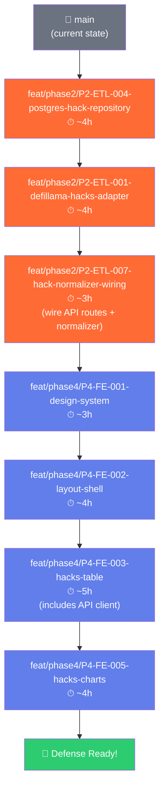

# Defense Sprint — Revised Plan (1 Task = 1 Branch)

## 🎯 Context

The team follows strict Git conventions: **every task ID gets its own branch** (`type/phase/task-id-description`), its own atomic commits, and its own PR. The defense sprint cherry-picks tasks across Phase 2 and Phase 4, but each task still gets a proper branch.

---

## 📋 Branch Execution Order

Each branch depends on the one above it being merged first. This is the **critical path** to a working demo.

**Total: ~27 hours across 7 branches/PRs**

---

## 📦 Branch Details

### Branch 1: `feat/phase2/P2-ETL-004-postgres-hack-repository`

| Field | Value |
|-------|-------|
| Task ID | P2-ETL-004 |
| Phase | Phase 2 — Data Pipelines & ETL |
| Scope | `hacks-engine` |
| Est. Hours | 4h |
| Status | ✅ Code already written (stashed) |

**What gets committed:**
- `packages/hacks-engine/src/adapters/postgres-hack.repository.ts` — Full `IHackDataPort` implementation
- `packages/hacks-engine/src/adapters/index.ts` — Updated barrel export

**Why first:** Everything downstream (API routes, frontend) depends on being able to query hack data from PostgreSQL.

---

### Branch 2: `feat/phase2/P2-ETL-001-defillama-hacks-adapter`

| Field | Value |
|-------|-------|
| Task ID | P2-ETL-001 |
| Phase | Phase 2 — Data Pipelines & ETL |
| Scope | `hacks-engine` |
| Est. Hours | 4h |

**What gets committed:**
- `packages/hacks-engine/src/adapters/defillama.adapter.ts` — HTTP client for `api.llama.fi/hacks`
- Zod schema for raw DefiLlama API response validation
- Retry logic with exponential backoff
- Unit tests with mocked HTTP responses

**Why:** This is the primary data source. Even though we have seed data, the defense demo is stronger if you can say *"we fetch real-time data from DefiLlama's API"*. Academically, this is the ETL pipeline design that your thesis documents.

> [!TIP]
> If time is extremely tight (< 3 days to defense), this branch can be **deferred**. The 55 seed records are sufficient for the dashboard demo. But implementing it strengthens the academic narrative significantly.

---

### Branch 3: `feat/phase2/P2-ETL-007-hack-normalizer-wiring`

| Field | Value |
|-------|-------|
| Task ID | P2-ETL-007 |
| Phase | Phase 2 — Data Pipelines & ETL |
| Scope | `api-gateway`, `hacks-engine` |
| Est. Hours | 3h |

**What gets committed:**
- `packages/hacks-engine/src/application/hack-normalizer.ts` — Chain/vector/platform classification
- `apps/api-gateway/src/routes/hacks.routes.ts` — Replace all `501 Not Implemented` handlers with real `PostgresHackRepository` queries
- `apps/api-gateway/src/server.ts` — Initialize DB connection and inject repository

**Why:** This is the **pivot branch** — after this merges, all 8 hacks API endpoints return real data instead of 501s. The frontend can start consuming.

---

### Branch 4: `feat/phase4/P4-FE-001-design-system`

| Field | Value |
|-------|-------|
| Task ID | P4-FE-001 |
| Phase | Phase 4 — Frontend Implementation |
| Scope | `web` |
| Est. Hours | 3h |

**What gets committed:**
- `apps/web/src/styles/globals.css` — CSS custom properties, dark mode, typography, spacing tokens
- `apps/web/src/styles/design-tokens.css` — Color palette using chain brand colors from `@aegis/core`
- `apps/web/src/app/layout.tsx` — Updated with Google Fonts, global styles import
- Font imports (Inter / Outfit)

---

### Branch 5: `feat/phase4/P4-FE-002-layout-shell`

| Field | Value |
|-------|-------|
| Task ID | P4-FE-002 |
| Phase | Phase 4 — Frontend Implementation |
| Scope | `web` |
| Est. Hours | 4h |

**What gets committed:**
- `apps/web/src/components/layout/Sidebar.tsx` — Navigation sidebar with route links
- `apps/web/src/components/layout/Header.tsx` — Top header with branding
- `apps/web/src/components/layout/AppShell.tsx` — Layout wrapper
- `apps/web/src/app/hacks/page.tsx` — Hacks Dashboard route
- `apps/web/src/app/page.tsx` — Updated landing page (redirect or dashboard overview)

---

### Branch 6: `feat/phase4/P4-FE-003-hacks-dashboard-table`

| Field | Value |
|-------|-------|
| Task ID | P4-FE-003 |
| Phase | Phase 4 — Frontend Implementation |
| Scope | `web` |
| Est. Hours | 5h |

**What gets committed:**
- `apps/web/src/lib/api-client.ts` — Type-safe fetch functions for all hacks endpoints
- `apps/web/src/hooks/useHacks.ts` — Data fetching hook with loading/error states
- `apps/web/src/components/hacks/HacksTable.tsx` — Paginated sortable data table
- `apps/web/src/components/hacks/HackBadges.tsx` — Chain, vector, severity badge components
- `apps/web/src/app/hacks/page.tsx` — Updated with table integration

> [!NOTE]
> The API client (P4-FE-009) is bundled into this branch because the table is unusable without it. This is a pragmatic merge of two tightly coupled tasks.

---

### Branch 7: `feat/phase4/P4-FE-005-hacks-charts`

| Field | Value |
|-------|-------|
| Task ID | P4-FE-005 |
| Phase | Phase 4 — Frontend Implementation |
| Scope | `web` |
| Est. Hours | 4h |

**What gets committed:**
- `apps/web/src/components/hacks/StatsCards.tsx` — Total hacks, total stolen, recovery rate, POC coverage
- `apps/web/src/components/hacks/TimelineChart.tsx` — Hacks over time (using lightweight charting — CSS/SVG or Chart.js)
- `apps/web/src/components/hacks/VectorChart.tsx` — Attack vector distribution
- `apps/web/src/components/hacks/ChainChart.tsx` — Chain breakdown
- `apps/web/src/app/hacks/page.tsx` — Final integration with charts above table

---

## ⚡ Acceleration Options

If time is critically short, here's what to cut:

| Priority | Branch | Cut? | Impact |
|----------|--------|------|--------|
| P0 | Branch 1 (Postgres Repo) | **Never cut** | No data = no demo |
| P0 | Branch 3 (API Wiring) | **Never cut** | No API = no frontend |
| P0 | Branch 4 (Design System) | **Never cut** | No styles = ugly demo |
| P0 | Branch 5 (Layout Shell) | **Never cut** | No navigation = broken app |
| P0 | Branch 6 (Hacks Table) | **Never cut** | This IS the demo |
| P1 | Branch 7 (Charts) | Cut if < 2 days | Table alone is a valid demo |
| P1 | Branch 2 (DefiLlama) | Cut if < 3 days | Seed data sufficient for demo |

**Minimum viable defense demo = Branches 1, 3, 4, 5, 6 (~19 hours, 5 PRs)**

---

## Open Questions

> [!IMPORTANT]
> **Q1: Should I start executing Branch 1 right now?**
> The code is already written and stashed. I can create the branch, pop the stash, commit, push, and generate the PR description in ~5 minutes.

> [!IMPORTANT]
> **Q2: For the deferred Phase 2 tasks (P2-ETL-002, P2-ETL-003, P2-ETL-005, P2-ETL-006, etc.), do you want me to create placeholder tracking issues or leave them as-is in `CODE_REVIEW_PHASE2.md`?**

> [!IMPORTANT]
> **Q3: How many days do you have before the defense?**
> This determines whether we include Branch 2 (DefiLlama adapter) and Branch 7 (Charts).
