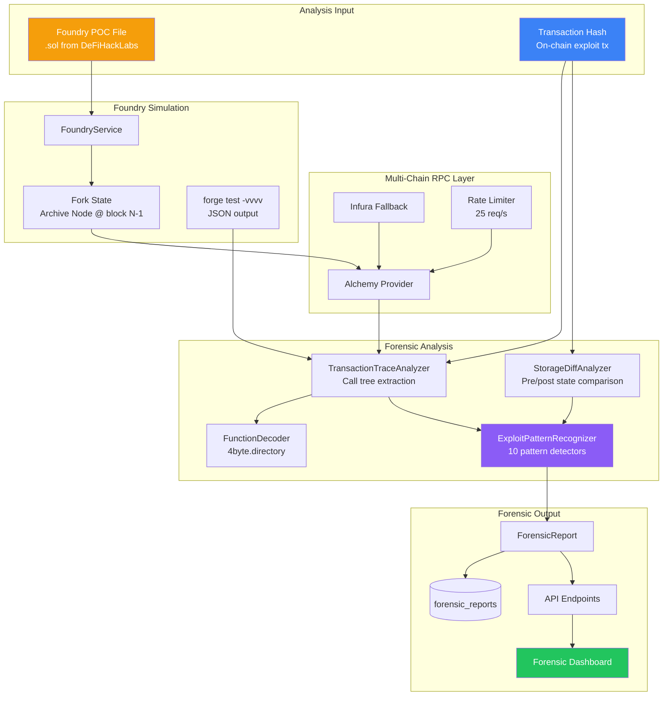

# 🔬 Phase 5 — Deep EVM Integration (Thesis 2)

> **AltFlex AEGIS v3.0** · Adaptive Exploit & Governance Intelligence System
> Phase Goal: Build a forensic intelligence engine that simulates exploit POCs via Foundry, traces on-chain transactions call-by-call, analyzes storage state diffs, automatically classifies exploit patterns, and visualizes all findings through an interactive frontend.
> **Academic Mapping**: Thesis 2 — "Programmable Forensic Replay and Exploit Pattern Recognition on the Ethereum Virtual Machine"

---

## 📋 Table of Contents

1. [Overview & Goals](#overview--goals)
2. [Forensic Architecture](#forensic-architecture)
3. [Multi-Chain RPC Provider](#multi-chain-rpc-provider)
4. [Foundry Integration Service](#foundry-integration-service)
5. [Transaction Trace Analyzer](#transaction-trace-analyzer)
6. [Storage Diff Analyzer](#storage-diff-analyzer)
7. [Exploit Pattern Recognizer](#exploit-pattern-recognizer)
8. [Forensic Use Case Orchestrator](#forensic-use-case-orchestrator)
9. [Forensic API Endpoints](#forensic-api-endpoints)
10. [Forensic Frontend — Trace Viewer](#forensic-frontend--trace-viewer)
11. [Forensic Frontend — Storage Diff Inspector](#forensic-frontend--storage-diff-inspector)
12. [Forensic Frontend — Pattern Report](#forensic-frontend--pattern-report)
13. [Evaluation Framework](#evaluation-framework)
14. [Thesis Methodology Notes](#thesis-methodology-notes)
15. [Validation Checklist](#validation-checklist)

---

## Overview & Goals

Phase 5 unlocks the **forensic superpower** of AltFlex AEGIS. While Phases 2–3 index historical hack data and analyze skill file safety, Phase 5 enables **active forensic analysis** of how exploits actually executed on-chain.

### What Phase 5 Delivers

```
┌────────────────────────────────────────────────────────────────────────┐
│ AltFlex AEGIS Forensic Engine │
│ │
│ Input: Exploit POC file ──OR── On-chain tx hash │
│ │
│ ┌─────────────┐ ┌──────────────┐ ┌──────────────┐ │
│ │ Foundry │ │ Transaction │ │ Storage │ │
│ │ Simulator │ │ Tracer │ │ Diff Analyzer│ │
│ │ │ │ │ │ │ │
│ │ forge test │ │ call tree │ │ pre vs post │ │
│ │ fork mode │ │ decoding │ │ slot changes│ │
│ └──────┬──────┘ └──────┬──────┘ └──────┬──────┘ │
│ └──────────────────┼──────────────────┘ │
│ ▼ │
│ ┌──────────────────┐ │
│ │ Exploit Pattern │ │
│ │ Recognizer │ │
│ │ │ │
│ │ 10 attack types │ │
│ │ confidence score │ │
│ └────────┬─────────┘ │
│ ▼ │
│ Output: ForensicReport { trace, diff, patterns, narrative } │
└────────────────────────────────────────────────────────────────────────┘
```

### Academic Contribution

| Aspect                | Detail                                                                                                                |
| --------------------- | --------------------------------------------------------------------------------------------------------------------- |
| **Title**             | Programmable Forensic Replay and Exploit Pattern Recognition on the EVM                                               |
| **Research Question** | Can automated analysis of EVM execution traces and storage state changes accurately classify DeFi exploit techniques? |
| **Core Method**       | Programmatic trace extraction + declarative pattern matching against call tree/storage diff                           |
| **Evaluation**        | Pattern recognition macro F1 ≥ 0.80 against labeled exploit dataset                                                   |
| **Dataset**           | 50+ historical exploit transactions with human-assigned pattern labels                                                |
| **Novel Aspect**      | First integrated system combining POC simulation + automated pattern classification                                   |

---

## Forensic Architecture

### System Overview



---

## Multi-Chain RPC Provider

### Implementation

```typescript
// packages/forensic-engine/src/adapters/rpc/ChainRpcProvider.ts
import { createPublicClient, http, fallback, Chain as ViemChain } from 'viem';
import { mainnet, bsc, polygon, arbitrum, optimism, avalanche, base } from 'viem/chains';
import { createLogger } from '@aegis/core';
import type { IRpcPort } from '../../ports/IRpcPort';
/**
 * ChainRpcProvider — Abstracted multi-chain RPC access layer.
 *
 * Features:
 * - Alchemy primary, Infura fallback
 * - Automatic failover on 429/5xx
 * - Rate limiting per chain
 * - Archive node validation
 *
 * @hexagonal Driven Adapter — Infrastructure Layer
 */
export class ChainRpcProvider implements IRpcPort {
  private readonly logger = createLogger('rpc-provider');
  private readonly clients: Map<string, ReturnType<typeof createPublicClient>> = new Map();
  private readonly CHAIN_CONFIG: Record<
    string,
    {
      viemChain: ViemChain;
      alchemySubdomain: string;
      infuraSubdomain: string;
    }
  > = {
    ethereum: { viemChain: mainnet, alchemySubdomain: 'eth-mainnet', infuraSubdomain: 'mainnet' },
    bsc: { viemChain: bsc, alchemySubdomain: 'bnb-mainnet', infuraSubdomain: 'bsc-mainnet' },
    polygon: {
      viemChain: polygon,
      alchemySubdomain: 'polygon-mainnet',
      infuraSubdomain: 'polygon-mainnet',
    },
    arbitrum: {
      viemChain: arbitrum,
      alchemySubdomain: 'arb-mainnet',
      infuraSubdomain: 'arbitrum-mainnet',
    },
    optimism: {
      viemChain: optimism,
      alchemySubdomain: 'opt-mainnet',
      infuraSubdomain: 'optimism-mainnet',
    },
    avalanche: {
      viemChain: avalanche,
      alchemySubdomain: 'avax-mainnet',
      infuraSubdomain: 'avalanche-mainnet',
    },
    base: { viemChain: base, alchemySubdomain: 'base-mainnet', infuraSubdomain: 'base-mainnet' },
  };
  constructor(
    private readonly alchemyKey: string,
    private readonly infuraKey: string,
  ) {
    this.initializeClients();
  }
  private initializeClients(): void {
    for (const [chain, config] of Object.entries(this.CHAIN_CONFIG)) {
      const alchemyUrl = `https://${config.alchemySubdomain}.g.alchemy.com/v2/${this.alchemyKey}`;
      const infuraUrl = `https://${config.infuraSubdomain}.infura.io/v3/${this.infuraKey}`;
      const client = createPublicClient({
        chain: config.viemChain,
        transport: fallback([
          http(alchemyUrl, { retryCount: 3, retryDelay: 1000 }),
          http(infuraUrl, { retryCount: 2, retryDelay: 2000 }),
        ]),
      });
      this.clients.set(chain, client);
      this.logger.info(`RPC client initialized for ${chain}`);
    }
  }
  getClient(chain: string): ReturnType<typeof createPublicClient> {
    const client = this.clients.get(chain.toLowerCase());
    if (!client) {
      throw new Error(
        `Unsupported chain: ${chain}. Supported: ${[...this.clients.keys()].join(', ')}`,
      );
    }
    return client;
  }
  async getTransaction(chain: string, txHash: string) {
    const client = this.getClient(chain);
    return client.getTransaction({ hash: txHash as `0x${string}` });
  }
  async getTransactionReceipt(chain: string, txHash: string) {
    const client = this.getClient(chain);
    return client.getTransactionReceipt({ hash: txHash as `0x${string}` });
  }
  async getBlock(chain: string, blockNumber: bigint) {
    const client = this.getClient(chain);
    return client.getBlock({ blockNumber });
  }
  async getStorageAt(chain: string, address: string, slot: string, blockNumber?: bigint) {
    const client = this.getClient(chain);
    return client.getStorageAt({
      address: address as `0x${string}`,
      slot: slot as `0x${string}`,
      blockNumber,
    });
  }
  /**
   * Trace transaction using debug_traceTransaction.
   * Requires archive node with debug API enabled.
   */
  async traceTransaction(chain: string, txHash: string): Promise<TraceResult> {
    const client = this.getClient(chain);
    // Use raw RPC call for debug_traceTransaction (not in viem's typed API)
    const result = await client.request({
      method: 'debug_traceTransaction' as any,
      params: [txHash, { tracer: 'callTracer', tracerConfig: { withLog: true } }],
    });
    return result as TraceResult;
  }
  /**
   * Health check: verify all chain connections.
   */
  async healthCheck(): Promise<Record<string, boolean>> {
    const results: Record<string, boolean> = {};
    for (const [chain, client] of this.clients) {
      try {
        await client.getBlockNumber();
        results[chain] = true;
      } catch {
        results[chain] = false;
      }
    }
    return results;
  }
}
// ── Types ──────────────────────────
export interface TraceResult {
  type: string;
  from: string;
  to: string;
  value: string;
  gas: string;
  gasUsed: string;
  input: string;
  output: string;
  error?: string;
  calls?: TraceResult[];
  logs?: TraceLog[];
}
interface TraceLog {
  address: string;
  topics: string[];
  data: string;
}
```

---

## Foundry Integration Service

### Implementation

```typescript
// packages/forensic-engine/src/adapters/foundry/FoundryService.ts
import { exec } from 'child_process';
import { promisify } from 'util';
import { writeFile, mkdir, rm } from 'fs/promises';
import { join } from 'path';
import { randomUUID } from 'crypto';
import { createLogger } from '@aegis/core';
const execAsync = promisify(exec);
/**
 * FoundryService — Programmatic Foundry/forge execution for POC simulation.
 *
 * Creates ephemeral Foundry projects in /tmp, configures fork parameters,
 * executes forge test, and parses structured output.
 *
 * @hexagonal Driven Adapter — Infrastructure Layer
 * @requires `forge` binary installed and available in PATH
 */
export class FoundryService {
  private readonly logger = createLogger('foundry-service');
  private readonly TIMEOUT_MS = 120_000; // 2 minutes
  constructor(private readonly rpcUrls: Record<string, string>) {}
  /**
   * Validate that forge is available.
   */
  async validateInstallation(): Promise<boolean> {
    try {
      const { stdout } = await execAsync('forge --version', { timeout: 5000 });
      this.logger.info(`Foundry detected: ${stdout.trim()}`);
      return true;
    } catch {
      this.logger.error('Foundry (forge) not found in PATH');
      return false;
    }
  }
  /**
   * Execute a POC simulation against forked mainnet state.
   *
   * @param pocContent - Solidity test file content
   * @param chain - Target chain for fork
   * @param forkBlock - Block number to fork from (pre-exploit)
   * @param testName - Specific test function to run (e.g., "testExploit")
   */
  async simulate(params: SimulationParams): Promise<SimulationResult> {
    const projectDir = join(process.env.TEMP || '/tmp', `aegis-forge-${randomUUID()}`);
    const startTime = Date.now();
    try {
      // 1. Create ephemeral Foundry project
      await this.scaffoldProject(projectDir, params);
      // 2. Execute forge test
      const forgeResult = await this.runForgeTest(projectDir, params);
      // 3. Parse output
      return {
        success: forgeResult.success,
        gasUsed: forgeResult.gasUsed,
        traces: forgeResult.traces,
        logs: forgeResult.logs,
        duration: Date.now() - startTime,
        rawOutput: forgeResult.rawOutput,
      };
    } catch (error) {
      this.logger.error(`Simulation failed: ${(error as Error).message}`);
      return {
        success: false,
        gasUsed: 0n,
        traces: [],
        logs: [],
        duration: Date.now() - startTime,
        error: (error as Error).message,
      };
    } finally {
      // Cleanup
      await rm(projectDir, { recursive: true, force: true }).catch(() => {});
    }
  }
  private async scaffoldProject(dir: string, params: SimulationParams): Promise<void> {
    await mkdir(join(dir, 'src'), { recursive: true });
    await mkdir(join(dir, 'test'), { recursive: true });
    // foundry.toml
    const rpcUrl = this.rpcUrls[params.chain];
    if (!rpcUrl) throw new Error(`No RPC URL configured for chain: ${params.chain}`);
    const foundryToml = `
[profile.default]
src = "src"
out = "out"
libs = ["lib"]
solc_version = "${params.solcVersion || '0.8.20'}"
[rpc_endpoints]
mainnet = "${rpcUrl}"
[profile.default.fuzz]
runs = 1
`.trim();
    await writeFile(join(dir, 'foundry.toml'), foundryToml);
    // Write POC test file
    await writeFile(join(dir, 'test', 'Exploit.t.sol'), params.pocContent);
    // Install dependencies (forge-std)
    await execAsync('forge install foundry-rs/forge-std --no-commit', {
      cwd: dir,
      timeout: 30_000,
    });
  }
  private async runForgeTest(dir: string, params: SimulationParams): Promise<ForgeOutput> {
    const cmd = [
      'forge test',
      params.testName ? `--match-test ${params.testName}` : '',
      `--fork-url ${this.rpcUrls[params.chain]}`,
      params.forkBlock ? `--fork-block-number ${params.forkBlock}` : '',
      '-vvvv',
      '--json',
    ]
      .filter(Boolean)
      .join(' ');
    try {
      const { stdout, stderr } = await execAsync(cmd, {
        cwd: dir,
        timeout: this.TIMEOUT_MS,
        maxBuffer: 50 * 1024 * 1024, // 50MB buffer for large traces
      });
      return this.parseForgeOutput(stdout);
    } catch (error: any) {
      if (error.killed) {
        throw new Error(`Simulation timed out after ${this.TIMEOUT_MS / 1000}s`);
      }
      // Forge returns exit code 1 for test failures — still parse output
      if (error.stdout) {
        return this.parseForgeOutput(error.stdout);
      }
      throw error;
    }
  }
  private parseForgeOutput(stdout: string): ForgeOutput {
    try {
      const json = JSON.parse(stdout);
      const testResults = Object.values(json) as any[];
      if (testResults.length === 0) {
        return { success: false, gasUsed: 0n, traces: [], logs: [], rawOutput: stdout };
      }
      const result = testResults[0];
      const testCases = Object.values(result.test_results || {}) as any[];
      const firstTest = testCases[0] || {};
      return {
        success: firstTest.status === 'Success',
        gasUsed: BigInt(firstTest.gas_used || 0),
        traces: this.extractTraces(firstTest.decoded_logs || []),
        logs: firstTest.logs || [],
        rawOutput: stdout,
      };
    } catch {
      // Non-JSON output — test likely failed to compile
      return { success: false, gasUsed: 0n, traces: [], logs: [], rawOutput: stdout };
    }
  }
  private extractTraces(decodedLogs: string[]): ForgeTrace[] {
    // Parse verbose trace output into structured traces
    // (Forge -vvvv output is semi-structured text)
    return decodedLogs.map((log, i) => ({
      depth: 0,
      type: 'LOG' as const,
      content: log,
      index: i,
    }));
  }
}
// ── Types ──────────────────────────
interface SimulationParams {
  pocContent: string;
  chain: string;
  forkBlock?: number;
  testName?: string;
  solcVersion?: string;
}
interface SimulationResult {
  success: boolean;
  gasUsed: bigint;
  traces: ForgeTrace[];
  logs: any[];
  duration: number;
  rawOutput?: string;
  error?: string;
}
interface ForgeOutput {
  success: boolean;
  gasUsed: bigint;
  traces: ForgeTrace[];
  logs: any[];
  rawOutput: string;
}
interface ForgeTrace {
  depth: number;
  type: string;
  content: string;
  index: number;
}
```

---

## Transaction Trace Analyzer

### Implementation

```typescript
// packages/forensic-engine/src/adapters/analysis/TransactionTraceAnalyzer.ts
import { createLogger } from '@aegis/core';
import { FunctionDecoder } from './FunctionDecoder';
import type { TraceResult } from '../rpc/ChainRpcProvider';
/**
 * TransactionTraceAnalyzer — Extracts and analyzes EVM call trees
 * from debug_traceTransaction output.
 *
 * Transforms raw trace data into a structured CallTree with:
 * - Decoded function signatures
 * - Gas breakdown per contract
 * - Reentrancy detection
 * - Value flow tracking
 *
 * @academic This is the primary data extraction layer for Thesis 2 analysis.
 */
export class TransactionTraceAnalyzer {
  private readonly logger = createLogger('trace-analyzer');
  constructor(private readonly decoder: FunctionDecoder) {}
  /**
   * Analyze a raw trace result into a structured TransactionTrace.
   */
  async analyze(rawTrace: TraceResult, txHash: string): Promise<TransactionTrace> {
    this.logger.info(`Analyzing trace for ${txHash}`);
    // 1. Build call tree
    const callTree = await this.buildCallTree(rawTrace, 0);
    // 2. Extract all events
    const events = this.extractEvents(rawTrace);
    // 3. Compute gas breakdown
    const gasBreakdown = this.computeGasBreakdown(callTree);
    // 4. Detect reentrancy
    const reentrancyWarnings = this.detectReentrancy(callTree);
    // 5. Compute value flow
    const valueFlow = this.computeValueFlow(callTree);
    // 6. Count unique contracts
    const uniqueContracts = new Set<string>();
    this.collectAddresses(callTree, uniqueContracts);
    return {
      txHash,
      callTree,
      events,
      gasBreakdown,
      reentrancyWarnings,
      valueFlow,
      totalCalls: this.countNodes(callTree),
      uniqueContracts: [...uniqueContracts],
    };
  }
  private async buildCallTree(trace: TraceResult, depth: number): Promise<CallTreeNode> {
    // Decode function selector
    const selector = trace.input?.slice(0, 10) || '0x';
    const decoded = selector.length >= 10 ? await this.decoder.decode(selector) : undefined;
    const node: CallTreeNode = {
      id: `${trace.from}-${trace.to}-${depth}-${selector}`,
      depth,
      type: trace.type as CallType,
      from: trace.from,
      to: trace.to || '',
      value: BigInt(trace.value || '0x0'),
      gasUsed: BigInt(trace.gasUsed || '0'),
      input: trace.input || '',
      output: trace.output || '',
      decodedCall: decoded,
      error: trace.error,
      children: [],
    };
    // Recursively process child calls
    if (trace.calls) {
      for (const childTrace of trace.calls) {
        const childNode = await this.buildCallTree(childTrace, depth + 1);
        node.children.push(childNode);
      }
    }
    return node;
  }
  /**
   * Detect reentrancy: same contract called multiple times
   * at increasing depth before state is committed.
   */
  private detectReentrancy(
    node: CallTreeNode,
    ancestorAddresses = new Set<string>(),
  ): ReentrancyWarning[] {
    const warnings: ReentrancyWarning[] = [];
    if (ancestorAddresses.has(node.to)) {
      warnings.push({
        address: node.to,
        depth: node.depth,
        decodedCall: node.decodedCall,
        severity: node.depth > 2 ? 'high' : 'medium',
      });
    }
    const newAncestors = new Set(ancestorAddresses);
    newAncestors.add(node.to);
    for (const child of node.children) {
      warnings.push(...this.detectReentrancy(child, newAncestors));
    }
    return warnings;
  }
  private computeGasBreakdown(node: CallTreeNode): Record<string, bigint> {
    const breakdown: Record<string, bigint> = {};
    this.accumulateGas(node, breakdown);
    return breakdown;
  }
  private accumulateGas(node: CallTreeNode, acc: Record<string, bigint>): void {
    const addr = node.to.toLowerCase();
    acc[addr] = (acc[addr] || 0n) + node.gasUsed;
    for (const child of node.children) {
      this.accumulateGas(child, acc);
    }
  }
  private computeValueFlow(node: CallTreeNode): ValueTransfer[] {
    const transfers: ValueTransfer[] = [];
    this.collectValueTransfers(node, transfers);
    return transfers;
  }
  private collectValueTransfers(node: CallTreeNode, acc: ValueTransfer[]): void {
    if (node.value > 0n) {
      acc.push({ from: node.from, to: node.to, value: node.value });
    }
    for (const child of node.children) {
      this.collectValueTransfers(child, acc);
    }
  }
  private extractEvents(trace: TraceResult): DecodedEvent[] {
    const events: DecodedEvent[] = [];
    this.collectLogs(trace, events);
    return events;
  }
  private collectLogs(trace: TraceResult, acc: DecodedEvent[]): void {
    if (trace.logs) {
      for (const log of trace.logs) {
        acc.push({
          address: log.address,
          topics: log.topics,
          data: log.data,
          decoded: undefined, // Decode in a later pass
        });
      }
    }
    if (trace.calls) {
      for (const child of trace.calls) {
        this.collectLogs(child, acc);
      }
    }
  }
  private countNodes(node: CallTreeNode): number {
    return 1 + node.children.reduce((sum, c) => sum + this.countNodes(c), 0);
  }
  private collectAddresses(node: CallTreeNode, set: Set<string>): void {
    set.add(node.from.toLowerCase());
    if (node.to) set.add(node.to.toLowerCase());
    for (const child of node.children) {
      this.collectAddresses(child, set);
    }
  }
}
// ── Types ──────────────────────────
export interface CallTreeNode {
  id: string;
  depth: number;
  type: CallType;
  from: string;
  to: string;
  value: bigint;
  gasUsed: bigint;
  input: string;
  output: string;
  decodedCall?: DecodedCall;
  error?: string;
  children: CallTreeNode[];
}
export interface DecodedCall {
  signature: string;
  selector: string;
  name: string;
  args: DecodedArg[];
}
export interface DecodedArg {
  name: string;
  type: string;
  value: string;
}
export type CallType =
  | 'CALL'
  | 'STATICCALL'
  | 'DELEGATECALL'
  | 'CREATE'
  | 'CREATE2'
  | 'SELFDESTRUCT';
export interface TransactionTrace {
  txHash: string;
  callTree: CallTreeNode;
  events: DecodedEvent[];
  gasBreakdown: Record<string, bigint>;
  reentrancyWarnings: ReentrancyWarning[];
  valueFlow: ValueTransfer[];
  totalCalls: number;
  uniqueContracts: string[];
}
interface ReentrancyWarning {
  address: string;
  depth: number;
  decodedCall?: DecodedCall;
  severity: string;
}
interface ValueTransfer {
  from: string;
  to: string;
  value: bigint;
}
interface DecodedEvent {
  address: string;
  topics: string[];
  data: string;
  decoded?: { name: string; args: Record<string, string> };
}
```

### Function Signature Decoder

```typescript
// packages/forensic-engine/src/adapters/analysis/FunctionDecoder.ts
import axios from 'axios';
/**
 * FunctionDecoder — Resolves 4-byte function selectors to human-readable signatures
 * using the 4byte.directory API and a local LRU cache.
 */
export class FunctionDecoder {
  private readonly cache = new Map<string, DecodedCall | null>();
  // Well-known selectors for common DeFi functions (avoid API calls)
  private readonly KNOWN_SELECTORS: Record<string, string> = {
    '0xa9059cbb': 'transfer(address,uint256)',
    '0x23b872dd': 'transferFrom(address,address,uint256)',
    '0x095ea7b3': 'approve(address,uint256)',
    '0x70a08231': 'balanceOf(address)',
    '0x18160ddd': 'totalSupply()',
    '0xd0e30db0': 'deposit()',
    '0x2e1a7d4d': 'withdraw(uint256)',
    '0x38ed1739': 'swapExactTokensForTokens(uint256,uint256,address[],address,uint256)',
    '0x022c0d9f': 'swap(uint256,uint256,address,bytes)',
    '0x128acb08': 'swap(address,bool,int256,uint160,bytes)',
    '0xab834bab':
      'atomicMatch_(address[14],uint256[18],uint8[8],bytes,bytes,bytes,bytes,bytes,bytes,uint8[2],bytes32[5])',
    '0x5c11d795':
      'swapExactTokensForTokensSupportingFeeOnTransferTokens(uint256,uint256,address[],address,uint256)',
  };
  async decode(selector: string): Promise<DecodedCall | undefined> {
    // Check cache
    if (this.cache.has(selector)) {
      return this.cache.get(selector) || undefined;
    }
    // Check known selectors
    if (this.KNOWN_SELECTORS[selector]) {
      const sig = this.KNOWN_SELECTORS[selector];
      const decoded = this.parseSignature(selector, sig);
      this.cache.set(selector, decoded);
      return decoded;
    }
    // Query 4byte.directory
    try {
      const { data } = await axios.get(
        `https://www.4byte.directory/api/v1/signatures/?hex_signature=${selector}`,
        { timeout: 5000 },
      );
      if (data.results?.length > 0) {
        const sig = data.results[0].text_signature;
        const decoded = this.parseSignature(selector, sig);
        this.cache.set(selector, decoded);
        return decoded;
      }
    } catch {
      // API unavailable — return raw selector
    }
    this.cache.set(selector, null);
    return undefined;
  }
  private parseSignature(selector: string, signature: string): DecodedCall {
    const nameMatch = signature.match(/^(\w+)/);
    return {
      signature,
      selector,
      name: nameMatch ? nameMatch[1] : signature,
      args: [], // Full arg decoding requires ABI
    };
  }
}
```

---

## Exploit Pattern Recognizer

### Architecture

```typescript
// packages/forensic-engine/src/domain/patterns/ExploitPatternRecognizer.ts
import { createLogger } from '@aegis/core';
import type {
  TransactionTrace,
  CallTreeNode,
} from '../../adapters/analysis/TransactionTraceAnalyzer';
import type { StorageDiff } from '../../adapters/analysis/StorageDiffAnalyzer';
/**
 * ExploitPatternRecognizer — Analyzes traces + storage diffs to
 * automatically classify exploit techniques.
 *
 * Supports 10 pattern types. Each detector is independent and
 * returns a confidence score (0.0–1.0).
 *
 * Multiple patterns can be detected per transaction (composable attacks).
 *
 * @academic This is the core classification engine for Thesis 2.
 */
export class ExploitPatternRecognizer {
  private readonly logger = createLogger('pattern-recognizer');
  private readonly detectors: PatternDetector[];
  constructor() {
    this.detectors = [
      new FlashLoanDetector(),
      new ReentrancyDetector(),
      new OracleManipulationDetector(),
      new AccessControlDetector(),
      new ArithmeticOverflowDetector(),
      new FrontrunningDetector(),
      new DelegatecallInjectionDetector(),
      new SelfDestructDetector(),
      new LogicErrorDetector(),
      new BridgeExploitDetector(),
    ];
  }
  /**
   * Analyze a trace + storage diff for all known exploit patterns.
   */
  recognize(trace: TransactionTrace, storageDiff: StorageDiff[]): PatternResult {
    const matches: PatternMatch[] = [];
    for (const detector of this.detectors) {
      try {
        const match = detector.detect(trace, storageDiff);
        if (match && match.confidence >= 0.5) {
          matches.push(match);
          this.logger.info(
            `Pattern detected: ${match.patternId} (${(match.confidence * 100).toFixed(0)}%)`,
          );
        }
      } catch (err) {
        this.logger.warn(`Detector ${detector.id} failed: ${(err as Error).message}`);
      }
    }
    // Sort by confidence
    matches.sort((a, b) => b.confidence - a.confidence);
    const primary = matches.length > 0 ? matches[0].patternId : 'UNKNOWN';
    const avgConfidence =
      matches.length > 0 ? matches.reduce((s, m) => s + m.confidence, 0) / matches.length : 0;
    return { detected: matches, primaryPattern: primary, confidence: avgConfidence };
  }
}
// ── Pattern Detectors ──────────────
abstract class PatternDetector {
  abstract readonly id: string;
  abstract readonly name: string;
  abstract detect(trace: TransactionTrace, diffs: StorageDiff[]): PatternMatch | null;
}
class FlashLoanDetector extends PatternDetector {
  readonly id = 'FLASH_LOAN';
  readonly name = 'Flash Loan Attack';
  private readonly FLASH_LOAN_SIGS = [
    'flashLoan',
    'flashBorrow',
    'executeOperation', // Aave
    'dYdXFlashLoan',
    'callFunction', // dYdX
    'flash',
    'uniswapV3FlashCallback', // Uniswap V3
    'flashLoan',
    'receiveFlashLoan', // Balancer
  ];
  detect(trace: TransactionTrace): PatternMatch | null {
    const flashLoanNodes = this.findNodes(trace.callTree, (node) =>
      this.FLASH_LOAN_SIGS.some((sig) =>
        node.decodedCall?.name.toLowerCase().includes(sig.toLowerCase()),
      ),
    );
    if (flashLoanNodes.length === 0) return null;
    // Check for large value movements (borrow + repay pattern)
    const largeTransfers = trace.valueFlow.filter((t) => t.value > 10n ** 18n); // > 1 ETH
    const confidence = Math.min(
      0.5 + flashLoanNodes.length * 0.15 + (largeTransfers.length > 2 ? 0.2 : 0),
      1.0,
    );
    return {
      patternId: this.id,
      patternName: this.name,
      confidence,
      evidence: {
        flashLoanCalls: flashLoanNodes.map((n) => n.id),
        valueTransfers: largeTransfers.length,
      },
      description: `Flash loan detected via ${flashLoanNodes[0].decodedCall?.name || 'unknown'} with ${largeTransfers.length} large value transfers.`,
    };
  }
  private findNodes(node: CallTreeNode, predicate: (n: CallTreeNode) => boolean): CallTreeNode[] {
    const results: CallTreeNode[] = [];
    if (predicate(node)) results.push(node);
    for (const child of node.children) {
      results.push(...this.findNodes(child, predicate));
    }
    return results;
  }
}
class ReentrancyDetector extends PatternDetector {
  readonly id = 'REENTRANCY';
  readonly name = 'Reentrancy Attack';
  detect(trace: TransactionTrace): PatternMatch | null {
    if (trace.reentrancyWarnings.length === 0) return null;
    const highSeverity = trace.reentrancyWarnings.filter((w) => w.severity === 'high');
    const confidence = Math.min(
      0.6 + highSeverity.length * 0.15 + (trace.reentrancyWarnings.length > 3 ? 0.15 : 0),
      1.0,
    );
    return {
      patternId: this.id,
      patternName: this.name,
      confidence,
      evidence: {
        reentrancyCount: trace.reentrancyWarnings.length,
        addresses: [...new Set(trace.reentrancyWarnings.map((w) => w.address))],
      },
      description: `${trace.reentrancyWarnings.length} reentrancy call(s) detected at depths up to ${Math.max(...trace.reentrancyWarnings.map((w) => w.depth))}.`,
    };
  }
}
class OracleManipulationDetector extends PatternDetector {
  readonly id = 'ORACLE_MANIPULATION';
  readonly name = 'Oracle Price Manipulation';
  private readonly ORACLE_SIGS = [
    'getPrice',
    'latestAnswer',
    'latestRoundData',
    'consult',
    'getAmountsOut',
    'getReserves',
    'observe',
    'slot0',
  ];
  private readonly DEX_SIGS = [
    'swap',
    'swapExactTokensForTokens',
    'swapTokensForExactTokens',
    'addLiquidity',
    'removeLiquidity',
  ];
  detect(trace: TransactionTrace): PatternMatch | null {
    const oracleReads = this.findBySignature(trace.callTree, this.ORACLE_SIGS);
    const dexCalls = this.findBySignature(trace.callTree, this.DEX_SIGS);
    if (oracleReads.length === 0 || dexCalls.length === 0) return null;
    // Pattern: DEX swap → oracle read (oracle reads manipulated price)
    const confidence = Math.min(
      0.5 + (oracleReads.length > 1 ? 0.2 : 0.1) + (dexCalls.length > 1 ? 0.15 : 0),
      1.0,
    );
    return {
      patternId: this.id,
      patternName: this.name,
      confidence,
      evidence: {
        oracleReads: oracleReads.map((n) => n.decodedCall?.name || 'unknown'),
        dexCalls: dexCalls.map((n) => n.decodedCall?.name || 'unknown'),
      },
      description: `${oracleReads.length} oracle read(s) and ${dexCalls.length} DEX interaction(s) in same transaction suggest price manipulation.`,
    };
  }
  private findBySignature(node: CallTreeNode, sigs: string[]): CallTreeNode[] {
    const results: CallTreeNode[] = [];
    if (sigs.some((s) => node.decodedCall?.name.toLowerCase().includes(s.toLowerCase()))) {
      results.push(node);
    }
    for (const child of node.children) {
      results.push(...this.findBySignature(child, sigs));
    }
    return results;
  }
}
// Additional detectors follow the same pattern...
// AccessControlDetector, ArithmeticOverflowDetector, FrontrunningDetector,
// DelegatecallInjectionDetector, SelfDestructDetector, LogicErrorDetector,
// BridgeExploitDetector — each with signature/trace heuristics.
// ── Types ──────────────────────────
export interface PatternMatch {
  patternId: string;
  patternName: string;
  confidence: number;
  evidence: Record<string, unknown>;
  description: string;
}
export interface PatternResult {
  detected: PatternMatch[];
  primaryPattern: string;
  confidence: number;
}
```

---

## Forensic Frontend — Trace Viewer

### Implementation

```tsx
// apps/web/src/components/forensics/TraceViewer.tsx
'use client';
import { useState, useMemo } from 'react';
import { ChevronRight, ChevronDown, Copy, Zap, ArrowRight } from 'lucide-react';
import { motion, AnimatePresence } from 'framer-motion';
import { formatEth, shortenAddress, formatGas } from '@/lib/formatters';
import styles from './TraceViewer.module.css';
interface TraceViewerProps {
  callTree: CallTreeNode;
  totalGas: bigint;
}
const CALL_TYPE_COLORS: Record<string, string> = {
  CALL: 'var(--accent-cyan)',
  STATICCALL: 'var(--text-muted)',
  DELEGATECALL: 'var(--accent-amber)',
  CREATE: 'var(--accent-purple)',
  CREATE2: 'var(--accent-purple)',
  SELFDESTRUCT: 'var(--accent-red)',
};
export function TraceViewer({ callTree, totalGas }: TraceViewerProps) {
  return (
    <div className={styles.viewer}>
      <div className={styles.header}>
        <h3>Transaction Trace</h3>
        <span className={styles.nodeCount}>{countNodes(callTree).toLocaleString()} calls</span>
      </div>
      <div className={styles.tree}>
        <TraceNode node={callTree} totalGas={totalGas} />
      </div>
    </div>
  );
}
function TraceNode({ node, totalGas }: { node: CallTreeNode; totalGas: bigint }) {
  const [expanded, setExpanded] = useState(node.depth < 3);
  const hasChildren = node.children.length > 0;
  const gasPercent = totalGas > 0n ? Number((node.gasUsed * 100n) / totalGas) : 0;
  return (
    <div className={styles.node} style={{ marginLeft: `${node.depth * 20}px` }}>
      <div
        className={`${styles.nodeRow} ${node.error ? styles.errored : ''}`}
        onClick={() => hasChildren && setExpanded(!expanded)}
        role={hasChildren ? 'button' : undefined}
        aria-expanded={hasChildren ? expanded : undefined}
      >
        {/* Expand icon */}
        {hasChildren ? (
          expanded ? (
            <ChevronDown size={14} />
          ) : (
            <ChevronRight size={14} />
          )
        ) : (
          <span className={styles.spacer} />
        )}
        {/* Call type badge */}
        <span
          className={styles.callType}
          style={{ color: CALL_TYPE_COLORS[node.type] || 'var(--text-secondary)' }}
        >
          {node.type}
        </span>
        {/* From → To */}
        <span className={styles.addresses}>
          <code>{shortenAddress(node.from)}</code>
          <ArrowRight size={12} />
          <code>{shortenAddress(node.to)}</code>
        </span>
        {/* Decoded function */}
        {node.decodedCall && <span className={styles.funcName}>{node.decodedCall.name}()</span>}
        {/* Value */}
        {node.value > 0n && <span className={styles.value}>Ξ{formatEth(node.value)}</span>}
        {/* Gas */}
        <span className={styles.gas}>
          <Zap size={10} /> {formatGas(node.gasUsed)} ({gasPercent}%)
        </span>
        {/* Error */}
        {node.error && <span className={styles.error}>⚠ {node.error}</span>}
      </div>
      {/* Children */}
      <AnimatePresence>
        {expanded && hasChildren && (
          <motion.div
            initial={{ opacity: 0, height: 0 }}
            animate={{ opacity: 1, height: 'auto' }}
            exit={{ opacity: 0, height: 0 }}
          >
            {node.children.map((child, i) => (
              <TraceNode key={child.id || i} node={child} totalGas={totalGas} />
            ))}
          </motion.div>
        )}
      </AnimatePresence>
    </div>
  );
}
function countNodes(node: CallTreeNode): number {
  return 1 + node.children.reduce((sum, c) => sum + countNodes(c), 0);
}
```

---

## Thesis Methodology Notes

### Research Design

| Element                  | Detail                                                          |
| ------------------------ | --------------------------------------------------------------- |
| **Research Approach**    | Design Science Research — build and evaluate an artifact        |
| **Artifact**             | Integrated forensic replay and pattern recognition system       |
| **Independent Variable** | Pattern detector configurations                                 |
| **Dependent Variable**   | Classification accuracy (multi-label P/R/F1)                    |
| **Dataset**              | 50+ historical exploit transactions                             |
| **Evaluation**           | Multi-label classification metrics                              |
| **Threats to Validity**  | RPC archive availability, forge compilation, new attack vectors |

### Thesis Chapter Mapping

| Thesis Chapter            | Phase 5 Deliverable                                                     |
| ------------------------- | ----------------------------------------------------------------------- |
| Chapter 3: Methodology    | Forensic architecture, trace extraction method, pattern detection logic |
| Chapter 4: Implementation | RPC provider, Foundry service, trace analyzer, pattern recognizer       |
| Chapter 5: Results        | Evaluation report (F1 per pattern), confusion matrix, case studies      |
| Chapter 6: Discussion     | New attack vector adaptability, gas cost implications, limitations      |
| Appendix A                | Pattern detector rules and heuristics                                   |
| Appendix B                | Labeled exploit dataset                                                 |
| Appendix C                | Case study: Euler Finance exploit trace-through                         |

---

## Validation Checklist

```bash
# 1. RPC connectivity
pnpm --filter forensic-engine run test:rpc
# ✅ All 7 chains reachable, archive queries succeed
# 2. Foundry simulation
pnpm --filter forensic-engine run simulate -- --poc euler_exp.sol --chain ethereum
# ✅ forge test completes, JSON output parsed
# 3. Transaction tracing
pnpm --filter forensic-engine run trace -- --tx 0x... --chain ethereum
# ✅ Call tree extracted, functions decoded
# 4. Storage diff
pnpm --filter forensic-engine run diff -- --tx 0x... --chain ethereum
# ✅ Pre/post storage compared, balance changes identified
# 5. Pattern recognition
pnpm --filter forensic-engine run recognize -- --tx 0x...
# ✅ Correct pattern(s) detected with confidence > 0.6
# 6. API endpoints
curl -X POST http://localhost:4000/api/v1/forensics/trace \
-H "X-API-Key: $API_KEY" -H "Content-Type: application/json" \
-d '{"chain":"ethereum","txHash":"0x..."}'
# ✅ Returns jobId
# 7. Frontend trace viewer
# ✅ Renders 1000+ call nodes without jank
# ✅ Expand/collapse works
# ✅ Function names decoded
# 8. Evaluation
pnpm --filter forensic-engine run evaluate
# ✅ Macro F1 ≥ 0.80 across 10 patterns
# 9. Tests
pnpm run test
# ✅ ≥120 new tests pass
# 10. Build
pnpm run build
# ✅ 0 errors
```

---

## What's Next: Phase 6

Phase 6 (Production Hardening & CI/CD) will deliver:

- 🚀 **Docker Compose** production stack
- 🚀 **GitHub Actions** CI/CD pipeline
- 🚀 **Cloud deployment** (Vercel frontend + Railway/Render backend)
- 🚀 **Monitoring** — Prometheus metrics, Grafana dashboards
- 🚀 **Security audit** — Dependency scanning, OWASP compliance

---

_Document Version: 3.5.0_
_Author: AltFlex AEGIS Engineering_
_Last Updated: March 2026_
