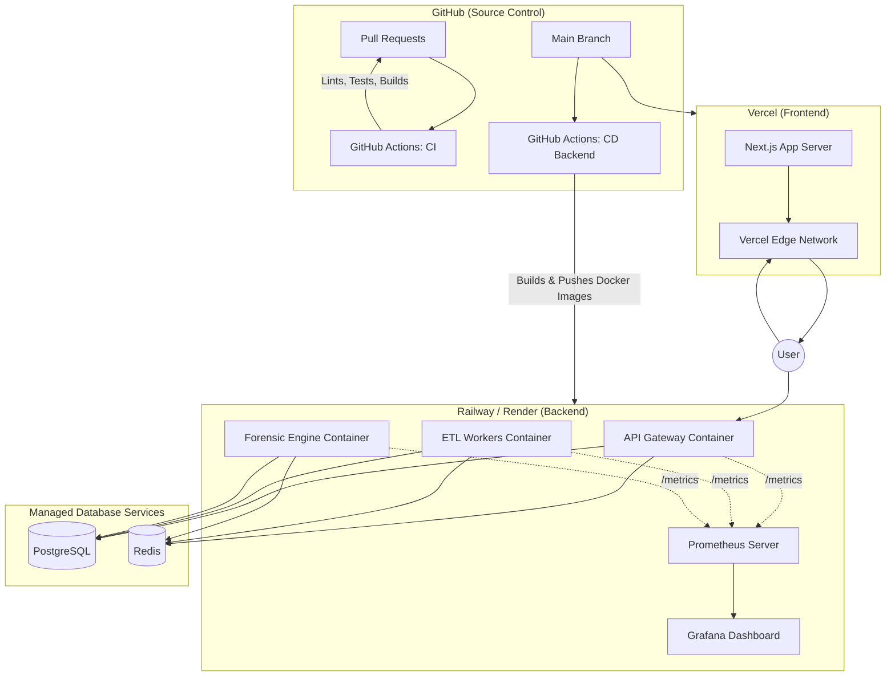

# 🚀 Phase 6 — Production Hardening & CI/CD

> **AltFlex AEGIS v3.0** · Adaptive Exploit & Governance Intelligence System
> Phase Goal: Containerize all services, automate testing/deployment via GitHub Actions, implement comprehensive observability (Prometheus + Grafana), and harden security for a production-grade release.

---

## 📋 Table of Contents

1. [Overview & Goals](#overview--goals)
2. [DevOps Architecture](#devops-architecture)
3. [Containerization (Docker)](#containerization-docker)
4. [CI/CD Pipelines (GitHub Actions)](#cicd-pipelines-github-actions)
5. [Frontend Deployment (Vercel)](#frontend-deployment-vercel)
6. [Observability Strategy (Prometheus & Grafana)](#observability-strategy-prometheus--grafana)
7. [Structured Logging](#structured-logging)
8. [Security Hardening & Rate Limiting](#security-hardening--rate-limiting)
9. [Database Migrations & Backups](#database-migrations--backups)
10. [Validation Checklist](#validation-checklist)

---

## Overview & Goals

Phase 6 marks the transition from local development to production readiness. The goal is to ensure AltFlex AEGIS is secure, observable, and easy to deploy and maintain. This phase focuses entirely on DevOps, SRE, and SecOps practices.

### Key Outcomes

- **Consistency**: Docker ensures the application runs exactly the same in production as it does locally.
- **Automation**: CI/CD pipelines eliminate manual deployment errors and enforce code quality.
- **Visibility**: Prometheus and Grafana provide deep insights into system health and performance.
- **Security**: Security audits and rate-limiting protect the application against abuse.

---

## DevOps Architecture



---

## Containerization (Docker)

### Multi-Stage Dockerfile Strategy

To keep image sizes small and secure, we use multi-stage builds.

#### `api-gateway/Dockerfile`

```dockerfile
# Stage 1: Build environment
FROM node:20-alpine AS builder
WORKDIR /app
# Enable corepack for pnpm support
RUN corepack enable
# Copy workspace configuration and dependency manifests
COPY package.json pnpm-workspace.yaml pnpm-lock.yaml ./
COPY packages/core/package.json ./packages/core/
COPY apps/api-gateway/package.json ./apps/api-gateway/
# Install dependencies (including devDependencies for build)
RUN pnpm install --frozen-lockfile
# Copy source code and build
COPY tsconfig.json ./
COPY packages/core ./packages/core
COPY apps/api-gateway ./apps/api-gateway
RUN pnpm --filter @aegis/core run build
RUN pnpm --filter api-gateway run build
# Stage 2: Production environment
FROM node:20-alpine AS runner
WORKDIR /app
# Set production environment
ENV NODE_ENV=production
# Install only production dependencies (optional, but good practice)
# Here we copy the built output and node_modules from builder.
# For smaller images, investigate pnpm deploy.
COPY --from=builder /app/node_modules ./node_modules
COPY --from=builder /app/packages/core/dist ./packages/core/dist
COPY --from=builder /app/apps/api-gateway/dist ./apps/api-gateway/dist
COPY --from=builder /app/apps/api-gateway/package.json ./apps/api-gateway/package.json
# Expose API port
EXPOSE 4000
# Start command
CMD ["node", "apps/api-gateway/dist/index.js"]
```

#### `forensic-engine/Dockerfile`

This image requires the `forge` binary for trace generation.

```dockerfile
# Stage 1: Build (similar to api-gateway)
# ... [same builder stage as above] ...
# Stage 2: Production environment (needs Foundry)
FROM ghcr.io/foundry-rs/foundry:latest AS foundry
FROM node:20-alpine AS runner
WORKDIR /app
# Install dependencies needed for Foundry/Forge
RUN apk add --no-cache curl git
# Copy forge binary from foundry image
COPY --from=foundry /usr/local/bin/forge /usr/local/bin/forge
# Verify installation
RUN forge --version
ENV NODE_ENV=production
# Copy built application and modules
COPY --from=builder /app/node_modules ./node_modules
COPY --from=builder /app/packages/core/dist ./packages/core/dist
COPY --from=builder /app/apps/forensic-engine/dist ./apps/forensic-engine/dist
CMD ["node", "apps/forensic-engine/dist/index.js"]
```

### Local Development (`docker-compose.yml`)

```yaml
version: '3.8'
services:
db:
image: postgres:15-alpine
environment:
POSTGRES_USER: aegis_dev
POSTGRES_PASSWORD: password
POSTGRES_DB: aegis
ports:
- "5432:5432"
volumes:
- pgdata:/var/lib/postgresql/data
healthcheck:
test: ["CMD-SHELL", "pg_isready -U aegis_dev -d aegis"]
interval: 5s
timeout: 5s
retries: 5
redis:
image: redis:7-alpine
ports:
- "6379:6379"
volumes:
- redisdata:/data
healthcheck:
test: ["CMD", "redis-cli", "ping"]
interval: 5s
timeout: 5s
retries: 5
# ... App services configured to wait for DB/Redis ...
volumes:
pgdata:
redisdata:
```

---

## CI/CD Pipelines (GitHub Actions)

### Continuous Integration (`ci.yml`)

Runs on every Pull Request to ensure code quality.

```yaml
name: CI
on:
pull_request:
branches: [main, develop]
jobs:
build-and-test:
runs-on: ubuntu-latest
steps:
- uses: actions/checkout@v4
- name: Setup Node.js
uses: actions/setup-node@v4
with:
node-version: '20'
- name: Install pnpm
uses: pnpm/action-setup@v3
with:
version: 8
- name: Install dependencies
run: pnpm install --frozen-lockfile
- name: Lint
run: pnpm run lint
- name: Typecheck
run: pnpm run typecheck
- name: Test Core
run: pnpm --filter @aegis/core run test
- name: Test API Gateway
run: pnpm --filter api-gateway run test
- name: Build Web
run: pnpm --filter web run build
env:
NEXT_PUBLIC_API_URL: http://localhost:4000
```

### Continuous Deployment Backend (`deploy-backend.yml`)

## Handles building Docker images and pushing them to a registry (GHCR), then triggering deployment.

## Frontend Deployment (Vercel)

Vercel provides native, optimized support for Next.js.

### Configuration (`vercel.json` optional)

Typically, Vercel zero-config works perfectly. If needed at the repository root:

```json
{
  "buildCommand": "pnpm --filter web run build",
  "outputDirectory": "apps/web/.next",
  "framework": "nextjs"
}
```

### Setup Steps

1. Connect Vercel to the GitHub repository.
2. Select the `apps/web` root directory (if using monorepo features, configure Root Directory accordingly).
3. Add Environment Variables (e.g., `NEXT_PUBLIC_API_URL=https://api.altflex.io`).

---

## Observability Strategy (Prometheus & Grafana)

Visibility into system performance is critical, especially for compute-intensive tasks like the Forensic Engine.

### 1. Exporting Metrics (`prom-client`)

In the Node.js services (e.g., API Gateway):

```typescript
// packages/core/src/metrics/prom-client-setup.ts
import client from 'prom-client';
// Enable default metrics (Memory, CPU, Event Loop)
client.collectDefaultMetrics({ prefix: 'aegis_' });
// Custom Histogram for API Response Times
export const httpReqDurationMicroseconds = new client.Histogram({
  name: 'aegis_http_request_duration_ms',
  help: 'Duration of HTTP requests in ms',
  labelNames: ['method', 'route', 'status_code'],
  buckets: [50, 100, 200, 500, 1000, 2000, 5000],
});
// Expose the /metrics endpoint (often run on a separate internal port, e.g., 9090)
import express from 'express';
const metricsApp = express();
metricsApp.get('/metrics', async (req, res) => {
  res.set('Content-Type', client.register.contentType);
  res.end(await client.register.metrics());
});
export function startMetricsServer(port: number = 9090) {
  metricsApp.listen(port, () => {
    console.log(`Metrics server listening on port ${port}`);
  });
}
```

### 2. Prometheus Configuration (`prometheus.yml`)

```yaml
global:
scrape_interval: 15s
scrape_configs:
- job_name: 'api-gateway'
static_configs:
- targets: ['api-gateway:9090']
- job_name: 'etl-workers'
static_configs:
- targets: ['etl-workers:9090']
- job_name: 'forensic-engine'
static_configs:
- targets: ['forensic-engine:9090']
```

### 3. Grafana Dashboards

Key panels to configure in the Dashboard:

- **Event Loop Lag**: Indicates if the Node.js single thread is struggling.
- **API Request Rates**: Heatmap of `/api/v1/*` activity.
- **Forensic Job Duration**: Identify if certain exploit traces are causing timeouts.
- **Rate Limit Hits**: Track API abuses or sudden spikes in traffic.

---

## Structured Logging

Move away from `console.log` strings to structured JSON logs.

```typescript
// packages/core/src/logger/index.ts
import winston from 'winston';
export const logger = winston.createLogger({
  level: process.env.LOG_LEVEL || 'info',
  format: winston.format.combine(
    winston.format.timestamp(),
    // In production, always output structured JSON
    process.env.NODE_ENV === 'production' ? winston.format.json() : winston.format.simple(), // Developer friendly format for local
  ),
  defaultMeta: { service: 'api-gateway' },
  transports: [new winston.transports.Console()],
});
```

---

## Security Hardening & Rate Limiting

### 1. HTTP Headers & Helmet

Ensure Express handles basic security headers.

```typescript
import helmet from 'helmet';
app.use(helmet());
```

### 2. Redis-Based Rate Limiting

Crucial for the compute-heavy Forensic API.

```typescript
// apps/api-gateway/src/middleware/rateLimiter.ts
import rateLimit from 'express-rate-limit';
import RedisStore from 'rate-limit-redis';
import { redisClient } from '@aegis/core';
export const forensicRateLimiter = rateLimit({
  store: new RedisStore({
    sendCommand: (...args: string[]) => redisClient.sendCommand(args),
  }),
  windowMs: 60 * 60 * 1000, // 1 hour
  max: 5, // Limit each IP to 5 forensic requests per `window`
  message: 'Too many forensic requests from this IP, please try again after an hour',
  standardHeaders: true,
  legacyHeaders: false,
});
```

---

## Database Migrations & Backups

Ensure database schema changes are applied automatically and safely during deployment.

### Deployment Script

Modify `package.json` to include a prestart script or configure the hosting provider's build command:

```json
{
  "scripts": {
    "build": "pnpm build",
    "db:migrate": "npx prisma migrate deploy",
    "start": "node dist/index.js"
  }
}
```

## _Note: Depending on the ORM (Prisma/TypeORM/Drizzle), ensure the migration command applies changes securely without disrupting active connections._

## Validation Checklist

```bash
# 1. Docker Build Success
docker compose build
# ✅ Images build successfully without caching issues
# 2. Local Docker Stack Run
docker compose up -d
# ✅ All services (PG, Redis, Gateway, Worker, Engine) start and report healthy
# 3. GitHub Actions CI
# ✅ PRs trigger lint/test/build successfully
# ✅ CI fails correctly if a linting error is introduced
# 4. Observability Endpoint Test
curl http://localhost:9090/metrics | grep aegis_
# ✅ Application-specific metrics are exported correctly
# 5. Rate Limiting Test
# Hit Forensic API 6 times quickly
# ✅ 6th request receives HTTP 429 Too Many Requests
# 6. Database Migrations
# ✅ Schema synchronizes cleanly on container startup
# 7. Vercel Frontend Deployment
# ✅ Frontend deploys via Vercel GitHub integration
# ✅ Frontend successfully interacts with deployed API Gateway
```

---

_Document Version: 3.6.0_
_Author: AltFlex AEGIS Engineering_
_Last Updated: April 2026_
